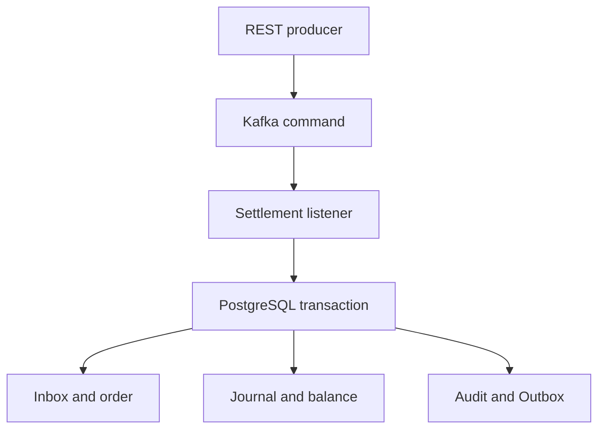

# FinCore Reliability Lab

[简体中文](README.md) | English


FinCore Reliability Lab is a runnable financial-settlement reliability system and coding-agent evaluation foundation. It tests whether money remains unique, balanced, auditable, and reconcilable after concurrency, retries, duplicate delivery, partial failure, worker takeover, and recovery.

All accounts, transactions, and operating parameters are fictional. The repository contains no former-employer source code or confidential production data.

## Why this repository exists

A financial service is not correct merely because an endpoint returns `200 OK`. It must preserve its invariants when the same command is delivered twice, when two nodes race, when a database transaction rolls back, when an outbox publisher crashes, or when a stale worker resumes after scale-down.

This repository turns those failure modes into executable experiments.

| Production risk | Protection in this lab | Executable proof |
|---|---|---|
| Duplicate Kafka delivery posts money twice | Database Inbox plus unique business key | Concurrent duplicate storm |
| Balance and journal partially commit | Single PostgreSQL transaction | Testcontainers integration tests |
| A stale request overwrites SUCCESS | CAS, legal state machine, audit trail | State-race tests |
| Reversal executes more than once | Unique compensation order and reverse journal | Duplicate compensation experiment |
| One fee account becomes a write hotspot | Deterministic shards and idempotent aggregation | Shard-total experiment |
| Old worker writes after takeover | Lease, epoch, and data-plane fencing | Stale-epoch rejection experiment |
| Balance is corrupted outside the journal | Balance-to-ledger recomputation | Fault injection and reconciliation |


## Implemented reliability model

- PostgreSQL accounts, balances, and append-only journal postings
- `BigDecimal` and `NUMERIC(38,18)` money representation
- Balanced debit/credit validation before persistence
- Kafka settlement commands
- Transactional Inbox and Outbox
- Message-ID and business-key idempotency
- Deterministic UUID account-lock ordering
- Conditional debit and insufficient-balance rejection
- CAS settlement transitions and state audit
- Separate, idempotent compensation orders and reverse journals
- Balance-to-ledger reconciliation with high-risk review records
- Fee-account sharding and idempotent treasury aggregation
- Shard lease, drain, epoch, and fencing token
- Data-plane fence validation inside the financial transaction
- Outbox claim recovery and retry
- Lab-only duplicate-delivery and balance-corruption endpoints
- Prometheus metrics and a provisioned Grafana dashboard
- JUnit, PostgreSQL Testcontainers, pure-JDK simulation, and k6 workload
- Five standardized coding-agent repair tasks and a 100-point rubric

## Architecture



Within one financial transaction the service inserts the Inbox record, creates or finds the business order, performs a CAS transition, locks accounts in deterministic order, validates asset and balance, appends a balanced journal, updates the balance view, records audit state, writes the Outbox event, and completes the Inbox record. An unhandled failure rolls the entire unit back and leaves Kafka free to retry.

## Run the complete lab

Requirements: Docker with Compose.

```bash
docker compose up --build
```

The one-shot `lab-runner` waits for health, executes the full scenario, and writes:

```text
reports/latest-scenario.json
```

Services bind to loopback by default:

| Service | Local address |
|---|---|
| FinCore API | http://127.0.0.1:8080 |
| Health | http://127.0.0.1:8080/actuator/health |
| Prometheus | http://127.0.0.1:9090 |
| Grafana | http://127.0.0.1:3000 |
| PostgreSQL | 127.0.0.1:5432 |
| Kafka | 127.0.0.1:9092 |

Run the deterministic demo again at any time:

```bash
./scripts/run-demo.sh
```

Expected checks:

```json
{
  "duplicate settlement storm": "PASS",
  "idempotent reverse journal": "PASS",
  "fee shard aggregation": "PASS: 3.000000000000000000 USDT",
  "scale-down stale epoch rejection": "PASS",
  "reconciliation corruption detection": "PASS"
}
```

## Verification

Full local verification:

```bash
./scripts/full-check.sh
```

Individual layers:

```bash
./scripts/verify-core.sh
./scripts/eval/validate-eval-kit.sh
mvn test
```

The Maven suite uses a real PostgreSQL Testcontainer and applies Flyway migrations. The pure-JDK simulation remains available when Maven or Docker is unavailable.

## Coding-agent benchmark

The public evaluation kit is under [`evals/`](evals/README.md). It defines five defect branches:

1. Duplicate settlement
2. Illegal terminal-state overwrite
3. Fee hot account
4. Stale worker after scale-down takeover
5. Duplicate compensation

Every run is scored against the same 100-point rubric covering functional correctness, transactions, idempotency, recovery, financial safety, tests, capacity, maintainability, and observability. Veto rules reject solutions that use floating-point money, allow repeated posting, mutate historical journals, hide errors, weaken tests, or treat memory/Redis as the ledger.

Hidden graders should be stored separately from this public repository.

### Controlled results

Codex, Claude Code, and Google Antigravity have completed a controlled five-task comparison using matched defect commits, prompts, hidden graders, and scoring rules. They scored 495/500, 490/500, and 485/500 respectively. Antigravity was fastest at 1,004 seconds. None triggered a financial-safety veto.

- [Interactive bilingual project showcase](https://fincore-agent-benchmark.soldierking04d.chatgpt.site)
- [Three-agent five-task comparison](reports/evaluations/README.md)
- [Codex vs Claude Code vs Antigravity report](reports/evaluations/coding-agent-comparison.md)
- [Frozen Claude Code vs Codex snapshot](reports/evaluations/claude-vs-codex.md)
- [Machine-readable comparison](reports/evaluations/comparison.json)
- [Codex summary](reports/evaluations/summary.json)
- [Claude summary](reports/evaluations/claude-summary.json)
- [Antigravity summary](reports/evaluations/antigravity-summary.json)
- [FC-001 evidence-backed report](reports/evaluations/FC-001/codex-gpt-5.6-sol-run-001/README.md)
- [FC-001 machine-readable scorecard](reports/evaluations/FC-001/codex-gpt-5.6-sol-run-001/scorecard.json)
- [FC-002 evidence-backed report](reports/evaluations/FC-002/codex-gpt-5.6-sol-run-001/README.md)
- [FC-002 machine-readable scorecard](reports/evaluations/FC-002/codex-gpt-5.6-sol-run-001/scorecard.json)
- [FC-003 evidence-backed report](reports/evaluations/FC-003/codex-gpt-5.6-sol-run-001/README.md)
- [FC-003 machine-readable scorecard](reports/evaluations/FC-003/codex-gpt-5.6-sol-run-001/scorecard.json)
- [FC-004 evidence-backed report](reports/evaluations/FC-004/codex-gpt-5.6-sol-run-001/README.md)
- [FC-004 machine-readable scorecard](reports/evaluations/FC-004/codex-gpt-5.6-sol-run-001/scorecard.json)
- [FC-005 evidence-backed report](reports/evaluations/FC-005/codex-gpt-5.6-sol-run-001/README.md)
- [FC-005 machine-readable scorecard](reports/evaluations/FC-005/codex-gpt-5.6-sol-run-001/scorecard.json)

The intentional defect definitions are versioned under [`evals/defects/`](evals/defects/README.md). After the verified `main` commit exists, `./scripts/eval/create-defect-branches.sh` creates all five benchmark branches reproducibly.

## Financial invariants

1. Money uses `BigDecimal` and PostgreSQL `NUMERIC(38,18)`.
2. Total debit equals total credit for every journal transaction.
3. Historical postings are append-only.
4. `message_id` and `business_key` are protected by database uniqueness.
5. JVM memory, Redis, and Kafka offsets are never the final uniqueness boundary.
6. `SUCCESS` is terminal; reversal is a separate compensation order.
7. Reconciliation differences are frozen for review, never silently repaired.
8. Fault-injection endpoints exist only in the `lab` profile.

## Documentation

- [Architecture overview](docs/architecture/overview.md)
- [Financial invariants ADR](docs/adr/0001-financial-invariants.md)
- [Inbox/Outbox ADR](docs/adr/0002-inbox-outbox.md)
- [Shard fencing ADR](docs/adr/0003-shard-fencing.md)
- [Coding-agent evaluation kit](evals/README.md)
- [Bilingual demo walkthrough](docs/showcase/demo-walkthrough.md)
- [Roadmap](BACKLOG.md)

## Scope and safety

This is a teaching, research, interview, and evaluation project. It is not a production custody or payment system. A real deployment would additionally require authentication, authorization, secrets management, encryption, disaster recovery, multi-region design, compliance controls, capacity certification, operational runbooks, and independent security review.
