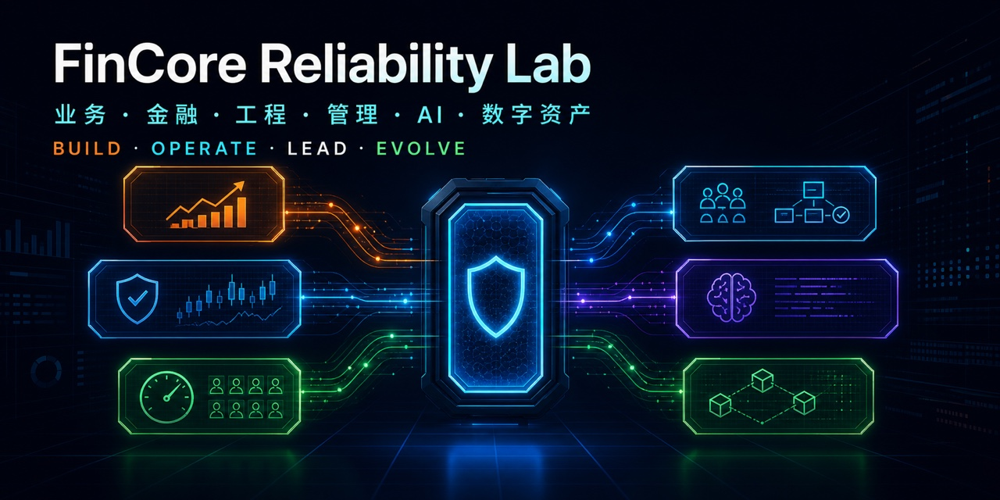
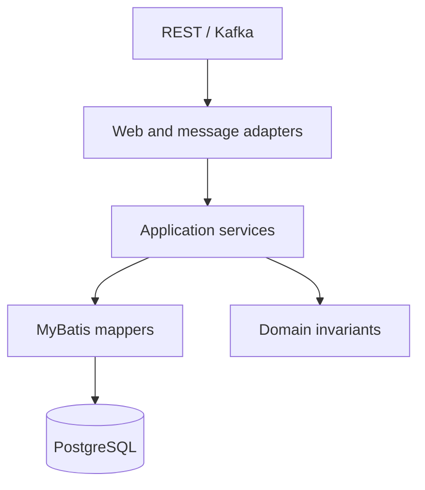

# FinCore Reliability Lab

[简体中文](README.md) | English


> A **runnable open-source reliability lab** for real financial failure modes.
> It uses Java 21, Spring Boot, MyBatis, PostgreSQL, and Kafka to reproduce and verify matching, settlement, idempotency, fencing, reconciliation, high-concurrency, and AI coding-agent safety problems.



[Live portfolio](https://fincore-reliability-demo.soldierking04d.chatgpt.site/) ·
[Public runtime](https://124.223.164.254/) ·
[System architecture](docs/resilient-system-architecture.md) ·
[Leadership playbooks](docs/management/README.md) ·
[AI benchmark](https://fincore-agent-benchmark.soldierking04d.chatgpt.site) ·
[Five-minute walkthrough](docs/showcase/demo-walkthrough.md)

If this project helps you understand or verify financial-system reliability, please consider clicking **Star** in the upper-right corner. It helps more developers discover these reproducible failure experiments.

## Decide in 30 seconds

This is not a diagram-only sample. It is a set of experiments that can run, inject failures, expose operational signals, and verify recovery. The headline results come directly from scenario code and automated checks:

| Scenario | Verified result | Meaning |
|---|---:|---|
| Concurrent matching during a market crash | `60 = 60` | 60 authoritative trades, 60 unique sequences, preserved priority and quantity |
| Duplicate settlement storm | `17 → 1` | 17 concurrent deliveries create exactly one financial effect |
| Full customer trading lifecycle | `8 / 8 PASS` | Customer, KYC, risk, market, account, matching, settlement, and reconciliation |
| Market-crash recovery | `10 / 10 PASS` | Retries, no liquidity, takeover, disorder, missing/corrupt/ghost data, and repair |
| Controlled coding-agent evaluation | `54 runs` | Eight financial-reliability tasks with hidden acceptance and safety vetoes |
| Automated technology governance | `5 registries` | Ownership, risk, metrics, adoption, and audit evidence checked by Maven/CI |

The [live portfolio](https://fincore-reliability-demo.soldierking04d.chatgpt.site/) exposes system metrics, price movement, order volume, QPS, architecture diagrams, service topology, and core sequence diagrams. Every experiment can also be reproduced locally.

## Start in three minutes

Docker Compose is the only requirement:

```bash
git clone https://github.com/soldierking04d/fincore-reliability-lab.git
cd fincore-reliability-lab
docker compose up --build
```

After the environment becomes healthy, run the representative composite failure scenario:

```bash
curl -s -X POST http://127.0.0.1:8080/lab/scenarios/market-crash-day
```

Use `./scripts/full-check.sh` for the complete verification. With JDK 21 but no Docker, start with `./scripts/verify-core.sh`. Good first-reading paths are the [system architecture](docs/resilient-system-architecture.md), [full trading lifecycle](docs/full-trading-lifecycle.md), and [market-crash experiment](docs/market-crash-day.md).

## More than engineering implementation

FinCore is also an evidence-bounded technology leadership portfolio, presented after the open-source experiments. It follows the full financial lifecycle from onboarding, KYC, risk, accounts, and market data through bounded admission, matching, clearing, settlement, immutable ledger, and reconciliation, then connects that runtime to product operations, organizational governance, AI adoption, and digital-asset scenarios.

| Leadership dimension | What this repository demonstrates | Verifiable evidence |
|---|---|---|
| Business and product operations | A complete customer journey with explicit rejection reasons, degradation rules, and operational measures | [Full trading lifecycle](docs/full-trading-lifecycle.md), [product and operations alignment](docs/management/04-product-operations-alignment.md) |
| Financial correctness and risk | Idempotency, balanced journals, state machines, compensation, reconciliation, and auditability | 17 concurrent deliveries create one financial effect; [financial invariants ADR](docs/adr/0001-financial-invariants.md) |
| Architecture and performance | Java 21, Spring Boot, MyBatis, bounded matching lanes, Kafka, Outbox, epoch fencing, G1/ZGC, Prometheus, and Grafana | 60 trades produce 60 unique sequences; [concurrency and JVM guide](docs/high-concurrency-jvm-tuning.md) |
| People, delivery, and governance | Talent pipeline, cross-functional decisions, SLO/DR, FinOps, security, vendors, technology radar, and executive communication | [18 responsibility and playbook chapters](docs/management/README.md), [five machine-readable governance registries](governance/README.md) |
| Practical AI adoption | Use-case registry, human baseline, cost, permissions, release gates, expiry, kill switch, and isolated multi-agent evaluation | Eight tasks and 54 controlled runs; [AI registry](ai/README.md), [evaluation evidence](reports/evaluations/README.md) |
| Digital-asset reliability | Existing reliability mechanisms mapped to deposits, reorgs, unknown withdrawals, nonce/UTXO control, HSM/MPC, and on/off-chain reconciliation | [Digital-asset design and implementation boundary](docs/blockchain-digital-asset-reliability.md) |

All accounts, transactions, and operating parameters are fictional. The repository contains no former-employer source code, customer data, or confidential production parameters. Implemented evidence and design-only extensions are explicitly separated.

## Why this repository exists

A financial service is not correct merely because an endpoint returns `200 OK`. It must preserve its invariants when the same command is delivered twice, when two nodes race, when a database transaction rolls back, when an outbox publisher crashes, or when a stale worker resumes after scale-down.

This repository turns those failure modes into executable experiments. The public explanation is split into [business risk and engineering boundaries](docs/agent-evaluations/benchmark-introduction.md) and the [repeatability protocol](reports/evaluations/repeatability-protocol.md): why the failures matter, then how the evidence is produced.

| Production risk | Protection in this lab | Executable proof |
|---|---|---|
| Concurrent orders violate price-time priority or duplicate trades | Per-symbol serialization, durable sequence, quantity conservation | Priority, idempotency, and concurrency tests |
| Duplicate Kafka delivery posts money twice | Database Inbox plus unique business key | Concurrent duplicate storm |
| Balance and journal partially commit | Single PostgreSQL transaction | Testcontainers integration tests |
| A stale request overwrites SUCCESS | CAS, legal state machine, audit trail | State-race tests |
| Reversal executes more than once | Unique compensation order and reverse journal | Duplicate compensation experiment |
| One fee account becomes a write hotspot | Deterministic shards and idempotent aggregation | Shard-total experiment |
| Old worker writes after takeover | Lease, epoch, and data-plane fencing | Stale-epoch rejection experiment |
| Balance is corrupted outside the journal | Balance-to-ledger recomputation | Fault injection and reconciliation |


## Implemented reliability model

- PostgreSQL accounts, balances, and append-only journal postings
- `BigDecimal` and `NUMERIC(38,18)` money representation
- Balanced debit/credit validation before persistence
- Kafka settlement commands
- Limit and market orders, price-time priority, maker pricing, partial fills, cancellation, and self-trade prevention
- Durable order/trade sequence, matching audit, and a dedicated matching event topic
- Transactional Inbox and Outbox
- Bounded per-symbol matching lanes with explicit 429/503 backpressure
- Platform-thread Kafka consumers and a data-plane-safe worker lease cache
- Asynchronous Outbox batches and batched append-only journal inserts
- G1 and Generational ZGC profiles with GC logs, heap dumps, and continuous JFR
- Message-ID and business-key idempotency
- Deterministic UUID account-lock ordering
- Conditional debit and insufficient-balance rejection
- CAS settlement transitions and state audit
- Separate, idempotent compensation orders and reverse journals
- Balance-to-ledger reconciliation with high-risk review records
- Fee-account sharding and idempotent treasury aggregation
- Shard lease, drain, epoch, and fencing token
- Data-plane fence validation inside the financial transaction
- Outbox claim recovery and retry
- Lab-only duplicate-delivery and balance-corruption endpoints
- Prometheus metrics and a provisioned Grafana dashboard
- JUnit, PostgreSQL Testcontainers, pure-JDK simulation, and k6 workload
- Eight standardized coding-agent repair tasks and a 100-point rubric

## Matching module

Matching, clearing, and settlement are intentionally separate. Matching produces deterministic trade facts; clearing derives obligations; settlement changes the asset ledger.

The current correctness baseline serializes one symbol with a PostgreSQL advisory transaction lock. It supports limit/market orders, price-time priority, maker-price executions, partial fills, idempotent client order IDs, cancellation, `CANCEL_TAKER` self-trade prevention, durable sequencing, audit records, and transactional trade Outbox events. It does not claim microsecond in-memory performance.

See the Chinese-first [matching module guide](docs/matching-engine.md) for business boundaries, APIs, and production upgrade paths.

## Advanced traffic and reconciliation scenarios

The lab now covers hot-symbol bursts, out-of-order and duplicate trade events, conflicting replays, missing or corrupted projections, ghost trades, idempotent repair, in-flight authoritative transactions, and mandatory post-repair reconciliation.

The repair boundary is deliberate: authoritative trades and financial ledgers are never overwritten to make totals match. Only derived trade projections can be rebuilt from authoritative facts; unmatched ghost projections are quarantined with an audit trail. See the Chinese-first [advanced scenarios guide](docs/advanced-scenarios.md).

```bash
curl -s -X POST \
  'http://127.0.0.1:8080/lab/scenarios/matching-burst?makers=80&takers=16'
curl -s -X POST \
  http://127.0.0.1:8080/lab/scenarios/trade-sync-recovery
```

## Architecture



Within one financial transaction the service inserts the Inbox record, creates or finds the business order, performs a CAS transition, locks accounts in deterministic order, validates asset and balance, appends a balanced journal, updates the balance view, records audit state, writes the Outbox event, and completes the Inbox record. An unhandled failure rolls the entire unit back and leaves Kafka free to retry.

## Run the complete lab

Requirements: Docker with Compose.

```bash
docker compose up --build
```

The one-shot `lab-runner` waits for health, executes the full scenario, and writes:

```text
reports/latest-scenario.json
```

Services bind to loopback by default:

| Service | Local address |
|---|---|
| FinCore API | http://127.0.0.1:8080 |
| Health | http://127.0.0.1:8080/actuator/health |
| Prometheus | http://127.0.0.1:9090 |
| Grafana | http://127.0.0.1:3000 |
| PostgreSQL | 127.0.0.1:5432 |
| Kafka | 127.0.0.1:9092 |

Run the deterministic demo again at any time:

```bash
./scripts/run-demo.sh
```

Expected checks:

```json
{
  "duplicate settlement storm": "PASS",
  "idempotent reverse journal": "PASS",
  "fee shard aggregation": "PASS: 3.000000000000000000 USDT",
  "scale-down stale epoch rejection": "PASS",
  "reconciliation corruption detection": "PASS"
}
```

## Verification

Full local verification:

```bash
./scripts/full-check.sh
```

Individual layers:

```bash
./scripts/verify-core.sh
./scripts/eval/validate-eval-kit.sh
mvn test
```

The Maven suite uses a real PostgreSQL Testcontainer and applies Flyway migrations. The pure-JDK simulation remains available when Maven or Docker is unavailable.

## Coding-agent benchmark

The public evaluation kit is under [`evals/`](evals/README.md). It defines eight defect branches:

1. Duplicate settlement
2. Illegal terminal-state overwrite
3. Fee hot account
4. Stale worker after scale-down takeover
5. Duplicate compensation
6. Hot-symbol cross-symbol contention
7. Conflicting trade-sync replay
8. Reconciliation repair race

Every run is scored against the same 100-point rubric covering functional correctness, transactions, idempotency, recovery, financial safety, tests, capacity, maintainability, and observability. Veto rules reject solutions that use floating-point money, allow repeated posting, mutate historical journals, hide errors, weaken tests, or treat memory/Redis as the ledger.

Hidden graders should be stored separately from this public repository.

### Controlled results

The benchmark now has two evidence sets: 45 repeated attempts on FC-001 through FC-005, and nine first-pass attempts on FC-006 through FC-008. In the advanced set, Codex scored 290/300 and cleared all three acceptance thresholds; Claude scored 195/300 and Antigravity 175/300. The latter two triggered the FC-008 veto when the authoritative trade transaction was still in flight.

- [Bilingual evaluation site](https://fincore-agent-benchmark.soldierking04d.chatgpt.site)
- [Advanced-scenario first-pass report](reports/evaluations/advanced-scenarios-results.md)
- [Advanced machine-readable results](reports/evaluations/advanced-scenarios-results.json)
- [All evaluation reports](reports/evaluations/README.md)
- [Codex vs Claude Code vs Antigravity report](reports/evaluations/coding-agent-comparison.md)
- [Frozen Claude Code vs Codex snapshot](reports/evaluations/claude-vs-codex.md)
- [Machine-readable comparison](reports/evaluations/comparison.json)
- [Codex summary](reports/evaluations/summary.json)
- [Claude summary](reports/evaluations/claude-summary.json)
- [Antigravity summary](reports/evaluations/antigravity-summary.json)
- [FC-001 evidence-backed report](reports/evaluations/FC-001/codex-gpt-5.6-sol-run-001/README.md)
- [FC-001 machine-readable scorecard](reports/evaluations/FC-001/codex-gpt-5.6-sol-run-001/scorecard.json)
- [FC-002 evidence-backed report](reports/evaluations/FC-002/codex-gpt-5.6-sol-run-001/README.md)
- [FC-002 machine-readable scorecard](reports/evaluations/FC-002/codex-gpt-5.6-sol-run-001/scorecard.json)
- [FC-003 evidence-backed report](reports/evaluations/FC-003/codex-gpt-5.6-sol-run-001/README.md)
- [FC-003 machine-readable scorecard](reports/evaluations/FC-003/codex-gpt-5.6-sol-run-001/scorecard.json)
- [FC-004 evidence-backed report](reports/evaluations/FC-004/codex-gpt-5.6-sol-run-001/README.md)
- [FC-004 machine-readable scorecard](reports/evaluations/FC-004/codex-gpt-5.6-sol-run-001/scorecard.json)
- [FC-005 evidence-backed report](reports/evaluations/FC-005/codex-gpt-5.6-sol-run-001/README.md)
- [FC-005 machine-readable scorecard](reports/evaluations/FC-005/codex-gpt-5.6-sol-run-001/scorecard.json)

The intentional defect definitions are versioned under [`evals/defects/`](evals/defects/README.md). After the verified `main` commit exists, `./scripts/eval/create-defect-branches.sh` creates all eight benchmark branches reproducibly.

## Financial invariants

1. Money uses `BigDecimal` and PostgreSQL `NUMERIC(38,18)`.
2. Total debit equals total credit for every journal transaction.
3. Historical postings are append-only.
4. `message_id` and `business_key` are protected by database uniqueness.
5. JVM memory, Redis, and Kafka offsets are never the final uniqueness boundary.
6. `SUCCESS` is terminal; reversal is a separate compensation order.
7. Reconciliation differences are frozen for review, never silently repaired.
8. Fault-injection endpoints exist only in the `lab` profile.

## Documentation

- [Architecture overview](docs/architecture/overview.md)
- [End-to-end resilient system architecture](docs/resilient-system-architecture.md)
- [Spring Boot + MyBatis persistence architecture](docs/mybatis-architecture.md)
- [Financial invariants ADR](docs/adr/0001-financial-invariants.md)
- [Inbox/Outbox ADR](docs/adr/0002-inbox-outbox.md)
- [Shard fencing ADR](docs/adr/0003-shard-fencing.md)
- [Technology leadership responsibility map and playbooks](docs/management/README.md)
- [AI use cases, boundaries, and evaluation evidence](ai/README.md)
- [Digital-asset reliability design](docs/blockchain-digital-asset-reliability.md)
- [Coding-agent evaluation kit](evals/README.md)
- [Bilingual demo walkthrough](docs/showcase/demo-walkthrough.md)
- [Contribution guide](CONTRIBUTING.md)
- [Roadmap](BACKLOG.md)

## Scope and safety

This is a teaching, research, interview, and evaluation project. It is not a production custody or payment system. A real deployment would additionally require authentication, authorization, secrets management, encryption, disaster recovery, multi-region design, compliance controls, capacity certification, operational runbooks, and independent security review.
