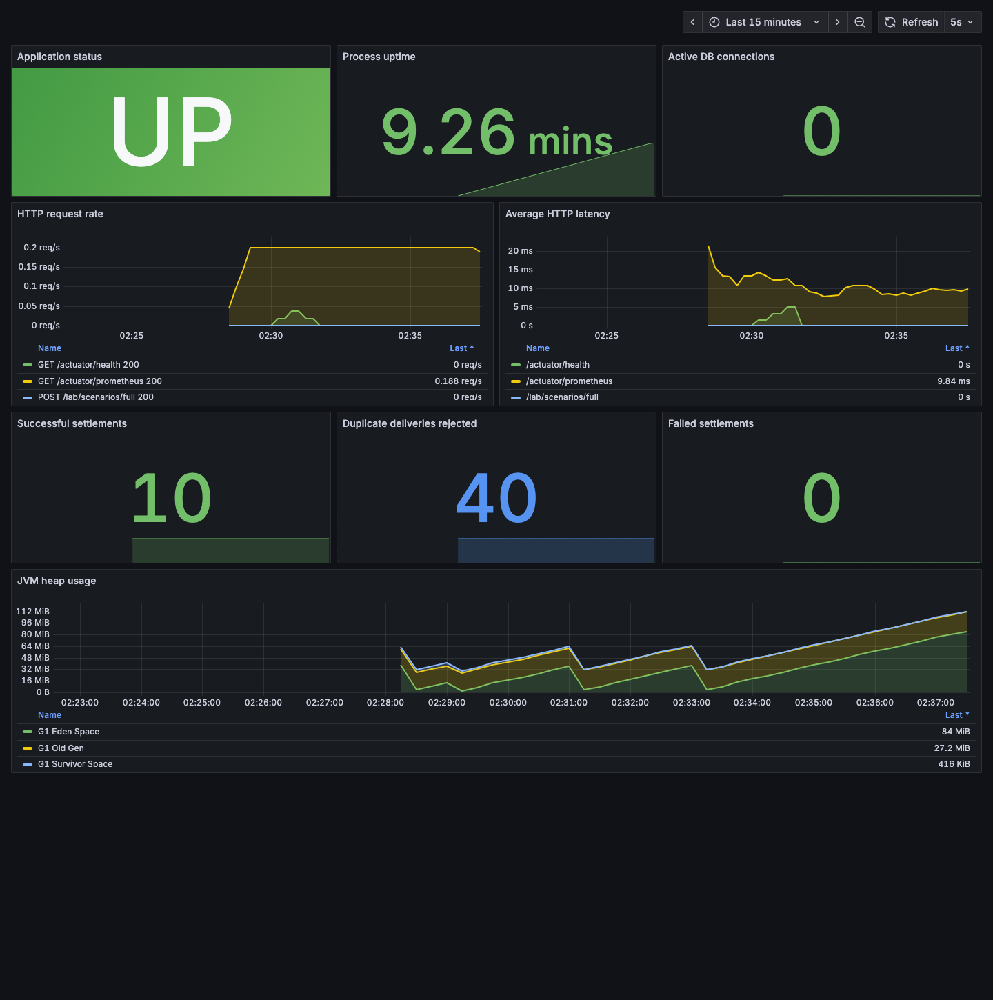
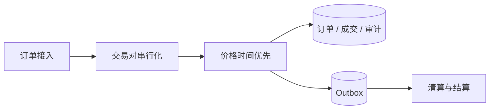

# FinCore Reliability Lab

[English](README.en.md) | 简体中文


一个可运行的金融交易与结算可靠性实验项目，用于研究撮合、成交事件、资金账本、重复消息、状态竞争、补偿、对账、热点账户以及服务缩容时的 fencing 问题。项目使用完全虚构的数据，不包含任何前雇主代码或内部参数。

它的判断标准不是“接口能返回成功”，而是：在并发、重试、重复投递、部分失败、Worker 接管和服务恢复之后，资金结果是否仍然唯一、平衡、可审计并且可对账。

源码已按阿里巴巴 P3C 规范补齐中文 Javadoc、枚举说明和关键事务注释；项目采用的格式、命名、检查命令
以及不可弱化的金融规则见[Java 代码与中文注释规范](docs/java-coding-conventions.md)。

当前代码基线采用 Spring Boot 3.5.16 与 MyBatis Spring Boot Starter 3.0.5，生产服务不再直接拼写或执行
`JdbcTemplate` SQL。Controller/Kafka Listener 负责协议接入，Application Service 负责事务与金融不变量，
12 个领域 Mapper 负责参数化 SQL 和结果映射。完整分层、调用链和迁移边界见
[Spring Boot + MyBatis 持久化架构](docs/mybatis-architecture.md)。

高并发版本已经把 Java 21 虚拟线程、有界撮合 Lane、Kafka 平台线程隔离、Worker Lease 缓存、
Outbox 异步批处理、账本批量写入、Hikari 限流、G1/ZGC 配置、GC/JFR 证据和混合 k6 压测完整落地。
线程与连接池为什么不能无限放大、超时和部分失败如何收敛，以及全部监控指标见
[高并发、线程、CPU 与 JVM/GC 落地说明](docs/high-concurrency-jvm-tuning.md)。

技术治理也已从文章扩展为运行系统：[技术负责人职责与实战手册](docs/management/README.md)覆盖
13 类基础职责和平台工程、数据产品、企业风险、技术雷达、AI 五类跨域责任；
[五份机器可读治理台账](governance/README.md)把服务 Owner、风险、指标口径、技术采用和审计证据
关联起来，并由脚本与 Maven/CI 自动拒绝无责任人、过期 AI 门禁、错误引用或不存在的已证明证据。

AI 登记见 [`ai/use-cases.json`](ai/use-cases.json)：除了权限和评测，还记录模型/提示/检索/工具策略
版本、人工价值基线、单位成本、发布阈值、复查与失效日期、允许工具、禁止范围和关闭开关。当前
只有 Coding Agent 隔离评测标记为已落地；其他用例在专用评测前保持规划和只读。

数字资产方向已补充[区块链与数字资产可靠性设计](docs/blockchain-digital-asset-reliability.md)：把当前已经验证的
Inbox/Outbox、平衡账本、状态机、Epoch Fencing 和对账机制映射到充值确认、链重组、提现未知结果、
EVM Nonce、Bitcoin UTXO、HSM/MPC 签名与链上链下对账。该文档明确区分“可迁移的现有证据”和
“尚待测试网及安全评审的专项实现”，不宣称已经接入真实公链或生产钱包。

## 60 秒看懂项目

项目介绍现在分为[业务风险与工程边界](docs/agent-evaluations/benchmark-introduction.md)和[可重复评测协议](reports/evaluations/repeatability-protocol.md)两部分：前者说明为什么这些故障重要，后者说明证据如何产生。

| 生产风险 | 项目中的保护机制 | 自动证明 |
|---|---|---|
| 并发订单破坏价格时间优先或生成重复成交 | 交易对单写锁 + 持久化序列 + 数量守恒 | 价格/时间优先、幂等与并发测试 |
| Kafka 重复投递导致重复入账 | Inbox + 业务键数据库唯一约束 | 并发重复结算风暴 |
| 余额和账本部分提交 | 单个 PostgreSQL 事务 | Testcontainers 集成测试 |
| 成功状态被旧线程覆盖 | CAS + 合法状态机 + 审计 | 状态竞争测试 |
| 冲正执行两次 | 独立补偿单 + 反向账本唯一约束 | 重复补偿实验 |
| 手续费账户热点 | 确定性分片 + 幂等归集 | 分片总额实验 |
| 缩容后旧 Worker 恢复写入 | Lease + Epoch + 数据面 Fencing | 接管与旧 Epoch 拒写实验 |
| 余额遭到异常修改 | 余额—账本重算对账 | 故障注入和差异发现 |
| 数字资产充值、提现和链重组 | 已完成可靠性架构映射；链专项实现仍在路线中 | [设计、状态机与验收路线](docs/blockchain-digital-asset-reliability.md) |



## 已实现的第一版闭环

- Spring Boot Web/Kafka 接入、Application Service 事务编排与 MyBatis Mapper 持久化分层；
- 用户注册、KYC 状态、交易开关和用户生命周期管理；
- 单笔/日累计额度、价格偏离、账户余额与行情新鲜度组成的盘前风控；
- 参考行情、聚合订单簿与最近成交组成的行情查询；
- 用户、KYC、风控、交易账户、行情、盘前决定和撮合串联的受控下单入口；
- Java 21 虚拟线程接入、有界撮合 Lane 和 Kafka/定时任务平台线程隔离；
- Outbox 有界批量异步发送、批量状态回写、指数退避与未知结果回收；
- Worker Lease 短期缓存削减控制面写热点，资金事务继续执行强制 Epoch Fencing；
- G1 默认与 Generational ZGC 备选启动配置、GC 日志、Heap Dump 和连续 JFR；
- PostgreSQL 账户、余额和不可变账本；
- 借贷平衡校验；
- Kafka 结算命令；
- 限价单、市价单、价格时间优先、部分成交、撤单与自成交保护；
- 订单/成交持久化序列、状态审计和独立撮合事件 Topic；
- Inbox 消息幂等和业务键唯一约束；
- 同事务完成账户锁定、账本落库、余额更新、状态更新和 Outbox；
- 固定 UUID 顺序锁账户，降低死锁风险；
- CAS 状态转换与状态审计；
- 独立反向账本补偿，不修改原始成功流水；
- 余额与账本对账，差异默认标记高风险并等待人工审核；
- Outbox 原子抢占与失败重试；
- 分片 Lease、Epoch、DRAINING 和 Fencing Token 实验接口；
- 手续费分片路由；
- Prometheus 指标；
- 仅在 `lab` Profile 开放的故障注入接口；
- JUnit、Testcontainers 和不依赖第三方库的核心验证脚本。

## 完整交易链路

项目不再从“订单已经进入撮合”开始，而是补齐上游用户、KYC、风控、账户和行情，并与下游撮合、
清算、结算、账本和对账形成统一闭环：

```text
用户 → KYC → 风控 → 交易账户 → 参考行情 → 盘前决定 → 有界下单
    → 撮合 → 成交事件 → 清算/结算 → 不可变账本 → 对账修复
```

受控入口 `POST /api/trading/orders` 会按顺序检查用户状态、KYC、交易权限、价格偏离、单笔/日累计额度、
行情新鲜度和所需资产余额，并保存可审计的 `APPROVED` 或 `REJECTED` 决定；批准后才进入现有撮合 Lane。
相同 `userId + clientOrderId` 重试只复用原决定和原订单，修改价格或数量的冲突重放会被拒绝。

完整模块责任、数据表、接口、拒绝原因、成功时序和自动测试见
[用户到对账的完整交易链路](docs/full-trading-lifecycle.md)。当前尚未实现开放委托资金冻结，也没有接入
真实 KYC 或行情供应商，因此仍按可靠性实验而不是生产交易平台描述。

运行一次隔离的用户—交易完整实跑：

```bash
curl -s -X POST http://localhost:8080/lab/scenarios/trading-lifecycle
```

## 撮合模块

撮合是交易系统从“用户下单”走向“资产交割”的第一道确定性边界。这个模块不把撮合等同于结算：**撮合负责形成不可歧义的成交事实，清算负责计算双方应收应付，结算负责安全地改变资产账本。**

> **English summary:** Matching creates deterministic trade facts; clearing derives obligations; settlement moves assets safely.

### 业务视角

| 负责人关心的问题 | 当前模块的回答 |
|---|---|
| 两张订单为什么以这个顺序成交？ | 价格优先，同价时按持久化订单序列先到先得 |
| 网络重试会不会重复下单？ | 用户与客户端订单号构成唯一业务键，相同请求幂等返回，篡改参数的重放被拒绝 |
| 大单如何跨档位成交？ | 支持逐笔部分成交，并由数据库约束保证原始量 = 已成交量 + 剩余量 |
| 成交后系统崩溃会不会丢结算消息？ | 成交、订单状态、审计和 Outbox 在同一数据库事务内提交 |
| 同一用户会不会和自己成交？ | 默认采用 `CANCEL_TAKER` 自成交保护 |
| 能否用于超低延迟生产撮合？ | 当前是跨进程正确性基线，不宣称微秒级性能；升级路径是单写者、命令日志、快照和确定性重放 |

### 技术视角



实现包含限价单、市价单、Maker 价格、部分成交、撤单、自成交保护、持久化订单/成交序列、按交易对的 PostgreSQL advisory transaction lock、乐观版本检查和独立 `matching.events.v1` 事件流。完整边界、接口和非目标见[撮合模块说明](docs/matching-engine.md)。

## 复杂场景：高峰流量与异常同步修复

项目包含六组生产式故障实验：

| 场景 | 需要守住的结果 |
|---|---|
| 热点交易对订单洪峰 | 并发成交不重复、序列不冲突、订单数量守恒、Outbox 不丢 |
| 成交事件乱序 | 下游投影不依赖消息到达顺序 |
| 重复与冲突事件 | 相同载荷幂等；同一事件号更换内容立即拒绝 |
| 漏同步与字段错值 | 全量对账分别识别 `MISSING` 与 `MISMATCH` |
| 幽灵成交与修复重试 | 额外投影进入隔离区；同一修复键只执行一次；再次对账必须 `CLEAN` |
| 权威成交事务在途提交 | 修复与撮合共享交易对锁，提交后重新核验，合法成交不能被误隔离 |

修复边界有意做了限制：成交表是权威事实，系统只自动重建派生投影或隔离幽灵数据，**不会为了让数字相等直接修改资金余额或历史账本**。复杂实验说明、API 和 k6 热点冲击方法见[大流量与对账修复场景](docs/advanced-scenarios.md)。

### 市场暴跌日：端到端复合故障

“市场暴跌日”不是简单压测，而是把公开事故中的高波动惊群、错误版本或旧节点迟到写入、接管失败和信息同步异常组合到同一条业务链中。场景依次验证三档深度被吃穿、客户端重试、无流动性安全拒单、Worker Epoch 接管、17 次重复结算、成交乱序/漏失/错值/幽灵数据、幂等修复和最终 CLEAN。

返回结果按时间线同时给出业务影响、故障注入、系统动作和数据库证据。完整的公开事故来源、映射关系、全过程与能力边界见[市场暴跌日恢复实验](docs/market-crash-day.md)。

快速执行：

```bash
curl -s -X POST \
  'http://127.0.0.1:8080/lab/scenarios/matching-burst?makers=80&takers=16'

curl -s -X POST \
  http://127.0.0.1:8080/lab/scenarios/trade-sync-recovery

curl -s -X POST \
  http://127.0.0.1:8080/lab/scenarios/market-crash-day
```

## 一键启动

Mac 安装并启动 Docker Desktop 后，在项目根目录运行：

```bash
docker compose up --build
```

无需继续手工操作。`lab-runner` 会等待应用健康，然后自动执行完整实验，并把结果写入：

```text
reports/latest-scenario.json
```

项目固定使用 Spring Boot 3.5.16，并采用 Apache 官方 Kafka Docker 镜像。Kafka 的单节点 KRaft 配置只用于本地实验，不代表生产部署方案。

## 腾讯云公网演示

4 核 4 GB 的腾讯云轻量服务器使用独立的低内存 Compose 配置运行 Spring Boot、PostgreSQL、
Kafka、Prometheus、Grafana 和 Nginx。公网入口、实时实验、监控链接、资源限制、安全边界和更新命令见
[腾讯云公网演示环境](docs/tencent-cloud-deployment.md)。

服务地址：

| 服务 | 地址 |
|---|---|
| FinCore API | http://localhost:8080 |
| 健康检查 | http://localhost:8080/actuator/health |
| Prometheus | http://localhost:9090 |
| Grafana | http://localhost:3000 |
| PostgreSQL | localhost:5432 |
| Kafka | localhost:9092 |

默认只绑定回环地址，避免实验接口暴露到局域网。从另一台主机访问虚拟机时，应通过 SSH 本地转发，而不是把 `lab` Profile 直接开放到 LAN。

## Ubuntu 虚拟机部署

在 UTM 网络已与物理局域网隔离后，先在虚拟机内执行安全准备，再部署：

```bash
./scripts/deploy/prepare-ubuntu-vm.sh
./scripts/deploy/deploy-and-verify.sh
```

第一条命令会保存变更前状态，关闭并禁用 `dnsmasq.service` 与 `split-gateway.service`，确认 UDP/67 没有 DHCP 服务监听，然后安装 Docker、Compose、Java 和 Maven。第二条命令会运行核心校验、Maven/Testcontainers 测试，启动服务并执行完整自动实验。

Mac 访问虚拟机内服务时，可用下面的通用脚本建立仅限本机的 SSH 隧道：

```bash
./scripts/deploy/open-local-tunnel.sh /path/to/key SSH_USER VM_HOST SSH_PORT
```

建立后 API、Prometheus 和 Grafana 地址仍分别为 `http://127.0.0.1:8080`、`http://127.0.0.1:9090` 和 `http://127.0.0.1:3000`。

环境启动完成后，不需要手工创建账户或逐条调用接口。直接执行全自动验收：

```bash
curl -s -X POST http://localhost:8080/lab/scenarios/full
```

系统会自行创建隔离账户并完成：20 次重复投递、唯一资金效果、反向补偿、手续费分片归集、旧 Epoch 拒写、新 Worker 接管和对账差异发现。响应中的每项检查都应为 `PASS`。

停止环境：

```bash
docker compose down
```

如需删除本项目生成的本地实验数据：

```bash
docker compose down -v
```

`-v` 会删除该 Compose 项目的 PostgreSQL Volume，只应在明确不再需要实验数据时使用。

## 第一次完整实验

### 1. 创建付款账户

```bash
curl -s http://localhost:8080/api/accounts \
  -H 'Content-Type: application/json' \
  -d '{"ownerId":"user-a","asset":"USDT","accountType":"USER","openingBalance":1000}'
```

### 2. 创建收款账户和手续费账户

分别执行：

```bash
curl -s http://localhost:8080/api/accounts \
  -H 'Content-Type: application/json' \
  -d '{"ownerId":"user-b","asset":"USDT","accountType":"USER","openingBalance":0}'
```

```bash
curl -s http://localhost:8080/api/accounts \
  -H 'Content-Type: application/json' \
  -d '{"ownerId":"SYSTEM_FEE_00","asset":"USDT","accountType":"SYSTEM_FEE","openingBalance":0}'
```

记录三个响应中的 `accountId`。

### 3. 提交结算

```bash
curl -s http://localhost:8080/api/settlements \
  -H 'Content-Type: application/json' \
  -d '{
    "messageId":"msg-0001",
    "businessKey":"order-0001",
    "payerAccountId":"替换为付款账户ID",
    "payeeAccountId":"替换为收款账户ID",
    "feeAccountId":"替换为手续费账户ID",
    "asset":"USDT",
    "amount":100,
    "fee":1
  }'
```

查询处理结果：

```bash
curl -s http://localhost:8080/api/settlements/order-0001
```

### 4. 验证重复消息

把同一份请求发送十次，或者调用实验接口：

```bash
curl -s 'http://localhost:8080/lab/faults/duplicate-message?copies=10' \
  -H 'Content-Type: application/json' \
  -d '{
    "messageId":"msg-0002",
    "businessKey":"order-0002",
    "payerAccountId":"替换为付款账户ID",
    "payeeAccountId":"替换为收款账户ID",
    "feeAccountId":"替换为手续费账户ID",
    "asset":"USDT",
    "amount":10,
    "fee":0.1
  }'
```

预期结果：Kafka 中出现十份消息，但数据库只有一笔结算、一个账本交易和一次余额变化。

### 5. 制造并发现对账差异

只在 `lab` Profile 中可以故意绕过账本修改余额：

```bash
curl -s -X POST 'http://localhost:8080/lab/faults/accounts/替换账户ID/corrupt-balance?delta=3'
curl -s -X POST http://localhost:8080/api/reconciliation/run
```

预期结果：对账返回一条 `BALANCE_LEDGER_MISMATCH`，不会自动修改资金。

### 6. 发起反向补偿

```bash
curl -s http://localhost:8080/api/compensations/order-0001 \
  -H 'Content-Type: application/json' \
  -d '{"reason":"laboratory reversal test"}'
```

重复执行同一个补偿请求时，只返回已有补偿结果，不会生成第二份资金效果。

## 缩容与 Fencing 实验

节点 A 领取分片 7：

```bash
curl -s http://localhost:8080/api/shards/7/claim \
  -H 'Content-Type: application/json' \
  -d '{"ownerId":"worker-a","ttlSeconds":30}'
```

响应包含 `epoch`。进入缩容排空：

```bash
curl -s http://localhost:8080/api/shards/7/drain \
  -H 'Content-Type: application/json' \
  -d '{"ownerId":"worker-a","epoch":1}'
```

Lease 过期后，节点 B 再次领取该分片会获得更大的 Epoch。此后用节点 A 的旧 Epoch 调用 fence 检查应返回 `false`：

```bash
curl -s 'http://localhost:8080/api/shards/7/fence?ownerId=worker-a&epoch=1'
```

当前版本已经把 `shardId + epoch` 接入 Kafka 消费链路，并在每次账务提交前共享锁定 Lease、强制校验 Fence，完成控制面与数据面闭环。

## 本地验证

有 Maven 和 Docker 时：

```bash
mvn test
```

没有本机 Maven、但有 Docker 时：

```bash
docker compose --profile test run --rm app-test
```

完整检查入口：

```bash
./scripts/full-check.sh
```

已经启动环境时，可单独运行标准展示实验：

```bash
./scripts/run-demo.sh
```

脚本会等待应用健康、执行完整场景、校验所有结果为 `PASS`，并生成 `reports/latest-scenario.json`。

该脚本依次执行纯 JDK 并发模拟、项目结构校验、Maven/Testcontainers 测试、容器启动和自动实验报告检查。仓库同时包含 CI 工作流，代码推送后会自动执行相同的核心与 Maven 验证。

压测脚本位于 `benchmarks/settlement.js`。创建三个账户后，把账户 ID 通过环境变量传给 k6，并从较低 `RATE` 开始建立本机基线。

只有 JDK 21、但暂时没有 Docker 时，仍可验证纯领域规则：

```bash
./scripts/verify-core.sh
```

## Coding Agent 评测包

`evals/` 提供八个生产级修复任务、统一的 100 分 Rubric、结果 Schema，以及八份可校验的故意缺陷补丁。`main` 完成验证并提交后，可重复生成独立评测分支：

```bash
./scripts/eval/validate-eval-kit.sh
./scripts/eval/create-defect-branches.sh
```

公开仓库只保存任务、缺陷和公开检查；隐藏测试应放在独立私有 Grader 仓库，避免 Coding Agent 针对测试实现取巧。

### 受控实测结果

评测分成两批：FC-001～FC-005 已完成 45 次三轮重复性实验；FC-006～FC-008 已完成 9 次复杂场景首轮实验。复杂场景中 Codex 为 290/300 且 3/3 达到接受线，Claude 为 195/300，Antigravity 为 175/300。后两者在 FC-008 的“权威成交事务仍在提交”强化场景中触发错误隔离安全否决。

- [中英文评测网站](https://fincore-agent-benchmark.soldierking04d.chatgpt.site)
- [三项复杂场景首轮报告](reports/evaluations/advanced-scenarios-results.md)
- [复杂场景机器可读结果](reports/evaluations/advanced-scenarios-results.json)
- [全部评测总入口](reports/evaluations/README.md)
- [Codex vs Claude Code vs Antigravity 详细报告](reports/evaluations/coding-agent-comparison.md)
- [原 Claude Code vs Codex 双 Agent 快照](reports/evaluations/claude-vs-codex.md)
- [机器可读对比](reports/evaluations/comparison.json)
- [Codex 机器可读汇总](reports/evaluations/summary.json)
- [Claude 机器可读汇总](reports/evaluations/claude-summary.json)
- [Antigravity 机器可读汇总](reports/evaluations/antigravity-summary.json)
- [FC-001 完整实测报告](reports/evaluations/FC-001/codex-gpt-5.6-sol-run-001/README.md)
- [FC-001 机器可读 Scorecard](reports/evaluations/FC-001/codex-gpt-5.6-sol-run-001/scorecard.json)
- [FC-002 完整实测报告](reports/evaluations/FC-002/codex-gpt-5.6-sol-run-001/README.md)
- [FC-002 机器可读 Scorecard](reports/evaluations/FC-002/codex-gpt-5.6-sol-run-001/scorecard.json)
- [FC-003 完整实测报告](reports/evaluations/FC-003/codex-gpt-5.6-sol-run-001/README.md)
- [FC-003 机器可读 Scorecard](reports/evaluations/FC-003/codex-gpt-5.6-sol-run-001/scorecard.json)
- [FC-004 完整实测报告](reports/evaluations/FC-004/codex-gpt-5.6-sol-run-001/README.md)
- [FC-004 机器可读 Scorecard](reports/evaluations/FC-004/codex-gpt-5.6-sol-run-001/scorecard.json)
- [FC-005 完整实测报告](reports/evaluations/FC-005/codex-gpt-5.6-sol-run-001/README.md)
- [FC-005 机器可读 Scorecard](reports/evaluations/FC-005/codex-gpt-5.6-sol-run-001/scorecard.json)

## 核心不变量

1. 所有金额使用 `BigDecimal` 和 PostgreSQL `NUMERIC(38,18)`。
2. 每个账本交易的 Debit 总和必须等于 Credit 总和。
3. 历史账本只追加，不修改、不删除。
4. `message_id` 和 `business_key` 都有数据库唯一约束。
5. 资金写入不能依赖 JVM 内存、Redis 或 Kafka Offset 保证唯一性。
6. 成功结算是终态；冲正使用独立补偿单和反向流水。
7. 对账差异默认冻结审查，不静默自动修复。
8. 故障注入接口只能存在于 `lab` Profile。

## 文档入口

- [架构说明](docs/architecture/overview.md)
- [Spring Boot + MyBatis 持久化架构](docs/mybatis-architecture.md)
- [资金安全决策](docs/adr/0001-financial-invariants.md)
- [消息幂等决策](docs/adr/0002-inbox-outbox.md)
- [缩容与 Fencing](docs/adr/0003-shard-fencing.md)
- [AI Coding 评测任务](docs/agent-evaluations/tasks.md)
- [Coding Agent 标准化评测包](evals/README.md)
- [中英文演示讲解](docs/showcase/demo-walkthrough.md)
- [技术负责人职责全景与管理实战手册](docs/management/README.md)
- [AI 用例登记、边界与评测证据](ai/README.md)
- [Grafana 仪表盘](infra/grafana/dashboards/fincore-overview.json)
- [后续路线](BACKLOG.md)

## 重要声明

这是教学、研究和面试展示项目，不可直接用于真实资金生产环境。真实生产系统还需要完整的权限控制、密钥管理、数据加密、灾备、多活、审计合规、容量验证、运维流程和独立安全评审。
