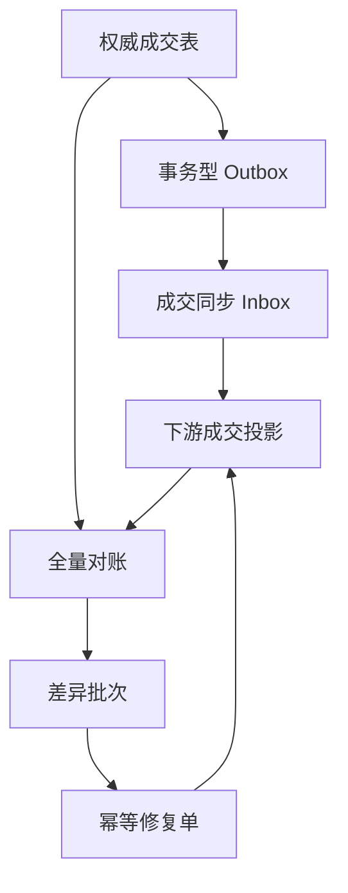

# 复杂可靠性场景：大流量、异常同步与对账修复

这组场景把项目从“单笔功能正确”推进到“高峰、乱序、漏数和重复修复后仍然收敛”。所有说明以业务判断为主，英文只保留必要术语。

> **English summary:** Advanced scenarios cover hot-symbol traffic, duplicated and out-of-order trade events, missing or corrupted projections, ghost trades, idempotent repair and post-repair convergence.

## 负责人先看结论

系统把数据分成两类：

1. **权威事实**：订单、成交和资金账本，只能通过合法业务事务写入；
2. **派生数据**：成交查询投影、报表和下游同步结果，可以从权威事实重建。

因此，“自动修复”只允许重建派生投影或隔离幽灵数据，不能直接把余额改成一个看起来对得上的数字。真实资金差异继续进入高风险人工处置，必要时通过独立补偿单和不可变反向流水处理。

## 新增场景地图

| 场景 | 业务风险 | 故障注入 | 系统证明 |
|---|---|---|---|
| AS-001 热点交易对洪峰 | 同一热门币对瞬间涌入大量订单，出现丢单、重复成交或数量超卖 | 80 个 Maker + 16 路并发 Taker；另提供 2,000 单 k6 冲击 | 成交唯一、序列唯一、数量守恒、Outbox 完整 |
| AS-002 成交事件乱序 | 下游先收到后发生的成交，报表顺序与事实不一致 | 倒序提交成交事件 | 投影按不可变 tradeId 接收，不依赖消息到达顺序 |
| AS-003 重复与冲突重放 | Kafka 重投或上游重试导致重复统计；相同事件号被换了载荷 | 同一 eventId 重放相同与不同内容 | 相同内容幂等返回，冲突内容拒绝 |
| AS-004 漏同步与错值 | 某条成交丢失，或价格、数量、Maker/Taker 被错误覆盖 | 故意跳过一条事件并篡改投影数量 | 全量对账识别 MISSING 与 MISMATCH |
| AS-005 幽灵成交与重复修复 | 下游多出权威成交表不存在的数据；修复任务重试产生二次修改 | 注入 EXTRA 投影并重复提交同一修复键 | 幽灵数据进入隔离区；修复单唯一；再次对账收敛到 CLEAN |

## 数据流与安全边界



关键约束：

- `event_id` 唯一，重复事件不能重复落投影；
- 每个事件保存 SHA-256 规范化指纹，相同事件号更换内容立即拒绝；
- `trade_id` 是不可变成交事实的唯一标识；
- 同一交易对的活动投影序列唯一；
- 对账使用权威成交与活动投影的全量外连接，不能只比较总金额；
- 修复批次有独立幂等键，重试只返回第一次结果；
- MISSING 与 MISMATCH 从权威成交重建；
- EXTRA 先隔离，不物理删除，不反向污染权威事实；
- 修复完成后必须再跑一轮对账，只有 `CLEAN` 才算闭环。

## 一键运行复杂实验

项目以 `lab` Profile 启动后运行热点交易对场景：

```bash
curl -s -X POST \
  'http://127.0.0.1:8080/lab/scenarios/matching-burst?makers=80&takers=16'
```

预期返回五项 `PASS`：

- 16 路 Taker 并发；
- 80 条唯一成交；
- 80 个唯一成交序列；
- 订单数量守恒；
- 80 条成交 Outbox 完整存在。

运行成交同步、差异发现和修复闭环：

```bash
curl -s -X POST \
  http://127.0.0.1:8080/lab/scenarios/trade-sync-recovery
```

这个场景会自动完成：

1. 生成三条真实成交；
2. 乱序同步两条并重复投递其中一条；
3. 发现一条漏同步；
4. 用唯一修复单补齐投影；
5. 重放修复请求，证明不会二次执行；
6. 篡改一条投影并注入一条幽灵成交；
7. 修正错值、隔离幽灵数据；
8. 再次对账，最终状态必须为 `CLEAN`。

## 生产式 API

接收成交同步事件：

```text
POST /api/trade-reliability/sync-events
```

创建指定交易对的对账批次：

```text
POST /api/trade-reliability/reconciliation-runs?symbol=BTC-USDT
```

查询对账证据：

```text
GET /api/trade-reliability/reconciliation-runs/{runId}
```

提交幂等修复：

```text
POST /api/trade-reliability/reconciliation-runs/{runId}/repairs
{"idempotencyKey":"repair-BTC-USDT-20260830-001"}
```

## k6 热点订单冲击

确保应用使用 `lab` Profile 启动，然后执行：

```bash
RUN_ID=$(date +%s) ORDERS=2000 VUS=50 \
  k6 run scripts/load/matching-hot-symbol.js
```

脚本让 50 个虚拟用户向同一交易对提交 2,000 张限价卖单，最后读取聚合订单簿，核对该价位的订单数必须等于 2,000，并设置：

- 请求失败率低于 0.1%；
- P95 小于 2 秒；
- 所有业务检查通过。

这个结果是本机环境的容量观测，不应包装成生产 TPS。生产容量结论仍需给出硬件、数据库配置、连接池、数据量、持续时间、P95/P99 和资源水位。

## 为什么不自动修余额

如果余额和账本不平，直接执行 `UPDATE account SET balance=...` 会掩盖真正原因，也会破坏审计。正确闭环是：

1. 冻结或限制受影响业务范围；
2. 保存差异证据和影响账户；
3. 定位缺失业务事件、重复流水或非法人工改数；
4. 对派生投影执行可重放重建；
5. 对真实资金问题创建唯一补偿单；
6. 通过新的不可变账本流水修正；
7. 再次对账并由授权人员关闭问题。

FinCore 当前自动完成前四步；资金账本继续坚持“发现但不自动改账”的安全边界。
