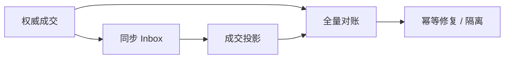
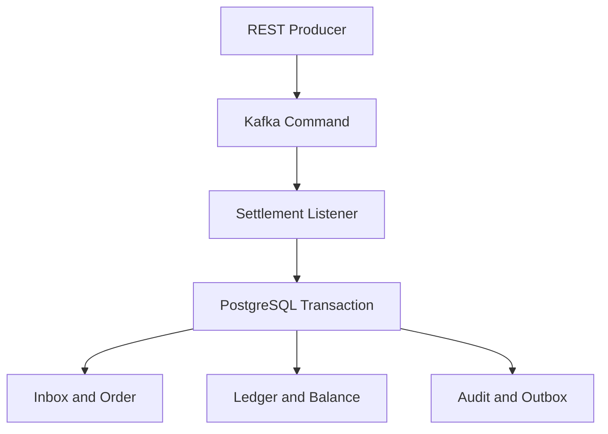

# 架构概览 / Architecture Overview

## 撮合到结算的系统边界


撮合负责生成确定性的成交事实，不直接修改资金余额。当前实现把订单、成交、状态审计和 Outbox 放在同一 PostgreSQL 事务中，并把成交发布到独立 `matching.events.v1`；下游清算根据成交计算应收应付，结算服务再通过不可变账本完成资产交割。撮合的完整接口、约束和非目标见[撮合模块说明](../matching-engine.md)。

## 成交同步与对账修复



对账在 PostgreSQL `REPEATABLE_READ` 一致快照中比较权威成交和活动投影，区分缺失、错值和额外数据。修复执行前再次确认权威成交，避免把对账后刚到达的数据错误隔离。系统只重建派生投影，不直接修改订单、成交事实或资金账本。完整故障模型见[复杂可靠性场景](../advanced-scenarios.md)。

## 结算写入链路



一次结算的数据库事务依次执行：

1. 插入 Inbox，`message_id` 冲突立即返回已有结果；
2. 插入业务单，`business_key` 冲突立即返回已有结果；
3. CAS 将 `INIT` 转换为 `PROCESSING`；
4. 按 UUID 排序后使用 `FOR UPDATE` 锁定三个账户；
5. 检查币种、余额和借贷平衡；
6. 新增账本交易及 Entries；
7. 更新余额视图；
8. CAS 将状态转换为 `SUCCESS`；
9. 写入状态审计和 Outbox；
10. 标记 Inbox 已完成，然后提交事务。

任一步发生未处理异常，整个事务回滚，Kafka 不确认消息并进行重试。

## 账本模型

余额是为了高效查询保留的派生视图，账本才是资金变化依据：

```text
expected balance = opening balance + credits - debits
```

结算 100 USDT、手续费 1 USDT：

| 账户 | 方向 | 金额 |
|---|---|---:|
| Payer | DEBIT | 101 |
| Payee | CREDIT | 100 |
| Fee | CREDIT | 1 |

总 Debit 与总 Credit 均为 101。

## 故障边界

| 故障点 | 行为 |
|---|---|
| Kafka 重复投递 | Inbox 与业务键双层去重 |
| 数据库事务回滚 | 不确认 Kafka，安全重试 |
| Outbox 发布失败 | 回到 PENDING 并延迟重试 |
| 多实例发布 Outbox | 原子 UPDATE + SKIP LOCKED 抢占 |
| 并发扣款 | 固定顺序行锁 + 条件扣减 |
| 重复补偿 | original_business_key 唯一约束 |
| 对账差异 | 记录 HIGH 风险，不自动改账 |
| 旧 Worker 恢复 | Epoch/Fencing Token 拒绝旧所有者 |

## 自动缩容保护

Kafka Listener 根据付款账户计算逻辑分片，取得数据库 Lease 后把 Fence Token 作为调用上下文传给结算服务。结算事务在任何资金写入前共享锁定 Lease；排空或接管更新必须等待在途事务提交。公开 API 不允许绕过 Kafka 直接执行结算。
