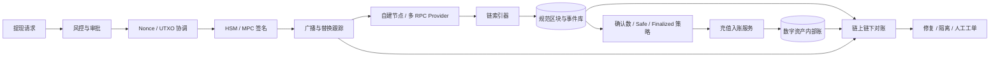

# 区块链与数字资产可靠性设计

## 一、先说明能力边界

FinCore 当前没有连接真实公链、测试网节点、托管钱包、HSM 或 MPC 签名服务，也没有处理真实数字资产。
本章不是把设计文档包装成生产经历，而是回答一个更可验证的问题：现有项目已经证明的幂等、不可变账本、
Outbox、状态机、Worker Fencing 和对账能力，怎样迁移到数字资产充值、提现与链上链下资金一致性场景；
哪些环节仍需要专项代码、测试网故障实验和安全评审。

2026-09-04 已新增一个不连接真实资产的确定性状态机，用于把链专项语义也放进自动测试。当前结论分为三类：

- **已经由 FinCore 证明的通用机制**：业务唯一键、Inbox/Outbox、单事务资金写入、不可变平衡账本、CAS
  状态机、Epoch Fencing、全量对账与幂等修复；
- **确定性模拟已证明的链专项语义**：链上金额使用整数最小单位、充值事件去重、确认数推进、已入账重组转
  `ADJUSTMENT_REQUIRED`、提现未知结果、Nonce Epoch 围栏、同一提现的替换交易哈希链；
- **尚待真实集成验证的能力**：EVM/Bitcoin 索引器、多 RPC 规范链判断、动态确认策略、UTXO 协调、
  HSM/MPC 签名、冷热钱包和测试网端到端演练。

对应实现为 `DigitalAssetWorkflow`，测试为
`creditedDepositReorgRequiresAdjustmentInsteadOfDeletion` 和
`withdrawalReplacementChainKeepsOneBusinessIntent`；完整九域报告与时序图见
[交易所核心能力补全实验](exchange-core-capability-lab.md)。

## 二、为什么区块链不是“换一个数据库”

中心化交易系统通常可以把数据库提交当作权威事实；数字资产系统还要处理另一层事实：节点看到的区块可能
尚未安全或最终确认，交易广播成功也不等于已经上链，同一笔提现还可能因手续费替换而出现新的交易哈希。
因此核心边界变成：

> 链上事实具有确认过程和重组风险，链下账本必须在不重复记账、不提前承诺最终性、不丢失未知结果的前提下
> 与规范链最终收敛。

这与 FinCore 已经处理的“消息至少一次投递、结果未知、旧 Worker 恢复、权威事实与派生投影不一致”高度相似，
但还需要增加链高度、区块哈希、确认级别、交易替换和密钥权限等专有语义。

## 三、现有能力怎样迁移

| FinCore 已验证机制 | 数字资产场景 | 迁移后的关键约束 |
|---|---|---|
| Inbox + 业务唯一键 | 充值事件入站 | EVM 使用 `chainId + txHash + logIndex`；UTXO 使用 `txid + vout`，重复扫描不能重复入账 |
| Outbox + 未知结果恢复 | 提现签名与广播 | 先持久化发送意图，再调用外部签名/节点；超时后先查询，不盲目重签或创建新提现 |
| 不可变平衡账本 | 用户数字资产内部账 | 充值、冻结、提现、手续费和冲正都形成新分录，不改历史成功流水 |
| CAS 合法状态机 | 充值/提现生命周期 | 只有合法前置状态可以推进；回调、轮询和人工操作不能相互覆盖 |
| Lease + Epoch Fencing | 索引分片、Nonce 或 UTXO 协调者 | 新 Owner 接管后旧进程即使恢复，也不能继续分配 Nonce、UTXO 或提交资金结果 |
| 权威事实对账 | 链上、钱包、内部账与客户投影 | 自动修复只触碰可重建投影；影响资产的差异必须经过确定性资金服务与授权 |

这些映射和确定性状态机说明已有基础可以复用，但不能据此宣称真实钱包与公链接入已经完成。

## 四、参考架构



节点或 Provider 只是外部观察源，不直接成为内部资金账本。索引器先保存区块父子关系、交易回执和标准化事件，
确认策略再判断何时允许入账；提现链路把请求、审批、签名意图、广播结果和替换关系分别持久化，避免把一次
网络调用误当成完整业务事务。

## 五、充值状态机与链重组

建议状态机：

```text
DETECTED -> CONFIRMING -> CREDITABLE -> CREDITED
     |           |             |
     +--------> REORGED <-------+
                 |
               HELD / ADJUSTMENT_REQUIRED
```

1. `DETECTED`：索引器发现目标地址或合约事件，并保存区块高度、区块哈希和事件唯一键；
2. `CONFIRMING`：等待资产、链和金额对应的确认策略，不能只使用一个全局确认数；
3. `CREDITABLE`：事件仍位于规范链，金额、Token 合约、精度和目标地址校验通过；
4. `CREDITED`：以充值业务键创建唯一账本事务，重复扫描返回原结果；
5. `REORGED`：原区块不再属于规范链。未入账事件可以撤销候选；已经入账的事件不能删除历史流水，应按风险
   策略冻结可用额、创建调整或人工工单，并保留完整因果链。

索引器不能只保存“最后扫描高度”。每个高度至少保存区块哈希和父哈希；发现父哈希不连续时，从共同祖先回滚
派生事件并重新扫描。多个 RPC Provider 对区块哈希或高度意见不一致时，应暂停高风险入账而不是随机选择一个结果。

## 六、提现状态机与未知结果

建议状态机：

```text
REQUESTED -> APPROVED -> SIGNING -> SIGNED -> BROADCAST -> CONFIRMING -> COMPLETED
      |          |           |          |           |
      +------> REJECTED      +-------> FAILED / REPLACED
```

- `withdrawalRequestId` 是端到端幂等键，相同请求不能创建第二笔资金冻结或提现；
- 审批、签名意图、签名结果、广播尝试和链上交易分别记录，不使用一个模糊的 `SUCCESS`；
- 签名服务超时属于“结果未知”。恢复任务应先按签名意图查询，不能直接重新生成另一笔交易；
- 广播超时先按交易哈希或交易内容查询节点。需要提高手续费时，建立 `replaces/replacedBy` 关系，不能把替换交易
  计为第二笔提现；
- 只有规范链确认满足策略并且内部账状态合法，才把冻结资产结转为正式扣减与手续费；
- 失败释放、人工拒绝和链上替换都写审计记录，禁止直接覆盖原请求。

## 七、EVM 模型需要专项处理什么

Ethereum JSON-RPC 使用 `eth_getTransactionCount` 查询地址交易计数，并区分 `latest`、`pending`、`safe` 和
`finalized` 等区块标签。工程实现不能把这些标签视为等价：前台展示、内部风险判断和最终入账可以采用不同级别，
但必须由显式策略控制。

### 1. Nonce 协调

- 以 `chainId + fromAddress` 建立单写协调域；
- 数据库内分配本地 Nonce，并保存节点 `pending` 视图、分配记录和交易哈希；
- 协调 Worker 使用 Lease + Epoch，旧 Epoch 不能继续分配或广播；
- 监控链上已确认 Nonce、节点 pending Nonce 和本地下一 Nonce 的差异；
- Nonce 空洞、节点丢失 pending 交易或替换冲突进入恢复流程，不能简单自增跳过。

### 2. 合约与金额

- 事件唯一键必须包含 `logIndex`，同一交易可以发出多个同类事件；
- Token 合约地址、`chainId`、事件签名和目标地址全部进入白名单校验；
- 金额使用整数最小单位，Token `decimals` 是展示元数据，不能用浮点数参与账务；
- 合约升级、代理合约和异常 Token 行为需要单独风险策略，不能仅凭交易状态成功就入账。

### 3. 手续费与替换

同一 Nonce 的交易可能被更高费用交易替换。系统应保存原交易、替换交易、费用策略和最终获胜交易，不以单一
`txHash` 作为提现业务主键。

## 八、Bitcoin/UTXO 模型需要专项处理什么

Bitcoin 交易消费已有 UTXO，并创建新的输出，因此提现不能套用 EVM 的账户 Nonce 模型：

- 输入唯一键使用 `txid + vout`；候选 UTXO 在构建交易前必须原子预留；
- 预留状态由签名、广播、确认或释放流程推进，两个 Worker 不能同时消费同一 UTXO；
- 找零输出必须被识别为钱包资产，不能误记为客户充值；
- 双花、RBF 替换、未确认祖先链和手续费率变化需要进入交易跟踪；
- 余额不只是节点返回的一个数字，而是满足确认、冻结和可花费策略的 UTXO 集合；
- 链重组后重新判断 UTXO 的存在、确认数和消费关系，并与内部钱包库存对账。

## 九、私钥与签名安全边界

应用服务、业务数据库、日志、监控标签和错误信息中都不应出现原始私钥。设计目标是让业务系统只能提交受约束的
签名意图，不能直接取得密钥材料。

- 使用 HSM 或经过独立评估的 MPC/托管签名方案；
- 热钱包、温钱包和冷钱包按风险与流动性分层，热钱包只保留运营所需额度；
- 地址白名单、单笔/单日限额、双人审批和异常行为拦截在签名前执行；
- 密钥生成、激活、轮换、备份、恢复、暂停和销毁都有具名 Owner 与审计证据；
- 签名策略至少绑定网络、资产、目标地址、金额、手续费上限和业务请求，不能签任意字节；
- Break-glass 操作必须限时、双人授权并形成不可抵赖审计；
- 签名服务与业务服务分离部署，最小权限访问，生产密钥不进入测试环境。

密钥管理方案还需要结合目标司法辖区、托管模式、审计要求和独立安全评审。本章引用 NIST 密钥管理指南作为
生命周期设计参考，不代表项目已获得安全认证。

## 十、四方对账与修复边界

数字资产对账至少包含四个事实面：

1. **规范链事实**：规范区块、交易、回执、事件和 UTXO；
2. **钱包库存**：地址余额、可花 UTXO、pending 交易、Nonce 和手续费；
3. **内部资产账本**：用户可用、冻结、平台热钱包、手续费和调整账户；
4. **客户查询投影**：充值记录、提现进度、余额展示和通知。

典型差异包括：`MISSING`、`MISMATCH`、`EXTRA`、`REORGED`、`NONCE_GAP`、`UTXO_CONFLICT`、
`STUCK_WITHDRAWAL` 和 `RPC_DISAGREEMENT`。

自动修复遵循 FinCore 现有边界：可以重新扫描、重建客户查询投影、补发通知和隔离幽灵数据；不能为追求数字
相等而直接修改历史账本或客户余额。需要改变资产结果时，必须通过有业务键、有借贷分录、有授权和可审计的
调整服务完成。

## 十一、运行指标与告警

| 观察面 | 核心指标 | 需要升级的信号 |
|---|---|---|
| 链索引 | 最新链高、已索引高度、索引延迟、重扫量 | 高度长期不前进、父哈希断裂、Provider 结果不一致 |
| 充值 | 各确认阶段数量、最长等待时间、重组深度 | 已入账事件被重组、积压超过资产策略 |
| 提现 | 各状态数量、签名/广播延迟、替换次数 | Nonce 空洞、UTXO 冲突、交易长时间未确认 |
| 钱包 | 热钱包可用额、手续费储备、地址/UTXO 数量 | 流动性不足、异常归集、单地址风险集中 |
| 签名 | 成功率、拒绝原因、策略命中、HSM/MPC 延迟 | 未授权意图、阈值节点不足、签名结果未知 |
| 对账 | 各类差异数量、金额、年龄和收敛时间 | 资金差异扩大、自动修复后仍不 CLEAN |

高风险告警必须携带 `chainId`、资产、区块高度/哈希、业务请求号和恢复手册链接，但日志与标签不得包含密钥、
助记词或完整敏感签名材料。

## 十二、需要进入实验室的故障场景

1. 两个 RPC Provider 在同一高度返回不同区块哈希；
2. 充值达到临时确认后发生链重组；
3. 同一 EVM 日志被重复、乱序或跨扫描窗口投递；
4. 签名或广播超时，但外部操作实际已经成功；
5. 两个提现 Worker 竞争同一 EVM Nonce；
6. 两个交易构建器竞争同一 UTXO；
7. 低费用交易卡住后进行替换，旧交易又被节点观察到；
8. Token 精度或合约配置错误导致金额放大/缩小；
9. Nonce/UTXO 协调 Worker 接管后，旧 Worker 恢复并尝试继续工作；
10. 链事件正确，但客户投影漏数、错值或出现幽灵记录。

每个实验都应同时验证业务结果、数据库约束、审计链、Prometheus 指标和恢复后再次对账 `CLEAN`，不能只验证
HTTP 返回码。

## 十三、分阶段验收路线

### 阶段 A：离线模型

- 建立链、区块、交易、事件、充值、提现、签名意图、Nonce/UTXO 预留和替换关系模型；
- 对十个故障场景编写纯数据库/模拟器测试；
- 复用 FinCore 平衡账本、Inbox/Outbox、状态机与 Fencing。

### 阶段 B：测试网闭环

- 接入至少两个独立 RPC 来源和 EVM 测试网；
- 完成充值发现、确认、入账、提现签名、广播、替换和对账；
- 人工制造重扫、Provider 超时、Nonce 冲突和替换；
- 生产密钥仍不得进入实验环境。

### 阶段 C：UTXO 与签名基础设施

- 增加 Bitcoin regtest/testnet UTXO 预留、找零、RBF 和重组实验；
- 接入模拟 HSM/MPC 接口，验证双人审批、签名策略、超时查询和灾难恢复；
- 完成威胁建模、第三方组件评估和密钥生命周期演练。

### 阶段 D：生产前评审

- 独立安全、金融控制、合规和灾备评审；
- 容量、费用、节点故障域、数据保留、SLO 和退出方案达到目标环境要求；
- 所有资产影响路径完成授权矩阵、审计证据和人工回退演练。

在阶段 D 完成之前，只能描述为“数字资产可靠性设计与实验”，不能描述为生产托管平台。

## 十四、官方参考资料

- [Ethereum JSON-RPC API](https://ethereum.org/developers/docs/apis/json-rpc/)：节点交互、交易计数、广播以及
  `latest`、`pending`、`safe`、`finalized` 等状态语义；
- [Ethereum Proof-of-Stake](https://ethereum.org/developers/docs/consensus-mechanisms/pos/)：区块安全性与最终性背景；
- [Bitcoin Developer Guide: Transactions](https://developer.bitcoin.org/devguide/transactions.html)：UTXO、输入、输出与
  交易结构；
- [NIST Key Management Guidelines](https://csrc.nist.gov/Projects/Key-Management/Key-Management-Guidelines)：密钥生命周期
  与管理控制参考。

这些资料用于确定设计语义和试验边界，不代表 FinCore 已通过任何链、托管、安全或合规认证。
