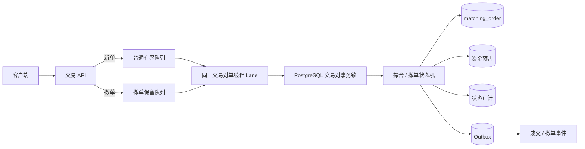
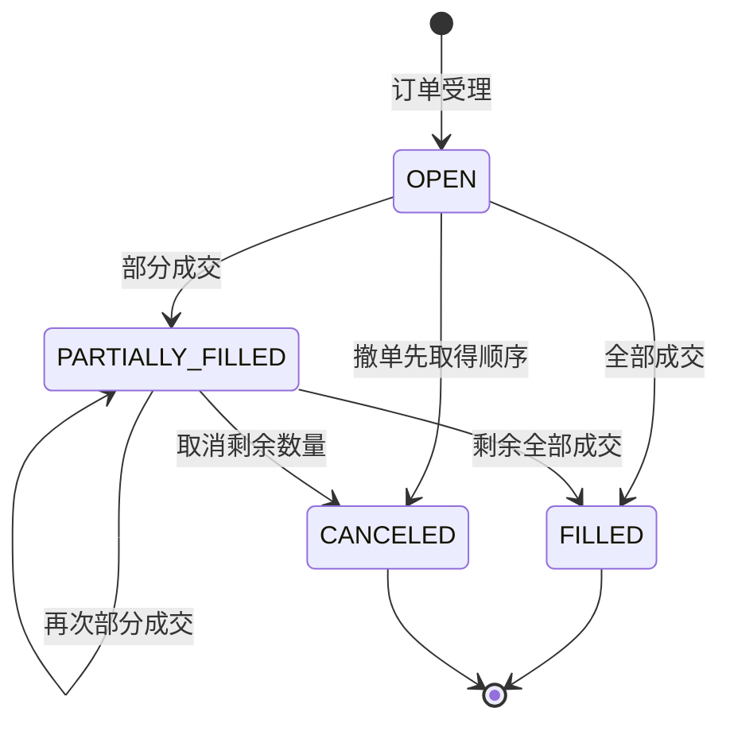
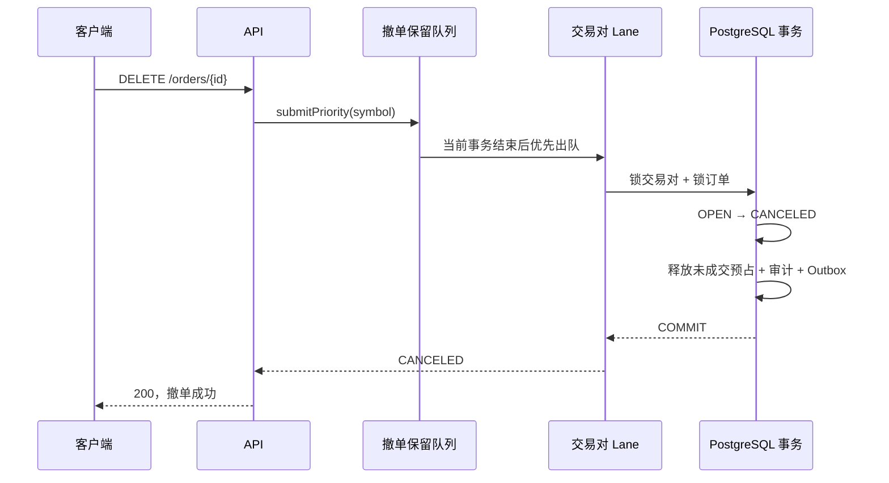
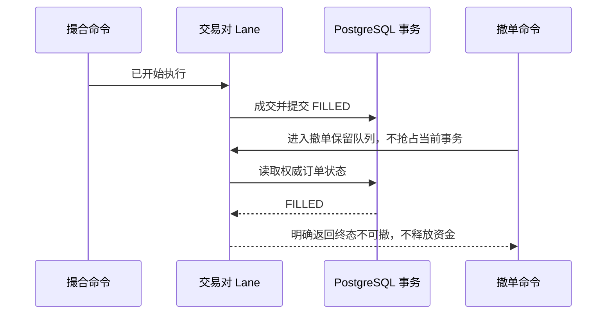
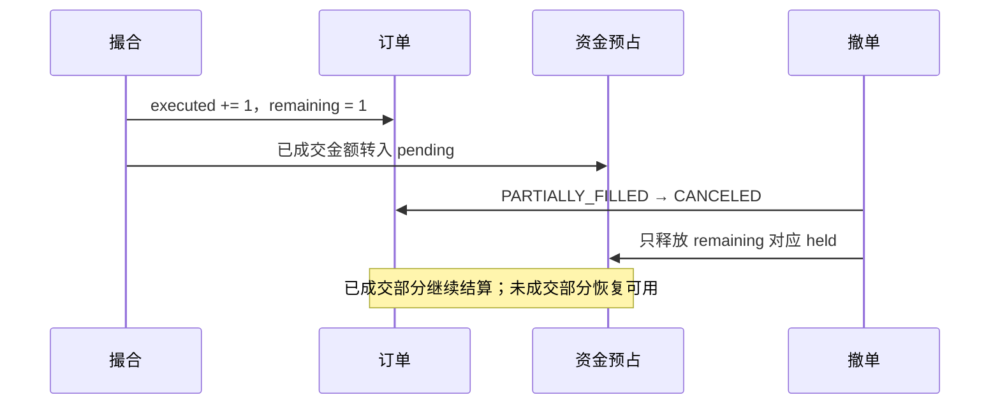

# 大流量下撤单：从错误直觉到可验证实现

## 问题定义

热点行情下，系统可能同时收到大量新单和撤单。真正的问题不是“把撤单放进一个缓存”，而是：

- 普通新单队列满载时，用户是否仍能表达退出风险的意图；
- 撤单与已经到达的成交谁先发生，能否给出唯一答案；
- 部分成交后应该释放多少资金；
- 重复撤单、超时重试和进程崩溃会不会重复释放；
- 前端什么时候可以显示“撤单成功”。

## 四条不可破坏的不变量

1. `executedQuantity + remainingQuantity = originalQuantity`；
2. 下单、成交和撤单必须在同一交易对顺序边界内决定先后；
3. 预占资金只能释放一次，并且只释放未成交部分；
4. 只有订单终态、资金释放和待发布事件在同一事务中可靠提交后，接口才能返回“撤单成功”。

## 为什么“专门做一个撤单缓存，消费者看到后跳过订单”不够

缓存可以作为加速提示，但不能作为权威状态：

- 消费者可能先读缓存、后发生撤单，形成检查—执行竞态；
- 缓存丢失、过期或主从切换会让已撤订单重新进入撮合；
- 多实例看到的缓存顺序未必与交易对的成交顺序一致；
- “缓存里有撤单”并不等于订单状态和资金释放已经提交；
- 前端提前提示成功后，订单可能已经部分或全部成交。

FinCore 的实现把缓存思路改成“保留容量 + 同序执行 + 权威事务”。

## 总体架构



### 保留容量不等于绕过顺序

撤单只会越过“尚未开始”的普通积压，不会中断当前正在提交的成交事务。Worker 完成当前命令后优先取撤单；连续处理 8 笔撤单后，如果普通队列非空，会让 1 笔普通命令前进，避免永久饥饿。

| 资源 | 默认每 Lane 容量 | 饱和行为 |
|---|---:|---|
| 普通下单队列 | 256 | 明确拒绝，HTTP 映射为 429，调用方使用原幂等键重试 |
| 撤单保留队列 | 32 | 明确拒绝；调用方先查询订单状态，再重试同一订单撤单 |
| Worker | 1 个平台线程 | 同交易对串行，不通过增加线程破坏顺序 |

配置项：

```yaml
fincore:
  concurrency:
    matching-lanes: 4
    matching-queue-capacity-per-lane: 256
    matching-cancel-queue-capacity-per-lane: 32
```

## 订单状态与数量语义



- `FILLED` 后到达的撤单是“太晚”，不能伪装成成功；
- `PARTIALLY_FILLED → CANCELED` 只取消 `remainingQuantity`，历史成交保持不变；
- 重复撤销 `CANCELED` 订单直接返回同一终态，资金释放使用唯一业务键避免二次效果；
- 当前同步接口不返回虚假的 `CANCEL_ACCEPTED`。请求超时意味着结果未知，客户端必须查询订单再决定是否重试。

## 三个关键时序

### 撤单赢得顺序



### 成交先取得顺序



### 部分成交后撤余单



## 代码实现映射

| 责任 | 代码 | 关键保证 |
|---|---|---|
| 双有界队列与优先策略 | `StripedTaskExecutor.PriorityCommandQueue` | 普通流量不能占用撤单容量；最大优先批次防饥饿 |
| 撤单进入同一交易对 Lane | `MatchingCommandCoordinator.cancel` | `submitPriority(snapshot.symbol(), ...)` |
| 跨实例顺序 | `MatchingService.cancel` | PostgreSQL advisory transaction lock |
| 订单终态 | `MatchingMapper.transition` | 只有开放状态能 CAS 到 `CANCELED` |
| 资金释放 | `SpotFundsService.releaseCanceled` | 行锁 + held 数量 + 唯一变更键，重复撤单不重复释放 |
| 原子提交 | `MatchingService.cancel` 的 `@Transactional` | 订单、资金、审计、Outbox 任一步失败则整体回滚 |
| 过载返回 | `ApiExceptionHandler.overloaded` | 429 + `retryable=true`，不吞异常 |

## API 与前端文案

```http
DELETE /api/matching/orders/{orderId}?userId={userId}
```

| 服务端结果 | 前端应该显示 | 资金动作 |
|---|---|---|
| 返回订单状态 `CANCELED` | 撤单成功 | 已提交释放未成交预占 |
| 返回/查询到 `FILLED` | 撤单失败：订单已全部成交 | 不释放已成交资金 |
| 429 | 系统繁忙，正在重试撤单 | 未知，先查询再重试 |
| 503/客户端超时 | 撤单结果确认中 | 未知，禁止直接显示成功 |
| 订单不存在或不属于用户 | 撤单失败并给出明确原因 | 不改变资金 |

前端不要把“请求已发送”写成“撤单成功”。如果未来改为异步 API，应分别使用 `ACCEPTED/PENDING` 和 `CANCELED`，并通过查询或推送完成最终确认。

## 自动测试

| 测试 | 输入 | 核心断言 |
|---|---|---|
| `cancellationUsesReservedCapacityAndOvertakesOrdinaryBacklog` | Worker 阻塞、普通容量 1 已满、再提交撤单 | 溢出新单被拒；撤单受理；执行顺序为当前任务 → 撤单 → 普通积压 |
| `cancellationStormPreservesExitCapacityAndOrderInvariant` | 32 笔普通积压 + 撤单 | 撤单完成时普通积压完成数为 0；数量守恒 |
| `cancellationReleasesOnlyOnce` | 同一订单撤单两次，再重放下单 | 预占只释放一次，余额不增加两次 |
| `partialFillPriceImprovementAndCancellationPreservePending` | 2 单位买单先成交 1，再撤余单 | 只释放剩余预占；已成交资金继续 DvP |
| `openOrderCanBeCanceledOnlyByItsOwner` | 非本人撤单、本人重复撤单 | 越权拒绝；本人撤单幂等 |

运行确定性撤单风暴：

```bash
curl -s -X POST \
  'http://127.0.0.1:8080/lab/scenarios/cancellation-storm?backlog=256'
```

代表性结果：

```json
{
  "ordinaryBacklog": 256,
  "overflowRejected": true,
  "cancellationStatus": "CANCELED",
  "ordinaryCompletedAtCancellation": 0,
  "ordinaryCompleted": 256,
  "quantityInvariant": true,
  "checks": {
    "普通队列背压": "PASS",
    "撤单保留容量": "PASS",
    "同交易对顺序": "PASS",
    "前端成功语义": "PASS",
    "订单数量守恒": "PASS"
  }
}
```

## 可观测性与告警

| 指标 | 含义 | 建议动作 |
|---|---|---|
| `fincore.matching.lane.queue.depth` | 普通命令排队深度 | 接近容量时限制新单、分析热点交易对 |
| `fincore.matching.queue.rejected` | 新单背压次数 | 持续增长时扩容或降载，不盲目增加队列 |
| `fincore.matching.cancel.lane.queue.depth` | 每 Lane 撤单排队深度 | 快速上升是市场风险和用户退出压力信号 |
| `fincore.matching.cancel.queue.depth.total` | 全部撤单积压 | 与价格变化率、订单/撤单比联动告警 |
| `fincore.matching.cancel.queue.rejected` | 撤单保留容量也已饱和 | 最高优先级事故；保护只减仓/撤单并限制新单 |
| `fincore.matching.queue.wait` | 排队等待时间 | p99 上升而执行时间稳定说明瓶颈在准入 |
| `fincore.matching.execution` | 实际命令执行时间 | 上升时检查数据库锁、慢 SQL、GC 和 CPU throttling |

## 已知边界

- 当前优先队列是单实例内存准入层；进程在尚未执行时崩溃，客户端需要根据订单状态重试撤单。生产级升级可使用按交易对分区的持久化命令日志。
- 多实例的最终顺序由数据库交易对事务锁保证，但流量路由最好保持同一交易对亲和，减少跨实例锁竞争。
- 保留容量降低撤单被新单挤出的风险，不能保证在数据库、网络或整个机房故障时立即完成；因此超时必须表达“未知”，不能表达成功。
- 本实验验证金融语义和过载行为，不把本机吞吐数字当生产 SLA。生产容量需结合真实订单分布、热点币对、网络和硬件重新测量。
