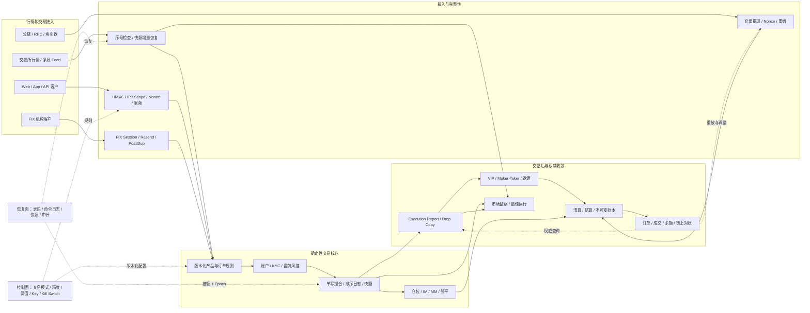
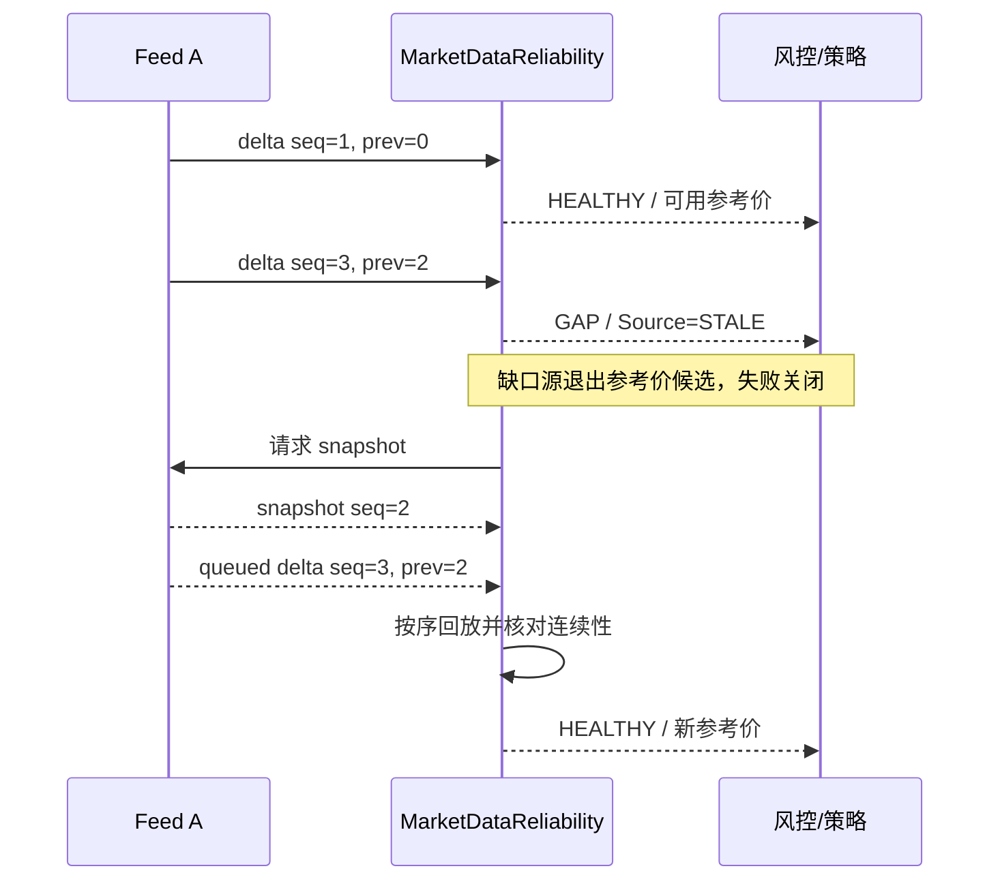
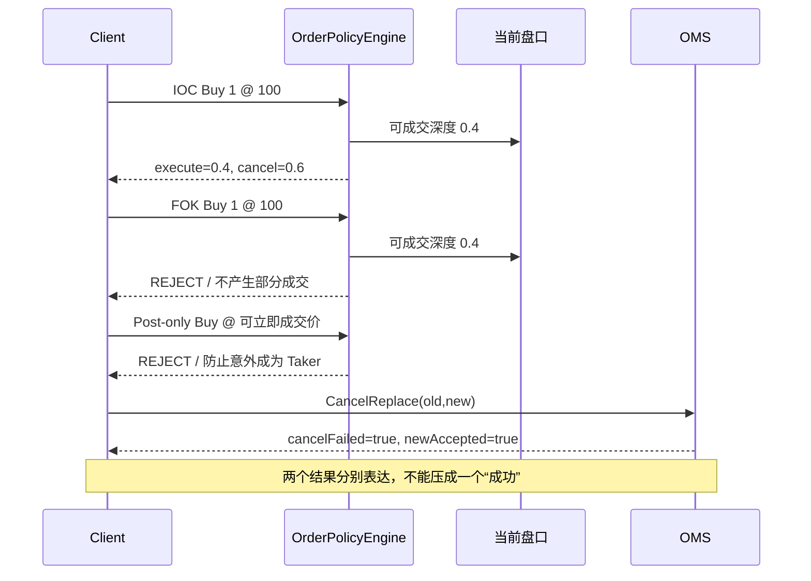
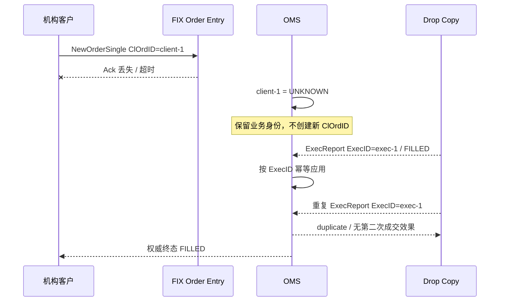
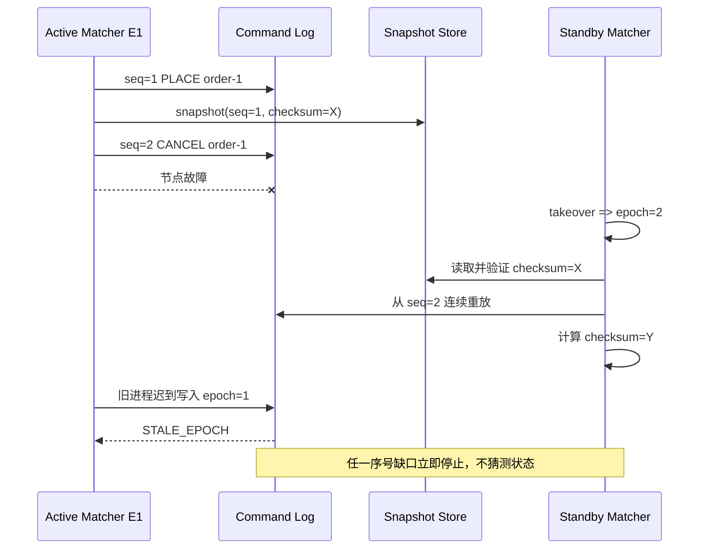
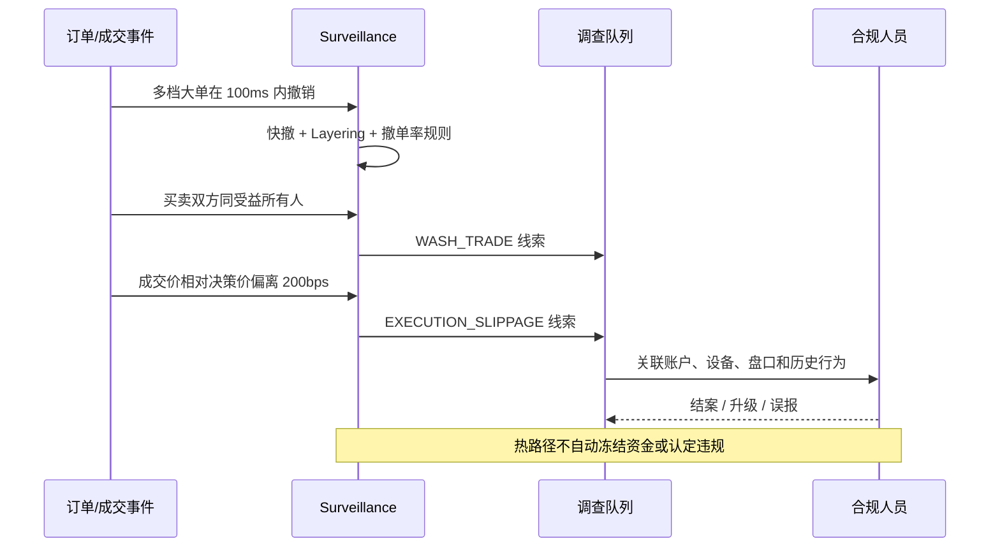
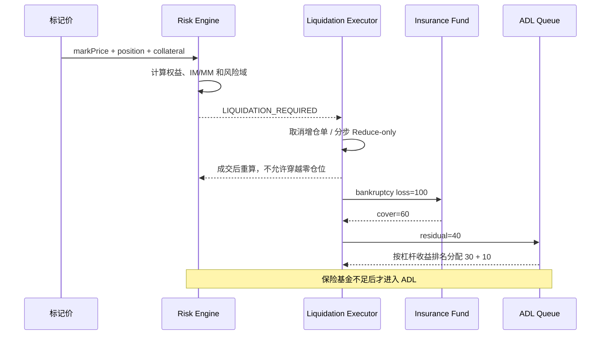
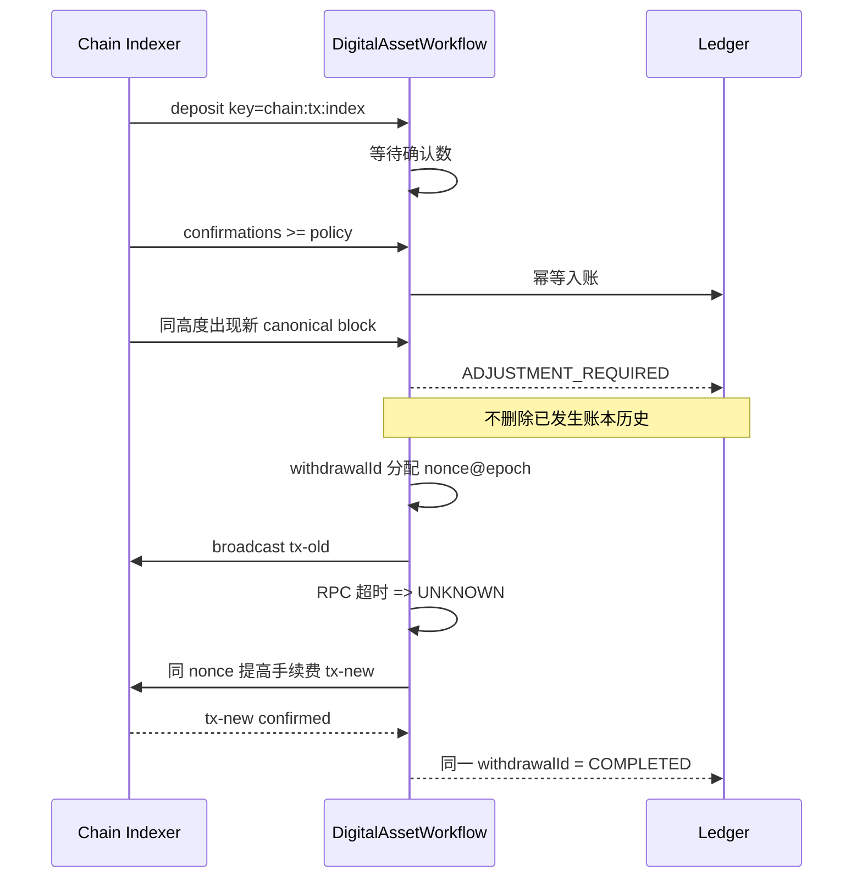

# 交易所核心能力补全实验

## 一、为什么补这一层

FinCore 原有强项是资金正确性、撮合、结算、幂等、接管、对账和故障恢复。真实数字资产交易团队还会继续追问：

- 行情丢包、乱序、多源分歧和慢消费者怎样处理；
- IOC、FOK、Post-only、STP、撤改单部分成功如何定义；
- FIX 会话断线、回报丢失和未知订单怎样收敛；
- 自成交、刷量、分层挂单和异常滑点怎样留下调查证据；
- API 防重放、手续费、撮合恢复、合约风险和链上状态是否能落到代码。

本次新增九个可运行的纯领域模型、一个 `lab` Profile 一键场景和自动测试。它们不替换原有持久化交易核心，
而是把此前只在文档中的行业问题变成可复算证据，并明确下一步生产化边界。

运行全部补全实验：

```bash
curl -s -X POST http://127.0.0.1:8080/lab/scenarios/exchange-coverage
```

返回 `PASS` 前会执行九组业务断言；任一断言失败都会使请求失败，不会返回假成功。

## 二、全局架构：业务、控制、恢复三条链



这不是“所有请求都同步穿过所有服务”。行情与交易接入、资金账本、风险和链上工作流拥有不同延迟与一致性要求：

- 热路径使用固定规则、显式容量和确定性顺序，不能依赖无界异步任务；
- 资金效果只由数据库事务与不可变账本确认，缓存、Kafka offset 和页面状态都不是最终事实；
- 超时表示结果未知，必须查询权威回报或链上事实；
- 监察只生成线索，不在热路径中自动处罚或修改用户资金；
- 控制面变更必须带版本，恢复面必须能证明输入、顺序和输出摘要。

## 三、九个能力域与可验证结果

| 能力域 | 本次实现 | 一键实验中的确定性结果 | 生产化仍需补充 |
|---|---|---|---|
| 行情完整性与分发 | 序号缺口、`STALE`、快照+增量恢复、多源择优、有界 Latest-Value 缓冲 | 异常源被剔除；连续恢复后重新健康；慢消费者发生 1 次合并与 1 次明确丢弃 | 真实 Feed、SBE/Aeron、ITCH/OUCH、多播、录包回放 |
| 订单语义与产品配置 | GTC/IOC/FOK/GTD、Post-only、STP、精度/最小名义金额、交易模式、撤改单组合结果 | IOC 成交 `0.4`、取消 `0.6`；FOK 深度不足全拒；Post-only 不会吃单 | 条件单持久化、撮合状态机整合、产品审批与灰度 |
| FIX / OMS / Drop Copy | 会话序号、缺口/补发、PossDup、执行编号幂等、UNKNOWN、掉线撤单 | 丢失回报由 Drop Copy 收敛；重复 `ExecID` 无第二次业务效果 | QuickFIX、证书、Sandbox、恢复时限和容量验收 |
| 市场监察与最佳执行 | 自成交、快速大单撤销、Layering、高撤单率、不利滑点 | 7 条调查信号、5 种信号类型；资金不被自动改动 | 关联账户图谱、盘口上下文、模型评估、合规工作流 |
| 交易 API 安全 | HMAC、规范串、时间窗口、Nonce、权限、IP 白名单、固定窗口限频 | 2 次合法、1 次重放拒绝、1 次限频拒绝 | KMS、分布式限频、WAF/DDoS、账户接管检测 |
| 手续费经济正确性 | Maker/Taker、VIP 阶梯、负费率返佣、一次舍入、原额冲正 | VIP1 Maker 费 `-1.2`；用户腿与手续费账户腿严格平衡 | 费率快照持久化、税务、活动券、多币种估值 |
| 撮合恢复 | 单写命令、业务指纹、顺序日志、快照摘要、连续重放、Epoch 围栏 | 快照后重放摘要一致；旧 Epoch 永久拒写；缺口停止恢复 | 磁盘刷写、复制、选主、热备与微秒订单簿 |
| 合约风险生命周期 | 全仓/逐仓、阶梯 IM/MM、资金费方向、部分强平、保险基金、ADL 排名 | 全仓安全、逐仓触发强平；保险基金先承担 60，ADL 再承担 40 | 强平成交、仓位账本、标记价治理和事件状态机串联 |
| 数字资产状态机 | 最小单位整数、充值去重/确认/重组、提现 UNKNOWN、Nonce 围栏、替换交易 | 已入账重组转人工调整；同一提现保留两个哈希并最终确认 | 测试网、多 RPC、索引器、HSM/MPC、冷热钱包策略 |

## 四、核心场景时序图

### 4.1 行情缺口：不能带着陈旧订单簿继续交易



慢消费者缓冲只合并“页面展示类行情”。订单、成交、账本和审计事件绝不能用 Latest-Value 语义覆盖。

### 4.2 IOC/FOK/Post-only 与撤改单部分成功



### 4.3 发单超时：UNKNOWN 不是失败，也不能换单号盲重试



### 4.4 撮合节点接管：快照、日志和 Epoch 缺一不可



### 4.5 市场监察：命中规则只产生案件线索



### 4.6 合约强平：先降风险，再走损失瀑布



### 4.7 充值重组与提现替换：业务身份和链哈希分离



## 五、代码与测试证据

| 代码 | 关键不变量 | 代表测试 |
|---|---|---|
| `MarketDataReliability` | 序列不连续立即过期；多源选择完整的一家报价，不拼出虚假倒挂盘 | `marketDataGapRequiresSnapshotRecovery`、`latestValueBufferIsBoundedAndCoalescesBySymbol` |
| `OrderPolicyEngine` | TIF 剩余量、STP 和撤改单组合结果都显式表达 | `orderTimeInForceHasExplicitRemainderSemantics`、`selfTradeAndCancelReplaceDoNotCollapseBusinessResults` |
| `FixOmsReconciler` | FIX 序号幂等与业务执行幂等分离；UNKNOWN 由权威回报收敛 | `unknownOrderConvergesFromDropCopyExactlyOnce` |
| `MarketSurveillanceEngine` | 信号不等于定罪；数值相同而 scale 不同的价格仍是同一档位 | `surveillanceNormalizesPriceLevelsBeforeLayeringDetection` |
| `TradingApiSecurity` | 只有验签通过才消费 Nonce 和限频额度；窗口配置不能导致除零 | `tradingApiRejectsReplayAndRateOverflow`、`tradingApiRejectsSubSecondFixedWindow` |
| `FeeEngine` | 金额使用 `BigDecimal`；一次舍入；手续费两腿和为零；冲正引用原额 | `feeCalculationAndReversalRemainBalanced` |
| `MatchingRecoveryLog` | 输入顺序、快照摘要、连续重放和 Epoch 一起决定可恢复性 | `matchingSnapshotReplayIsDeterministicAndFenced` |
| `DerivativeRiskEngine` | 全仓/逐仓隔离；正资金费多头支付；部分强平不反向开仓 | `derivativeFundingAndLiquidationWaterfallAreDeterministic` |
| `DigitalAssetWorkflow` | 链上金额用整数最小单位；已入账重组不删除历史；提现意图不随哈希替换 | `withdrawalReplacementChainKeepsOneBusinessIntent` |

执行纯领域验收：

```bash
mvn -Dtest=ExchangeCoverageLabTest,CodeConventionTest test
```

这组测试无需外部交易所、真实公链和数据库，适合快速复现语义。它不能替代 PostgreSQL 集成测试、真实协议
认证、长稳压测、目标硬件尾延迟测试、灾备演练和安全渗透测试。

## 六、面试高频追问与回答锚点

### 6.1 “为什么不能收到一条行情就直接更新？”

因为行情是有顺序的状态增量。`seq=3` 不能在缺少 `seq=2` 时应用到旧订单簿；正确行为是标记数据源过期，
停止它参与决策，获取快照后只回放快照之后连续的增量。多源不是简单取最高买和最低卖，跨源拼接可能构造
并不存在的盘口。

### 6.2 “发单超时了，重发不就行了吗？”

超时只说明客户端不知道结果。原单可能已成交，换一个业务编号重发会形成双单。应保持同一 `ClOrdID` 或业务
幂等键，进入 `UNKNOWN`，再通过订单状态查询、执行回报和 Drop Copy 收敛。执行回报还要以 `ExecID` 去重。

### 6.3 “撤改单到底算一个动作还是两个？”

用户意图是一个，但外部事实可能是四种组合：旧单撤销成功/失败与新单接受/拒绝。接口必须表达组合结果，
不能把 `new accepted + cancel failed` 压成一个模糊成功，否则用户会同时持有旧单和新单而不知情。

### 6.4 “如何证明撮合接管后状态没变？”

不是只看进程启动成功。需要验证快照摘要、重放起始序号、日志连续性、同输入的最终状态摘要，以及旧 Epoch
无法写入。真实系统还要证明日志刷盘、复制提交点、选主协议和 RTO/RPO。

### 6.5 “现货经验怎样迁移到合约？”

复用的是订单、撮合、幂等、回报、账本、对账、Fencing 和可观测性；新增的是仓位、杠杆、标记价、全仓/逐仓、
IM/MM、资金费、强平、破产价、保险基金和 ADL。FinCore 对新增部分提供可复算模型，但明确没有把它描述成
完整生产合约系统。

### 6.6 “区块链和 Kafka 有什么本质区别？”

Kafka 重放面对的是消息投递与消费进度；公链还存在规范链选择、确认过程、相同高度不同区块、Nonce/UTXO、
手续费替换和密码学签名权限。链上交易广播成功也不是业务完成，链哈希可以变化而提现业务身份不能变化。

## 七、容量、监控与失败契约

每个模块上线前至少定义下面三类指标：

| 领域 | 业务正确性 | 容量与尾延迟 | 失败与恢复 |
|---|---|---|---|
| 行情 | gap、stale source、多源分歧、倒挂保护 | 每频道 msg/s、decode P99.9、consumer lag、合并/丢弃 | 快照恢复耗时、失败次数、恢复后摘要 |
| OMS/FIX | UNKNOWN 订单、重复 ExecID、状态差异 | order-to-ack、fill-to-position、session backlog | resend 次数、断线时长、Drop Copy 收敛时间 |
| 撮合 | 数量守恒、价格时间优先、重复命令 | queue depth、tick-to-trade、每 symbol QPS | snapshot age、replay lag、epoch rejection |
| 合约 | 风险域权益、MM、负权益、ADL 排名 | 风险重算 P99.9、强平队列深度 | 陈旧标记价、强平失败、保险基金缺口 |
| 链上 | 充值唯一键、确认数、提现业务身份 | 区块 lag、RPC P99、签名队列 | reorg 深度、UNKNOWN 年龄、替换次数 |

失败契约需要对用户说清楚：

- `REJECTED`：系统明确没有接受业务效果，可以按规则修改后重试；
- `UNKNOWN`：结果尚未确认，不允许换业务键盲重试；
- `PENDING_CANCEL`：撤单请求已接受但订单终态仍等待权威回报；
- `STALE`：输入事实不可信，停止破坏性决定而不是拿旧数据继续；
- `ADJUSTMENT_REQUIRED`：历史效果保留，后续用授权调整收敛；
- `STALE_EPOCH`：旧所有者永久失去写权限，不能靠重启继续。

## 八、与行业公开接口的对应关系

这组实现不是凭空发明术语，而是把公开协议中的关键语义缩成可测模型：

- Coinbase Exchange 公开说明撮合采用价格时间优先并提供 STP 行为：
  <https://docs.cdp.coinbase.com/exchange/concepts/matching-engine>
- Coinbase FIX Drop Copy 返回跨 Order Entry/REST 会话的执行报告，并包含 `ClOrdID`、`OrderID`、
  `ExecID`、`CumQty` 与 `LeavesQty`：<https://docs.cdp.coinbase.com/exchange/fix-api/drop-copy>
- Binance Spot 公开订单类型、STP、精度和交易对过滤语义：
  <https://developers.binance.com/docs/binance-spot-api-docs>
- OKX 公开全仓/逐仓、维持保证金、保险基金和 ADL 指标/流程：
  <https://www.okx.com/docs-v5>、<https://www.okx.com/en-gb/help/iv-introduction-to-auto-deleveraging-adl>
- Ethereum 交易包含账户顺序 `nonce`；订阅在链重组时可能看到同高度的新区块头：
  <https://ethereum.org/developers/docs/transactions>、
  <https://ethereum.org/developers/tutorials/using-websockets/>

交易所的实际规则会随市场、地区、账户类型和版本变化。生产接入必须锁定目标版本、在 Sandbox 验证并持续
监控公告，不能把本实验常量当作任何交易所的正式参数。

## 九、完成度与下一阶段

本次完成的是“面试可讲、代码可读、测试可跑、数据可复算”的能力补全。最有价值的下一阶段不是继续堆术语，
而是选择目标岗位最相关的两条链做真实集成：

1. 行情 Feed + 订单簿录包回放 + P99.9 延迟和缺口恢复；
2. FIX Sandbox + Drop Copy + 断线补发和 UNKNOWN 收敛；
3. 合约仓位账本 + 标记价治理 + 强平成交闭环；
4. EVM 测试网 + 多 RPC + 充值重组与提现替换演练。

在这些集成通过之前，作品集应继续使用“确定性实验/生产化设计”而不是“生产交易所已验证”的表述。
