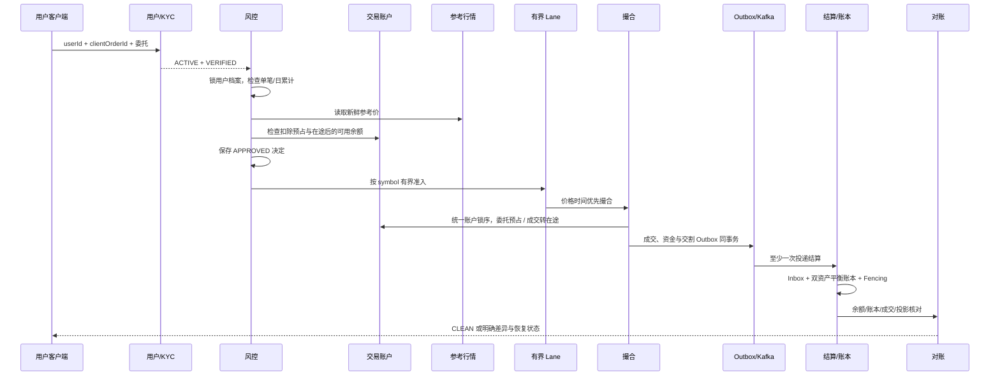

# 用户到对账的完整交易链路

## 一、目标与边界

FinCore 不再从“订单已经进入撮合”开始讲解，而是把一次交易前后的业务责任串成完整链路：

```text
用户注册 → KYC → 风控档案 → 交易账户 → 参考行情
    → 盘前检查 → 有界下单 → 撮合 → 成交事件
    → 清算/结算 → 不可变账本 → 查询投影 → 对账修复
```

本版本已经实现用户、KYC、风控档案、交易账户、参考行情、可审计盘前决定和受控下单入口。已有的撮合、
Outbox、Kafka 结算、不可变账本、Worker Fencing 和对账链路继续作为下游可靠性底座。

当前仍是可靠性实验，不是生产经纪或交易平台：没有接入真实身份供应商、制裁名单、行情供应商、交易所会员
体系或真实资金。V8 已将限价委托的可用、预占和在途模型接入受控入口，并通过 Outbox/Kafka
交给有围栏 Worker 完成双资产交割；所有期初资金仍为虚构实验数据，无手续费。精确边界和验收见
[第二阶段资金闭环](spot-funds-closure.md)，具体上线状态以发行记录为准。

## 二、全链路责任地图

| 阶段 | 输入 | 权威状态 | 核心保护 | 失败时的明确结果 |
|---|---|---|---|---|
| 用户 | 用户编号、名称、国家/地区 | `customer_profile` | 用户主键唯一、状态机 | 用户不存在或已暂停时拒绝下单 |
| KYC | 审核结果 | `kyc_status` | 只接受 PENDING/VERIFIED/REJECTED | 未通过时生成 `KYC_NOT_VERIFIED` 决定 |
| 风控 | 交易权限、单笔/日累计限额、价格偏离 | `risk_profile` | 用户行锁、版本递增、失败关闭 | 配置缺失、权限关闭或超限均不创建订单 |
| 账户 | 用户、资产、总额、预占、在途 | `account` / `spot_order_reservation` | 用户+资产+类型唯一、总额覆盖、UUID 锁序 | 可用不足或对账冻结时拒绝 |
| 行情 | 交易对、价格、来源、观察时间 | `market_reference_price` | 较新时间才能覆盖、30 秒新鲜度 | 缺失或过期时停止接单 |
| 盘前决定 | 用户、客户端订单号、完整委托参数 | `pre_trade_decision` | 业务键唯一、原参数重放核验 | 重试复用原决定，篡改参数立即报错 |
| 下单准入 | 已批准委托 | 有界交易对 Lane | 固定容量、明确超时/429 | 不无限堆线程或静默丢单 |
| 撮合 | 合法限价单 | `matching_order` / `trade_execution` | 价格时间优先、数量守恒、自成交保护 | 整体回滚或返回明确终态 |
| 事件 | 成交事实 | `outbox_event` | 与成交同事务、异步重试 | 发布失败不丢成交事实 |
| 交割 | 成交编号的至少一次投递 | `spot_delivery`、两资产账本、四账户 | Inbox、成交键、账户锁、Epoch | 两种资产同事务，重复消息只有一次资金效果 |
| 对账 | 权威成交、投影、余额、账本 | 对账问题与修复记录 | 全外连接、幂等修复、隔离 | 只修派生投影，不改权威成交和历史账本 |

## 三、用户与 KYC

用户模型有两个独立维度：

- 生命周期状态：`ACTIVE`、`SUSPENDED`、`CLOSED`；
- KYC 状态：`PENDING`、`VERIFIED`、`REJECTED`。

只有 `ACTIVE + VERIFIED` 可以继续盘前检查。把两个维度分开，能够表达“身份已通过但因风险事件暂停”与
“用户仍有效但身份审核尚未结束”的不同业务含义。接口不会把缺少用户或 KYC 未通过伪装成撮合失败。

主要接口：

```text
POST  /api/trading/users
GET   /api/trading/users/{userId}
PUT   /api/trading/users/{userId}/kyc
PATCH /api/trading/users/{userId}/status
```

实验中 KYC 结果由接口写入；生产方案必须由可信身份供应商、权限控制、审计和人工复核流程替换。

## 四、风控档案与并发额度

每个用户的风控档案包含：

- 风险等级；
- 交易开关；
- 单笔最大名义金额；
- 当日累计批准金额；
- 委托价格相对参考价的最大偏离比例。

受控下单在数据库事务内使用 `SELECT ... FOR UPDATE` 锁定该用户的风控档案，然后汇总当天已经批准的
`pre_trade_decision`。因此同一用户并发提交两笔临界订单时，不会同时看到旧累计值并一起越过日限额。

当前日累计口径采用“批准即占用、自然日内不释放”的保守策略。生产系统应增加撤单释放、部分成交、在途、
多币种折算和分层风险敞口，但必须保持同一业务键只占用一次额度。

主要接口：

```text
PUT /api/trading/risk/{userId}
GET /api/trading/risk/{userId}
```

## 五、交易账户

交易账户复用现有 `account` 表和 `AccountService`：

- `owner_id` 对应用户编号；
- `asset` 使用大写资产代码；
- `account_type` 固定为 `TRADING`；
- 数据库保证用户、资产、账户类型唯一；
- 余额使用 `NUMERIC(38,18)`，禁止浮点数；
- 余额非负约束仍由数据库提供最后防线。

买单检查计价资产余额，卖单检查基础资产余额。例如 `BTC-USDT` 买单检查 USDT，卖单检查 BTC。

```text
POST /api/trading/users/{userId}/accounts
```

V8 检查可用余额 `balance - reserved_balance - pending_debit`，提交时再用账户锁保障预算。
委托预占、成交转在途、价差返回和撤单释放写入不可变分桶审计；交割在同一个事务中更新两种资产的
平衡总账及余额。收款账户可自动创建零余额记录，不增加期初资金。详细例子见[资金闭环](spot-funds-closure.md)。

## 六、参考行情与订单簿

参考行情和撮合订单簿承担不同职责：

- 参考行情用于价格笼子和风险计算，记录价格、来源、观察时间与版本；
- 订单簿用于展示当前买卖深度；
- 最近成交用于展示实际成交序列；
- 三者在行情查询接口中组合返回，但不会互相冒充权威来源。

较旧的 `observedAt` 不能覆盖更新行情。受控下单只接受 30 秒内的参考价，过期时返回
`MARKET_QUOTE_STALE`。这是一种失败关闭策略：行情不可判断时停止新增风险，而不是沿用陈旧价格继续接单。

```text
PUT /api/trading/market/{symbol}/reference
GET /api/trading/market/{symbol}?depth=20&tradeLimit=50
```

实验允许手工发布参考价；生产方案需要多源行情、序列缺口、时钟偏差、异常值、主备切换与回放能力。

## 七、盘前决定

受控下单入口：

```text
POST /api/trading/orders
```

执行顺序如下：

1. 按 `userId + clientOrderId` 查询历史盘前决定；
2. 重放时核对交易对、方向、类型、价格和数量，禁止偷换参数；
3. 校验用户为 ACTIVE；
4. 校验 KYC 为 VERIFIED；
5. 锁定风控档案并检查交易开关；
6. 拒绝无价格保护的市价单；
7. 读取 30 秒内参考价并计算价格偏离；
8. 校验单笔和日累计额度；
9. 根据买卖方向查找所需资产账户并检查余额；
10. 保存 `APPROVED` 或 `REJECTED` 决定；
11. 批准后调用 `MatchingService.placeFunded`，订单、成交、预占/在途和交割 Outbox 同事务提交；
12. Worker 消费成交通知，按数据库事实及有效 Fence 完成双资产原子交割。

拒绝不是异常吞噬，而是可查询、可解释的业务事实。典型原因码：

| 原因码 | 含义 |
|---|---|
| `USER_NOT_FOUND` | 用户不存在 |
| `USER_NOT_ACTIVE` | 用户被暂停或关闭 |
| `KYC_NOT_VERIFIED` | KYC 未通过 |
| `TRADING_DISABLED` | 用户交易权限关闭 |
| `MARKET_ORDER_REQUIRES_PROTECTION` | 受控入口禁止无价格保护市价单 |
| `MARKET_QUOTE_MISSING` / `MARKET_QUOTE_STALE` | 行情缺失或过期 |
| `PRICE_DEVIATION` | 委托价格越过价格笼子 |
| `SINGLE_ORDER_LIMIT` / `DAILY_LIMIT` | 单笔或累计额度超限 |
| `ACCOUNT_MISSING` / `INSUFFICIENT_BALANCE` | 账户缺失或余额不足 |

## 八、完整成功路径



## 九、自动验证

启动 `lab` Profile 后可以运行一键实验：

```text
POST /lab/scenarios/trading-lifecycle
```

场景每次创建隔离用户、风控档案、分资产账户与交易对，完成一笔成交并演示额外挂单预占与重复撤单；
只读等待真实 Kafka Worker 交割后返回双方余额、撤单释放、时间和 12 项检查。任一断言失败、资金仍在途或
等待超时都不返回 `PASS`；公开场景不能直调交割事务。

`TradingLifecycleIntegrationTest` 覆盖：

- 两个已完成 KYC、账户和风控配置的用户通过完整链路形成成交；
- 相同客户端订单重放复用原盘前决定和原订单；
- 相同幂等键偷换价格被拒绝；
- KYC 未通过会保存拒绝决定但不会创建撮合订单；
- 价格偏离越过风控阈值会拒绝；
- 参考行情超过 30 秒会失败关闭；
- 行情查询同时返回参考价、订单簿与最近成交。

原有 `TradingLifecycleIntegrationTest` 继续验证盘前入口；资金模型增加 `SpotFundsIntegrationTest`，
真实消息链路增加 `SpotDeliveryKafkaIntegrationTest`。这些实验不替代真实 KYC、市场数据、手续费、
外部资金通道、生产风险模型和持续容量验收。

## 十、继续阅读系统级架构

本文关注一笔订单的数据与事务链路。关于整套系统如何拆分接入、行情、交易、资金和恢复通道，如何通过有界队列、
symbol 分片、价格笼子、Kafka 削峰、Epoch Fencing 和对账闭环抵抗复合故障，以及怎样快速接入新行情源、风控规则
与下游消费者，见[高并发、行情波动与快速扩展架构](resilient-system-architecture.md)。
