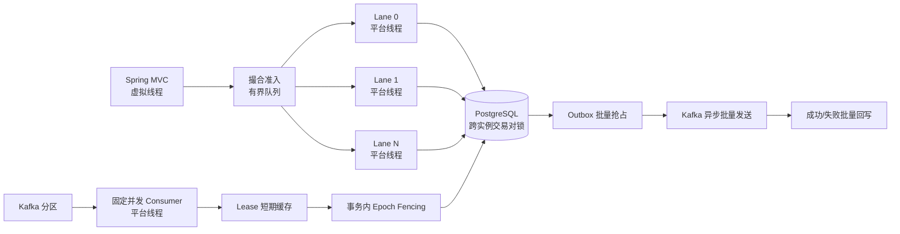

# 高并发、线程、CPU 与 JVM/GC 落地说明

本文说明 FinCore Reliability Lab 如何在不削弱金融正确性的前提下处理高并发，以及如何用数据而不是
“参数越大越快”的直觉调整线程、数据库连接池、CPU、堆内存和垃圾收集器。

项目当前运行基线是 Java 21、Spring Boot 3.5.16、MyBatis 3.0.5、PostgreSQL 16 和 Kafka KRaft。

## 1. 先定义正确目标

本项目的优化顺序固定为：

1. 金融结果唯一、平衡、可审计；
2. 过载时有界、可观测、可恢复；
3. 在前两项成立时提高吞吐并降低尾延迟；
4. 使用压测、Prometheus、GC 日志和 JFR 证明调整有效。

因此项目没有采用以下危险做法：

- 不用无界线程池或无界任务队列隐藏过载；
- 不用 `parallelStream()` 把数据库锁竞争扩散到公共 ForkJoinPool；
- 不用 JVM 内存 Map 代替账本、Inbox、Outbox 或 Worker 所有权；
- 不因 HTTP 等待超时中断已经开始的资金事务；
- 不通过增加数据库连接数“解决”慢 SQL 或锁冲突；
- 不为了降低 GC 次数取消堆上限；
- 不把 ZGC、超大堆或虚拟线程当成无需验证的万能配置。

## 2. 最终线程模型



| 子系统 | 线程类型 | 默认并发 | 为什么 |
|---|---:|---:|---|
| Spring MVC 请求 | Java 21 虚拟线程 | 随请求创建、由 JVM 调度 | 大量短时 I/O 等待不需要同等数量的平台线程 |
| 同实例撮合 | 有界单线程 Lane | 4 | 同一交易对串行，不同交易对并行；减少锁竞争和上下文切换 |
| 跨实例撮合 | PostgreSQL advisory transaction lock | 每交易对 1 个写者 | 多副本仍保持价格/时间优先 |
| Kafka 结算 | 固定平台线程 | 4 | Kafka Consumer 非线程安全，且底层同步代码不适合盲目放到虚拟线程 |
| 定时任务 | 固定平台线程 | 2 | Outbox 发布与异常抢占恢复相互隔离 |
| 数据库连接 | Hikari 固定池 | 12 | 用小而饱和的连接池保护 PostgreSQL，不随请求数线性增长 |

Spring Boot 官方说明：Java 21 以上并设置 `spring.threads.virtual.enabled=true` 时，自动任务执行器会使用
虚拟线程；项目同时为 Kafka 和定时任务显式创建平台线程执行器，避免它们意外继承全局策略。参考：
[Spring Boot Task Execution and Scheduling](https://docs.spring.io/spring-boot/3.5/reference/features/task-execution-and-scheduling.html)。

Spring Kafka 官方特别提醒，虚拟线程与底层同步协调代码组合时可能发生 carrier thread pinning，因此
Listener 并发不应超过平台线程资源。参考：
[Spring Kafka Thread Safety](https://docs.spring.io/spring-kafka/reference/kafka/thread-safety.html)。

## 3. 撮合并发：按交易对分片，而不是让所有请求抢同一把锁

### 3.1 单实例有界 Lane

`StripedTaskExecutor` 根据规范化交易对计算稳定散列。同一个 `symbol` 永远进入同一个
`ArrayBlockingQueue + 单平台线程`，因此：

- 同一交易对任务按提交顺序执行；
- 不同交易对最多由多个 Lane 并行执行；
- 不会为每个交易对永久创建一条线程；
- 每个 Lane 队列默认最多 256 个任务；
- Lane 饱和时使用 `AbortPolicy`，转换为 HTTP 429；
- 不使用 `CallerRunsPolicy`，因为调用方线程直接执行可能越过 Lane 排序；
- 不使用丢弃策略，因为金融命令不能静默消失。

配置：

```yaml
fincore:
  concurrency:
    matching-lanes: 4
    matching-queue-capacity-per-lane: 256
    matching-cancel-queue-capacity-per-lane: 32
    matching-wait-timeout: 10s
```

对应环境变量：

```text
FINCORE_MATCHING_LANES
FINCORE_MATCHING_QUEUE_CAPACITY
FINCORE_MATCHING_WAIT_TIMEOUT
```

### 3.2 数据库仍是跨实例正确性边界

Lane 只减少单实例内的竞争，不能取代 PostgreSQL 事务锁。`MatchingService.place()` 仍在事务开始后：

1. 获取交易对 advisory transaction lock；
2. 校验 `(user_id, client_order_id)` 幂等键；
3. 分配持久化序号；
4. 按价格优先、时间优先锁定最优 Maker；
5. 更新数量并校验版本；
6. 同事务追加成交、审计与 Outbox。

即使两个应用实例把相同交易对散列到不同本地 Lane，数据库锁仍保证只有一个事务修改该交易对。

### 3.3 超时不是取消

HTTP 最多等待 10 秒。超时返回 503，但已经进入 Lane 或事务的任务不会被粗暴中断，因为数据库可能已经
提交或正在提交。调用方必须：

1. 使用原 `clientOrderId` 查询；
2. 或携带完全相同的幂等键和载荷重试；
3. 不得生成新业务键盲目重发。

数据库唯一约束和完整载荷核对会把未知结果收敛为唯一订单。

## 4. Kafka 结算：固定平台线程、分区有序和 Lease 写热点削减

### 4.1 Consumer 并发

`settlementKafkaListenerContainerFactory` 显式配置固定平台线程执行器，默认并发为 4。生产 Topic 的
分区数应大于等于所有实例 Consumer 总数，否则多出的 Consumer 空闲；同一 `businessKey` 作为 Kafka
Key，同一业务的重投稳定进入同一分区。实际 Consumer 数还会取配置值与 JVM 容器感知 CPU 数的较小值，
防止小 CPU 配额容器因为配置照搬而创建过多平台消费线程。

```yaml
fincore:
  concurrency:
    settlement-consumers: 4
spring:
  kafka:
    consumer:
      enable-auto-commit: false
      properties:
        max.poll.records: 50
```

消费者成功返回后才按 `record` 模式提交 Offset。抛出异常不会伪装成成功，容器会保留失败语义。

HTTP 提交端最多等待 3 秒 Kafka Broker 确认，只有确认成功才返回 202。Broker 失败或确认结果未知时返回
可重试 503；调用方必须复用相同 `messageId` 和 `businessKey`，这样即使 Broker 已收到但响应丢失，也只会
产生一次资金效果。Producer 的 `max.block.ms` 限制为 1 秒，元数据不可用或发送缓冲区饱和时不会让请求
无限挂起。

### 4.2 Worker Lease 短期缓存

旧实现每条 Kafka 消息都执行一次 `acquireOrRenew()`，热点分片会持续更新同一行。现在
`WorkerLeaseManager` 在进程内缓存 Lease，并在距离过期 10 秒时提前续期：

```yaml
fincore:
  concurrency:
    worker-lease-ttl: 30s
    worker-lease-renew-ahead: 10s
```

同一分片的并发续期通过 `ConcurrentHashMap.compute()` 合并，避免续期惊群。

缓存不是最终授权。每笔资金事务仍调用 `requireValidFenceForUpdate()`，在同一个 PostgreSQL 事务中
`FOR SHARE` 锁定 `shard_lease` 并重新校验：

- `owner_id`；
- `epoch`；
- `RUNNING` 状态；
- `lease_until > now()`。

如果管理员排空分片、Lease 过期或新 Worker 完成接管，旧缓存只能得到明确的 `fence rejected`，不能写入
账本。Listener 会按旧 Epoch 比较并清除缓存，消息随后按 Kafka 失败策略重试。

## 5. Outbox：从逐条等待改为有界批量异步确认

原实现每条事件都执行一次 `kafka.send(...).get()` 和一次状态更新，批次内网络等待完全串行。

现在的发布流程为：

1. 单条 SQL 使用 `FOR UPDATE SKIP LOCKED` 原子抢占最多 200 条；
2. 批次内全部调用 Kafka 异步发送；
3. 使用 `CompletableFuture.allOf()` 等待 Broker 确认，最长 15 秒；
4. 已确认成功的 ID 使用一条 SQL 批量标记 `PUBLISHED`；
5. 明确失败的 ID 使用一条 SQL 批量释放；
6. 未完成、结果未知的记录留在 `PROCESSING`；
7. 60 秒后由异常抢占恢复任务重新放回 `PENDING`。

Kafka Producer 同时启用：

```yaml
acks: all
enable.idempotence: true
compression.type: lz4
linger.ms: 5
batch.size: 65536
max.in.flight.requests.per.connection: 5
```

失败重试使用指数退避，上限 300 秒，并按 `event_id` 增加 0—2 秒确定性抖动，避免 Broker 恢复后所有
Publisher 同时重试。

这里提供的是至少一次投递：Broker 已收到消息但确认响应丢失时，事件会再次发布。下游必须继续依赖
Inbox、事件 ID 或业务唯一键幂等，不能假设 Kafka 网络调用恰好一次。

## 6. 数据库与 CPU 优化

### 6.1 小连接池，而不是请求数等于连接数

Hikari 默认固定 12 个连接，获取连接最多等待 1.5 秒：

```yaml
spring:
  datasource:
    hikari:
      maximum-pool-size: 12
      minimum-idle: 12
      connection-timeout: 1500
      keepalive-time: 120000
```

Hikari 官方建议从 `连接数 ≈ CPU 核数 × 2 + 有效磁盘数` 附近开始压测，而不是按用户数扩池；多个应用
副本共享数据库时，这个预算是所有副本的总和。参考：
[HikariCP Pool Sizing](https://github.com/brettwooldridge/HikariCP/wiki/About-Pool-Sizing)。

默认 12 适合本项目的 4 核实验基线，不是任意生产机器的固定答案。`hikaricp_connections_pending` 持续大于
0 时，应先看慢 SQL、锁等待和数据库 CPU，再决定是否增大连接池。

### 6.2 减少数据库往返

- 一笔结算或补偿的全部借贷分录通过 MyBatis `<foreach>` 一次批量插入；
- Outbox 成功和失败状态分别批量更新；
- PostgreSQL JDBC 启用 `reWriteBatchedInserts=true`；
- 新增 Outbox 条件覆盖索引，只扫描已经到重试时间的 `PENDING` 记录；
- 新增 `(taker_order_id, trade_sequence)` 索引，降低幂等重放查询成本。

批处理没有移动事务边界：账本头、全部分录、余额、状态和 Outbox 仍在同一事务提交。

### 6.3 降低对象分配和 CPU 浪费

- 多账户锁顺序不再使用 `UUID::toString` 创建临时字符串，而是直接比较两个 64 位分量；
- 三账户重复编号先去重，避免同一账户重复加锁和覆盖 Map；
- 热路径集合按已知批次大小预分配；
- 不对金额使用 `double`，金额仍然是 `BigDecimal`；
- 不使用公共 ForkJoinPool，避免后台并行任务与请求线程争抢 CPU；
- 同一热点交易对只允许一个平台线程做有效工作，避免大量线程在数据库锁前上下文切换。

## 7. JVM 与垃圾回收配置

### 7.1 默认 G1 配置

容器默认加载 `config/jvm/g1.options`：

| 参数 | 作用 | 选择理由 |
|---|---|---|
| `-XX:+UseContainerSupport` | 按容器 CPU/内存识别资源 | 防止 JVM 按宿主机总内存定堆 |
| `-XX:+UseG1GC` | 使用 G1 | 中小堆吞吐与停顿的稳健基线 |
| `InitialRAMPercentage=25` | 初始堆为容器内存 25% | 避免小流量一开始提交过多内存 |
| `MaxRAMPercentage=65` | 最大堆为容器内存 65% | 为 Metaspace、线程栈、DirectBuffer、JFR 和系统留空间 |
| `MaxGCPauseMillis=200` | G1 的软停顿目标 | 是调度目标，不是 SLA 保证 |
| `ParallelRefProcEnabled` | 并行处理引用 | 降低引用处理阶段停顿 |
| `UseStringDeduplication` | G1 字符串去重 | JSON 字段、业务键和资产代码重复较多 |
| `ExitOnOutOfMemoryError` | OOM 后退出 | 交给容器重启，避免半失效进程继续接单 |
| `HeapDumpOnOutOfMemoryError` | OOM 输出堆转储 | 保留根因证据 |
| `-Xlog:gc*,safepoint` | GC 与安全点轮转日志 | 区分 GC 停顿和非 GC safepoint |
| `StartFlightRecording` | 保留 6 小时循环 JFR | 观察分配、锁、CPU、I/O 和线程固定 |

Oracle 对 G1 的一般建议是先保留大部分默认值，只明确最大堆和需要的停顿目标，再根据 GC 日志调整，
而不是一次加入大量互相影响的参数。参考：
[G1 GC Tuning](https://docs.oracle.com/en/java/javase/21/gctuning/garbage-first-garbage-collector-tuning.html)。

### 7.2 ZGC 备选配置

当真实生产堆较大、G1 的 p99/p999 停顿经过证据确认无法满足目标时，可以：

```bash
FINCORE_JVM_PROFILE=zgc docker compose up -d --build app
```

`config/jvm/zgc.options` 使用 Java 21 Generational ZGC。ZGC 通常用更多 CPU 和并发回收开销换取更低停顿，
因此不能只看暂停时间；必须同时比较吞吐、CPU、分配速率、RSS 和数据库完成量。

G1 与 ZGC 都保留相同的堆比例、OOM 策略、GC 日志和 JFR，确保对比条件一致。

### 7.3 为什么最大堆只给 65%

容器内存不只包含 Java Heap，还包含：

- Metaspace 和 Code Cache；
- 平台线程栈与虚拟线程 continuation；
- Kafka/JDBC/NIO DirectBuffer；
- JFR、GC remembered set 和 JVM 本身；
- 本地库以及容器文件缓存。

直接把 `-Xmx` 设成容器内存的 90%—100% 会让进程在 Java 堆尚未 OOM 时先被容器 OOM Killer 杀死，
来不及生成 Heap Dump。

## 8. 可观测指标

Actuator 已自动暴露 HTTP、JVM、CPU、GC、线程、Hikari 和 Kafka 指标。本项目还提供：

项目额外引入 `micrometer-java21`，通过 JFR 事件暴露虚拟线程 pinned 时长和提交失败次数，便于发现
阻塞代码把虚拟线程固定在载体线程上的问题。参考：
[Micrometer JVM Metrics](https://docs.micrometer.io/micrometer/reference/reference/jvm.html)。

| 指标 | 含义 | 需要告警的趋势 |
|---|---|---|
| `fincore.matching.lane.queue.depth` | 每个 Lane 排队数 | 单个 Lane 持续上涨表示热点交易对饱和 |
| `fincore.matching.queue.depth.total` | 全部撮合排队数 | 接近 Lane 数 × 单 Lane 容量 |
| `fincore.matching.queue.rejected` | 入口过载拒绝数 | 任何持续增长都应扩容或降载 |
| `fincore.matching.cancel.lane.queue.depth` | 单 Lane 撤单积压 | 与价格波动、订单/撤单比联动观察 |
| `fincore.matching.cancel.queue.depth.total` | 全部撤单积压 | 快速上涨时优先限制新单并保护退出能力 |
| `fincore.matching.cancel.queue.rejected` | 撤单保留容量拒绝数 | 最高优先级事故，不能与普通 429 等同处理 |
| `fincore.matching.queue.wait` | 排队等待分布 | p99 上升但执行时间稳定说明排队不足 |
| `fincore.matching.execution` | 实际撮合耗时 | 上升时看 DB 锁和 SQL |
| `fincore.settlement.consumer.inflight` | 正在处理的结算消息 | 长期等于 Consumer 数表示饱和 |
| `fincore.worker.lease.cache.hit` | Lease 缓存命中 | 用于确认控制面写热点是否被削减 |
| `fincore.outbox.ready.backlog` | 可发布 Outbox 积压 | 持续增长表示 Kafka 或 Publisher 吞吐不足 |
| `fincore.outbox.uncertain` | 等待确认超时的未知结果 | 网络/Broker 延迟或发送超时 |
| `jvm.threads.virtual.pinned` | 虚拟线程固定载体的次数与时长 | 持续出现时用 JFR 定位同步阻塞点 |
| `jvm.threads.virtual.submit.failed` | 虚拟线程启动/恢复失败 | 任意增长都表示运行时资源异常 |

Grafana 仪表盘已经加入：

- 进程与系统 CPU；
- JVM Heap；
- GC pause p99；
- 虚拟线程 pinned、结算 in-flight 与 Lease 缓存命中；
- 撮合队列深度和拒绝速率；
- Outbox 积压与发布速率；
- Hikari 等待连接数；
- HTTP QPS 和延迟。

GC 日志、Heap Dump 和 JFR 默认写入 `reports/runtime/`。这些文件可能很大且包含业务对象内容，不应上传
到公开仓库。

## 9. 一键混合压测

执行：

```bash
./scripts/performance/run-performance-lab.sh
```

脚本会启动 PostgreSQL、Kafka、应用、Prometheus 和 Grafana，然后使用固定到达率同时产生：

- 150 QPS 结算命令；
- 100 QPS 热点交易对写入；
- 100 QPS 盘口与成交查询。

默认持续 60 秒，输出：

```text
reports/performance/latest-k6-summary.json
reports/performance/latest-actuator-snapshot.json
reports/runtime/gc.log*
reports/runtime/fincore.jfr
```

调整负载：

```bash
FINCORE_SETTLEMENT_RATE=300 \
FINCORE_MATCHING_RATE=200 \
FINCORE_READ_RATE=200 \
FINCORE_PERFORMANCE_DURATION=5m \
./scripts/performance/run-performance-lab.sh
```

压测使用 `constant-arrival-rate`，因为固定 VU 模型在系统变慢时会自动降低请求产生速度，容易隐藏真实过载。

### 必须同时通过的判断

1. k6 `http_req_failed < 1%`；
2. 过载拒绝率 `< 1%`；
3. 结算接入 p99 `< 800ms`；
4. 热点撮合 p99 `< 3s`；
5. 查询 p99 `< 500ms`；
6. 撮合队列压测结束后能够回落到 0；
7. Outbox 积压能够回落而不是持续增长；
8. Hikari pending 不持续为正；
9. 不出现 Full GC、OOM、数据库死锁或围栏越权；
10. 压测后运行可靠性场景，全部资金、账本、幂等和对账检查仍为 PASS。

## 10. 调参顺序

每次只改一类参数，并保存 k6、Prometheus、GC 日志和 JFR：

1. 固定 CPU 与内存限制，建立默认 G1 基线；
2. 根据独立活跃交易对数量调整 `matching-lanes`，通常不超过可用 CPU 核；
3. 根据 Kafka 分区和数据库完成能力调整 Consumer 数；
4. 观察 Hikari pending、PostgreSQL CPU 和锁等待，再调整总连接预算；
5. 观察 Outbox backlog 和 Kafka request latency，再调整批次和 linger；
6. 只有在对象分配和堆大小明确后，才比较 G1 与 ZGC；
7. 每次调整后重跑金融可靠性测试，不接受“吞吐提高但重复入账”的结果。

### 4 核 / 2 GiB 实验机起始值

| 参数 | 起始值 |
|---|---:|
| matching lanes | 4 |
| settlement consumers | 4 |
| DB pool | 12 |
| matching queue / lane | 256 |
| Outbox batch | 200 |
| JVM max heap | 容器内存 65% |
| GC | G1 |

这些是压测起点，不是生产承诺。单个热点交易对仍然是一个逻辑写者；增加 Lane 只提升多交易对并行度，
不会让同一个订单簿同时由多个线程写入。

## 11. 并发、重试与部分失败总表

| 故障点 | 系统行为 | 最终保护 |
|---|---|---|
| 撮合 Lane 队列满 | HTTP 429，未入队 | 调用方原幂等键退避重试 |
| HTTP 等待超时 | HTTP 503，任务可能继续 | 查询或原键重试，数据库唯一约束收敛 |
| 同交易对多实例写入 | 本地 Lane 不能互相看见 | PostgreSQL advisory transaction lock |
| Kafka 重复投递 | 再次进入 Listener | Inbox、messageId、businessKey 唯一约束 |
| 旧 Worker 使用缓存 Epoch | 事务内围栏拒绝并清缓存 | `FOR SHARE` + owner/epoch/state/expiry |
| Kafka 发送明确失败 | 批量释放并指数退避 | Outbox 记录不删除 |
| Kafka 发送确认未知 | 暂留 PROCESSING，超时回收 | 至少一次投递 + 下游幂等 |
| 批量账本 SQL 失败 | 整个 SQL 和事务回滚 | 账本、余额、状态、Outbox 同事务 |
| OOM | 生成 Heap Dump 后退出 | 容器重启，不让半失效 JVM 接单 |

## 12. 自动证明

专项测试覆盖：

- 相同业务键最大并发执行数始终为 1；
- 不同 Lane 能同时开始执行；
- 执行中 + 队列满时第三个任务明确拒绝；
- 撮合 Lane 使用平台线程；
- 64 个并发消息共用一次有效 Lease 获取；
- 只有匹配旧 Epoch 的缓存才会被清除；
- UUID 锁顺序稳定且去重；
- Java 21、虚拟线程、Kafka 平台线程隔离、Outbox 批处理和 JVM 诊断参数不能被回退；
- 原有 Testcontainers 继续验证价格/时间优先、资金事务、幂等、Epoch Fencing、Outbox 和对账修复。

代码优化只能在这些测试与 CI 全部通过后合并。
