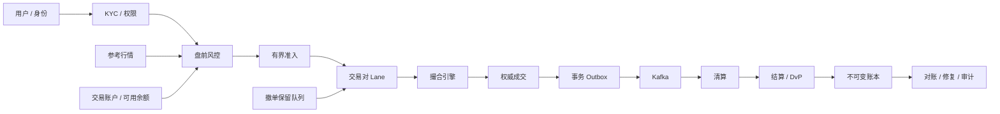

# 从互联网系统到数字资产交易：差异、迁移能力与证据

## 范围与核心约束

本案例比较互联网高并发系统与数字资产交易系统的工程边界，并说明 FinCore 如何把差异转成架构、代码、指标和自动化实验。

交易系统交付的不只是订单页面，而是可追溯、不可歧义的资产状态。价格跳变可能同时放大下单、撤单、行情订阅和风险计算负载；全年运行还要求在没有统一维护窗口时完成变更与恢复。

项目采用以下控制边界：

- 身份、KYC、账户、参考行情与盘前风控共同决定能否受理订单；
- 同一交易对的下单与撤单共享权威顺序，成交、清算、结算及不可变账本组成资金闭环；
- 新单准入有界，撤单保留处理容量；对外成功必须对应权威状态提交；
- 监控同时关联市场变化、交易流量、资金在途、消息积压和资源饱和；
- 故障恢复区分明确拒绝、处理中与未知结果，通过幂等、查询、重放和对账收敛。

这些约束在下文映射到真实代码和可复现测试。外部供应商、目标硬件和生产容量仍按文末边界单独验收。

## 业务与工程差异

| 维度 | 典型互联网/电商系统 | 数字资产交易系统 | 负责人必须作出的设计变化 |
|---|---|---|---|
| 流量来源 | 活动、投放和节日可提前估计 | 价格跳变、舆情、清算瀑布会瞬间触发 | 容量模型加入波动率、订单/撤单比和热点交易对倾斜 |
| 运行时间 | 可安排低峰发布和维护 | 7×24 小时且跨时区 | 灰度、双运行、回滚、值班和灾备成为日常能力 |
| 错误后果 | 页面错误、超卖通常可退款补偿 | 重复成交、错账、穿仓会直接形成资产损失 | 状态机、幂等、不可变账本、对账和审计必须内建 |
| 延迟目标 | 很多读取可缓存，写入可异步排队 | 行情新鲜度和交易公平性直接影响成交结果 | 明确确定性核心，控制抖动；不能用异步掩盖未知结果 |
| 一致性边界 | 订单、库存、支付常由最终一致串联 | 订单、成交、保证金、资产交割具有强因果关系 | 核心事务强一致，跨域用 Inbox/Outbox 和可重放事件 |
| 过载策略 | 推荐、搜索、营销可以大幅降级 | 新单可限流，但撤单和降风险通道必须保留 | 分级准入、撤单保留容量、只减仓优先、明确 429/503 |
| 数据特征 | 用户和商品热点相对可运营干预 | 单一币对可能占据绝大部分流量 | 按交易对分片、热点隔离、单写者与跨实例 Fencing |
| 风控 | 欺诈和信用风险多在交易外围 | 市场、流动性、杠杆、对手和操作风险同时存在 | 盘前、盘中、盘后形成连续风险闭环 |
| 外部依赖 | 支付、物流、短信等供应商 | KYC、行情、托管、节点、链、做市商和法币通道 | 超时即未知；隔离、重试、人工审核和供应商退出预案 |
| 合规审计 | 隐私、支付和消费者保护 | 还叠加资产来源、制裁、市场滥用和地区规则 | 决策版本、证据链、权限分离和数据保留策略可审计 |

## 总体架构：哪些能力可以迁移，哪些必须加强

核心思想是：互联网经验并没有失效，但需要从“尽量可用”升级为“先定义经济事实，再决定哪里可以异步、缓存或降级”。

## 交易系统全链路

## 高波动日的监控联动

单看 CPU 或 QPS 无法判断交易系统是否安全。负责人需要把业务、市场、风险、资金和系统指标放在同一时间轴上：

| 指标组 | 关键指标 | 联动判断示例 |
|---|---|---|
| 市场 | 中间价、1s/1m 价格变化率、点差、盘口深度 | 波动率上升且深度下降，预期撤单比和滑点同时上升 |
| 交易 | 下单 QPS、撤单 QPS、订单/撤单比、成交率、429 | 新单队列接近上限时主动拒绝新单，持续保留撤单容量 |
| 风险 | 盘前拒绝原因、净敞口、集中度、保证金覆盖率 | 价格过期与余额不足要区分，避免把风险拒绝误判为系统故障 |
| 资金 | 预占、在途、可用余额、账本差异、未决提现 | 撤单后只释放未成交预占；在途交割不能再次消费 |
| 系统 | Lane 深度、DB 锁等待、Kafka lag、GC pause、CPU throttling | 排队 p99 上升但执行耗时稳定时，应看准入而不是盲目加线程 |
| 运营 | 告警到确认时间、值班负载、恢复时间、客户影响账户数 | 技术恢复和客户沟通必须使用同一事故时间线和事实口径 |

## 代码与证据映射

| 能力 | 实现位置 | 可验证证据 |
|---|---|---|
| 用户、KYC、风控、账户、行情 | `TradingLifecycleService` | `TradingLifecycleIntegrationTest` |
| 同交易对确定性顺序 | `StripedTaskExecutor`、`MatchingCommandCoordinator`、PostgreSQL advisory lock | `StripedTaskExecutorTest`、`MatchingIntegrationTest` |
| 新单背压、撤单保留能力 | 双有界 `PriorityCommandQueue`、`submitPriority` | `cancellationUsesReservedCapacityAndOvertakesOrdinaryBacklog` |
| 订单数量与成交一致性 | `MatchingService`、乐观版本条件更新 | `MatchingIntegrationTest`、热点撮合实验 |
| 现货资金预占与撤单释放 | `SpotFundsService.releaseCanceled` | `cancellationReleasesOnlyOnce`、`partialFillPriceImprovementAndCancellationPreservePending` |
| 消息与资金可靠性 | Inbox、Outbox、不可变账本、Epoch Fencing | 结算、接管、对账和修复集成测试 |
| 7×24 可观测性 | Actuator、Micrometer、Prometheus、Grafana、GC/JFR | `ConcurrencyArchitectureTest` 与公网仪表盘 |

## 项目中的代表性测试数据

| 场景 | 输入 | 结果 | 证明什么 |
|---|---:|---:|---|
| 热点并发撮合 | 60 个 Maker、多路并发 Taker | 60 笔成交、60 个唯一序列、0 异常订单 | 高并发下价格时间顺序与数量守恒 |
| 重复结算风暴 | 同一命令并发投递 17 次 | 1 次资金效果 | 网络重试不会重复入账 |
| 完整交易链路 | 用户到对账 8 组检查 | 8/8 PASS | 上下游不是孤立模块 |
| 市场暴跌复合故障 | 订单洪峰、无流动性、接管、错值和幽灵成交 | 10/10 PASS、最终 CLEAN | 波动日的恢复闭环 |
| 撤单风暴 | 256 笔普通积压 + 1 笔溢出新单 + 1 笔撤单 | 新单明确拒绝；撤单先于 256 笔积压完成 | 退出风险通道不会被新单洪峰挤占 |

测试数字用于证明语义和恢复能力，不等同于生产容量承诺。生产容量需要在目标硬件、真实网络、数据分布和峰值模型下重新压测。

## 能力边界与下一步

- 当前撮合以 PostgreSQL 事务锁作为跨实例正确性基线，不宣称微秒级撮合；更低延迟需要单写者内存订单簿、顺序命令日志、快照和确定性重放。
- 当前公网实验使用模拟 KYC、参考行情和资产，不接入真实客户、交易所或托管系统。
- 现货资金闭环已经实现；合约保证金、资金费、只减仓和强平以隔离实验呈现，不把设计稿冒充完整生产合约平台。
- GPU 适合离线风控模型训练和批量推理，不放入要求确定性和极低尾延迟的逐笔撮合核心。

工程迁移可以复用高并发、分布式可靠性和运行治理能力，但新增的交易语义与经济不变量必须独立验证。本文列出的实验提供关键差异的验证基线，不构成生产准入或领域零成本迁移的证明。
