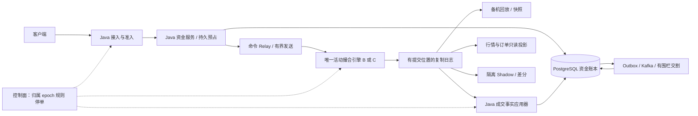
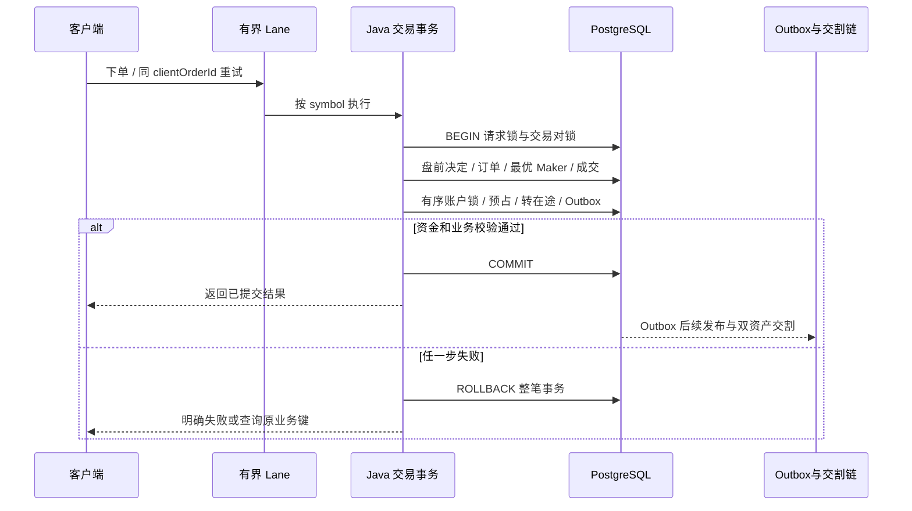
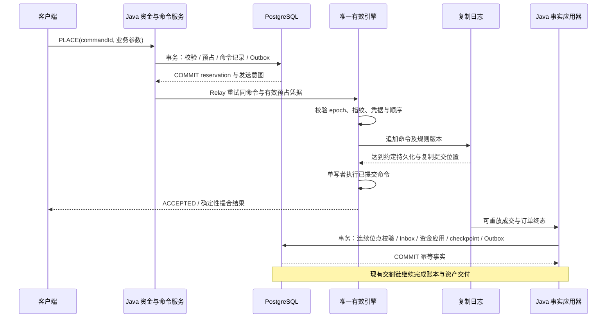
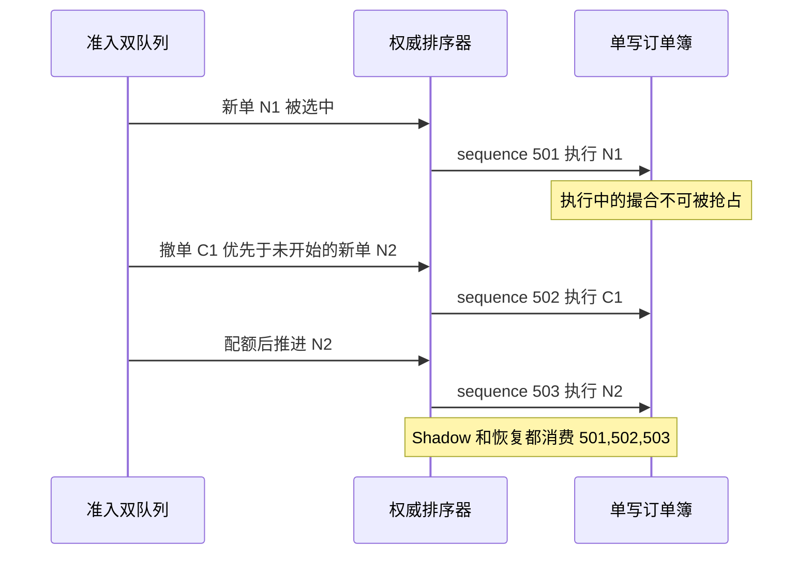
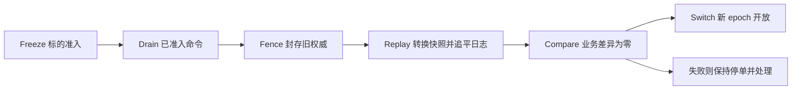

# Java → C++ 交易撮合迁移：从语言比较到可验收的系统工程

本文面向交易系统技术负责人：既能解释 Java、C++ 与硬件的关系，也能把迁移转化为明确的业务收益、资金协议、恢复证据和团队交付。
结论是先定位瓶颈、建立 Java 内存候选，再决定是否引入 C++ 热核；数据库事务模型改为内存单写模型产生的收益，不能全部归因于语言。
概念速览见第一部分；结合本仓库代码的详细案例见第二部分；团队交付与验收见第三部分。本文描述的是演进设计，不是已完成的生产 C++ 改造。

阅读配套：[低延迟与 CPU/GPU 手册](low-latency-compute-playbook.md)、[恢复证据](recovery-capacity-evidence.md)、[双语言实测记录](java-cpp-trading-evidence.md)。
资料核对日期：2026-09-06；Java 讨论固定在本仓库 Java 21，C++ 实验固定为 C++20，不把后续版本能力倒写到此基线。

## 第一部分：概念总览与决策边界

### 1. 三个基线，两个独立问题

| 基线 | 订单簿及顺序权威 | 资金与持久化 | 能回答什么 |
|---|---|---|---|
| A：当前 Java + PostgreSQL | 数据库订单、持久序号、交易对事务锁；本地 Lane 限流 | 盘前决定、撮合、预占、在途、Outbox 同事务；交割另有事务 | 可靠性与现有完整业务链的成本 |
| B：Java 内存候选 | 每分片单写者、内存簿、经提交日志确定命令顺序 | 需要重新设计预占和成交应用协议 | 去除逐 Maker SQL 与拆分事务后，架构能改善多少 |
| C：C++ 内存候选 | 与 B 同输入、规则、布局约束、排序与日志合同 | 与 B 同预占、日志复制、确认点、恢复目标 | 在相近架构与语义下，更换语言的边际价值 |

A→B 是架构实验；B→C 才更接近语言实验。即使 B/C 使用等价业务合同，若容器布局、分配器、批量大小不同，也要单列变量。
不能让 A 跑完整 HTTP、SQL、账务，而 C 仅跑内存循环，再声称“C++ 快一百倍”。这样的数据只证明两个计时范围不同。

本仓库 [独立实验目录](../experiments/java-cpp-matching/)用于两种语言的有限内存模型、共同样例与差分验证。
它不是生产入口，没有真实资金权限，也不能代替 B/C 的持久化、主备、恢复、网络及完整业务测试；具体能力以该目录 README 和实际报告为准。
本次运行数据另见 [真实实测证据与原始样本](java-cpp-trading-evidence.md)。本文的设计目标与已测量结果分开，不用内存实验替代生产迁移验收。

### 2. 什么情况下值得迁移

先把问题写为可证伪假设，例如：“在目标机器与高撤单负载下，撮合计算占用了主要延迟预算；Java 优化后仍无法满足约定 P99.9。”
业务必须同时给出这段延迟影响的成交机会、容量、客户体验或基础设施成本；“行业都用 C++”不能构成投资理由。

| 观察到的主要瓶颈 | 优先动作 | C++ 的合理位置 |
|---|---|---|
| 逐笔 SQL、锁等待、连接池耗尽 | 索引、批量边界、分片、准入；评估内存模型 | 先证明 B 的收益，再评估 C |
| 分配/GC 与尾延迟相关 | 控制对象图、复用缓冲、GC 与堆 A/B | Java 仍不达标时比较原生所有权方案 |
| 业务计算与缓存访存占主导 | 同数据结构剖析、热冷字段拆分 | 有可量化空间时尝试 C++ 布局与编译优化 |
| 上游网络或外部交易所慢 | 分段时间戳、会话流控、链路治理 | 本地语言变化可能几乎无收益 |
| 账务落库慢、交割积压 | 数据库容量、幂等消费、对账与背压 | 撮合更快可能放大风险积压 |
| 人员稀缺、规则频繁变更 | 稳定业务模型与自动验收 | 把 C++ 范围收敛到规则明确的热核 |

“不迁移”和“先完成 B”都是可以被验收的技术决策。退出条件应与立项同时确定，避免因为已经写了代码而继续扩大范围。

### 3. Java 与 C++：机制如何影响交易路径

| 维度 | Java 21 | C++20 | 对交易系统的含义 |
|---|---|---|---|
| 执行 | HotSpot 可根据运行剖面编译与优化 | 通常提前编译；可用 LTO/PGO | 比较冷启动、预热后稳态及行情变化后的表现 |
| 内存 | GC 管理堆对象；对象引用可能形成分散访问 | 可明确布局、生命周期与分配方式 | 连续数据与低分配是设计结果，不随语言自动获得 |
| 安全 | 数组检查、类型系统、受管对象生命周期 | 指针、别名、越界、悬空引用与数据竞争风险更直接 | C++ 需要所有权纪律、sanitizer 和故障可定位性 |
| 并发 | 平台线程、虚拟线程、锁、原子与 VarHandle | 线程、锁、原子与内存序 | 同一订单簿通常优先单写者，避免无收益共享修改 |
| 精度 | BigDecimal 可表示精确十进制乘法 | 标准库没有等价 BigDecimal 类型 | 定点数必须有 scale、范围、溢出和舍入合同 |
| 运维 | JFR、堆、GC、安全点与线程证据 | 符号、core dump、perf、分配器与 sanitizer | 引入新语言也引入构建、值班和事故分析成本 |

HotSpot 分层编译会利用运行剖面；因此只测刚启动的 JVM 不公平，只报告预热后结果也会遗漏接管风险。
备机应在接管前完成代表性回放与就绪检查，报告从启动到可安全接单的时间。[Oracle HotSpot 分层编译](https://docs.oracle.com/en/java/javase/21/vm/java-hotspot-virtual-machine-performance-enhancements.html)

G1 的暂停目标是调优目标，不能视为严格截止时间；堆大小、分配率、存活集和主机 CPU 都影响结果。
Java 21 已有分代 ZGC，可作为候选配置；“存在低暂停收集器”不等于整个请求无抖动，仍需测 CPU 成本和分配停顿。
[Oracle G1 调优](https://docs.oracle.com/en/java/javase/21/gctuning/garbage-first-garbage-collector-tuning.html)、[OpenJDK 团队分代 ZGC 说明](https://inside.java/2023/11/28/gen-zgc-explainer/)

虚拟线程主要帮助大量等待型并发，不会让 CPU 计算本身加速。本仓库 HTTP 等待与固定平台线程 Lane 的分工与此一致。
Java 21 下应观察 pinning；不能把该版本的限制推广到所有后续 JDK。[JEP 444](https://openjdk.org/jeps/444)

### 4. 热路径、控制面、恢复面与账务面

热路径只保留必须按顺序完成的动作：准入验证、命令排序、订单簿更新、成交事实和确认所需的持久化。
控制面管理交易对归属、epoch、规则版本、限额与停单；恢复面保留命令日志、快照、状态摘要和切换证据；账务面负责真实资产事实。



这是候选拓扑，不表示当前项目已实现这些跨进程角色。B 和 C 在同一交易对同一时刻只能有一个生产写入者。
日志可以恢复撮合订单状态，但不能替代不可变资金账本；Kafka 位点、JVM map、共享内存和 C++ 对象都不是最终财务事实。

## 第二部分：结合真实代码的迁移案例

### 5. 当前代码到底保证了什么

| 当前入口或模块 | 已有行为 | 提取后的对应职责与风险 |
|---|---|---|
| [TradingOrderCoordinator](../src/main/java/dev/fincore/application/TradingOrderCoordinator.java) | 整条盘前/撮合链先进入 symbol Lane；超时不强停事务 | Java 接入保持有界；显式区分排队、受理和结果未知 |
| [TradingLifecycleService.place](../src/main/java/dev/fincore/application/TradingLifecycleService.java) | 请求锁、交易对锁、KYC/风控/行情、决定、撮合同事务 | 决定快照与预占独立持久化；缺少原事务的整体回滚 |
| [MatchingService](../src/main/java/dev/fincore/application/MatchingService.java) | 最优价 Maker、价格时间优先、STP、订单/成交/审计/Outbox | 引擎输出确定性事件；Java 幂等应用落库 |
| [SpotFundsService](../src/main/java/dev/fincore/application/SpotFundsService.java) | 预占、成交转在途、价差释放、撤单释放 held | 持久预占先于引擎受理；成交事件不能重复扣占 |
| [StripedTaskExecutor](../src/main/java/dev/fincore/infrastructure/concurrent/StripedTaskExecutor.java) | 有界双队列、单平台线程、撤单优先、最多连续八条 | 迁移的是业务调度合同；单机队列不能充当集群归属协议 |
| [MatchingMapper](../src/main/java/dev/fincore/infrastructure/persistence/mapper/MatchingMapper.java) | PostgreSQL advisory 事务锁、持久序号、索引排序、行锁与 CAS | 不能删掉 SQL 后仍假设跨实例顺序存在 |
| [MatchingRecoveryLog](../src/main/java/dev/fincore/exchange/MatchingRecoveryLog.java) | 剩余量模型、命令指纹、epoch、快照摘要和连续重放检查 | 仅 JVM 模型；缺磁盘、复制、选举及完整恢复后的幂等结果 |

当前 `placeFunded` 先在未提交的事务中构造撮合结果，再调用 `capture`；`capture` 锁定付款账户、检查可用余额、预占并转在途。
这个调用顺序在当前模型可成立，是因为不足额时订单、成交、决定和 Outbox 全部回滚，对外没有已提交成交。
如果 C++ 已把成交广播出去再调用 Java 冻结资金，原事务保护已经消失，冻结失败也不能撤回对手方已看到的成交。
当前 accepted/trades 等指标会在提交前递增，事务回滚不回退计数器；迁移与差分的事实基准必须查询已提交订单、成交、账务和事件，不能只比较监控计数。



`TradingOrderCoordinator` 等待超时只表示客户端没有等到结果；任务可能继续并提交。
新服务必须保留“同业务键查询/重试”的合同，不能通过生成新订单号来消除超时表象。

### 6. 用协议补回被拆开的事务边界

候选协议建议先保留 Java 资金权威，把 C++ 限定为有资金凭据的确定性撮合器。以下是设计要求，尚非当前生产实现。
初始范围为受控限价现货；市价资金保护、手续费、保证金及衍生品规则要另立合同，不能借用裸撮合入口绕过预占。

#### 6.1 命令与结果的最小合同

| 字段 | 必须约定的含义 |
|---|---|
| commandId / clientOrderId | 下单与撤单分别有稳定命令号；用户域与作用域明确；重启后仍可识别 |
| requestFingerprint | 规范化全部业务参数及规则版本；同键不同载荷拒绝，不返回假成功 |
| symbol / ownerEpoch | 唯一标的与有效任期；旧 epoch 写入 fail closed，不自动降级到旧引擎 |
| reservationId / reservationVersion | 已提交资金预占及额度；绑定账户、资产、命令、标的与消费权限 |
| price / quantity / scaleVersion | 整数值、单位、tick/lot、允许范围和乘法精度 |
| rulesVersion / riskDecisionId | STP、价格笼子等决定性输入；不在重放时读取“现在”的配置 |
| commandSequence / eventIndex | 由唯一权威分配的线性化顺序；同命令多笔成交有稳定事件下标 |
| resultStatus / originalSequence | 明确受理、拒绝、成交结果及重放对应的原序号；查询与重放语义不混用 |

确认语义至少区分：`RECEIVED` 仅接入收到，`RESERVED` 已冻结，`ACCEPTED` 已满足日志提交合同，`APPLIED` 已计算出结果，`SETTLED` 已完成交割。
客户端原来的同步“最终订单快照”若改为异步 `ACCEPTED`，是 API 产品合同变化，须显式版本化，不能只替换后端地址。
当前生产重放会查询原订单的当前状态；若实验返回原始响应，则只能说明实验合同一致，不能直接宣布生产 API 等价。

#### 6.2 先预占，再受理；先有恢复依据，再公开结果



图中日志是一条可恢复的确定性输入序列，结果必须能用保留的规则版本重建；若另写结果日志，则声明其原子组与提交条件。
不得“先发成交，再祈祷异步日志能落盘”。外部可见结果只来自 committed prefix，未提交尾部不得驱动真实资金或行情成交广播。
首次版本不追求消除所有 Java 数据库访问：先证明正确协议，再考虑预分配资金额度等更复杂模式。

#### 6.3 预占状态不是超时清理缓存

资金事务以数据库唯一约束实现命令/预占幂等。Relay 只发送已提交预占凭据；重复发送不能生成第二份可消费额度。
引擎通过可信命令通道接收凭据并验证归属、绑定和版本；有效性必须可在恢复时证明，不能只信任客户端提供的金额。
预占可以经历 `RESERVED → BOUND → PARTIALLY_CONSUMED → CLOSED`，资金应用位点与已消费事件集合要持久化。
Java 事实应用器须按同 symbol 的已提交命令顺序、同命令 eventIndex 连续应用；把该命令产生的成交、终态、held→pending、释放、Inbox、应用 checkpoint 与 Outbox 放在同一数据库事务。
每个已提交命令提供完整结果批次或明确的无资金变化标记，使应用器能判断下一合法位置；跨 epoch 衔接按封存 manifest 验证。重复批次返回已应用结果，缺口或乱序则缓冲/重试并阻止越过缺口。
checkpoint 不能在账务事务外提前推进。若先应用后来的 CANCEL，它可能释放先前 FILL 尚未转入 pending 的 held；不同事件各自幂等也无法阻止这次错误。
跨 symbol 可以并行，但共享账户仍使用确定的账户锁序与余额约束；需要对账冻结时停止相关资金应用，保留有序积压，不跳过失败事件推进位点。

| 故障窗口 | 允许的恢复动作 | 不能做什么 |
|---|---|---|
| 预占事务未提交 | 同 commandId 重试，依靠事务与唯一约束 | 仅凭内存记录向引擎发送 |
| 预占已提交，Relay 未发出 | 扫描 Outbox 继续发送或走正式撤销协议 | 按短 TTL 自动释放可用余额 |
| 引擎可能已受理，回包丢失 | 查权威命令结果并重放原请求 | 换 commandId 或直接释放预占 |
| 引擎明确拒绝 | 持久拒绝事件使凭据不可再被受理，幂等释放 held | 只用一次网络错误当“从未受理”证明 |
| 成交已提交，Java 应用失败 | 保留占用，重放稳定事件，唯一键防重复 | 回滚成交或释放 pending |
| 切换后收到旧 Relay 消息 | 按 epoch/凭据版本拒绝，或经显式再绑定继续原命令 | 让旧凭据在两个 owner 同时有效 |

“证明未受理”需要权威关闭协议：先封住该命令/旧任期的未来受理，再确认 committed prefix 无其成交事实，最后提交释放授权。
仅在查库时“没找到订单”不足以释放；消息仍可能在路上。可采用已提交的 abort tombstone 或停单围栏后的封存证明，具体机制须故障测试。
网络分区无法证明终态时保留冻结并告警；对可用性与资金占用的代价给业务明确说明。

### 7. 真实语义案例：排序、STP、撤单与资金

#### 7.1 价格时间优先不是“按毫秒排序”

当前 SQL 买盘按价格降序、卖盘按价格升序，同价按持久 `order_sequence` 升序；成交价取 Maker 价格。
新引擎可用价位树/价格索引加同价 FIFO，加 orderId→节点索引做撤单；树、数组或哈希的选择应由价格跨度与深度决定。
时间优先是权威受理顺序，不是客户端时间、随机 UUID 或某台机器的纳秒时钟。跨交易对不必强行形成一条全局串行序列。

同一用户在多个 symbol 的资金竞争仍存在：symbol 单写只能保护订单簿，不能保护共享账户可用额度。
第一阶段由 Java 持久预占解决；未来若做分片额度租约，需要证明所有分片额度之和不超过可用资金并可围栏收回。

#### 7.2 STP 发生在扫单中途

案例：卖盘依次为他人 `100 × 2`、本人 `101 × 3`；本人提交买单 `101 × 4`。
当前 `MatchingService` 先与第一张成交 2，再遇到本人 Maker，执行 `CANCEL_TAKER`：保留已发生成交，取消剩余 2。
本人 Maker 保留，不能为了“减少分支”改为跳过本人继续扫，也不能悄悄改成整单预检查拒绝；三种规则会产生不同成交与优先级。

两种实验语言即使差分为零，也只证明二者相互一致；必须再验证共同实现符合独立业务预言。迁移生产前须把这个中途 STP 案例加入生产合同 golden。
规则变化若是业务主动选择，需新规则版本、独立审批与客户合同；不能把语言迁移当作隐含规则变更。

#### 7.3 撤单优先改变的是尚未开始命令的调度

当前撤单由 `MatchingCommandCoordinator` 进入同 symbol 的优先队列；连续最多八笔撤单后，若普通队列非空就推进一笔普通命令。
它不会中断已经开始的数据库事务，但可能越过仍在普通队列等待的新单；因此“所有请求严格按网络到达 FIFO”并非当前保证。
内存候选应在优先调度后、执行前分配最终 commandSequence，或设计等价的权威调度日志；不允许重放时重新按系统时间决定优先级。



撤单不等于零风险：错误用户不能撤他人订单，已完全成交订单不能被“撤回”；重复撤单需稳定终态与幂等释放。
洪峰时保留撤单容量，并监控“请求撤单到确认”的尾延迟；队满有明确拒绝，不能静默丢弃、无限排队或让调用线程越过 owner 直接执行。

#### 7.4 部分成交后只释放未成交资金

买单限价 `101`、数量 `4`，初始预占 `404`；以 Maker 价 `100` 成交 `2`，预算占用减少 `202`，实际 `200` 转在途，价差 `2` 回可用。
此时未成交 held 为 `202`、pending 为 `200`。撤单只能释放 `202`；若把 `402` 全部释放，已成交交割就会失去资金覆盖。
这些整数金额用于解释，没有手续费；真实实现还需按资产单位与费用合同验证。

当前 `SpotFundsService.stage` 与 `releaseCanceled` 已体现该区别。提取后，重复事件、重启、撤单与成交竞态也必须复现相同资金分桶结果。
成交事件要有稳定 ID，例如“原命令标识 + eventIndex”，不能每次重放生成新随机 tradeId 导致账务唯一键失效。
故障测试必须主动把撤单结果交给应用器、延迟前一笔成交；期望应用位点不前进且 held 不被提前释放，待缺口补齐后按序得到相同 pending/available。

#### 7.5 急剧波动把排队变成风险输入

行情骤变时，预占成功但等待很久的订单可能已经越过准入决定的有效期。候选协议需携带参考行情序号、风险规则版本及有效性条件，由权威顺序中的校验决定受理或拒绝。
该决定与实际使用的时间/行情事实写入恢复输入；重放不能读取当前墙钟或最新行情重判历史订单。过期后重新审批也继续关联原命令，避免再次消耗限额。
撮合积压、资金应用延迟与 pending 年龄要进入新增风险准入，撤单保留容量和 Kill Switch 则有独立监控；Kill 产生有序命令，不能绕开 owner 并发清空订单簿。
未知结果数量持续上升时降低新增风险并查询收敛；资金释放以可证明终态为准。恢复门同时看账户可对账、命令状态收敛和撤单可用，不能只看吞吐回升。

### 8. BigDecimal → 定点数：先写单位，再选类型

当前 `MatchingPolicy.quoteAmount` 做精确乘法；资金路径允许价格与数量最多八位小数，并限制成交额存储的整数位数。
迁移 `BigDecimal` 到 `int64_t` 不是无损的语法替换：当前数据库数值范围可能远大于有符号 64 位整数能覆盖的范围。
产品应逐 symbol 定义价格 tick、数量 lot、价格/数量/名义金额上限、结果 scale、舍入点和版本。对超界输入在修改订单簿之前拒绝。

例如 `P = price × 10^8`，`Q = quantity × 10^8`，则 `P × Q` 的 scale 为 16；不能把它直接当 scale 8 的金额。
若目标金额 scale 为 18，需要再乘 `10^2`；若目标为 8，则要除 `10^8` 并验证余数与舍入规则。
`P`、`Q` 各自能放进 64 位，并不代表乘积、累积成交额或费用能放下；必须覆盖中间值和最终缩窄转换。

```cpp
// 示意：仅适用于已经定义为正整数且乘积必须装入 int64_t 的合同。
// 完整 scale 转换、费用与宽整数方案需独立实现和审查。
bool checked_notional(std::int64_t price, std::int64_t qty,
                      std::int64_t& result) {
    if (price <= 0 || qty <= 0) return false;
    if (price > std::numeric_limits<std::int64_t>::max() / qty) return false;
    result = price * qty;
    return true;
}
```

C++ 有符号溢出属于未定义行为；先乘再检测 `result < 0` 已经太晚。无符号回绕虽有定义，也不符合资金守恒。
使用检查算术、受验证宽整数库，或在限定工具链中使用更宽类型并检查缩窄；`__int128` 是常见编译器扩展，不属于标准 C++20 通用承诺。
[Clang UBSan 整数检查](https://clang.llvm.org/docs/UndefinedBehaviorSanitizer.html)

差分样例应覆盖最小 tick/lot、零/负数、超精度、小数文本规范化、最大合法值、乘法与累加溢出、整数转换、多个部分成交后的精确汇总。
Java B 与 C++ C 要使用相同单位合同；不能一边 BigDecimal 精确计算，一边四舍五入到较少位数后把差异称为容差。

### 9. IPC、JNI、FFM 与协议演进

| 方式 | 好处 | 新成本与故障边界 | 适用判断 |
|---|---|---|---|
| 独立进程 + IPC/网络 | C++ 可独立部署、崩溃隔离、两侧可录包 | 编解码、队列、复制、超时和进程生命周期 | 服务级热核的首轮候选，先测完整往返 |
| JNI | 同进程调用，可复用现有 Java 编排 | 原生崩溃影响 JVM；内存/引用生命周期与升级耦合 | 小而稳定的纯计算库较容易限定边界 |
| Java FFM | 以 API 表达外部内存与函数访问 | 仍需管理原生资源与调用约定；版本支持要固定 | 本仓库 Java 21 中属于预览方案，不能当稳定基线直接依赖 |

Java 21 FFM 为第三次预览（JEP 442），编译和运行需相应预览设置；Java 22 最终定稿不能倒推为 Java 21 已稳定。
FFM 可以改善互操作表达，但不会让被调用 C++ 的越界、生命周期错误或业务竞态自动消失。[Oracle Java 21 FFM](https://docs.oracle.com/en/java/javase/21/core/foreign-function-and-memory-api.html)、[Java 21 预览列表](https://docs.oracle.com/en/java/javase/21/docs/api/preview-list.html)

Aeron/SBE 可以作为候选工具，不是正确性的替代物。Aeron `offer` 正返回仅表示数据写入传输 log buffer，并不表示资金提交、业务受理或集群持久提交。
其背压状态必须进入发送状态机；`tryClaim` 的拷贝减少伴随生命周期和范围约束，不能只摘取“零拷贝”宣传。[Aeron 发布语义](https://aeron.io/docs/aeron/publications-subscriptions/)

进程间协议显式规定字节序、长度、schemaId、templateId、schemaVersion、空值、最大消息长度和校验方式；不要直接把 C++ struct 原始内存发给 Java。
ABI 受编译器、标准库、对齐和布局影响；跨边界使用稳定序列化或明确 C ABI，不传 `std::string`、对象指针或未定义所有权的容器。
SBE 的追加字段与 `sinceVersion` 等机制有助于结构演进，但业务规则的兼容仍需另行证明。[SBE 消息版本规则](https://github.com/aeron-io/simple-binary-encoding/wiki/Message-Versioning)

发布门禁包含旧写新读、新写旧读、未知枚举、截断帧、超长帧与历史快照解码；金额 scale 或 STP 变化不能仅靠“字段兼容”放行。
保留恢复所需的旧规则执行版本和解码器；重放历史命令时禁止用最新规则悄悄重新解释历史成交。

### 10. 单写者、复制日志与恢复协议

#### 10.1 一个线程不等于一个权威

单进程单写者可以减少锁竞争，但网络分区后两台机器都可能各有一个线程在运行。
必须有可线性化的归属/选举机制发出单调递增 epoch，日志提交端和对外结果出口拒绝非法写入；不能只检查进程本地变量或租约墙钟。
旧节点断网又恢复时即使拿着更大的本地序号，也不能绕过新 owner。检测失去权威后停止接单；无法验证 epoch 时 fail closed。

账务消费者还要验证事件属于获准提交区间。新 epoch 上线后，旧 epoch 已提交的历史事件仍可能合法补应用；不能简单丢弃“所有旧 epoch 事件”。
迁移记录应封存各 epoch 的 committed end 和授权范围，拒绝的是旧 owner 的新增/越界事件，同时允许合法历史前缀幂等回放。

#### 10.2 确认点决定能承诺什么

| 返回确认前达到的位置 | 能恢复的范围 | 不能据此承诺 |
|---|---|---|
| 仅进入内存队列 | 进程未丢失时可能继续 | 崩溃后保留已确认订单 |
| 写入本机页缓存 | 某些进程退出场景可恢复 | 断电或节点故障下零丢失 |
| 本机可靠刷写完成 | 按设备/文件系统合同承受本机进程故障 | 主机永久丢失或机房灾难的零丢失 |
| 达到规定副本持久提交条件 | 在规定故障数与故障域内恢复已确认前缀 | 任意灾难下 RPO=0 或无限可用 |

候选生产设计应写明副本数、故障域、法定提交条件、flush 语义与掉电保护；“三个节点”不是这些条件的替代品。
若为了较低延迟降低持久化等级，要先修改受理合同与风险预算，不能仍宣称“不丢已接受订单”。
本仓库现有恢复报告不证明这样的集群合同已经成立；尤其单 Broker 恢复与多副本切换是不同证据。

#### 10.3 完整快照必须能恢复幂等和顺序

快照至少包含：所有开放订单及同价顺序、订单终态或可查询索引、命令指纹与原结果定位、已消费预占、规则版本、epoch 和 committed sequence。
还应包含用于稳定事件编号的计数状态、快照格式版本、分段校验和、状态摘要及对应日志位置。
恢复时先验快照完整性，再从边界后一条重放连续日志，只发布已提交前缀；缺口、重复位置冲突、损坏帧和摘要不符都停止开放写入。

只恢复盘口却遗失幂等表，会让客户端跨重启重试再次成交。幂等索引如需压缩，应保留足够历史索引和业务键生命周期合同，不能按内存压力随意过期。
快照应以一致边界写入临时版本，完成校验后原子发布；保留上一份和日志，不用覆盖唯一恢复副本来节省空间。
全量 checksum 会消耗 CPU，可按明确边界生成并在恢复端重算；快照摘要验证不是逐条业务等价验证的替代品。

#### 10.4 RTO/RPO 用交易可恢复状态验收

RTO 从故障导致服务不可用开始，直到权威建立、日志/快照验证、幂等恢复、账务积压受控且安全接单；不能在“进程健康”时停止计时。
RPO 对已确认命令定义允许缺失的事实范围，对资金账本单独定义；假设目标可设为“单节点故障下已受理命令丢失数 0”，但必须由故障注入证明。
演练包括进程强杀、刷写失败、磁盘满、副本延迟、分区、旧主复活、损坏快照、日志缺口和跨版本重放，记录每次实际恢复时间及未收敛状态。

### 11. Shadow、按 symbol 迁移与安全回滚

#### 11.1 Shadow 只观察，不产生第二份财务事实

Shadow 消费同一权威输入顺序和版本化配置，把输出写入独立对比通道。其身份、数据库权限与 Topic ACL 禁止发送生产交割和扣占事件。
不能把相同 commandId 当作唯一保护后让两个引擎都向真实账务发事件：事件粒度、序号或重放版本差异仍可能绕过幂等。
差分比较逐条成交、Maker/Taker、价格、数量、顺序、STP、撤单终态、剩余量、预占及账务输出；公开顺序也是业务事实，不能排序后隐藏差异。

成交、金额、数量、权限、状态机、优先级、资金和幂等差异必须为零；允许容差的是预先约定的性能波动、测量误差或非业务诊断时间戳。
随机 UUID 等非语义标识只能按预先批准的稳定映射比较，并验证映射一一对应；不能过滤掉无法解释的字段来获得“零差异”。

#### 11.2 首次从数据库引擎提取，也需要迁移入口

当前数据库没有完整外部内存引擎快照；不能用已有 `MatchingRecoveryLog` 剩余量模型代替转换器。
需在一致边界导出开放订单、价格时间顺序、已受理命令/结果、规则、资金预占和 pending，建立可校验 manifest，并核对迁移前后数量/金额。
旧数据库入口也必须实现标的停单与写入围栏；仅让网关切地址会留下后台、旧实例或重试路径继续写入。

#### 11.3 Freeze → Drain → Fence → Replay → Compare → Switch



| 阶段 | 必须留下的证据 |
|---|---|
| Freeze | symbol、入口集合、冻结令牌；停止新增风险，撤单策略与客户返回明确；管理写也纳入 |
| Drain | 已准入普通/撤单、Relay 与未知结果清单归零或形成可转移记录；不能只看 HTTP 活跃数 |
| Fence | 旧 writer 被存储/日志接收端实际拒绝；记录旧 epoch、最终提交位置 K 与权限撤销证据 |
| Replay | 一致快照导入并追平到 K，恢复幂等结果、订单簿、预占映射与事件应用位置 |
| Compare | 逐笔输出、最终状态、资金分桶与 ledger/outbox 事实一致；差异零、日志无缺口 |
| Switch | 新 epoch 获授权后开放该 symbol；流量、限额、Kill Switch、撤单与值班到位 |

分标的迁移不等于把同一标的的 1% 请求随机发给新引擎；同一订单簿这样拆流会丢失统一优先级。
可选择少量 symbol、隔离测试账户或明确的新市场作为灰度单位；共享账户的资金权威仍要覆盖全部 symbol。
Fence 失败时不得继续 Switch；任何一方都不能以“先恢复可用”为由形成双写。

#### 11.4 回滚必须带回新引擎已经接受的写入

切换后尚未接受新命令，可以按已验证状态重新授权旧实现；一旦新引擎已受理，就不能直接启动切换前快照。
例如旧边界 K=1000，新引擎已接受到 1072：回滚必须冻结/排空新入口，围栏新 owner，验证并导入 1001…1072 的命令、结果和资金映射。
旧实现要恢复到等价状态且获得更新 epoch 才能开放；已应用账务按稳定事件键去重，禁止再次交割，也不能恢复旧数据库覆盖已提交余额。

如果数据库版本无法导入新事件格式或规则，安全动作是保持该标的停单并前向修复；“回滚按钮”此时只回滚软件，不具备回滚状态的资格。
因此旧实现的向后导入器、版本兼容窗口和回滚演练是迁移前交付物，而不是事故发生后的临时脚本。

### 12. CPU、内存与并发：逐项建立因果证据

#### 12.1 数据布局、NUMA 与伪共享

价位与订单热字段紧凑存放，审计文本放冷区；比较树节点追逐、哈希访问与连续数组的 LLC miss、分支预测及内存占用。
预分配容量必须有耗尽拒绝与恢复路径；使用 `vector` 时注意扩容使引用/指针失效，侵入式链表必须明确节点归属和回收时点。
对象池不是自动正确：重复释放、复用后悬空引用、ABA 和无界增长可能比原先 GC 更难定位。

绑核、内存首次触碰与 NIC/IRQ 的 NUMA node 应一起验证；只绑线程不会自动搬迁已经分配在远端节点的页面。
比较本地/远端访存与迁核，保留同样的 cpuset 和内存限制。[Linux NUMA 内存策略](https://docs.kernel.org/admin-guide/mm/numa_memory_policy.html)

不同线程更新同一缓存行的不同变量也可能造成伪共享；把生产/消费序号分开对齐，避免全局热计数器，但缓存行大小和最优 padding 要按硬件验证。
用 cache-to-cache 证据证明问题，避免机械给所有结构加 padding 导致更大工作集。[Linux 伪共享说明](https://docs.kernel.org/kernel-hacking/false-sharing.html)

#### 12.2 SPSC 队列与 acquire/release

单写者订单簿之外可以用 SPSC 连接明确的一对生产/消费线程。多接入线程需要独立 SPSC 汇聚或经过审查的 MPSC，不能偷偷给 SPSC 加第二个生产者。
生产者先写槽内容，再 release 发布位置；消费者 acquire 观察到该发布后读取内容，处理完成后 release 公布可复用位置。
生产者也要 acquire 观察消费位置后才能覆盖槽；遗漏这一半可能在压力下覆盖仍在读的数据。

`relaxed` 仅适用于不承担数据发布关系的原子访问；不能用 `volatile` 替代跨线程同步。
C++ 中无正确同步的冲突非原子访问可能形成数据竞争并导致未定义行为；“x86 上压测没复现”不构成正确性证明。
[C++ 工作草案数据竞争规则](https://eel.is/c++draft/intro.races)、[原子内存序规则](https://eel.is/c++draft/atomics.order)

锁自由也不意味着等待时间有硬上界；还要考虑竞争、重试、调度和回收。小范围互斥锁如果满足预算，可能比复杂无锁结构更易维护。
这段 SPSC 内存序是同进程 C++ 线程说明，不能直接套作跨 Java/C++ 共享内存协议；跨进程原子布局与平台保障必须由库或专门协议证明。

#### 12.3 页故障、分配、日志和 JIT

把线程、缓冲和常见路径初始化纳入预热；观察 major/minor page fault、TLB、RSS、CPU 节流和频率变化。
Java 的预触碰可以把部分内存工作移到启动阶段；C++ 也需要真实触碰预留页，`reserve` 成功不等于所有页面已就绪。
hugepage/锁页会增加部署与内存管理成本，按目标硬件测，不作为默认“加速开关”。[Oracle G1 系统调优](https://docs.oracle.com/en/java/javase/21/gctuning/garbage-first-garbage-collector-tuning.html)

热路径避免字符串拼接、同步磁盘日志和无界诊断队列；使用有界异步诊断并记录丢弃量。
诊断日志可按规则采样，恢复/审计命令日志不可静默丢弃；复制日志背压必须限制受理，不能用异步日志开关破坏确认合同。
批量复制能提高吞吐，但增加凑批等待；既报告 batch=1，也报告按明确最大等待时间批量的结果。

#### 12.4 C++ 工具链与发布质量

| 构建/检查 | 主要发现 | 验收边界 |
|---|---|---|
| ASan + UBSan | 越界、释放后使用、部分未定义行为和算术错误 | 覆盖真实输入、极值与故障路径；通过不代表已证明全部内存安全 |
| 独立 TSan 构建 | 数据竞争 | 覆盖队列、退出、接管和快照；不能拿其吞吐作发布性能 |
| Release + 符号 | 实际性能、线上事故定位 | 固定编译器、优化标志、CPU target；保留构建 ID 与符号 |
| PGO/LTO 候选 | 基于 profile 优化与链接期优化 | 训练与验收数据分离，保留高波动/撤单/拒绝路径 |
| 跨平台与 ABI 检查 | 架构假设、字节序、对齐、未定义依赖 | 发布环境与回放/恢复二进制都可追溯 |

ASan、TSan 与 UBSan 分别覆盖不同问题，按工具支持组合建独立作业；sanitizer 运行引入额外开销，不能与无 instrumentation 的 Java 基线公平比较性能。
[Clang ASan](https://clang.llvm.org/docs/AddressSanitizer.html)、[TSan](https://clang.llvm.org/docs/ThreadSanitizer.html)、[UBSan](https://clang.llvm.org/docs/UndefinedBehaviorSanitizer.html)

PGO 必须用代表性流量，遗漏的路径可能被当作冷路径优化。验收集独立包含剧烈波动、长扫单、取消风暴、风险拒绝与恢复，避免只对训练轨迹表现优秀。
[Clang PGO 手册](https://clang.llvm.org/docs/UsersManual.html#profile-guided-optimization)

GPU 默认不放单笔撮合关键路径：订单顺序依赖、分支与小任务不天然适合吞吐型批处理，数据传输和调度也要计入截止时间。
可单独评估批量风险、压力测试、回放或研究任务；这是工作负载判断，不能断言 GPU 永远不能用于低延迟。
[NVIDIA CUDA 数据传输与优化指南](https://docs.nvidia.com/cuda/cuda-c-best-practices-guide/index.html#data-transfer-between-host-and-device)

## 第三部分：可验收实验、技术管理与表达

### 13. 公平性能实验的完整合同

#### 13.1 输入、环境和计时边界

三基线使用同一版本 golden 和回放种子；记录 commandId、symbol 分布、同价深度、开放订单数、成交笔数、扫单长度和撤单占比。
基准硬件固定 CPU 型号/架构/核数/频率策略、NUMA、内存、内核、容器配额、网卡、磁盘、复制拓扑；还要固定 Java/GC 与 C++ 编译器/标志。
压测机独立于被测关键核；记录时钟位置和同步误差。每次保留 commit、配置、原始分布及摘要，不挑最好的一次。

分别测三个范围：纯算法循环、相同 IPC/日志外壳、完整资金预占到业务确认/交割链。
A、B、C 的全链路报告要使用相同业务终点；实验内存循环只能出现在第一层，无法推算后三者的生产延迟。

| 场景 | 必须控制/观察的变量 |
|---|---|
| 稳定负载 | 目标到达率、挂单深度、CPU 余量、GC/分配与积压 |
| 单 symbol 热点 | 避免平均到多 symbol 掩盖单簿瓶颈；记录每分片指标 |
| 长扫单/深盘口 | 单命令产生大量成交的执行时间、事件大小、预占应用压力 |
| 撤单风暴 | 撤单占比、普通命令是否饥饿、撤单确认 P99.9、拒绝率 |
| 剧烈波动 | 分支分布变化、STP/风控拒绝、行情过期、未知结果数量 |
| 过载后恢复 | 积压增长/净下降、确定拒绝与未知结果、恢复到 SLO 的时间 |
| 长时间运行 | 内存稳定性、句柄、日志轮转、快照与后台复制干扰 |
| 故障接管 | 从故障到安全接单、已确认命令完整性、账务差异 |

#### 13.2 分位数、到达率与错误必须一起报告

报告 P50/P95/P99/P99.9/max、样本数、运行时长、吞吐、到达率、拒绝/超时/错误、队列深度、每核 CPU、RSS 和恢复指标。
P99.9 对应尾部千分之一，需要足够样本和多轮长时间窗口；列出分位数误差和窗口，不把少量样本的一次最大值叫稳定 P99.9。

使用固定/预定到达率避免慢响应时客户端自动停止发压，遗漏本应排队的请求，即 coordinated omission。
端到端延迟从计划发送时刻起计时，并同时记录实际发送迟滞；负载生成器跟不上也要报告。只做闭环压测时必须明确它测的是闭环场景。
[HdrHistogram 项目说明](https://github.com/HdrHistogram/HdrHistogram#coordinated-omission)

不能用 `P99(端到端) - P99(数据库)` 计算 Java 开销，也不能相加各段 P99 得到总 P99；两端可能来自不同请求。
应按同一 trace 的起止时间求每条样本的分段耗时，再分别汇总分布。跨机段若时钟误差大于目标差异，则当前证据不足以归因。
微基准防死代码消除与常量折叠，结果摘要要被消费；JIT 预热与 C++ PGO 训练分别披露，不把初始化或文件解析偷偷只计入一方。

#### 13.3 验收目标示例，仅为立项假设

假设目标市场在指定 Linux 单路主机、四个活动 symbol、每 symbol 十万开放订单下，需要支持 5 万命令/秒，五倍短突发持续 2 秒。
假设内存核心 P99.9 ≤ 100 μs、含规定复制确认的受理 P99.9 ≤ 5 ms、单节点故障 RTO ≤ 30 秒、已确认命令 RPO=0；这些数字均不是当前实测或生产承诺。
完整预占、账务落库和交割另设预算；如果资金服务只支持更低持续速率，系统准入按瓶颈收敛，不能靠无限挂账维持撮合吞吐。

语言迁移价值门可设为“在同合同 B/C 中，C 的关键尾延迟改善至少 20%，或同 SLO 的容量成本下降足以覆盖额外 TCO”；阈值须立项时约定。
财务事实与业务语义仍零差异；不能把这条 20% 性能门错误用作金额、状态、顺序或丢单容差。

### 14. ROI、TCO 与人员计划

#### 14.1 业务收益用可观测结果核算

延迟下降可能改善成交机会、报价更新或客户体验，但利润不与微秒线性对应。由业务提供延迟分层与机会/成交率关系，排除市场变化和策略版本干扰。
基础设施收益以相同 SLO、冗余和恢复等级的成本比较；单机更快却新增专用轮询核、备机和跨团队值班，未必更便宜。

```text
三年 TCO = 初始研发 + 测试迁移 + 三年硬件/云/复制/存储
         + 三年维护/值班/培训 + 协议与工具链升级 + 退出及事故准备
年度净收益 = 可归因业务增益 + 可兑现基础设施节省 - 新增年度运行成本
回收期（月） = 一次性投入 ÷ 正年度净收益 × 12
```

假设一次性投入 180 万元，新增每年维护/值班 60 万元，基础设施每年节省 30 万元。
若业务试验支持每年新增贡献 150 万元，年度净收益为 120 万元，简单回收期为 18 个月，三年未折现净增益为 180 万元。
若业务增益只有 50 万元，则年度净收益仅 20 万元、回收期为 108 个月；这一情景下应缩小或停止 C++ 投入。
这些数额是算例，未含税费、折现和概率调整；正式预算由财务/业务核对，可增加成功概率、延迟收益减半与成本超支情景。

#### 14.2 人员配置与责任

| 角色 | 核心交付 | 交付验收证据 |
|---|---|---|
| 技术负责人 | 业务合同、架构边界、预算、阶段门与最终协调 | 为什么值得、哪里最危险、什么时候停止 |
| C++ 资深 owner | 内存簿、所有权、并发、工具链与事故诊断 | 指标热点、sanitizer、恢复与代码评审 |
| Java/资金 owner | 预占协议、账务幂等、Outbox、接口与旧系统导入 | 重复/未知/部分失败的资金结果 |
| QA/性能工程师 | golden、差分、开放到达压测、故障矩阵 | 数据代表性、独立预言、零业务差异 |
| SRE/交易运维 | 归属/围栏、容量、日志/快照、演练和值班 | 从进程存活到交易恢复的完整证据 |
| 产品/风控/业务 | 规则冻结、收益归因、停单窗口、风险阈值 | STP、撤单和受理语义是否获准 |

示例核心团队为一名 C++ owner、一名 Java/资金 owner、一名 QA/性能、一名 SRE，技术负责人协调，产品/风控按阶段参与。
这是规划假设；需要至少两人能处理原生事故与交接，避免只有一位专家能构建或值班。人员可兼职，容量预算不能假装兼职有全职产能。

#### 14.3 阶段、交付物与退出门

| 阶段（假设工期） | 交付物 | 放行条件 / 停止条件 |
|---|---|---|
| G0：第 1–2 周 | 现状剖析、业务 SLO、ROI 假设、规则合同 | 瓶颈与价值可定位；否则继续现有优化 |
| G1：第 3–5 周 | A/B/C 可比较实验、独立 golden、语义差分 | B/C 零业务差异；性能无价值则停止 C |
| G2：第 6–9 周 | 预占/确认/幂等/复制/快照/epoch 协议与实现 | 断电/强杀/分区/旧主复活、重启重试等故障门通过 |
| G3：第 10–12 周 | 生产输入 Shadow、账务隔离、长稳报告 | 代表性场景零差异；性能、积压与内存满足目标 |
| G4：第 13–14 周 | 选定 symbol 迁移、回滚导入演练、值班手册 | freeze/drain/fence/replay/compare/switch 可执行 |
| G5：后续观察窗口 | SLO 与业务收益归因、成本复盘、范围决策 | 无未解业务差异；收益不成立则不扩大范围 |

14 周只是四名核心角色具备基础设施和明确限价现货范围时的排期样例；构建共识日志或补生产市场协议可能显著延长工期。
每一门保留验收签字、未关闭风险和确切版本。安全停单是失败处理，不等于项目失败；未经验证扩大写权限才会放大风险。

### 15. 专项交付物与验收边界

该专项将语言实验、资金协议和上线治理拆分验收，避免局部吞吐结果越过业务安全门。

| 交付物 | 可核验内容 | 当前状态 |
|---|---|---|
| 业务契约与源码映射 | 价格/FIFO、整数范围、STP、撤单、幂等以及生产差异 | 本文及实验协议已记录 |
| 共同输入与独立参考模型 | Golden 期望、逐条完整响应、最终订单状态和不变量 | 隔离实验已验证，详见实测记录 |
| 性能记录 | 环境、输入与源码哈希、预热、原始样本、分位数和未测项 | 已保留本机有限样本；不代表公网容量 |
| 跨引擎资金协议 | 预占先于受理、未知结果查询、成交/撤单有序入账 | 设计待实现，不授予实验引擎生产账务权限 |
| 故障恢复与迁移 | 日志持久化、提交前缀、快照、Epoch、按交易对切换与带状态回退 | 方案待端到端故障演练 |
| 投资与运营验收 | 业务收益、团队覆盖、值班成本、阶段门和停止条件 | 文中算例用于规划，须以目标环境数据批准 |

Java 数据库事务已提供的原子性不能由一次语言替换自动继承。只有在新协议逐项恢复这些保证、故障演练通过且业务收益成立后，才可进入有限范围迁移。

### 16. 官方与一手资料索引

- Java 执行与并发：[HotSpot 分层编译](https://docs.oracle.com/en/java/javase/21/vm/java-hotspot-virtual-machine-performance-enhancements.html)、[JEP 444 虚拟线程](https://openjdk.org/jeps/444)。
- Java 内存与互操作：[G1 调优](https://docs.oracle.com/en/java/javase/21/gctuning/garbage-first-garbage-collector-tuning.html)、[分代 ZGC](https://inside.java/2023/11/28/gen-zgc-explainer/)、[Java 21 FFM](https://docs.oracle.com/en/java/javase/21/core/foreign-function-and-memory-api.html)。
- C++ 规则：[工作草案数据竞争](https://eel.is/c++draft/intro.races)、[原子内存序](https://eel.is/c++draft/atomics.order)；在线草案会更新，实施须锁定目标标准与编译器。
- C++ 质量：[Clang ASan](https://clang.llvm.org/docs/AddressSanitizer.html)、[TSan](https://clang.llvm.org/docs/ThreadSanitizer.html)、[UBSan](https://clang.llvm.org/docs/UndefinedBehaviorSanitizer.html)、[PGO](https://clang.llvm.org/docs/UsersManual.html#profile-guided-optimization)。
- 协议：[Aeron 发布与背压](https://aeron.io/docs/aeron/publications-subscriptions/)、[SBE 版本演进](https://github.com/aeron-io/simple-binary-encoding/wiki/Message-Versioning)。
- 硬件与测量：[Linux NUMA](https://docs.kernel.org/admin-guide/mm/numa_memory_policy.html)、[伪共享](https://docs.kernel.org/kernel-hacking/false-sharing.html)、[HdrHistogram](https://github.com/HdrHistogram/HdrHistogram#coordinated-omission)、[CUDA 优化指南](https://docs.nvidia.com/cuda/cuda-c-best-practices-guide/index.html#data-transfer-between-host-and-device)。

来源支持的是机制与工具语义；本文的架构、数字、排期和门禁是面向本项目提出的设计或明确标注的假设，不是来源背书的生产结果。
