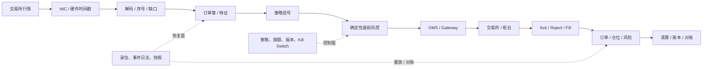
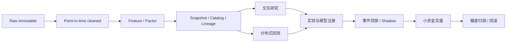

# 低延迟交易、CPU/GPU 与研究计算专项手册

这份手册补齐 FinCore Reliability Lab 在“高并发”之外的低延迟与异构计算知识。它回答的不是“会不会背
DPDK、NUMA、GPU、FPGA”，而是技术负责人能否定义指标、找到瓶颈、做出边界决策、设计失败回退，并用实验
证明投入值得。

## 0. 证据边界

本文严格区分四类证据，避免把学习和设计包装成生产经历：

| 标识 | 含义 | FinCore 当前例子 |
|---|---|---|
| `VERIFIED` | 已有代码、自动测试或运行报告 | 有界撮合 Lane、行情缺口与快照恢复、撮合日志重放、幂等、Outbox、Epoch Fencing、G1/ZGC 配置与指标 |
| `DEMO` | 有完整架构、故障路径和验收口径，可用于评审与演示 | 低延迟三平面、CPU/GPU 决策矩阵、HFT 故障推演 |
| `POC` | 需要在目标硬件、网卡、交易所或数据规模上做专项实验 | 绑核、NUMA、DPDK、硬件时间戳、GPU 风险批计算 |
| `OWNER` | 应由有直接生产经验的领域负责人实施，技术负责人负责目标与验收 | C++ 热路径、FPGA RTL、柜台协议、GPU 集群底层优化 |

当前 Java 项目是可恢复、跨进程正确的交易基线，不宣称已经达到微秒或亚微秒。技术负责人的可信表达应是：
“我能定义性能预算、设计实验和安全回退，也能领导领域专家交付；没有直接做过的实现不会冒充做过。”

## 1. 高并发不等于低延迟

高并发通常优化单位时间完成的请求数量、资源利用率和过载恢复；低延迟关注单个关键事件从输入到输出所需
时间及其抖动。批量、排队和线程池扩张可能提高吞吐，却会恶化 P99.9。

### 1.1 先统一延迟口径

| 口径 | 起点 | 终点 | 主要用途 |
|---|---|---|---|
| wire-to-app | 报文到达网卡 | 应用收到标准化事件 | 网络与接入归因 |
| tick-to-signal | 可信行情进入策略 | 策略产生交易意图 | 行情、订单簿和策略计算 |
| tick-to-trade | 行情到达 | 订单离开本机或网卡 | HFT 主性能口径 |
| order-to-wire | 订单进入执行层 | 报文离开网卡 | 风控、OMS 与网关 |
| order-to-ack | 本地发单 | 交易所确认返回 | 外部网络与柜台体验 |
| fill-to-position | 成交回报到达 | 仓位/风险视图可见 | 回报与实时风险 |
| trade-to-settle | 成交事实形成 | 资金账本完成 | FinCore 已验证的可靠性链路 |

每个口径至少报告 P50、P95、P99、P99.9、max、样本量、流量分布、硬件与版本。只有平均值或单次最快值
不能代表低延迟能力。

### 1.2 完整链路不是一条箭头



主路径追求确定性；控制面负责配置、权限和紧急停止；恢复面保存录包、事件、快照和外部权威查询。只画主路径
会遗漏真正决定系统能否安全上线的两部分。

## 2. 延迟预算和测量方法

### 2.1 预算必须能相加

技术负责人先给每一段预算，而不是先指定组件。例如一个假设性的 tick-to-trade 目标可以拆成：网卡与接收、
解码、簿更新、信号、盘前风控、OMS 编码和发送。数字必须由目标市场和真实硬件实验产生，不能从本文复制到
生产承诺。

预算表必须包含：

- 业务截止时间与错过机会的成本；
- 各段 P50/P99.9 和最大允许抖动；
- 排队时间与执行时间分开；
- 丢包、陈旧行情、未知订单和降级路径；
- 测量误差、时钟最大偏差与时间戳位置；
- 版本、CPU 频率、电源模式、网卡、核心拓扑和负载分布。

### 2.2 时间戳和时钟

同机阶段可以用单调时钟计算耗时；跨机归因需要 PTP、硬件时间戳和偏差监控。NTP 适合一般系统校时，不能
自动证明微秒链路的分段准确性。需要监控主时钟切换、offset、drift、holdover 和失锁状态。

硬件时间戳也不是终点：必须说明在 MAC、PHY、驱动、用户态还是业务方法打点，否则多个团队报告的
“端到端”可能根本不是同一段。

### 2.3 实验纪律

1. 固定流量、数据集、硬件、BIOS、电源策略、版本和进程拓扑；
2. 先录基线，分开排队、执行、系统调用、网络和外部等待；
3. 每次只改一类变量；
4. 同时报尾延迟、吞吐、错误、丢包、CPU、功耗与正确性；
5. 使用真实录包回放和长时间 soak，不能只跑微基准；
6. 优化后重跑业务不变量、故障切换、回退和对账；
7. 结果无显著收益或故障面过大时撤销方案。

## 3. CPU：从线程数走到微架构和硬件拓扑

FinCore 已经验证“同 symbol 单写、跨 symbol 并行、有界队列、减少临时对象和数据库往返”，并新增了
行情序号缺口、快照+增量恢复、慢消费者有界缓冲和撮合命令日志确定性重放模型。完整代码与测试映射见
[交易所核心能力补全实验](exchange-core-capability-lab.md)。这些解决的是
正确性与高并发基线。若进入专用低延迟节点，还要补下面的硬件协同。

### 3.1 核心、IRQ、网卡队列和线程要同拓扑

- 热路径使用专用物理核，避免与 GC、日志、监控、内核 housekeeping 和其他容器争抢；
- RX/TX queue、IRQ、轮询线程和业务 owner 对齐，避免包在核心间搬运；
- 避免线程迁核导致缓存重新预热；
- 超线程的两个逻辑核共享执行资源，是否启用要做 P99.9 A/B 实验；
- 深 C-state、动态频率和 Turbo 会影响功耗、峰值与抖动，不能只看名义主频；
- Kubernetes CPU limit 可能造成 throttling，绑核也不能掩盖 cgroup 配额不足。

验收数据包括每核利用率、上下文切换、迁核、软中断、IRQ 分布、CPU throttling、run queue 和分段尾延迟。

### 3.2 NUMA 不是只绑一个线程

线程在 socket 0、内存在 socket 1、NIC 在 socket 0 时，远端访存会穿过 UPI/QPI。正确做法是同时考虑：

- 线程与物理核；
- NIC 所在 PCIe / NUMA node；
- RX/TX queue 与 IRQ；
- 堆、直接内存、ring buffer 和 hugepage 的首次分配位置；
- 跨 socket 的共享状态和后台线程。

只执行 `taskset` 而不控制内存首次触碰和网卡队列，不算完成 NUMA 优化。使用 `lscpu`、`numactl`、
`numastat`、`ethtool`、`/proc/interrupts` 和性能计数器验证本地性。

### 3.3 Cache locality、伪共享和数据布局

低延迟数据结构应让热字段连续、访问顺序稳定，减少指针追逐和 LLC miss。不同线程更新同一 64B 缓存行内的
不同变量也会触发 cache line ping-pong，这就是伪共享。

常见动作：

- 热/冷字段拆分，订单簿热字段紧凑布局；
- 每核或每分片独占计数器，必要时 padding；
- 顺序数组或结构化数组替代随机对象图；
- 预取必须以硬件计数器和端到端结果证明，不能凭感觉加入；
- 比较 cycles、instructions、IPC、branch miss、L1/LLC miss 和 cache-to-cache 流量。

Java 的对象头、引用跳转和 GC 与 C++ 连续内存布局不同。FinCore 的 Java 服务可承担可靠控制面、账户与结算，
若将撮合热核演进为 C++，协议和可重放事件应保持兼容，而不是让整个系统重写。

### 3.4 分配、页故障、TLB 与 hugepage

热路径应预分配固定容量，避免动态扩容、allocator 竞争和不可预测页故障。启动预热阶段可以触碰内存并锁页，
避免首次访问在交易时分配物理页。Hugepage 可能减少 TLB miss，但会增加内存预留、碎片、部署和 NUMA 管理
难度，必须按数据规模实验。

需要观察 minor/major page fault、TLB miss、RSS、直接内存、分配速率和页所在 NUMA node。对象池如果没有
所有权和容量边界，可能把 GC 问题变成泄漏、ABA 或回收复杂度。

### 3.5 分支、虚调用、JIT 与编译器

- 高频条件分支的分布比“分支数量”重要；异常路径不要污染常见路径；
- 虚调用、边界检查、拷贝和序列化是否昂贵，需要由 profile 证明；
- Java 必须区分解释执行、JIT 预热、去优化和 safepoint；
- C++ 的 LTO/PGO、内联和编译选项也必须用真实回放验证；
- 微基准要防止死代码消除、常量折叠、缓存过热和不真实数据分布。

### 3.6 并发模型和 lock-free 边界

单写者、按 symbol/策略分片和 SPSC 队列通常比共享状态上的复杂无锁结构更容易获得确定性。MPSC/MPMC 带来
更多原子竞争和内存序复杂度。Lock-free 不是必然更快：还要解决 ABA、对象生命周期、内存回收、活锁和调试。

负责人应能解释 `relaxed`、`acquire`、`release` 的 happens-before 边界，但实现必须由具备 C++ 并发经验的
owner 评审。临界区短且竞争低时，简单锁可能更快、更安全。

### 3.7 CPU 验收矩阵

| 问题 | 指标/工具 | 通过标准的写法 |
|---|---|---|
| 是否频繁迁核 | perf sched、上下文切换、per-core 采样 | 与基线相比迁核下降，P99.9 同向改善 |
| 是否远端访存 | numastat、NUMA perf/VTune | NIC、线程和主要内存位于同 node；远端比例受控 |
| 是否 cache miss | perf stat/record、perf c2c | 热点调用栈和 cache-to-cache 证据可定位 |
| 是否页故障 | page-fault、TLB、RSS | 稳态热路径不出现 major fault，minor fault 可解释 |
| 是否 CPU 节流 | cgroup throttled time | 目标负载下无持续节流，容量留有余量 |
| 优化是否值得 | P50/P99.9/max + 吞吐 + 正确性 | 多次实验稳定改善，失败与回退测试通过 |

## 4. 网络、内核旁路与行情完整性

### 4.1 RSS、RPS、RFS、XPS 的区别

- RSS 由网卡硬件按流哈希分配 RX queue；
- RPS 在软件层把接收处理分配到 CPU；
- RFS 尝试让包处理更靠近消费该流的应用 CPU；
- XPS 选择发送队列与 CPU 映射。

目标不是“全部打开”，而是让 queue—IRQ—core—应用 owner 对齐，同时验证是否产生乱序和跨 NUMA 访问。

### 4.2 中断、轮询和 busy poll

中断节省空闲 CPU，但调度和软中断会增加抖动；持续轮询占用核心，却能提供更稳定的低延迟；混合模式在
负载变化时折中。`busy_poll` 或用户态 poll 必须计入功耗、核心成本和运维能力。

### 4.3 UDP 行情与 TCP/会话订单

行情接入必须保存频道、序号和接收时间；发现缺口时把本地簿标成 stale，按协议请求重传或用快照 + 增量重建，
重建完成前不能让陈旧订单簿继续生成无限风险。双源行情要定义权威、分歧门槛和切换规则。

订单会话必须处理序号、重连、流控、拒单码和回报补发。发单超时是未知结果，不能生成新 clientOrderId
盲重试。`TCP_NODELAY` 适合避免小报文等待，但不能解决应用排队或外部柜台慢。

### 4.4 DPDK、RDMA 和内核网络栈

DPDK 通过用户态轮询、hugepage 和专用队列减少内核协议栈、中断和拷贝开销，代价是占核、部署、驱动、监控
和故障工具链更复杂。只有分段证据表明瓶颈位于网络栈，且 P99.9 收益覆盖新故障面时才进入 PoC。

RDMA 适合受控内部网络的低拷贝通信，不代表外部交易所接入可以使用。必须先回答它解决的是集群内部状态复制、
数据分发还是存储访问，以及错误模型和回退路径。

### 4.5 PTP 与硬件时间戳

必须监控 grandmaster、offset、drift、holdover、主备切换和每台主机状态。时钟失去可信度时，系统应暂停
依赖精确时间的归因或策略，并保留接收顺序证据。不能用“服务器时间看起来一致”证明合规和微秒测量有效。

## 5. FPGA、SmartNIC、ASIC：负责人怎样划边界

FPGA 适合协议解析、过滤、硬件时间戳、固定簿更新、简单确定性风控或报单流水线；复杂策略、频繁变化规则、
大状态和异常编排通常留在 CPU。SmartNIC 介于软件灵活性与硬件确定性之间，ASIC 只有在逻辑长期稳定且规模
足以覆盖成本时才有意义。

上线必须同时验收：

- 端到端而不是局部 P50/P99.9/max；
- 每拍吞吐、流水线 backpressure 和丢包；
- 协议升级、固件版本、可观测计数器和抓包；
- 卡、PCIe、链路、时钟或逻辑异常；
- CPU 安全慢路径和单一路径发单 fencing；
- 录包回放、shadow 双跑、差异阈值和灰度；
- 三年 TCO、人才、备件、迭代周期和退出条件。

FPGA 异常时先判断输出是否可信。若可能发出错误行情或订单，应隔离硬件路径、确保只保留一个发单权威、切换
CPU 安全路径或暂停策略。恢复后查询交易所权威订单、对账仓位和资金，再用回放与 shadow 恢复。

## 6. GPU：什么时候该用，什么时候不该用

GPU 的优势是大量相似、可批量、算术密集的并行计算。它不是通用的“更快 CPU”。PCIe/NVLink 传输、
kernel launch、排队和 batch 聚合都有固定成本，因此对单笔串行订单状态机、数据库事务、OMS 会话和微秒级
小任务通常不划算。

### 6.1 适用决策矩阵

| 工作负载 | 默认选择 | 原因 | 主要风险 |
|---|---|---|---|
| 单笔订单簿更新、盘前固定规则、OMS | CPU/FPGA | 小状态、强顺序、极低延迟 | GPU 启动/传输和 batch 等待 |
| 深度学习训练、批量推理 | GPU | 矩阵计算和高并行 | 利用率、显存、数据供应与复现 |
| Monte Carlo、批量情景风险 | GPU/CPU 对比 PoC | 大量独立或向量计算 | 精度、随机性、数据搬运 |
| 因子矩阵、向量化回测 | CPU SIMD / GPU | 数据规模大且规则可批量 | 数据格式、分支发散、未来函数 |
| 实时组合风险汇总 | CPU 主路径 + GPU 异步 | 热路径给硬限额，GPU 做更复杂刷新 | 结果时效和降级 |
| 日志、对账、数据库 OLTP | CPU/存储 | I/O 与事务为主 | 加卡不解决瓶颈 |

### 6.2 GPU 利用率低的分解顺序

```text
对象存储/行情数据
  → 读取与解压
  → CPU 清洗/特征
  → pinned memory
  → Host-to-Device
  → kernel / 模型
  → 多卡通信
  → Device-to-Host
  → 指标/检查点/模型注册
```

先测每段时间，再决定增加 worker、缓存、并行读取、prefetch、batch、混合精度、算子融合、梯度累积或增加 GPU。
如果 GPU 经常等数据，增加卡只会扩大闲置和通信成本。

### 6.3 显存、批量、精度和确定性

- batch 增大通常提高吞吐和张量核心利用率，也增加排队、显存和结果反馈时间；
- 混合精度可提升吞吐、降低显存，但需验证数值误差、溢出和策略指标；
- checkpoint、梯度、optimizer state 和激活共同占显存，OOM 不能只靠缩数据解决；
- 多卡通信可能让扩卡收益递减，必须报告 scaling efficiency；
- 固定随机种子仍不必然保证跨驱动、硬件和算子完全确定；
- 金融结果应定义可接受数值误差、golden dataset 和回归阈值。

### 6.4 调度、隔离与成本

研究任务应登记 GPU 型号、显存、CPU/RAM、数据版本、预计时长和优先级。交互实验、正式训练、回测和生产推理
需要资源配额与抢占策略。MIG 或独占 GPU 是否适合取决于隔离、通信和模型大小，不能只追求表面利用率。

成本至少报告 GPU-hour、等待时间、有效训练时间、失败重跑、存储/传输和单位可信实验成本。自建与云按数据
敏感性、稳定负载、峰谷弹性、网络、人才、备件和三年 TCO 决策。

### 6.5 训练复现、发布和漂移

每次实验绑定：点时数据快照、特征/标签版本、代码 commit、容器/依赖、随机种子、参数、硬件和结果。模型
按离线评估 → 历史回放 → shadow → 小资金灰度 → 扩容发布；每一关都有风险阈值、人工批准与回滚。

漂移不能只看预测分布。需要同时按市场状态监控输入分布、缺失率、特征、预测、实盘收益/风险、成交质量、
滑点和容量。GPU 或模型不可用时，交易热路径要能回退到确定性硬规则、旧模型或暂停策略，不能绕过风控。

## 7. 中频研究平台：速度必须建立在可信之上



### 7.1 十类回测陷阱

1. 未来函数和使用修订后数据；
2. 存活者偏差；
3. 复权、分红、拆并股和公司行动口径错误；
4. 手续费、税费、借券、资金和冲击成本低估；
5. 按中间价/收盘价成交，忽略盘口深度、排队、停牌和涨跌停；
6. 行情、基本面、事件、时区和交易日历对齐错误；
7. 过拟合、多重检验和只展示最好结果；
8. 忽略资金规模、换手、冲击和策略容量；
9. 研究与实盘重写导致语义、精度和异常处理分叉；
10. 数据回补、供应商变化和特征漂移没有版本记录。

### 7.2 回测与实盘“同一套”的正确含义

共享的是数据定义、特征/因子逻辑、订单/成交模型接口、配置和 golden dataset，不必强求完全相同运行时。
研究侧适合向量化、批处理和探索；实盘侧适合事件驱动、确定性和严格时限。用录包回放、shadow 和差异归因
证明两者语义一致。

### 7.3 策略容量和组合优化

组合优化不仅是求一个权重向量，还要纳入风险暴露、杠杆、集中度、换手、流动性、可借规模、交易成本、整数
手数和市场限制。策略容量要观察资金扩大后信号衰减、排队、冲击、成交率和风险，而不是线性放大回测收益。

实盘偏差按数据、信号、组合构建、成本模型、执行、容量和系统故障分层归因。技术团队要提供完整血缘和回放，
不能把所有偏差都归给“市场变化”。

## 8. 市场接入和微结构边界

股票、期货、期权、数字资产在交易时段、集合竞价、夜盘、涨跌停、撤单、保证金、结算价和日切上不同，不能
把现货状态机原样复制。

负责人应覆盖：

- 行情快照、逐笔委托/成交、频道、序号、缺口、乱序、重建和陈旧检测；
- 报单会话、流控、会话序号、拒单码、重连、回报补发和未知结果；
- 资金、持仓、保证金、价格笼子、频率、自成交和 Kill Switch；
- 交易日、夜盘、结算价、费用税费、公司行动和复权；
- 决策数据、代码、参数、订单和时间戳审计；
- 具体柜台协议与监管规则由有经验的市场接入 owner 最终确认。

FinCore 的现货、衍生品故障实验、幂等、资金账本、对账和 Epoch Fencing 可以迁移为可靠性骨架，但保证金、
强平、资金费率、组合风险和市场会话必须按目标市场重新验证。

## 9. 六个代表性故障推演

| 场景 | 首要动作 | 定位证据 | 恢复门槛 |
|---|---|---|---|
| 行情 10 倍、P99.9 暴涨 | 保护撤单/风控，限制新增风险 | 分段时间戳、队列、丢包、IRQ、CPU/NUMA、柜台 | 积压净下降、行情可信、订单与仓位可对账 |
| 行情序号缺口 | 标记 stale，按风险等级停策略 | 频道/序号、双源、快照与增量 | 簿重建完成并与权威源一致 |
| 报单超时、结果未知 | 禁止新业务键盲重试 | clientOrderId、会话序号、回报补发/查询 | 外部订单状态收敛并完成对账 |
| CPU 尾延迟突然上升 | 隔离新变更和噪声核心 | 迁核、IRQ、cache miss、page fault、频率、GC | 多轮回放 P99.9 恢复，正确性通过 |
| GPU 训练利用率低 | 不先加卡，分段测数据流水线 | 读取、预处理、H2D、kernel、通信、排队 | 单位实验成本下降且结果可复现 |
| FPGA 输出可疑 | 隔离路径并防双发 | 心跳、CRC、序号、时间戳、计数器、双跑差异 | CPU 慢路稳定，对账清零，回放/shadow 通过 |

## 10. 从 FinCore 到专用低延迟平台的演进路线

### 阶段 A：保留现有可靠性基线（`VERIFIED`）

- 交易命令幂等、价格时间优先和数量守恒；
- 成交 + Outbox 原子提交；
- 资金 Inbox、账本、余额、状态与 Outbox 同事务；
- Worker 接管与事务内 Epoch Fencing；
- 故障注入、对账、补偿和审计；
- 有界队列、G1/ZGC、JFR、Prometheus 和固定到达率压测。

### 阶段 B：建立低延迟事实（`DEMO` → `POC`）

- 明确 tick-to-trade / order-to-ack 等口径；
- 接入统一单调时钟、PTP 状态和分段时间戳；
- 录包回放并报告 P50/P99/P99.9/max；
- 建立 CPU 拓扑、IRQ、NUMA、cache、page fault 和节流基线；
- 把热路径和控制/恢复/账务路径拆开，协议版本化。

### 阶段 C：由专项 owner 做候选优化（`OWNER`）

- C++ 单写者订单簿、SPSC ring、预分配与 CPU/NUMA 亲和；
- 证明网络栈是瓶颈后再做 DPDK/busy poll；
- 固定且高价值逻辑做 FPGA/SmartNIC PoC；
- GPU 用于批量研究、训练、风险和回放，不直接搬入单笔交易状态机。

### 阶段 D：安全上线

- 原始事件与 golden dataset 驱动新旧双跑；
- 差异为零或在事先批准阈值内；
- 小流量/小资金灰度，保留安全慢路径；
- 性能、正确性、故障、运维和 TCO 共同验收；
- 达不到阶段门就停止，不让技术投入变成沉没成本。

## 11. 技术投资与团队责任

```text
优先级 ≈ 可验证业务增益 × 覆盖策略规模 × 成功概率
          ------------------------------------------------
          三年 TCO + 复杂性 + 人才成本 + 新故障面
```

| 决策层 | 应负责什么 | 不应假装什么 |
|---|---|---|
| 技术负责人 | 性能口径、业务价值、边界、预算、owner、阶段门、回退和最终系统结果 | 自己是每个 FPGA/C++/GPU 细节的最佳实现者 |
| HFT/C++ owner | 热路径数据结构、并发、编译、性能剖析和代码质量 | 只报局部最快值而不管端到端和故障 |
| FPGA/网络 owner | 板卡/协议、时序、队列、时间戳、旁路和可观测性 | 隐藏升级、备件与恢复成本 |
| GPU/研究平台 owner | 数据供应、调度、利用率、复现、模型发布和成本 | 用 GPU 数量代替研究效率 |
| SRE/交易运维 | 容量、时钟、监控、变更、Kill、切换、演练与事件证据 | 只看主机存活判断交易恢复 |
| 研究/业务 | 机会成本、策略容量、风险、验收阈值与实盘归因 | 把所有实盘偏差都归给技术或市场 |

## 12. 面试时的四级表达模板

```text
结论：这个问题的核心目标和最大风险是什么。
约束：延迟口径、分位数、吞吐、正确性、硬件、市场规则和预算。
设计：主路径、控制面、恢复面；为什么选择 A 而不是 B。
失败：至少两个具体失败模式、检测、隔离和回退。
证据：基线、分段时间戳、性能计数器、回放、shadow、故障演练和对账。
边界：我亲自做过 / 评审过 / 用实验验证过 / 尚未做过但会配置 owner。
```

对“为什么你能领导 CPU/GPU/FPGA 专家”的可靠回答是：技术负责人不代替专家，但必须把模糊的“更快”变成
统一口径、性能预算、实验、业务收益、失败回退和退出条件，并能追问到证据。FinCore 已证明的是金融正确性、
高并发与恢复基线；专项硬件能力将按本文阶段门由领域 owner 实施。

## 13. 参考资料

- [Linux Networking Scaling](https://docs.kernel.org/networking/scaling.html)
- [Linux Timestamping](https://docs.kernel.org/networking/timestamping.html)
- [DPDK Poll Mode Driver](https://doc.dpdk.org/guides/prog_guide/poll_mode_drv.html)
- [Oracle Java 21 G1 调优](https://docs.oracle.com/en/java/javase/21/gctuning/garbage-first-garbage-collector-tuning.html)
- [NVIDIA CUDA Best Practices Guide](https://docs.nvidia.com/cuda/cuda-c-best-practices-guide/)
- [NVIDIA Reproducibility](https://docs.nvidia.com/deeplearning/frameworks/reproducibility/index.html)
