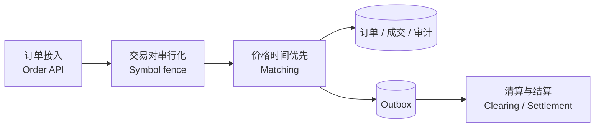

# 撮合模块：从订单意图到可结算成交

FinCore 撮合模块不是一个只在内存里跑通买卖队列的演示。它用于说明交易系统中三个必须分开的责任：**撮合决定谁和谁以什么价格成交，清算计算应收应付，结算才真正改变资金账本。**

> **English summary:** The matching module provides deterministic price-time priority, idempotent order entry, partial fills, cancellation, self-trade prevention, durable sequencing, audit history and transactional trade events.

## 负责人先看什么

撮合系统最难的地方不是比较两个价格，而是维持确定性：

- 同样的输入序列必须得到同样的成交序列；
- 重复下单不能在订单簿中出现两份；
- 并发节点不能同时为同一交易对分配顺序；
- 部分成交后，原始量必须始终等于已成交量加剩余量；
- 成交事实必须与 Outbox 同事务提交，不能“成交成功但结算消息丢失”；
- 撮合只生成成交事实，不能绕过清算与结算直接修改余额。

## 模块边界



当前实现使用 PostgreSQL 事务级 advisory lock 对单个交易对串行化。它不是微秒级生产撮合内核，而是一个可运行、可恢复、跨进程正确的基线：先把确定性、幂等和事件原子性证明清楚，再讨论内存订单簿、分区日志、快照恢复和更低延迟。

## 已实现能力

| 能力 | 业务含义 | 技术保证 |
|---|---|---|
| 限价单与市价单 | 支持挂单和立即成交 | 市价剩余量不进入订单簿 |
| 价格优先、时间优先 | 最优价格先成交，同价先到先得 | 数据库序列 + 明确排序 |
| Maker 价格成交 | Taker 接受订单簿已有价格 | 成交价取被动单价格 |
| 部分成交 | 大单可跨多个价位逐笔成交 | 数量守恒 CHECK 约束 |
| 客户端订单幂等 | 网络重试不产生第二张订单 | `(user_id, client_order_id)` 唯一约束 |
| 冲突重放拒绝 | 同一订单号不能偷偷修改价格或数量 | 原始请求字段逐项比对 |
| 撤单 | 仅本人可撤销仍开放的剩余量；新单洪峰不能挤占退出通道 | 独立有界保留容量 + 同交易对 Lane + 交易对锁 + 合法终态检查 |
| 自成交保护 | 避免同一用户买卖互成交 | `CANCEL_TAKER` 策略 |
| 成交事件 | 下游可以可靠清算和结算 | 成交与 Outbox 同事务 |
| 审计与指标 | 可追踪订单每次状态变化 | matching_audit + Prometheus |

## API

提交限价卖单：

```bash
curl -s http://localhost:8080/api/matching/orders \
  -H 'Content-Type: application/json' \
  -d '{
    "clientOrderId":"seller-001",
    "userId":"user-seller",
    "symbol":"BTC-USDT",
    "side":"SELL",
    "type":"LIMIT",
    "price":65000,
    "quantity":0.1
  }'
```

提交可成交买单：

```bash
curl -s http://localhost:8080/api/matching/orders \
  -H 'Content-Type: application/json' \
  -d '{
    "clientOrderId":"buyer-001",
    "userId":"user-buyer",
    "symbol":"BTC-USDT",
    "side":"BUY",
    "type":"LIMIT",
    "price":65100,
    "quantity":0.05
  }'
```

查看订单簿、最近成交和订单：

```bash
curl -s 'http://localhost:8080/api/matching/books/BTC-USDT?depth=20'
curl -s 'http://localhost:8080/api/matching/trades/BTC-USDT?limit=50'
curl -s http://localhost:8080/api/matching/orders/替换为订单ID
```

撤单：

```bash
curl -s -X DELETE \
  'http://localhost:8080/api/matching/orders/替换为订单ID?userId=user-seller'
```

撤单返回 `CANCELED` 时，订单终态、未成交资金释放、审计和 Outbox 已经提交；429、503 或客户端超时都不能由前端解释为成功。完整的双队列架构、竞态时序、资金语义和测试数据见[大流量下撤单](cancellation-under-load.md)。

## 明确没有伪装成什么

- 这不是微秒级内存撮合引擎的性能样本；
- 当前版本已经实现预交易余额预占、基础风控限额和价格笼子；停牌与手续费档位仍未接入；
- 成交事件已经进入独立 matching topic，现货双资产 DvP 已形成实验闭环；生产级清算网关和外部托管仍不在当前范围；
- 生产升级方向应是单交易对单写者、持久化命令日志、快照与确定性重放，而不是让多个节点共享修改内存订单簿。
