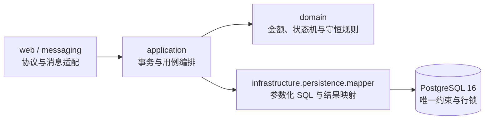

# Spring Boot + MyBatis 持久化架构

## 改造目标

本次重构把散落在 Application Service 中的 Spring JDBC SQL 收拢到独立 MyBatis Mapper，形成可审查的四层结构：

采用版本：

| 组件 | 版本 | 用途 |
|---|---:|---|
| Java | 17 | 运行基线与不可变 record 模型 |
| Spring Boot | 3.5.16 | Web、Kafka、事务、配置和可观测性 |
| MyBatis Spring Boot Starter | 3.0.5 | Mapper 扫描、会话和 Spring 事务集成 |
| PostgreSQL | 16 | 金融事实、唯一约束、行锁和事务锁 |
| Flyway | Spring Boot 管理版本 | 数据库结构迁移 |

MyBatis 官方兼容表说明 Starter 3.0 支持 Spring Boot 3.2—3.5 与 Java 17 及以上；3.0.5 发布版以
Spring Boot 3.5.x 为基线，因此项目锁定 3.0.5，而不是依赖浮动版本。

## 包职责

| 包 | 只负责 | 不负责 |
|---|---|---|
| `dev.fincore.web` | HTTP 参数、响应和 Lab Profile 边界 | SQL、资金事务 |
| `dev.fincore.messaging` | Kafka 收发、Ack 与 Worker Fence 上下文 | 业务幂等最终判定 |
| `dev.fincore.application` | 用例编排、`@Transactional`、锁顺序、状态机和失败传播 | SQL 字符串和结果集解析 |
| `dev.fincore.domain` | `BigDecimal` 金额、借贷平衡、合法状态迁移等纯规则 | 基础设施访问 |
| `dev.fincore.infrastructure.persistence.mapper` | 参数化 SQL、数据库行映射和原子 CAS | 跨 Mapper 事务编排 |

Spring Boot 启动类通过 `@MapperScan` 扫描 Mapper。服务使用构造器注入接口，不持有数据库连接或
`JdbcTemplate`。测试代码仍可使用 `JdbcTemplate` 构造故障和直接核验数据库事实，这不会进入生产调用链。

## 11 个 Mapper 的边界

| Mapper | 数据边界 | 关键并发或可靠性语义 |
|---|---|---|
| `AccountMapper` | 账户创建、账户和账本汇总查询 | 账户业务唯一键 |
| `LedgerMapper` | 账户行锁、余额 CAS、账本追加 | UUID 固定锁序；无账本更新/删除 SQL |
| `SettlementMapper` | Inbox、结算单、状态审计 | 双层幂等；带原状态的 CAS |
| `OutboxMapper` | 事务事件、抢占、发布确认和回收 | `SKIP LOCKED`；发布者身份校验 |
| `ShardLeaseMapper` | Lease、DRAINING、Epoch Fence | 行锁接管；共享锁验证数据面 Fence |
| `CompensationMapper` | 补偿单和原结算快照 | 原业务键唯一；原单只读并加锁 |
| `FeeAggregationMapper` | 手续费分片和归集单 | 归集键幂等；分片余额 CAS |
| `ReconciliationMapper` | 账本重算差异与审查单 | 只发现和冻结，不自动改账 |
| `MatchingMapper` | 订单、序列、成交、盘口和审计 | 交易对事务锁；价格时间优先；版本 CAS |
| `TradeReliabilityMapper` | 成交 Inbox、投影、对账与修复 | 权威成交只读；修复仅作用于派生投影 |
| `LabScenarioMapper` | 实验故障注入与证据统计 | 仅由 `lab` Profile 组件调用 |

## 一次结算如何跨 Mapper 保持原子

`SettlementService.settle` 是事务边界。一次调用按下面的顺序执行：

1. `SettlementMapper` 插入消息 Inbox，重复 `message_id` 返回已有结果；
2. 在同一事务内通过 `ShardLeaseMapper` 锁定并核验 Worker 的 owner、epoch、state 和 lease；
3. `SettlementMapper` 创建业务单，重复 `business_key` 返回已有结果；
4. `LedgerMapper` 按 UUID 字符串顺序 `FOR UPDATE` 锁定账户；
5. Domain 层使用 `BigDecimal` 校验资产、余额和借贷平衡；
6. `LedgerMapper` 追加账本事务和分录，再执行带下限条件的余额更新；
7. `SettlementMapper` 使用原状态条件完成 CAS，并追加状态审计；
8. `OutboxMapper` 在同一事务写入事件，最后标记 Inbox 完成；
9. 任意未处理异常由 Spring 回滚全部 Mapper 操作，Kafka 可以安全重试。

Mapper 不会自行提交事务。MyBatis 的 Spring 集成让本次调用中的 Mapper 会话参与同一个 Spring 管理事务，
避免“结算成功、Outbox 丢失”或“账本已写、余额未改”的部分提交。

## SQL 与映射规则

- 所有外部值使用 `#{...}` 预编译绑定；Mapper 禁止 `${...}` 字符串直替。
- 买卖方向分别使用固定 SQL，不把列名或排序方向作为动态字符串传入。
- record 查询列显式使用驼峰别名，配置启用基于构造器参数名的映射。
- `local-cache-scope: statement` 确保金融事务的后续查询不会跨语句复用一级缓存快照。
- 默认 SQL 超时为 30 秒，防止异常查询无限占用事务和连接。
- `LedgerMapper` 不提供 `UPDATE/DELETE ledger_entry`；冲正必须追加反向账本。
- `TradeReliabilityMapper` 不提供 `UPDATE/DELETE trade_execution`；修复只能重建或隔离投影。

## 并发、重试与部分失败

| 情况 | 保护方式 | 失败后的行为 |
|---|---|---|
| Kafka 重复投递 | Inbox 主键 + 业务键唯一约束 | 返回已持久化结果，不重复入账 |
| 两个节点同时结算 | 数据库唯一约束、账户行锁和条件扣款 | 仅一个事务产生资金效果 |
| 两个 Taker 抢同一 Maker | 交易对 advisory transaction lock + 订单版本 CAS | 同一 Maker 不会被重复成交 |
| Worker 排空后恢复 | Lease 行锁 + 单调 Epoch + 资金事务内 Fence | 旧 Epoch 抛错并整体回滚 |
| Outbox Publisher 中途退出 | 原子抢占、发布者身份和超时回收 | 事件重新进入待发布状态 |
| 修复期间权威成交迟到 | 可重复读快照、交易对锁和执行前再核验 | 合法成交从权威表重建，不错误隔离 |

## 自动防回退测试

`PersistenceArchitectureTest` 和 `scripts/verify-code-conventions.sh` 持续检查：

- 生产源码不得引用 `JdbcTemplate` 或 `NamedParameterJdbcTemplate`；
- 项目必须加载 MyBatis Starter 并配置 `@MapperScan`；
- 核心领域 Mapper 不得少于 11 个；
- Mapper 不得出现 `${...}`；
- 账本分录和权威成交不得出现更新或删除语句。

这些检查与数据库集成测试互补：前者防止架构和不可变边界在代码评审中悄悄退化，后者使用真实 PostgreSQL
验证 SQL、事务、锁、唯一约束和重试行为。

## 官方参考

- [MyBatis Spring Boot Starter 官方文档](https://mybatis.org/spring-boot-starter/mybatis-spring-boot-autoconfigure/)
- [MyBatis Spring Boot Starter 3.0.5 发布说明](https://github.com/mybatis/spring-boot-starter/releases/tag/mybatis-spring-boot-3.0.5)
- [MyBatis SQL 映射与参数绑定](https://mybatis.org/mybatis-3/sqlmap-xml.html)
