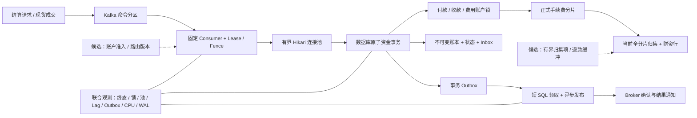

# 中间件、热点账户与结算性能专项

不是把线程、连接和批次统一调大，而是从**共享资源、资金一致性和可恢复性**出发，回答三个问题：哪里在排队；如何减少真正的串行工作；如何证明更快之后仍然正确。

本专项以 `ee8ed2c` 为审查基线。9 月 20 日先补手册与隔离实验工具；9 月 21 日继续实现结算幂等、提交前 Fence、提交后指标和重复查询优化，并增加真实 PostgreSQL 回归与逐笔审计工具。**源码已实现不等于线上后端已切换，也不等于容量认证通过。** 阅读顺序是“本页概览 → 对应专项步骤 → 代码/测试 → 原始实验报告”。最新状态见[结算专项补齐记录](settlement-completion.md)。

## 1. 一分钟理解三个重点

| 专项 | 要解决的实际问题 | 技术决策重点 | 详细入口 |
| --- | --- | --- | --- |
| 中间件优化 | Kafka 已接收，但消费、数据库连接或 Outbox 持续积压 | 分区/消费者/连接池的总预算；SQL 与锁；发送未知、超时回收及重试 | [中间件实施手册](middleware-optimization-playbook.md) |
| 热点账户优化 | 不同订单仍争用同一个手续费、大户资金或公共池账户 | 找准账户资产一致性域；正式分片与有资金支持的子预算；有界归集、退款及迁移 | [热点账户实施手册](hot-account-optimization-playbook.md) |
| 结算性能优化（独立章节） | 接入很快但最终到账慢，统计显示成功却缺少资金证据 | 区分受理/提交/通知；缩短持锁事务；保留幂等、Fence、平衡分录与恢复路径 | [结算实施手册](settlement-performance-playbook.md)、[实现与验证记录](settlement-completion.md) |

每份手册都分清“当前代码有什么”和“候选方案还需什么”，提供源码定位、诊断 SQL、参数实验、故障用例、通过门槛和回退方式。不会把方案图、配置项或工具替身测试当成生产性能成绩。

## 2. 全链路优化位置



现货成交先经过请求 Outbox 再进入 Kafka；通用命令直接经 HTTP 发送 Kafka。图中虚线是候选，当前并没有强制版本化费用路由、账户 Lane 或归集项状态机。Consumer、Hikari 和 DB 行锁分别控制不同资源，增加某一层预算可能只把等待转移到下一层。

## 3. 当前已经具备的结构性基础

- 资金状态、平衡分录、余额、Inbox、Outbox 处于同一事务；账户按确定 UUID 顺序加锁。
- 分录使用多值 INSERT，Outbox 有界领取、异步发送、批量回写，Kafka 失败不静默确认。
- 固定消费者、小连接池、有界撮合队列和 Lease 缓存；缓存不取代事务内资金裁决。
- 手续费已有正式账户与确定性路由；现货有跨币对共享预算、双资产交割及故障回滚测试。

这些是可由源码检查的机制，不是“提升多少”的实测结论。CPU 优化首先来自减少无效 SQL、连接争抢、序列化和锁竞争；再用 JFR、数据库等待与每完成单 CPU 成本验证，不能仅用进程 CPU 下降推导系统更快。底层线程与 JVM 参数见[高并发 / CPU / GC 专项](../high-concurrency-jvm-tuning.md)。

## 4. 必须正视的现状限制

| 已识别问题 | 为什么会影响优化结论 | 当前状态与下一步 |
| --- | --- | --- |
| 原结算 k6 主要统计 HTTP 202 | Broker 接收不代表完成到账 | 已补闭环终态工具与数据库逐笔审计；持续到达率容量实验仍待运行 |
| Kafka key 与 Worker shard 使用不同规则 | 多实例可能争同一 Lease，增加分区不等于账户并行 | 先记录实际映射，验证双实例移交，再决定版本化路由 |
| 费用路由是辅助 API，结算接受传入 feeAccountId | 建了分片也可能继续把所有费用写入同一个账户 | 服务端固化映射与账户，校验重放和同键冲突 |
| 归集先锁全部分片，财资仍是共享写点 | 后台任务可能推高前台尾延迟，空分片也被锁 | 单源或小批次归集项，原键恢复，保留退款缓冲/回补协议 |
| 通用幂等关联及冲突校验有缺口 | 换 messageId 再重放可能查询不到原单；不同载荷不可误当新资金效果 | 已补经济载荷校验、Inbox 原业务关联及真实数据库回归；不再列为未实现 |
| 等待跨 TTL 后提交旧 Fence | 长锁等待、外层事务延迟可能使方法入口验证过期 | 已补事务提交前复验，具体故障窗口与测试见结算补齐记录 |
| 成功计数在事务提交前增加 | Counter 不等于已提交资金结果 | 已改提交后观测；进程崩溃仍可能丢指标，数据库终态是最终依据 |

先补正确性和测量口径，再扩大并发。识别不适合立即优化的地方，与实现更快路径同样重要。

## 5. 本轮可运行内容

[工具说明](../../scripts/performance/README.md)提供完整准备、执行、观测和保留现场步骤；[独立配置](../../infra/performance/compose.isolated.yml)仅发布本机端口 18080，不复用公网服务与生产卷。

```bash
# 协议回归：无 HTTP、无数据库、无钱包
node --test scripts/performance/settlement-comparison.test.mjs scripts/performance/settlement-database-audit.test.mjs

# 默认仅计划，不执行创建或交易
node scripts/performance/settlement-comparison.mjs --scenario shared-fee --count 64 --concurrency 4
```

执行模式比较三种真实接口路径：公共费用账户、16 个费用分片、16 费用分片加单一热点付款方。每轮新合成资产，经 HTTP → Kafka → 原有带 Fence 的 Worker；逐键查询终态，用独立 BigInt 期望核对账户与账本摘要。**不会绕过现有资金服务或直写 SQL 提高数字。**

工具保留未知接收和未知终态，不自动换键重发；核账接口不可用与确定资金差异分开记录；原始 JSON 数字保留精度，防止极小差额被浮点舍入。所有写入前先输出恢复标识。工具不实现真实资产交易，不产生虚构压测成绩。

该对照是有限闭环实验，不是固定到达率容量测试。默认 64 笔可用于快速验链，不能据此承诺 P99、10 分钟稳定吞吐或生产 SLA。数据库审计进一步核查逐笔唯一分录、完整键集、Inbox 与 Outbox；其 PostgreSQL 合成夹具不是完整 Kafka 压测。历史记录见[9 月 20 日验证记录](VERIFICATION.md)，最新实现与限制见[结算专项补齐记录](settlement-completion.md)。

## 6. 从定位到落地的执行顺序

| 阶段 | 具体操作 | 必须留下的证据 | 继续条件 |
| --- | --- | --- | --- |
| 0. 固定口径 | 记录版本/配额/数据分布，明确接受、完成、通知、未知的定义 | 环境清单、输入清单、时间窗 | 非零样本且每个业务键可追踪 |
| 1. 正确性前置 | 补幂等冲突、换消息重放、跨 TTL 与查询未可见协议 | 先失败后通过的独立回归用例 | 唯一资金效果和冻结/重试语义明确 |
| 2. 建立基线 | 三类账户分布，采集锁、连接、分区 Lag、Outbox 年龄 | 原始 JSON、SQL 快照、JFR/资源曲线 | 资金差异 0，无静默丢单，未知完整保留 |
| 3. 单点改动 | 先减少 SQL/持锁，再分别改变批次、消费者或池大小 | 同条件基线/候选至少三轮 | 收益大于噪声，尾延迟/失败率不恶化 |
| 4. 热点治理 | 强制版本化费用路由；账户准入；有界归集与退款 | 协议、迁移、原键重放、前后台共同验收 | 冷账户有预算，历史事实不变，退款可恢复 |
| 5. 故障与放量 | 暂停 Broker/Worker，制造回执丢失、接管和归集并发 | 恢复时序、逐资产对账、积压排空时间 | 正确性硬门槛先通过，再进入小范围灰度 |

止损条件：借贷或余额不一致、重复资金效果、旧 Epoch 产生新写入时立即停止新实验；延迟、拒绝率或积压超过预先约定预算则退回上一组参数。回退配置不删除账本、不清空 Inbox/Outbox、不重置 offset，也不撤销已经提交的经济事实。

## 7. 对外展示的重点

审阅者可以从本专项复核：是否能把慢请求拆到具体资源；是否理解多账户一致性和超级账户共享预算；是否识别归集与退款的反作用；是否掌握单变量实验、容量预算、幂等迁移和故障回退。每一项都连接到真实源码和可复验步骤，而不是只列技术名词。

源码路径、案例和图分别在三份详细手册中，测试结果单独归档。未经实测的吞吐提升、尚未实现的路由/归集协议、没有执行的故障窗口，始终标注为待验证或候选。
