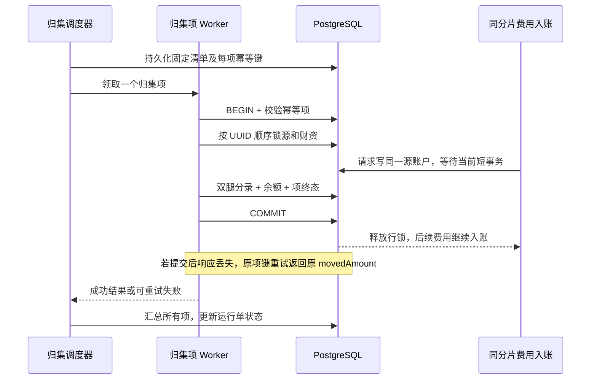

# 热点账户优化：一致性域、资金分片与有界归集

本文以 `ee8ed2c` 中的资金实现为审查基线，补充可执行的优化路径。标为“当前”的内容有代码依据；标为“候选”的协议需要新增代码、迁移和测试，不能当成已经上线的能力。文中的阈值是实验验收门槛，实际吞吐和延迟以隔离环境原始报告为准。

优化目标是降低共享资金行的等待，同时保持账户余额、预占、在途、借贷分录、业务终态和事件的一致性。先找出哪个账户成为共享写点，再选择准入、分片或缩短事务；把线程数、Kafka 分区数、数据库连接数一起调大，无法消除同一余额行的串行约束。

## 1. 代码实际具备的能力

| 位置 | 当前事实 | 优化时必须保留或补齐的边界 |
| --- | --- | --- |
| [FeeShardRouter](../../src/main/java/dev/fincore/domain/FeeShardRouter.java) | `shardFor(businessKey)` 做确定性散列，分片数必须是正的 2 的幂；`accountOwner` 生成 `SYSTEM_FEE_00` 等标识 | 扩容会改变路由；目前没有映射版本或迁移协议 |
| [FeeAggregationService](../../src/main/java/dev/fincore/application/FeeAggregationService.java) 的 `ensureShards/route` | 创建正式手续费账户；按调用方给出的 `asset/count/businessKey` 查询账户 | `count` 由调用者传入，不是受版本管理的服务端权威配置；创建更多分片不会删除旧分片 |
| [FeeController](../../src/main/java/dev/fincore/web/FeeController.java) 的 `/api/fees/route` | 调用 `fees.route`，返回应使用的账户 | 这是辅助路由 API，不会拦截、改写或校验每一笔结算的费用账户 |
| [SettlementController](../../src/main/java/dev/fincore/web/SettlementController.java) 与 [SettlementService](../../src/main/java/dev/fincore/application/SettlementService.java) | 请求携带 `feeAccountId`；经 Kafka 后，事务直接锁定并写入该账户 | 资金事务没有调用 `FeeShardRouter`，也没有校验费用账户符合某一分片映射；不能宣称自动强制分片 |
| [LabScenarioService](../../src/main/java/dev/fincore/application/LabScenarioService.java) | 综合演示用 `shards.get(i)` 手动选择费用账户，再调用归集 | 演示覆盖手动分散入账，不是线上强制路由证明；模拟器和 [CoreVerification](../../scripts/CoreVerification.java) 的路由断言也不代表真实数据库性能 |
| [SettlementListener](../../src/main/java/dev/fincore/messaging/SettlementListener.java) | 普通结算按付款账户派生 Worker 分片；现货交割按买方计价资产账户派生分片 | HTTP 生产者当前使用 `businessKey` 作为 Kafka key；消息分区与 Worker 分片不是同一个规则，现有结构不能证明每个账户只有一个写线程 |
| [SpotFundsService](../../src/main/java/dev/fincore/application/SpotFundsService.java) 与 [SpotDeliveryService](../../src/main/java/dev/fincore/application/SpotDeliveryService.java) | 多币对预占仍锁同一资产账户；交割在单事务中锁四个账户并处理两种资产 | 按交易对分 Lane 不会分离共享的 USDT 余额；按买方路由也不能消除共享卖方或收款方热点 |
| [FeeAggregationService.aggregate](../../src/main/java/dev/fincore/application/FeeAggregationService.java) | 枚举某资产的全部手续费分片，加上财资账户，排序去重后逐一 `FOR UPDATE`，全部持锁至提交 | 先锁全部，再过滤非零余额；零余额分片也加锁。异步归集仍会阻塞前台费用入账，且多归集任务仍竞争同一个财资账户 |
| [DerivativesLabService](../../src/main/java/dev/fincore/application/DerivativesLabService.java) | `applyFunding/reduceOnly/topUp` 都通过 `lockPair` 锁用户模拟账户和公共池 | 所有请求复用同一池时会串行；这是 `lab` 独立资产域，不是生产清算池，也没有交易所全体多空净额结算 |

另一个可验证的小热点是：`SettlementService.lockAccounts` 即使 `fee=0` 也锁 `feeAccountId`。候选优化可在验证费用账户的要求不变、补偿兼容的前提下，跳过不产生资金效果的费用行锁；需要先写“零费率并发仍争同一费用账户”的测试，再修改资金路径。

## 2. 按一致性域识别四类热点

一致性域是“必须一起判断和提交的资金状态”。当前现货以 `account_id` 为最小余额行，它对应 `(owner_id, asset, account_type)` 唯一账户，而不是 `(user, symbol)`。模型和约束见 [V1](../../src/main/resources/db/migration/V1__baseline.sql)、[V8](../../src/main/resources/db/migration/V8__spot_funds_delivery.sql)。

| 热点 | 为什么变热 | 优先方案 | 不成立的捷径 |
| --- | --- | --- | --- |
| 公共手续费账户 | 大量不同用户、不同订单都向同一收入行记账 | 按资产建立正式子账户，按稳定业务键分散收入，后台有界归集 | 只增加消费者；先累加 Redis、稍后补账却仍返回结算成功 |
| 超级用户跨币对交易 | BTC-USDT、ETH-USDT 等争用同一个用户 USDT 可用余额 | 账户资产维度准入，限制同一账户在途任务；确需并行时使用预分配且有账本依据的预算 | 给每个交易对复制一份“完整可用余额” |
| 公共清算池/资金费池 | 多个用户独立操作，但都借记或贷记同一池 | 按独立资金责任域设有资金支持的子池；共同风险额度仍有总量约束 | 将同一池余额复制 N 份；把实验池当保险基金 |
| 财资归集账户及大归集事务 | 全分片扫描锁和财资行构成第二个共享点 | 单分片或有限小批次归集、限频、轮转、公平性监控 | 将全分片大事务放到后台后就认为前台不会受影响 |

需要始终成立的等式：

```text
现货可用余额 = balance - reserved_balance - pending_debit >= 0
订单 initial_amount = held + pending + settled + released
同一资产、同一账本事务：Σ DEBIT = Σ CREDIT
手续费系统总余额 = 各正式手续费分片余额 + 财资余额
内部归集前后：手续费系统总余额不变
```

最后两个等式的比较必须扣除窗口内新入账、退款及外部财资流出；不能把并发窗口两次裸 `SUM` 的差值直接判为丢钱。按事务账本和窗口起止水位解释所有变化。衍生品实验允许已发生亏损暴露负权益，其独立规则见 [V7](../../src/main/resources/db/migration/V7__derivatives_lab.sql)，不能套用现货非负余额断言。

## 3. 先形成热点证据，再决定分片数

第一步，在隔离数据库记录源码版本、CPU 配额、PostgreSQL/Kafka/JDK 版本、连接池、消费者数、消息分区、账户数量、热点占比、收费规则和随机种子。给每组请求固定金额，用 `BigDecimal` 或十进制定点整数生成，避免输入精度差异掩盖结果。

第二步，收集每笔请求的接入时间、Broker 确认时间、观测到数据库终态时间；统计业务成功、失败、未知、重复效果、排队长度和恢复耗时。202 只是接收回执。当前对照工具轮询终态获得的是完成时延上界，包含查询间隔，不能写成数据库提交本身的精确延迟。

第三步，采样阻塞关系，区分“连接池等不到连接”和“已经拿到连接、正在等账户锁”。下面查询只读取观测数据，建议在隔离环境每秒采样，并随报告保存时间戳：

```sql
SELECT clock_timestamp() AS sampled_at, pid, application_name,
       wait_event_type, wait_event,
       clock_timestamp() - xact_start AS transaction_age,
       pg_blocking_pids(pid) AS blockers,
       left(query, 160) AS query_sample
FROM pg_stat_activity
WHERE datname = current_database()
  AND pid <> pg_backend_pid()
  AND (wait_event_type = 'Lock' OR cardinality(pg_blocking_pids(pid)) > 0)
ORDER BY xact_start NULLS LAST;
```

参数化 SQL 的采样一般不能直接告诉你具体账户 UUID。将业务侧低频 Top-K 账户摘要、事务 trace、请求清单和阻塞时间关联；不要把全量 `accountId/businessKey` 作为 Prometheus 标签。候选指标可按 `account_type/asset/operation` 有限维度聚合账户锁等待和持锁时长，Top-K 另存抽样诊断文件。这些账户级锁时长指标目前需要补埋点，现有消费者总耗时不能直接替代。

第四步，对同一费用分片统计成功订单数和手续费总额，检查路由是否真的分散。分片数相同并不保证每个分片流量相同：

```sql
SELECT o.asset, o.fee_account_id, count(*) AS successful_orders,
       sum(o.fee) AS fee_amount
FROM settlement_order o
WHERE o.status = 'SUCCESS'
  AND o.asset = '替换为本轮独立实验资产'
GROUP BY o.asset, o.fee_account_id
ORDER BY successful_orders DESC;
```

PostgreSQL 的行锁会阻止冲突的资金更新，并通常保留到事务结束。这里的“全局热点”指同资产业务共享的行及锁集合，不表示执行了全表排他锁。实际锁行为以 [PostgreSQL 16 行锁与死锁说明](https://www.postgresql.org/docs/16/explicit-locking.html) 为依据。

## 4. 手续费分片：先完成端到端接入，再谈扩容

当前可运行的调用链是：


可以在已启动的独立本地实验服务中，先创建分片并查询某业务键的费用账户。以下接口会写实验数据，仅用于隔离环境；不能把共享环境的真实资产拿来初始化或归集：

```bash
curl --fail-with-body -X POST 'http://127.0.0.1:8080/api/fees/shards?asset=HOTLAB01&count=16'
curl --fail-with-body --get 'http://127.0.0.1:8080/api/fees/route' \
  --data-urlencode 'asset=HOTLAB01' \
  --data-urlencode 'count=16' \
  --data-urlencode 'businessKey=hotlab-01-order-001'
```

正式接入候选应按以下顺序实施：

1. 定义费用责任域和稳定业务键，例如 `settlement:<businessKey>:<feeAsset>:<feeKind>`。同一资金效果重复投递时键不变；不能用每次生成的新 `messageId` 来选分片。
2. 增加服务端费用映射配置，至少包含 `asset、mappingVersion、shardCount、hashAlgorithm、state`，并建立映射内分片到正式账户的唯一关系。新映射账户 ID 和 owner 应包含版本；现有 UUID 只由资产和分片编号生成，不能直接冒充版本化账户。
3. 新请求先由受信服务解析费用政策，在持久化请求事实或结算单时固化 `mappingVersion、feeShardId、feeAccountId`。重放先查既有业务事实，不能按“最新配置”重算历史路由。缓存配置只能缓存已发布的不可变版本。
4. 把 `FeeShardRouter` 接到实际资金路径的参数验证前段；校验所选费用账户资产、类型和映射归属。HTTP 调用者给出的账户仅作兼容输入或校验对象，最终决定不能任意由外部覆盖。如何保留旧 API 由接口兼容迁移说明明确。
5. 保留数据库 `business_key`、账本业务键、Inbox 唯一约束。补充“同业务键换金额、换资产、换费用账户”冲突测试；冲突应返回原事实或明确拒绝，绝不按新路由再记一遍。当前通用结算只返回已有结果，不具备完整的请求指纹校验协议。
6. 从 `1、4、16、64` 分片选择实验候选，保持付款和收款分布相同，只改变费用账户。以锁等待、终态吞吐及尾延迟决定是否增加分片，不能把散列计算 O(1) 当成结算吞吐证明。

分片表仍在同一个 PostgreSQL 中时，主要收益是把同一账户行锁拆开。WAL、提交、磁盘、连接池仍共享；因此 16 个账户不等于 16 倍容量。若压测使用一个共同付款账户或共同收款账户，可能完全遮住手续费分片的收益，必须分别测试。

## 5. 超级账户：单写者和有界准入的可实现边界

当前撮合执行器 [StripedTaskExecutor](../../src/main/java/dev/fincore/infrastructure/concurrent/StripedTaskExecutor.java) 按交易对串行、有界排队。它不是账户执行器；两个币对可同时进入 `SpotFundsService.capture`，然后在同一 USDT 账户行串行。当前 [concurrentSymbolsShareOneBudget](../../src/test/java/dev/fincore/SpotFundsIntegrationTest.java) 已表达跨币对不重复花费这一正确性要求。

第一阶段保留数据库事务作为唯一资金裁决者，增加账户资产维度准入，目标是让等待发生在可观测的有界入口，而不是占住所有数据库连接：

1. 对新下单或转账确定 `fundingAccountId`，在开启资金事务前进行准入；按账户维护有限 pending 数，另外限制实例总队列和并发账户数。可先实验 `每热账户 32、128` 个等待任务，不写死成最佳值。
2. 热账户达到上限时，新请求明确返回“未接纳”或“结果未知需查询”，保留原业务键重试；不能先返回成功再丢队列。已得到 Kafka 确认的任务继续保留在持久队列，消费暂停或退避，不得丢弃并提交 offset。
3. 准入拒绝率、账户队列等待和正常账户 P99 一起观察。为冷账户留出预算，避免一个大户把全局队列塞满。限流只是控制资源占用，不改变资金是否充足的判断。
4. 若引入账户 Lane，事务必须在执行 Lane 的线程中由 Spring 代理开启，不能在 Web 线程先开事务，再把同一个连接或事务上下文跨线程传递。
5. 需要跨实例顺序时，统一“逻辑资金分片 → Kafka 分区 → Worker Lease”映射；固定版本并在 rebalance 撤销时排空。当前仅让相同 payer 派生相同 Fence，不保证相同账户被同一线程顺序执行。
6. 每笔资金操作仍在数据库事务内部检验 Fence、锁余额并执行条件更新。共享 Lease `FOR SHARE` 校验允许同一 owner 多事务并行，不是互斥的单写线程锁。[WorkerLeaseManager](../../src/main/java/dev/fincore/application/WorkerLeaseManager.java) 的缓存仅减少续期，不能作为资金授权。

Kafka 只提供分区内的顺序基础。把 key 换成账户后，还要检查两类 Topic、补偿、撤单、归集和内部调用是否访问相同余额；仅修改一个 Producer 的 key 不能宣布所有资金写入已经串行。[Kafka 设计文档](https://kafka.apache.org/41/design/design/) 描述了分区及消费语义，具体账户路由是本项目需要补齐的协议。

对于 `A → B` 与 `C → B`，按付款方排队仍会竞争 B；现货四腿交割还同时涉及两种资产。第一阶段称为“付款账户准入 + 数据库多账户原子提交”更准确。若要覆盖所有参与账户的单写者，需要一个有界调度器按完整账户集合原子获得执行资格，跨实例还需协调归属；不要让 A 的 Lane 同步等待 B 的 Lane，再让 B 反向等待 A。该复杂度高于目前需求，应先用确定锁序与有界并发验证收益。

第二阶段仅在单一超级账户确实饱和且业务接受资金隔离时，再引入预算分桶：总账户通过正式转账向各业务子账户预拨预算，每个桶只能花自己的预算。桶间再平衡必须有唯一调拨单和双边分录；所有桶可用预算之和不能超过已划拨资金。当前 `(owner_id, asset, account_type)` 唯一键及现货 `accountId(owner,asset)` 查询只支持一个 TRADING 账户，因此要新增子账户身份、路由与对账模型，不能直接把现有 `account` 表多插 N 行当完成。

## 6. 公共清算池：分片必须伴随责任和流动性

当前可定位的公共池例子在 [DerivativesLabService](../../src/main/java/dev/fincore/application/DerivativesLabService.java)：资金费、平仓盈亏、追加资金都锁用户和池。重复资金费甚至在读取业务重放结果之前先锁池，因此“重复风暴”也是独立测试项。这个实验域没有币种字段和全仓净额清算，不应包装成现货财资能力。

可行演进顺序：

1. 先对不同用户、同一池与不同池运行同样数量的操作，确认池锁占据主要等待；使用固定周期快照，业务幂等键保持 `account + symbol + cycle`，不能按投递消息号重复收费。
2. 依据资产、结算责任、周期及流动性预算定义子池。每个子池都要有独立期初事实或正式拨付分录，明确允许支付的义务和最大敞口；合约或币对数量不是可以凭空复制资金的理由。
3. 每笔用户结算与一个被固化的子池原子记双腿账，不在资金事务里等待所有子池汇总。子池余额不足时进入明确的待补资/失败业务状态，不能从其他子池未确认的余额透支。
4. 子池调拨走独立幂等转账，所有参与账户使用同一锁顺序；每周期核对用户费用净额、子池净变化、调拨和已知差额。若做净额结算，需要冻结周期输入、逐笔义务可追溯、舍入差额规则和重跑唯一性。
5. 先在 `lab` 域验证故障和会计等式。生产清算或保险基金需要额外的业务责任定义；本节不把实验池改名后当成已具备这些能力。

## 7. 归集优化：从全部持锁改为有界资金搬运

当前 `aggregate` 的持锁集合为 `所有 SYSTEM_FEE_SHARD(asset) + treasury`。固定 UUID 顺序降低账户锁环，但无法缩短持锁窗口；分片越多，枚举行、锁请求、逐分片扣款都越多。即便大多数余额为零，仍先锁住全部账户。多个归集键并发时，还会被相同财资行重新串行。当前重复 `aggregationKey` 直接返回已存结果，没有比较本次传入资产和目标账户，因此新协议还需要请求指纹冲突校验。

首个候选版本采用“一笔归集项处理一个费用分片”，维持同一数据库事务和同步双腿入账，避免引入跨库资金在途协议：

| 对象 | 候选持久化信息 | 必须满足 |
| --- | --- | --- |
| 归集运行单 | `runId, asset, mappingVersion, cutoff, state` | 运行单枚举固定候选清单，状态能解释部分完成；不宣称一个时刻全分片快照 |
| 归集项 | `runId, sourceAccountId, targetAccountId, ordinal, status, movedAmount` | 唯一 `(runId, sourceAccountId, ordinal)`；相同键不同参数拒绝 |
| 分录业务键 | 包含固定运行单和归集项标识 | 同一项重试只有一个资金效果 |
| 调度状态 | `nextAttemptAt, attempts, lastError` | 失败可恢复；队列和并发数有上限 |

处理步骤：

1. 小批量领取归集**任务行**，选出的任务 ID 持久化。可以用 `SKIP LOCKED` 协作领取任务，但不能把跳过账户资金行解释为已处理完全部资金。
2. 开始归集项事务，校验资产、来源类型、目标类型、映射版本和请求指纹；查询已成功项时直接返回原结果。源与目标按 `UuidOrder` 排序后加锁，不能总是先锁源再锁目标。
3. 在锁内读取最新可搬金额。若预留退款缓冲，按明确规则计算 `max(可搬余额 - 缓冲, 0)`；不得搬走预占、在途或冻结资金。零金额也保存这一归集项结果，后续新入账由下一运行单处理。
4. 同一事务写双腿平衡分录、扣源、加目标、归集项 SUCCESS；若需要对外事件，Outbox 也放进该事务。任一更新受影响行数不符则整体回滚。
5. 一项提交后才处理下一项。财资方向初始限制为单个归集 Worker，防止大量 Worker 持有不同源账户锁后全挤在财资行；按分片轮转，不让高收入分片永久占据所有批次。
6. 最后由运行单聚合所有归集项。`COMPLETED` 表示固定清单中的任务完成，汇总金额为已提交分录金额之和，不代表所有分片此刻余额为零。
7. 若一财资行仍成为后台吞吐瓶颈，再评估中间财资子账户及分层汇总；需要额外账户、审计和调拨成本，先证明当前限频单 Worker 无法满足归集时限。

`SKIP LOCKED` 会给出不完整视图，适合队列领取而非通用资金汇总，这是 [PostgreSQL SELECT 锁子句](https://www.postgresql.org/docs/16/sql-select.html) 明确提示的边界。若允许跳过繁忙资金源，必须保留待办、最大跳过年龄和再次调度，不能直接把运行单标为成功。



该图是候选协议，当前 `FeeAggregationService` 尚未实现归集项、限批和调度恢复。

需要同时处理退款流动性：当前 [CompensationService](../../src/main/java/dev/fincore/application/CompensationService.java) 从原费用账户反向扣回手续费。若手续费已全部归集，原账户余额不足时补偿会失败并要求人工审核。优化归集不能忽略这一依赖。候选方案是在费用源保留经过业务批准的退款缓冲，或先以独立幂等转账从财资回补原账户，再执行原补偿。回补失败不能假称退款成功；不得篡改原费用分录或临时把补偿费用账户替换成最新映射。

## 8. 版本迁移：扩容与重试必须一起设计

直接把 `count=16` 改成 `32` 会让一部分旧业务键改写新分片。当前 `ensureShards` 只增加缺失账户，`findFeeShardIds` 又按资产查询全部历史分片，没有 ACTIVE/RETIRED 版本选择。因此扩容不能只改一个环境变量或 API 参数。

候选迁移分为以下可审查阶段：

1. **准备**：先上线兼容读代码和新表结构，历史单补充明确的 legacy 映射标识；创建 `v2` 正式账户，验证零期初和唯一约束。旧版本仍接收新业务。
2. **发布**：新接收请求用一个原子切换点选择 `v2`，在业务事实持久化时固化版本和账户。已持久化 `v1` 请求继续用 `v1`；客户端重试不自行选择版本。
3. **双版本读取、单次记账**：同时接受两代合法业务事实，决策仍由原 `businessKey` 唯一性约束。不能同一费用同时写两代正式余额；镜像比对只能写无资金效果的诊断数据。
4. **排空**：监控 `v1` 未完成请求、Kafka/Outbox 积压、回补及补偿窗口。所谓排空应依据业务事实及水位，不是等待固定几分钟。
5. **旧账户搬运**：以版本化归集项转移可搬资金，保留退款缓冲或回补路径。跨版本汇总对账，保存旧路由和账户永久可追溯。
6. **停写与回滚**：仅关闭 `v1` 新业务接纳，不删除历史账户和分录。出现资金差异时暂停 `v2` 新请求并冻结差异审查，已接受 `v2` 单仍按其固化路由处理；回退接纳配置不等于把在途单重新 hash 到 `v1`。

失败用例必须包括：发布新配置后旧消息重放、提交成功但响应丢失、同键不同金额、归集提交后一方崩溃、归集与新费用入账并发、迁移后原交易补偿。所有断言以唯一业务效果、余额守恒和不可变原事实为准。

## 9. 双账户死锁与隐藏的共享锁

当前 [UuidOrder](../../src/main/java/dev/fincore/domain/UuidOrder.java) 按 UUID 的两个无符号 64 位分量建立统一顺序。通用结算、补偿、现货交割、归集和实验池转账都应复用它；同一账户出现在多腿时先去重。对于 `A→B` 和 `B→A`，两笔事务都先锁较小 UUID，再锁较大 UUID，而不是各自先锁付款方。

账户排序只覆盖“账户行之间”的顺序，不能据此宣称所有死锁都被消除。当前调用还有如下前置资源：

| 资金路径 | 当前关键锁顺序 | 需要验证的交叉点 |
| --- | --- | --- |
| 通用结算 | Inbox → Lease 共享校验 → 业务单 → 账户 UUID 集合 | 重复键等待、共享费用/收款账户；新增操作不能持账户锁反向获取已被别的资金路径持有的业务锁 |
| 现货预占/成交捕获 | 撮合交易对锁及订单处理 → 账户 UUID 集合 → 预占增量变更 | 同一大户跨币对、一次吃单涉及多个 Maker；事务 SQL 数随成交量增加 |
| 现货交割 | Lease 共享校验 → 交割行 → Inbox → 四账户 UUID 集合 → 预占变更 | 两笔不同成交共享 Maker 预占或收款账户；与撮合、撤单并发 |
| 手续费归集 | 归集业务键 → 全部费用账户及财资 UUID 集合 | 财资共享行，空分片锁，归集期间的前台等待 |
| Lease 续期/接管 | Lease 独占更新 | 数据面长事务持 `FOR SHARE` 会延迟续期或接管；它不是账户锁但仍会影响恢复 |

修改前应逐函数画出实际锁图，尤其禁止新增“持账户锁后续期 Lease”的反向依赖。当前现货交割提交前再次验 Fence，普通结算没有对应的第二次校验；不要把前者能力概括成所有结算都如此。

验收时并发执行 A→B、B→A、对应补偿、交割、归集和 Lease 接管，保存阻塞图。若出现数据库死锁，整个事务回滚，以原业务键有界重试并带抖动；错误不得转换成 SUCCESS。锁超时、事务超时和重试预算的设置先由单项实验验证，不能拿无限重试遮住持续热点。

## 10. 缓存只加速读，不拥有可花预算

| 数据 | 可采用的缓存 | 写入权威和失效条件 |
| --- | --- | --- |
| 已发布的版本化费用映射 | JVM 只读快照，按版本缓存 | 数据库配置及已固化业务事实；版本发布后不可原地改含义 |
| 账户展示余额、手续费统计 | 带版本/更新时间的查询缓存或读模型 | PostgreSQL 提交及 Outbox 事件驱动刷新；允许展示延迟时必须说明时间口径 |
| 可用余额、预占、在途 | 可用快照做预检查，最终事务再次判断 | [LedgerMapper.debit](../../src/main/java/dev/fincore/infrastructure/persistence/mapper/LedgerMapper.java) 条件扣款和 [SpotFundsMapper](../../src/main/java/dev/fincore/infrastructure/persistence/mapper/SpotFundsMapper.java) 数据库约束 |
| Worker Lease | 当前已有短期缓存 | [ShardLeaseMapper](../../src/main/java/dev/fincore/infrastructure/persistence/mapper/ShardLeaseMapper.java) 事务内共享锁及 owner/epoch/state/期限检查 |

不能用 Redis/JVM 的加减结果作为结算成功依据，也不能先确认 Kafka offset 再异步补余额和账本。当前费用 route API 返回的 `balance` 只是查询快照，不是本次结算的金额授权。数据库只读副本的延迟也不能拿来裁决当前可花预算。

## 11. 对照实验与可核查验收

仓库提供 [settlement-comparison.mjs](../../scripts/performance/settlement-comparison.mjs) 对照工具及其 [参数/统计测试](../../scripts/performance/settlement-comparison.test.mjs)，完整用法见 [工具说明](../../scripts/performance/README.md)。默认只生成计划，不发网络请求；真实运行需要显式 `--run --confirm-isolated` 并使用带端口的 `127.0.0.1` 地址。它创建新的合成资产和实验账户，不执行自动归集，不连接真实钱包。

```bash
node scripts/performance/settlement-comparison.mjs
node --test scripts/performance/settlement-comparison.test.mjs
```

确认 `127.0.0.1:18080` 指向本轮独立本地实验栈后，以下命令执行第一组；再以相同参数将 `--scenario` 改为另外两组。工具固定每笔金额 10、费用 1，以整数合成资产减少实验输入差异：

```bash
node scripts/performance/settlement-comparison.mjs \
  --scenario shared-fee --count 64 --concurrency 4 \
  --deadline-ms 60000 --poll-ms 200 \
  --base-url http://127.0.0.1:18080 --run --confirm-isolated
```

三组已有工具场景的账户分布：

| 场景 | 付款方 | 收款方 | 手续费账户 | 能回答的问题 |
| --- | --- | --- | --- | --- |
| `shared-fee` | 每笔不同 | 每笔不同 | 1 个 | 共同费用行的影响 |
| `sharded-fee` | 每笔不同 | 每笔不同 | 16 个 | 相同账户分布下费用分片的差异 |
| `hot-payer` | 1 个共同付款方 | 每笔不同 | 16 个 | 费用已分散时，单一付款行是否主导 |

工具先调用 route API 固定 `feeAccountId`，再走原 Kafka 结算入口，并核验各账户余额与账本。它采用有界闭环并发；得到的是该并发预算下的完成吞吐，不是固定到达率下的容量上限。默认 64 笔只适合快速验证链路，P99 几乎受最慢样本支配；报告中的低样本提示必须保留，不能据此给出稳定容量结论。若轮询未知、失败或账本不平，不能只剔除失败样本后输出漂亮 P99。测压端的 CPU、连接数和轮询负担也应记录。

完整优化验收还需逐步补齐以下实验；下表是待实现的场景清单，不能因前三组跑通就标为已完成：

| 扩展试验 | 保持不变与唯一变量 | 验收证据 |
| --- | --- | --- |
| 共享收款方 | 与 `sharded-fee` 同参数，仅 payee 改为固定 | 收款账户等待是否成为主导，避免只优化付款方 |
| 超级用户跨币对 | 同一 USDT 预算，两币对并发；先无限制基线，再账户准入 | 不能超卖，冷账户 P99、热账户拒绝率和队列上限同时展示 |
| 原归集与持续收费 | 16 个费用分片，固定收费负载，每轮只加入一次原 `aggregate` | 归集时间窗内的前台 P95/P99、持锁时间、余额与分录守恒 |
| 有界归集候选 | 相同固定请求清单，比较全锁/每项 1 源/有限小批次 | 前台尾延迟、归集完成时间、公平性、崩溃恢复，无重复搬款 |
| 公共模拟池 | 相同用户和周期快照，1 池与有预算的多子池 | 双腿账本、池变化、重复周期及池不足语义 |
| 扩容重试 | v1 产生并留存请求，切 v2 后重放 v1 并制造响应丢失 | 同一业务仅一次效果、历史映射不变 |
| 归集后补偿 | 原订单收费后归集，再补偿 | 当前不足路径明确失败；候选回补和补偿合计守恒且可恢复 |
| 反向转账与故障 | A→B 与 B→A 并发，混合退款、Lease 接管 | 无账户锁序环，旧 Epoch 不产生资金效果，异常无部分提交 |

推荐实验协议：每组预热 30 秒、测量 180 秒、独立重复 3 次；有限笔数工具的快速演示报告则记录实际笔数和运行时间，不伪称持续稳态。每轮用独立资产/数据集，固定全部配置和请求种子，只改一个变量。性能改进假设可预注册为“相同成功率下，热点阶段 P99 降低至少 20%，或同一延迟预算下终态吞吐提高至少 20%”，这只是待测目标；若不达标，应记录瓶颈转移、额外锁或噪声，而不是把目标写成成果。

必须先过的正确性门槛：余额/分桶差异为 0、每业务资金效果恰好 1 次、重复归集项搬运 0 次、过期 Worker 新增资金效果 0 次、全部已接受任务最终有可解释终态或明确未完成清单。队列必须不超过配置容量；准入拒绝不是结算成功。归集的流动性 SLA 与前台时延预算一起给出，否则“前台变快”可能只是归集永远没有完成。

## 12. 测试边界、实施顺序与交付物

可先运行已有相关测试，具体结果以本次执行日志为准：

```bash
./mvnw -Dtest=ShardRouterTest,UuidOrderTest,WorkerLeaseManagerTest test
./mvnw -Dtest=FeeAggregationIntegrationTest,SettlementIntegrationTest,SpotFundsIntegrationTest test
./mvnw -Dtest=SpotDeliveryKafkaIntegrationTest test
```

后两行需要可用的容器环境；相关 Testcontainers 测试配置了 `disabledWithoutDocker=true`，跳过不等于通过真实数据库或 Kafka 验证。当前 `FeeAggregationIntegrationTest` 实际只有 `concurrentShardProvisioningIsIdempotentAcrossTransactions`，验证 16 个并发创建者只得到一组分片；类注释提到归集不代表已有完整并发归集测试。

本次补充的 [ShardRouterTest](../../src/test/java/dev/fincore/domain/ShardRouterTest.java) 验证费用路由在新实例及重投时稳定、各合法分片规模输出不越界、既有 null/空白输入和非法分片数拒绝契约，以及 4096 个固定成交风格键的分片覆盖。分布断言只检查所有 16 个分片都有样本且单分片不吸收超过四分之一的样本，不要求精确均匀，也不证明真实流量或数据库吞吐收益。版本化映射迁移与真实并发归集仍需单独实现和验证。

2026-09-20 使用 JDK 21、Maven 3.9.11 对 `ShardRouterTest` 执行定向 JUnit 验证，结果为 6 项、0 失败、0 错误、0 跳过，退出码 0；这次运行没有启动 Docker、数据库或 Kafka。

实施时每一步都留一个可审查产物：

1. **现状记录**：提交号、调用图、上述三组对照、账户/账本核验、阻塞样本；确认主要共享行。
2. **费用强制路由**：映射契约和迁移文件、固化路由事实、真实结算入口集成、同键冲突与重放测试；验证客户端不能绕过规则。
3. **账户准入**：有界队列和并发预算、拒绝/未知语义、冷账户隔离、单账户过载恢复测试；不改数据库最终资金权威。
4. **有界归集**：运行单/项状态机、单项事务、退款缓冲或回补策略、崩溃点测试、前台与后台共同验收报告。
5. **按证据扩展**：仅在公共池或超级账户仍主导时，增加有资金支持的子账户/子池；每个新域提供守恒证明、幂等键与重放测试。
6. **灰度与回退演练**：新映射只接少量独立测试业务；对比版本间结果。异常时停止新版本接纳，保留已接收事实按原版本处理；资金差异冻结审核，历史账本只能用反向分录纠正。

完成标准是能够从原始请求、路由版本、数据库终态、不可变分录和性能报告逐项复核“为什么更快，以及失败时资金去了哪里”。在这个标准下，散列路由、数据库锁序、跨币对预算、归集流动性、幂等迁移和容量验收共同构成可展示的工程深度。
