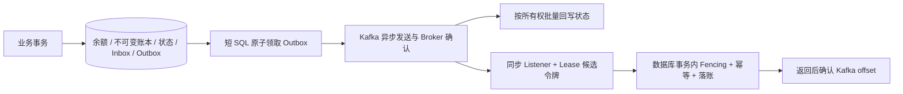

# 中间件优化：从消息积压、数据库等待到可恢复的吞吐

本文把 PostgreSQL、HikariCP、MyBatis、Kafka 和事务 Outbox 作为一条完整链路分析：先确认时间花在哪里，再调整批次、连接和消费者预算，最后用资金不变量与故障恢复验证优化有效。工程重点是解释瓶颈、保留金融正确性、给出可复验的证据。

核对基线为 `ee8ed2c`。下表是源码与配置事实，文中的候选参数、持续压测和故障补测属于后续实验方案；本次文档补充没有运行新的中间件容量实验，也没有修改线上配置。现有有限样本测试及历史恢复证据见[容量与恢复证据](../recovery-capacity-evidence.md)。

## 1. 当前系统已经具备什么

| 部件 | 当前实现与参数 | 工程含义与边界 |
| --- | --- | --- |
| Java / Spring / MyBatis | JDK 21、Spring Boot 3.5.16、MyBatis starter 3.0.5 | 版本声明见 [pom.xml](../../pom.xml)；Spring Kafka、Kafka client、HikariCP、pgJDBC 的解析版本由依赖管理决定，不能用 Broker 版本代替客户端版本 |
| 本地基础设施 | Compose 为 PostgreSQL `16.10-alpine`、Kafka `4.1.0`；业务 Topic 各 8 分区、1 副本 | [docker-compose.yml](../../docker-compose.yml) 是本地实验拓扑，不代表服务器运行版本；单 Broker 无副本切换能力 |
| HikariCP | `maximum-pool-size=minimum-idle=12`；获取连接 1500ms，校验 1000ms，连接最大寿命 1800000ms，keepalive 120000ms | 固定小池给数据库限流；Web、资金事务、Outbox 和后台任务共享该连接预算 |
| MyBatis / pgJDBC | `local-cache-scope=statement`、SQL timeout 30s；`reWriteBatchedInserts=true` | 跨语句不复用一级缓存；当前账本分录已使用多值 INSERT，不能再次把驱动重写开关算成一份已证明的收益 |
| Kafka Producer | `acks=all`、幂等开启、LZ4、`linger.ms=5`、`batch.size=65536`、`max.in.flight.requests.per.connection=5`；`delivery.timeout.ms=120000`、`max.block.ms=1000` | 保留可靠确认，按分区聚合消息；批次大小单位是字节，Outbox 批次单位是事件条数 |
| Kafka Consumer | 自动提交关闭、`ack-mode=record`、`max.poll.records=50`、`max.poll.interval.ms=300000`、`session.timeout.ms=45000` | 同步调用资金事务，成功返回后才允许确认；不是收到消息就确认 |
| 消费者执行资源 | 配置 4，实际为 `min(配置值, JVM 可用处理器数)`；固定平台线程，队列容量 0 | 通用结算与现货交割共用一个 Listener；线程数还受分区分配与业务分片所有权影响 |
| 失败处理 | 1s 固定退避、无限次尝试；异常处理后不确认；首次及每 60 次重试记录日志 | 保留失败命令，代价是相关分区可能持续阻塞；没有自动跳过资金坏消息的策略 |
| Outbox | 每批最多 200 条、任务结束后固定延迟 100ms、整批异步确认等待 15s；调度线程 2 | 一次抢占、并行等待网络确认、分别批量回写成功和失败；100ms 不是端到端延迟承诺 |
| Outbox 回收与重试 | 每 30s 扫描；`PROCESSING` 超过 60s 回到 `PENDING`；失败按指数退避加确定性抖动 | 当前 SQL 使用 `2^min(attempts,8)` 加 0～2s，指数项实际封顶 256s；外层还有 300s 上限 |
| Worker Lease | 8 个业务分片；TTL 30s、提前 10s 续期 | JVM 缓存减少续期写入；每笔资金事务仍验证数据库中的 owner、epoch、状态与有效期 |

参数原文见 [application.yml](../../src/main/resources/application.yml)、[并发配置](../../src/main/java/dev/fincore/infrastructure/concurrent/ConcurrencyConfiguration.java)和[参数校验](../../src/main/java/dev/fincore/infrastructure/concurrent/ConcurrencyProperties.java)。当前依赖及拓扑没有 Redis，因此 Redis 缓存、Lua 扣款或 Redis 分布式锁均不属于已实现内容。

## 2. 优化依赖的事务与投递边界



这里包含不同事件方向：通用结算命令由 Kafka 进入，事务成功再产生结果 Outbox；现货成交先在事务内生成 `SPOT_DVP_REQUESTED` Outbox，再进入 Kafka 交割 Worker。不是所有结果 Topic 都由结算 Listener 消费。

- [SettlementService.settle](../../src/main/java/dev/fincore/application/SettlementService.java) 将 Inbox、资金修改、状态与 Outbox 放在一个显式事务内；[SpotDeliveryService](../../src/main/java/dev/fincore/application/SpotDeliveryService.java)负责双资产交割。
- [OutboxMapper.claimBatch](../../src/main/java/dev/fincore/infrastructure/persistence/mapper/OutboxMapper.java) 用单条 `UPDATE … RETURNING` 和 `FOR UPDATE SKIP LOCKED` 领取记录；网络发送不包在资金长事务中。
- [OutboxPublisher](../../src/main/java/dev/fincore/messaging/OutboxPublisher.java) 只把已确认事件标为 `PUBLISHED`；明确失败释放重试，未知结果保留 `PROCESSING` 等待恢复。
- [SettlementListener.onCommand](../../src/main/java/dev/fincore/messaging/SettlementListener.java) 同步处理，异常交回容器；[WorkerLeaseManager](../../src/main/java/dev/fincore/application/WorkerLeaseManager.java) 的缓存只减少控制面访问。

Kafka 幂等 Producer 解决其自身重试范围内的重复，不消除 Outbox 在崩溃后重新发送产生的重复业务通知。协议目标仍是至少一次投递、唯一业务资金效果，见 [Inbox / Outbox ADR](../adr/0002-inbox-outbox.md)。`SKIP LOCKED` 适合并行领取队列任务，不适合用来跳过被锁住的余额参与方；其视图不完整的语义见 [PostgreSQL 16 SELECT 文档](https://www.postgresql.org/docs/16/sql-select.html#SQL-FOR-UPDATE-SHARE)。

## 3. 先固定实验口径

### 3.1 每次实验必须留存的材料

每轮记录 commit、解析依赖版本、JDK、CPU / 内存配额、磁盘类型、Broker 与数据库镜像摘要、Topic 配置、实际消费者分配、连接池参数、数据规模和账户/分区倾斜比例。公开报告只保存这些允许公开的字段，不保存带密码的完整环境或连接串。

```bash
git rev-parse HEAD
java -version
./mvnw --batch-mode dependency:tree \
  -Dincludes=org.springframework.kafka:spring-kafka,org.apache.kafka:kafka-clients,com.zaxxer:HikariCP,org.postgresql:postgresql,org.mybatis:mybatis
```

基线和候选版本使用相同数据快照与负载种子；独立预热 2 分钟，正式采样至少 10 分钟，交替运行至少 3 轮。该时长是建议实验协议，不是仓库已有测试的默认时长。所有故障注入只在本轮新建的隔离容器里执行。

已有 [SpotDeliveryKafkaIntegrationTest](../../src/test/java/dev/fincore/SpotDeliveryKafkaIntegrationTest.java) 的 16 并发 / 64 市场 / 128 张订单 / 64 笔交割适合先做正确性基线。它是有限样本，不能直接证明 10 分钟持续吞吐；现有 [performance lab](../../scripts/performance/run-performance-lab.sh) 和 [matching-hot-symbol.js](../../scripts/load/matching-hot-symbol.js) 侧重撮合入口，也不能替代结算完成速率测试。

### 3.2 同一时间窗看四层数据

| 层级 | 已有观测入口 | 需要补采的内容 |
| --- | --- | --- |
| 入口 | HTTP 延迟、失败/拒绝、撮合队列深度和等待 | 负载器发出速率、未发送/超时数量；持续实验要避免客户端等待变慢掩盖排队 |
| 消息 | `fincore.outbox.ready.backlog`、claimed / published / failed / uncertain、`fincore.outbox.publish.batch` | Outbox 最老未发布年龄、各状态积压；每个 Kafka 分区 Lag、最老消息年龄、rebalance 次数、发送延迟与缓冲池等待 |
| 数据库 | Hikari active / pending、PostgreSQL 系统视图 | 连接获取/占用时长、SQL 调用次数和耗时、锁阻塞者、WAL 字节差值、磁盘等待、死元组与 autovacuum |
| 业务结果 | 数据库终态、账本与余额对账；消费者 inflight / processing Timer | 从成交/结算受理到数据库终态的端到端 P95/P99、重复投递次数与唯一资金效果 |

9 月 21 日补齐后，`fincore.settlement.consumer.processing` 从 Listener 入口开始，覆盖路由、Lease 获取及事务代理返回（含 COMMIT）；新增 `fincore.settlement.consumer.stage` 分阶段计时。它仍不包含 Broker 排队和 offset 提交，不能标成端到端结算耗时。消费者 `success` 表示处理正常返回，包含幂等重放和业务拒绝；不能当成成功到账。`fincore.settlement.success` 已改为事务提交后递增；指标可能因进程崩溃而漏记，吞吐和资金事实仍以固定时间窗内数据库业务终态去重计数。详见[结算实现记录](settlement-completion.md)。

`ready.backlog` 只统计 `PENDING AND next_attempt_at<=now()`，不包括退避中的 PENDING 和未回收 PROCESSING。不能据此宣称全部消息清空。消费者 processing 与 stage Timer 已补显式直方图配置，并以真实 Prometheus registry scrape 测试核验桶；上线仪表盘仍需核对运行版本与实际暴露的桶，不凭指标名假设配置已部署。

### 3.3 可直接在隔离数据库使用的只读诊断

以下语句使用当前真实表名；先以 10～30s 间隔采样，避免每个请求执行全量 COUNT。监控读数不参与资金授权。

```sql
-- 展示可发送、退避中和处理中三类工作量，而非只看 ready gauge。
SELECT status,
       COUNT(*) AS total,
       COUNT(*) FILTER (
           WHERE status='PENDING' AND next_attempt_at<=now()
       ) AS ready,
       EXTRACT(EPOCH FROM now()-MIN(created_at)) AS oldest_age_seconds,
       MAX(attempts) AS max_attempts
FROM outbox_event
WHERE status <> 'PUBLISHED'
GROUP BY status;

-- 不输出业务 SQL/载荷；找到锁等待、长事务及其阻塞会话。
SELECT pid, application_name, state, wait_event_type, wait_event,
       now()-xact_start AS transaction_age,
       pg_blocking_pids(pid) AS blockers
FROM pg_stat_activity
WHERE datname=current_database() AND pid<>pg_backend_pid()
ORDER BY xact_start NULLS LAST;

-- 同步比较表的更新规模、死元组估计与最近自动清理时间。
SELECT relname, n_live_tup, n_dead_tup, n_tup_ins, n_tup_upd,
       last_autovacuum, last_autoanalyze
FROM pg_stat_user_tables
WHERE relname IN ('account', 'outbox_event', 'shard_lease', 'ledger_entry');

-- 在采样窗首尾读取增量；不主动重置全局统计。
SELECT wal_records, wal_fpi, wal_bytes FROM pg_stat_wal;
SELECT xact_commit, xact_rollback, deadlocks, temp_bytes
FROM pg_stat_database WHERE datname=current_database();
```

视图读取范围受数据库角色权限影响；使用同一角色和采样间隔比较，累计值需相减。统计含义见 [PostgreSQL 16 统计系统](https://www.postgresql.org/docs/16/monitoring-stats.html)。`pg_stat_statements` 未在当前 Compose 显式启用；如果需要 SQL 聚合统计，应在隔离数据库提前配置扩展及 preload 并重启，不能把它当作现成监控。配置要求见[官方扩展说明](https://www.postgresql.org/docs/16/pgstatstatements.html)。

## 4. 场景一：成交成功，但 Outbox 积压与通知延迟持续增长

### 4.1 如何定位

1. 同时画出 Outbox 三类积压、最老年龄、每秒 published、Kafka 发送延迟、数据库抢占 SQL 耗时与 Broker CPU / 磁盘。确认积压是在数据库领取前，还是已经进入 PROCESSING 等待确认。
2. 如果 `PENDING ready` 增长、PROCESSING 很少且 SQL 慢，先查查询计划、表膨胀和调度任务是否被占用；如果 PROCESSING / uncertain 增长且 Kafka request latency 高，先查 Broker、网络与 Producer buffer，不先扩大批次。
3. 对真实待发比例建三组隔离数据：历史 PUBLISHED 为主、即时 PENDING 为主、退避 PENDING 为主。用同一查询和 LIMIT 分析扫描行数、排序、堆访问与 shared read / hit blocks。
4. 观察成功状态回写是否慢于发送。大批 `IN (...)`、频繁状态变化、索引维护、WAL 与 autovacuum 都可能把 Kafka 优化后的压力转移到数据库。

当前有 [V1 状态/时间索引](../../src/main/resources/db/migration/V1__baseline.sql)和 [V5 PENDING 部分索引](../../src/main/resources/db/migration/V5__concurrency_indexes.sql)。V5 的键顺序为 `(next_attempt_at, created_at) INCLUDE(event_id)`；当首列使用范围条件、查询仅 `ORDER BY created_at` 时，不保证消除排序。`FOR UPDATE` 还需要访问并锁定堆元组，不能因 INCLUDE 就宣称抢占过程是 Index Only Scan。

先执行不修改数据的计划检查：

```sql
EXPLAIN (COSTS, VERBOSE)
UPDATE outbox_event
SET status='PROCESSING', claimed_at=now(), publisher_id='isolated-plan-only'
WHERE event_id IN (
    SELECT event_id FROM outbox_event
    WHERE status='PENDING' AND next_attempt_at<=now()
    ORDER BY created_at
    LIMIT 200
    FOR UPDATE SKIP LOCKED
)
RETURNING event_id, aggregate_id, event_type, payload;
```

需要真实耗时时，在只有实验数据的数据库中把同一语句改为 `EXPLAIN (ANALYZE, BUFFERS, WAL)`，放入 `BEGIN` / `ROLLBACK`。`ANALYZE` 会执行语句并取得锁，即使最终回滚仍有执行开销；操作语义见 [PostgreSQL EXPLAIN](https://www.postgresql.org/docs/16/using-explain.html)。只测去掉锁的 SELECT 不足以证明实际领取路径快。

### 4.2 按阶段优化

| 阶段 | 操作 | 本轮要回答的问题 |
| --- | --- | --- |
| A：保持现状建立基线 | 200 条、100ms、15s；保留所有成功/失败/超时样本 | 每秒成功发布、最老年龄和数据库成本分别是多少？ |
| B：只变领取批次 | `FINCORE_OUTBOX_BATCH_SIZE` 依次比较 50、100、200、400；其他参数保持不变 | SQL 往返减少的收益是否超过确认尾延迟、对象与 WAL 成本？ |
| C：只变调度间隔 | 在选定批次下比较 `FINCORE_OUTBOX_DELAY_MS` 的 100、250、500ms | 低流量时减少空轮询是否满足通知时延预算？ |
| D：只变 Producer 批处理 | 独立实验配置比较 16 / 32 / 64KiB，linger 0 / 5 / 10ms；固定消息大小分布和 key 分布 | 每分区实际 batch 大小、request-rate、CPU 与端到端延迟是否同时改善？ |
| E：依据计划改索引 | 候选包括按可用时间领取 `(next_attempt_at, created_at, event_id)`，或保留创建时间优先策略并设计匹配索引；先比较真实分布与公平性 | 选择顺序是否影响长时间退避消息、队首饥饿和排序成本？ |
| F：多 Publisher | 在隔离环境为每实例配置唯一 `FINCORE_WORKER_ID`；只扩 Publisher 前须先拆分角色配置或停用该实验实例的消费者 | 领取是否分散？数据库是否变为瓶颈？同一聚合事件顺序是否仍满足需求？ |

当前应用是混合角色：直接扩整个应用会同时扩大消费者、连接池和调度任务。F 阶段是待实施实验，不存在现成的“仅 Publisher 部署模式”。同一聚合事件跨 Publisher 可被并发领取，SQL RETURNING 也不保证返回顺序；需要严格序列的下游必须引入聚合序列及校验，不能把 Kafka 相同 key 当成跨发布者的完整顺序协议。

Kafka 的 batch 按分区组织，64KiB 是上限而不是每次发送量；8 分区分散的低流量可能始终填不满。LZ4 是否值得要看 CPU 与网络数据，`acks=all`、幂等和 `max.in.flight<=5` 保持不变。参数语义见 [Kafka 4.1 Producer 配置](https://kafka.apache.org/41/configuration/producer-configs/)。

### 4.3 当前超时窗口需要专项补测

15s 是代码提交完整批次后等待 `allOf` 的时间，不是 `publishBatch()` 的硬性总时限。`send()` 在元数据或 buffer 不可用时可能每次阻塞至 `max.block.ms=1000`；200 次串行提交本身就可能远超 15s。单轮 Future 列表有界，但上一轮超时后 Producer 中尚未完成的发送可能与新一轮重叠，因此不能声称全进程始终最多 200 条在途。

60s 抢占回收也短于 Producer 120s 投递超时。可能出现：旧发送仍在等待 → 记录被回收 → 新领取再次发送 → 两次都到达 Broker。当前依赖下游幂等保证唯一资金效果，不能把 PROCESSING 超时等同于发送失败。还需验证同一 `publisherId` 再次领取后的迟到结果：当前所有权条件没有独立 claim generation，不能区分同实例的前后两轮领取。

候选改进是为一次领取增加唯一 token 或 generation，状态回写同时校验该 token；为提交阶段设总预算和全局在途上限；根据真实发送生命周期设计领取续租或回收阈值。三项均须先增加故障测试再改实现，不能单独把等待或回收时间调大就宣布问题解决。

## 5. 场景二：连接池等待上升，增加连接后 P99 更差

### 5.1 用证据区分三种拥塞

| 观测 | 优先假设 | 下一步 |
| --- | --- | --- |
| active 贴近 12、pending 增长；大量会话 `wait_event_type=Lock`，阻塞 PID 相同 | 热账户、长事务或 Lease/归集锁竞争 | 查阻塞链与事务持续时间，转入[热点账户专项](hot-account-optimization-playbook.md)；继续加连接会增加排队事务 |
| active 高、pending 高；数据库 CPU / 磁盘等待高，SQL 扫描/写放大明显 | 数据库执行能力已饱和 | 优先缩短 SQL、减少往返和无效写，保留小池背压 |
| pending 高但数据库 CPU / I/O / 锁等待均低 | 连接预算偏小、应用长时间持有连接、慢外部调用或连接创建问题 | 采集连接占用栈与事务耗时，确认原因后才小步增池 |

Hikari pool size 限制实际数据库并发，不等于可接收 HTTP 请求数；虚拟线程使等待便宜，却没有增加数据库容量。Hikari 官方强调池大小依赖实际负载与环境，[池大小说明](https://github.com/brettwooldridge/HikariCP/wiki/About-Pool-Sizing)不能作为某个固定数字适合本项目的性能证据。

### 5.2 可操作的收敛步骤

1. 建立总预算：`所有应用实例的 pool maximum 之和 + 迁移/监控/运维连接 + 保留余量 <= 数据库可用连接预算`。数据库可用连接预算还要受实际 CPU / I/O 能力限制，不能只按 `max_connections` 填满。
2. 从当前 12 开始，只对隔离实验比较 8 / 12 / 16；每轮固定 Producer、消费者、负载分布和数据库。记录 pending 峰值及时间占比、获取连接 P99、事务占用 P99、完成结算速率、失败率与数据库等待。
3. 若更多连接没有提高完成速率却抬升 P99，选择拐点前的较小池；若热点锁主导，先减少同热点并发或缩短事务，之后重新测池大小。
4. 审核每个资金事务中的远程调用与 SQL 次数。当前 Outbox 把 Kafka 等待移出资金事务，账本分录使用一个多值 INSERT，Lease 缓存减少逐消息续期，均可作为结构性优化依据。进一步减少一次 SQL 之前，列出它承担的状态、锁或幂等检查，避免删除正确性条件。
5. 若报表/大扫描占住连接，先限频、分页、缩小查询范围；拆独立连接池/只读副本属于新设计，需要确认一致性要求与总体连接预算。当前没有专用资金连接池或只读路由，不能当成已实现隔离。
6. 1500ms connection timeout 是等连接预算，30s MyBatis timeout 是语句预算，均不是整笔资金事务超时。给事务增加更短预算前，须实测正常最坏执行时间、锁等待及回滚时间；发生异常仍必须抛出并回滚，不转换成业务成功。

### 5.3 MyBatis 批处理的实际收益和限制

[LedgerMapper.insertEntries](../../src/main/java/dev/fincore/infrastructure/persistence/mapper/LedgerMapper.java) 使用 `<foreach>` 生成 `INSERT … VALUES (...), (...)`，已把一组分录合成一条 SQL；[OutboxMapper](../../src/main/java/dev/fincore/infrastructure/persistence/mapper/OutboxMapper.java) 对状态做集合更新。这是能够由代码直接证明的减少往返机制，具体节省多少时间仍需实测。

`reWriteBatchedInserts` 重写的是合适的 JDBC batch，已有多值 SQL 不会仅凭该开关再合并出一份收益。pgJDBC 的语义见[驱动配置](https://jdbc.postgresql.org/documentation/use/#connection-parameters)。当前配置没有全局 `ExecutorType.BATCH`；不能为了吞吐全局切换，因为资金 Mapper 立即依据 `affectedRows==1` 判定扣款、CAS、幂等和状态更新，延迟 flush 会改变结果可用时点与异常位置。MyBatis SIMPLE / REUSE / BATCH 和 STATEMENT 缓存语义见[官方配置](https://mybatis.org/mybatis-3/configuration.html#settings)。

未来批量导入或独立后台任务可以评估 BATCH，但需要独立入口、显式 flush/commit 边界、部分失败回滚测试和有界批次。不能复用它把多笔必须独立决策的结算事务拼成一个长事务。

## 6. 场景三：Kafka 总 Lag 不高，但某些账户或交割一直延迟

### 6.1 消费并行度不是一个数字

应用默认只有一个 Listener 同时订阅两个命令 Topic；Compose 每 Topic 8 分区，实际有任务的消费者数量取决于分区分配、负载倾斜与 JVM CPU 上限。Kafka 分区、撮合 Lane、业务 Lease 分片是三个不同维度，不可因为它们都出现数字 8 就认为一一对应。

通用结算按付款账户计算业务 shard；现货按成交相关业务规则计算 shard；Producer 的 record key 由各调用路径决定，Outbox 使用 `aggregateId`。多个 Kafka 分区可能命中同一个业务 Lease。如果把应用直接扩为多实例，不同实例可能竞争同一业务 shard，不能仅凭“分区够多”推断能线性扩容。

诊断时记录 `topic/partition → 当前 consumer 实例 → 业务 shard → Lease owner/epoch` 的实际映射，统计每个分区 Lag、最长处理时长、fence rejection、lease renewal / invalidation。映射以诊断样本保存，不把账户 UUID 或业务单号放入高基数监控标签。

### 6.2 逐步处理

1. 判断是分区负载倾斜还是坏消息阻塞。若每秒失败日志和相同 partition/offset 持续重复，先处理错误原因；增加消费者无法越过同一分区的失败记录。
2. 固定 Topic 分区与 key 策略，先比较单实例消费者 1 / 2 / 4；CPU 配额不足时 `effectiveSettlementConsumers()` 会截断配置，报告中必须写有效值。
3. 对正常路径估算 `max.poll.records × 单条高分位处理时间 + 重试/暂停/调度余量 < max.poll.interval`，再用最大观察值和持续故障测试校验。P99 相乘只是预算估计，不能作为不会 rebalance 的证明。默认 50 × 处理时间需要放在 300s 窗口内检查。
4. 若单条 SQL/锁等待已接近 30s，优先处理数据库等待。盲目增大 poll 或 poll interval 会延后故障发现、增加批次尾部等待；可以先在隔离实验将 poll records 从 50 降为 10 / 25 观察稳定性。
5. 测试停止一个实验 Worker、令 Lease 接管，再让旧 Worker 恢复。验收新 Worker 继续推进、旧 Epoch 被拒绝、重复消息无重复分录。当前多实例 Kafka 分配与业务 shard 的长期一致性需专项验证；若不成立，先设计显式 shard-owner 分派/移交协议，再扩实例。
6. 扩 Topic 分区会改变默认 key 到 partition 的映射；同 key 的新旧消息可能位于不同分区。对有顺序语义的命令，先排空旧路由或使用带版本的路由迁移协议。分区增加没有对称的直接缩回操作，故不作为第一轮低风险调参。

失败命令保留在原分区符合当前资金语义。若未来引入隔离 Topic / DLT，应先持久化待处理原因和人工处置状态、定义恢复与去重协议，再决定何时能提交原 offset；当前没有该功能，不能在处置流程中直接删除或跳过消息。

## 7. 故障正确性与验收清单

| 故障窗口 | 期望结果 | 现有证据 / 需要补测 |
| --- | --- | --- |
| 资金事务中途失败 | Inbox、账本、余额、状态、Outbox 一起回滚；重新投递仍可处理 | [SpotFundsIntegrationTest](../../src/test/java/dev/fincore/SpotFundsIntegrationTest.java) 的 `lastWriteFailureRollsBackBothAssetsAndCanReplay` 验证末尾 Outbox 失败后的双资产回滚和重放；通用结算的每个精确异常窗口仍需单独补测 |
| 消费者暂停后恢复；相同消息或业务重复 | 待交割保持，恢复后唯一落账、逐资产对账一致 | [SpotDeliveryKafkaIntegrationTest](../../src/test/java/dev/fincore/SpotDeliveryKafkaIntegrationTest.java)已有真实 Broker 链路与重放断言 |
| Broker 暂停，已发布命令尚未消费 | 恢复后原成交完成且资金一致 | 同一集成测试已有暂停恢复；不是多 Broker 主备切换 |
| Broker 实例重建并复用已迁移数据卷 | 原消息、已提交 offset 与后续写入保留 | [KafkaVolumeRecoveryIntegrationTest](../../src/test/java/dev/fincore/KafkaVolumeRecoveryIntegrationTest.java)已有专项 |
| DB 提交后、offset 提交前 Worker 退出 | 再消费但没有第二份资金效果 | 幂等机制已实现；精确崩溃点自动化补测，不把一般重复投递冒充为该窗口的实测 |
| Broker 确认后、Outbox 标记前 Publisher 退出 | 允许重复通知，最终唯一业务效果且 Outbox 可收敛 | 协议支持；精确崩溃点与多 Publisher 故障注入待补 |
| 发送超过 60s 被回收；同一 Publisher 迟到回写 | 无丢失、重复可识别，所有权状态可解释 | 当前时间窗口风险已识别，claim token / 总提交预算尚未实现 |
| 毒消息、Schema 不兼容或持久化 payload 无法反序列化 | 不确认成功、不静默丢弃；积压可见且能人工恢复 | 重试代码已有；持续阻塞告警、隔离处置流程需补 |
| 多实例同时领取；一个实例恢复旧 Lease | 不重复落账、不被旧 owner 修改金融状态 | SQL 条件/Fencing 已有；路由对齐、再均衡及长期负载矩阵待补 |

复验入口从仓库根目录执行，要求本地 JDK 21、Docker daemon 可用；集成测试创建自己的容器，不连接服务器或真实账户：

```bash
bash scripts/run-maven-verify.sh \
  -Dtest=ConcurrencyArchitectureTest,SettlementIntegrationTest,SpotFundsIntegrationTest,SpotDeliveryKafkaIntegrationTest,KafkaVolumeRecoveryIntegrationTest \
  test
```

检查该轮 `target/surefire-reports/TEST-*.xml` 的 tests / failures / errors / skipped；`disabledWithoutDocker=true` 可能使 Maven 成功但容器测试跳过，所以 `BUILD SUCCESS` 不是完整链路通过。`target/runtime-evidence/bounded-http-load.json` 只在相应断言完成后生成，核对本轮 `recordedAt`，避免把旧报告算作新结果。

需要发布级完整验收时使用项目统一入口：

```bash
bash scripts/run-maven-verify.sh -Dfincore.test.require-database=true clean verify
java scripts/VerifyTestReports.java
```

后一个检查要求完整必需测试集和零跳过，不用于仅运行少量测试后的结果判断。本篇文档中的待补故障测试尚未包含在上述现有测试名内。

性能验收同时满足以下条件，才能把候选纳入发行评审：

1. 正确性硬门槛：重复资金效果为 0、账本不平衡为 0、余额/预占/在途对账差异为 0、旧 Epoch 成功写入为 0、失败后静默跳过为 0。任何一项失败都不接受吞吐收益。
2. 预先声明本轮通知/结算完成时延 SLO 与允许拒绝率；报告所有请求，包括拒绝、失败、超时和未知结果，不能只统计成功返回。
3. 同样输入速率和倾斜下，完成结算速率可持续，Outbox 最老年龄与分区 Lag 不长期上升；峰值结束后在约定窗口内排空。该窗口写在实验计划中，不能跑完再修改。
4. 候选相对基线的吞吐、端到端 P95/P99、连接等待、WAL/业务单、CPU/业务单和失败率并列展示；至少报告 3 轮原始值与波动。如果提升小于样本噪声，结论写“未证实收益”。
5. 故障解除后在预设恢复预算内推进到正确终态；记录重复发送量、最长恢复时间和人工处置步骤，不只看最终成功截图。

## 8. 扩容与回滚

参数实验一次只改变一个因子，保留旧参数、旧镜像和原始样本。小范围灰度先观察完整负载周期；出现资金不变量失败立即停止新实验写入并保留原始记录，出现吞吐下降或 P99 / oldest-age 超预算则恢复旧参数。回滚应用配置不回退账本、不清空 Inbox / Outbox，也不重置消费组 offset。

| 变更 | 扩容前检查 | 回退方式 |
| --- | --- | --- |
| Hikari 12 → 16 | 全实例连接预算、数据库饱和度、锁等待 | 结束在途事务后滚动恢复 12，复查 pending 与恢复速率 |
| Outbox 批次或 Producer batch/linger | 两个不同单位、消息大小分布、在途/超时窗口、重复率 | 恢复原参数，保留 PROCESSING 供既有恢复机制处理并核对最终状态 |
| 增加应用实例 | 唯一 workerId、分区/业务 shard 对齐、总 DB 连接数、调度任务是否重复扩大 | 排空待退实例，确保 Lease 移交与旧 Epoch 拒绝后缩容；不能只删除 Consumer 就声称完成移交 |
| 改 Outbox 索引 | EXPLAIN 与写放大基线、锁影响、存储空间、旧新版本 SQL 兼容 | 先保留旧索引，确认新索引收益后再走独立迁移；生产在线建索引需专门维护方案 |
| 增加 Topic 分区 / 改 key | 相同 key 的顺序迁移、路由版本、旧分区排空与回放 | 依赖预先设计的新旧 Topic/路由切换；不能直接把分区数改小 |
| 多 Broker 与副本增强 | 故障域、复制流量、磁盘、实际 ISR 与最小 ISR 策略 | 独立可靠性改造，重新测带副本开销的性能；当前单副本数字不作生产容量承诺 |

Broker 的 `acks=all` 取决于 ISR 与副本拓扑；当前 RF=1 时没有第二份 Broker 副本。Kafka 容器存在卷也不代表真实日志目录位于该卷内，必须核对运行时日志目录与持久化恢复证据。已有相关检查过程见[容量与恢复证据](../recovery-capacity-evidence.md)，本专项不触发现网部署或迁移。

## 9. 可以从项目公开验证的技术重点

| 状态 | 内容 | 审阅入口 |
| --- | --- | --- |
| 已实现 | 有界 Outbox 抢占、异步发送、批量回写、失败退避、未知结果回收 | [OutboxPublisher](../../src/main/java/dev/fincore/messaging/OutboxPublisher.java)、[OutboxMapper](../../src/main/java/dev/fincore/infrastructure/persistence/mapper/OutboxMapper.java) |
| 已实现 | 小连接池、固定消费者、同步事务后确认、失败不静默跳过 | [配置](../../src/main/resources/application.yml)、[消费者工厂](../../src/main/java/dev/fincore/infrastructure/concurrent/ConcurrencyConfiguration.java) |
| 已实现 | 多值分录 INSERT、固定账户锁序、数据库唯一键、事务内 Fencing | [LedgerMapper](../../src/main/java/dev/fincore/infrastructure/persistence/mapper/LedgerMapper.java)、[SettlementService](../../src/main/java/dev/fincore/application/SettlementService.java) |
| 已有可运行验收 | 隔离真实 PostgreSQL / Kafka、有限并发完整交割、消息重放、暂停恢复、卷重建 | [集成测试](../../src/test/java/dev/fincore/SpotDeliveryKafkaIntegrationTest.java)、[卷恢复测试](../../src/test/java/dev/fincore/KafkaVolumeRecoveryIntegrationTest.java) |
| 待验证 | 批次/池大小/消费者参数矩阵的持续负载收益；SQL 索引实际计划；数据库与 Broker CPU/I/O 拐点 | 本文第 3～6 节的实验协议，不能预填收益百分比 |
| 待设计并测试 | per-claim token、全局在途限制、多 Publisher 顺序语义、多实例 shard 移交、坏消息隔离流程 | 先确定状态协议和失败断言，再实施，保持原有资金事务边界 |

本专项展示的判断力在于：能把“响应变慢”拆成消息排队、连接等待、锁竞争、数据库执行和 Broker 确认；能分清结构性优化与实测收益；能说明每个性能选择在重复、乱序、崩溃和恢复时仍保持哪些不变量。
