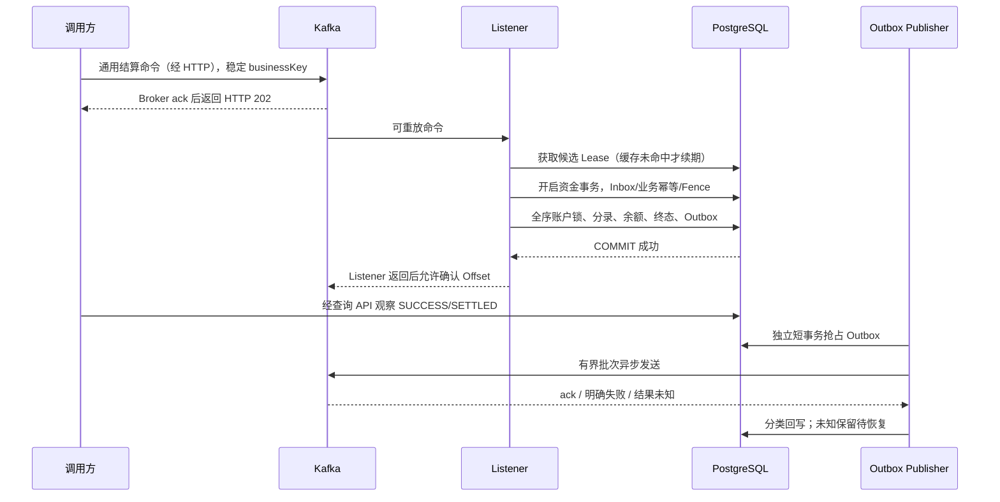

# 结算性能优化：从接入回执到资金闭环

适用版本：基础版本 `ee8ed2c` 上的 2026-09-21 结算专项补丁，PostgreSQL V1–V8，Java 21。幂等、提交前围栏、提交后计数和快照复用已补代码，见[本轮实现与验收](settlement-completion.md)。参数梯度仍是实验输入，未执行的负载不能写成性能成绩，公网版本以发行记录为准。

优化目标是：在金额精度、唯一资金效果、逐资产借贷平衡和可恢复性成立时，提高**已提交结算完成量**，降低**提交请求至查询可见资金结果**的尾延迟。HTTP 202、Kafka Offset 和 Outbox PUBLISHED 各自只证明一个阶段，不能互相替代。

## 1. 当前实现、实验能力与待实现项

| 状态 | 已核对的内容 | 证据 |
|---|---|---|
| 已实现 | 通用转账的 Inbox、业务唯一键、三账户全序锁、批量分录、余额、终态和 Outbox 同事务 | [SettlementService](../../src/main/java/dev/fincore/application/SettlementService.java)、[SettlementMapper](../../src/main/java/dev/fincore/infrastructure/persistence/mapper/SettlementMapper.java)、[LedgerMapper](../../src/main/java/dev/fincore/infrastructure/persistence/mapper/LedgerMapper.java) |
| 已实现 | 现货两资产原子交割，消费自己的成交在途，交易事实不可改写，提交前再次检查 Fence | [SpotDeliveryService](../../src/main/java/dev/fincore/application/SpotDeliveryService.java)、[SpotFundsMapper](../../src/main/java/dev/fincore/infrastructure/persistence/mapper/SpotFundsMapper.java)、[V8](../../src/main/resources/db/migration/V8__spot_funds_delivery.sql) |
| 已实现 | 共享有界 Consumer 池、记录级确认、异常不确认、固定退避重试 | [SettlementListener](../../src/main/java/dev/fincore/messaging/SettlementListener.java)、[ConcurrencyConfiguration](../../src/main/java/dev/fincore/infrastructure/concurrent/ConcurrencyConfiguration.java) |
| 已实现 | Lease 缓存降低续期写频率；事务内 `FOR SHARE` 验证当前 owner/epoch/state/expiry | [WorkerLeaseManager](../../src/main/java/dev/fincore/application/WorkerLeaseManager.java)、[ShardLeaseMapper](../../src/main/java/dev/fincore/infrastructure/persistence/mapper/ShardLeaseMapper.java) |
| 已实现 | Outbox 有界抢占、异步发送、分类回写、过期 PROCESSING 恢复 | [OutboxPublisher](../../src/main/java/dev/fincore/messaging/OutboxPublisher.java)、[OutboxMapper](../../src/main/java/dev/fincore/infrastructure/persistence/mapper/OutboxMapper.java) |
| 已有实验 | 真实 PostgreSQL/Kafka 的暂停消费、恢复重放、有限现货负载、Broker 暂停、备份恢复测试 | [SpotDeliveryKafkaIntegrationTest](../../src/test/java/dev/fincore/SpotDeliveryKafkaIntegrationTest.java) |
| 已有实验 | HTTP 接入及混合负载，尚不能单独证明通用结算最终吞吐 | [settlement.js](../../benchmarks/settlement.js)、[mixed-workload.js](../../benchmarks/mixed-workload.js) |
| 本轮新增实验工具 | 三种账户分布的有限并发闭环、逐键终态观测上界、未知结果记录、独立整数预期与账户账本摘要校验 | [settlement-comparison.mjs](../../scripts/performance/settlement-comparison.mjs)；默认 plan 无网络，工具协议测试不等于数据库实测 |
| 本轮补齐 | Listener 分段、提交后计数、幂等冲突/关联/未可见查询、提交前 Fence、快照复用、逐笔审计 | [实现与验收](settlement-completion.md) |
| 待完整环境认证 | 持续现货容量、多实例归属、COMMIT 网络响应丢失 | 完整环境与发行门禁另验，不宣称性能提升 |

## 2. 用真实链路定义优化边界

### 2.1 通用结算与现货交割不是同一个起点

通用结算：`POST /api/settlements` → Kafka 确认 → HTTP 202 → Listener → 数据库事务 → `SUCCESS/FAILED` 可查询 → Outbox → Broker 确认。公开 HTTP 不直接调用 `settle`，压测也必须经过消息入口。

现货交割：受控下单 → 撮合事务生成成交、预占转在途、`spot_delivery(PENDING)`、`SPOT_DVP_REQUESTED` Outbox → Publisher → Kafka → Listener → 双资产交割事务 → `SETTLED` 与 `SPOT_DVP_SETTLED` Outbox。成交回执并不等于资产交割完成。



图中数据库访问由应用服务完成。Consumer Offset 确认可以晚于资金提交，崩溃后重放是正常恢复路径；禁止把两者改成“先确认，再后台记账”。

### 2.2 一笔资金事务必须保留的合同

1. 通用单：Inbox、订单状态及审计、账本头和分录、全部账户余额、Outbox 在一个事务内；任一 SQL 失败整体回滚。余额不足以 `FAILED` 业务终态完成，不是数据库技术失败。
2. 现货单：交割事实、Inbox、两个资产各自的平衡分录、四腿资金分桶、两订单预占消耗、SETTLED 和 Outbox 原子提交；`balance >= reserved_balance + pending_debit` 且各桶非负。
3. 金额使用 `BigDecimal` / `NUMERIC(38,18)`。按资产校验借贷平衡，不能把 USDT 和基础币求和抵消差异。
4. 账户锁统一调用 `UuidOrder.uniqueSorted`，按无符号 UUID 128 位全序去重、排序。新批量锁 SQL 必须证明获取顺序等价；只写 `WHERE account_id IN (...)` 不能保证锁顺序。
5. `SUCCESS` 不回退；已提交错误经济结果走独立补偿单和反向分录。数据库回滚只能撤销尚未提交的事务。

### 2.3 Kafka 分区键不等于账户串行

当前通用命令以 **businessKey** 发送，Worker shard 由 **payerAccountId** 计算；现货 Outbox 以 **tradeId** 发送，Worker shard 由数据库事实中的 **buyerQuoteId** 计算。这是两套不同的路由维度。

不同业务键可能同时操作同一个付款、收款或手续费账户；同一账户也可能参与多个现货成交。因此不能根据“同 Key 有序”推导“同账户串行”。当前跨分区/跨实例资金互斥来自数据库账户行锁，不来自 Kafka 或 Lease 缓存。

扩容前先记录每 Topic 分区、每实例 Consumer 数、每 shard owner 的映射。现有 Worker 采用按需抢 Lease，没有看到 Kafka 分区分配与 payer shard 所有权的一致协调器；两个实例可能消费不同分区却争同一业务 shard，出现 `shard unavailable` 和分区重试。必须在双实例实验中验证归属冲突，不能直接把实例数乘进吞吐预测。未来若按付款账户分区，只减少付款侧争用；共享收款/手续费账户和跨账户转账仍需全序数据库锁。分区扩容、在途旧消息和所有权迁移也需单独排空、恢复方案。

## 3. 延迟拆解与已补观测口径

| 阶段 | 要测什么 | 当前可得证据 / 限制 |
|---|---|---|
| 接入 | 请求起点至 Broker ack | k6 HTTP 时长；包含提交等待，不能代表资金完成 |
| Kafka 等待 | Broker 入队至 Listener 开始 | Consumer group Lag 可看积压；精确消息时延需要 trace/时间戳补点 |
| 路由与 Lease | 现货事实查询、缓存命中/续期、分片冲突等待 | 新增 `consumer.stage` 的 routing/lease，processing 也包含该段 |
| 连接池等待 | 事务借连接的等待和超时 | `hikaricp.connections.pending/active`；可用的 acquire 指标先从 Actuator 枚举确认 |
| 资金事务 | 围栏、幂等、锁等待、SQL、COMMIT | 新增 `consumer.stage{stage=transaction}` 包含借连接、SQL、提交/回滚；不是每条 SQL 的独立 Timer |
| 结果可见 | 提交起点至只读查询观察到终态 | 客户端有界轮询/测试计时；轮询周期造成观测误差，应记下采样间隔 |
| 通知 | 资金提交至 Outbox 被确认发布 | Outbox pending 年龄、publish batch Timer、published_at；PUBLISHED 不是下游业务处理确认 |

分段公式需要使用不重叠的边界：`T资金可见 = T请求至消息入队 + T入队至消费开始 + T路由租约 + T连接获取 + T事务执行及提交 + T提交至查询观察`。HTTP 等 ack 与消费者执行可能重叠，不能直接把 HTTP 请求时长加到 Broker 入队至消费时长；当前 processing Timer 又包含调用事务代理时的连接获取，不能再重复加一次池等待。精确拆段需关联同一业务键的埋点；客户端工具先提供请求起点至观察终态的上界。Outbox 发布延迟另报，现货请求 Outbox 的等待则位于交割资金事务之前。

本轮已修正三个口径问题：

- 总 Timer/inflight 在路由前开启，routing/lease/transaction 分段记录；不含此前 Broker 排队与后续 offset 提交。
- processing 与 stage 开启 histogram，真实 Prometheus scrape bucket 已验证。type/stage/outcome 固定低基数，无负载采样仍无实测 p99。
- success/completed 在 afterCommit 增加，回滚/提交失败不计成功；资金写入不移到回调。进程可能在提交后回调前崩溃，完成数仍按数据库唯一业务键校准。consumer outcome=success 仅表示正常返回，包含重复与已提交业务 FAILED。

`settlement_order.updated_at-created_at`、`inbox_message.processed_at-received_at` 不能作为结算耗时：当前 SQL 使用 `now()`，PostgreSQL 的 `now()` 固定为事务开始时间，同事务字段可能完全相等。现货 `settled_at-created_at` 跨两个事务，可用于粗略队龄，但仍不包含准确的最终 COMMIT 时间。官方语义见 [PostgreSQL 16 时间函数](https://www.postgresql.org/docs/16/functions-datetime.html#FUNCTIONS-DATETIME-CURRENT)。

## 4. 可复现测量步骤

以下命令都从仓库根目录执行，只面向本地 Compose 或测试套件自己创建的容器。记录 `git rev-parse HEAD`、JDK、CPU/内存配额、实际 Topic 分区数、数据库数据规模和完整参数。此文未执行这些负载，下面的预期是验收标准。

### 步骤 A：先跑资金与消息闭环测试

```bash
./mvnw -Dtest=SettlementIntegrationTest,SpotFundsIntegrationTest,SpotDeliveryKafkaIntegrationTest test
```

查看 `target/surefire-reports/` 的 failures、errors、skipped。Testcontainers 设置了 `disabledWithoutDocker=true`，Docker 不可用时跳过不能记为资金验收通过。现货测试通过后会写 `target/runtime-evidence/`；其中 `bounded-http-load.json` 是 64 个市场、128 次 HTTP 下单、64 个成交的固定有限样本，报告已明确不是持续容量。保留 JSON 的时间、提交版本及测试日志，不能把旧文件当本轮证据。

### 步骤 B：建立单热点与混合争用基线

已有混合压测会自动创建独立账户，一轮结算共用同一 payer/payee/fee，天然是三账户热点负载；不要称为均匀分布基线。先跑较低档位，例如：

```bash
FINCORE_SETTLEMENT_RATE=20 FINCORE_MATCHING_RATE=10 FINCORE_READ_RATE=10 \
FINCORE_PERFORMANCE_DURATION=60s ./scripts/performance/run-performance-lab.sh
```

该脚本会启动/构建本地实验容器，并写 `reports/performance/latest-*`；下轮会覆盖 latest 文件，运行之间归档并标明 run ID。它退出成功只说明现有 HTTP/混合门禁通过，仍须执行本节 SQL、等待最终结算及 Outbox 排空。

再分别使用到达率 20 → 50 → 100，或按实际容量更小步进；每档先预热，再独立记录至少 3 轮相同持续时间的稳态结果。数字只表示实验输入。每档观察资金完成量、积压斜率和排空时间；发现队列持续增长便停止加压。均匀账户组、90% 单付款热点、90% 单手续费热点需要扩展负载夹具并记录实际分布，当前脚本没有这三个开关。

`benchmarks/settlement.js` 可作为给定三个实验账户的单热点入口脚本，接受 `PAYER_ACCOUNT_ID/PAYEE_ACCOUNT_ID/FEE_ACCOUNT_ID/RATE/DURATION`；它只有 202 检查，没有资金终态、余额或 Outbox 门禁，也没有混合脚本的管理 Token 头。需要受保护账户创建的环境优先用现有混合脚本。

### 步骤 B2：补做账户分布有限对照

本轮新增工具覆盖 `shared-fee`（独立付款/收款、一个手续费账户）、`sharded-fee`（独立付款/收款、16 个手续费分片）、`hot-payer`（一个付款账户、独立收款、16 个手续费分片）。每轮新建合成资产，金额固定整数 10、手续费 1；用 BigInt 构造独立期望，再对比每个账户的余额、账本净额和期初。

先查看零网络计划：

```bash
node scripts/performance/settlement-comparison.mjs --scenario shared-fee --count 64 --concurrency 4
node scripts/performance/settlement-comparison.mjs --scenario sharded-fee --count 64 --concurrency 4
node scripts/performance/settlement-comparison.mjs --scenario hot-payer --count 64 --concurrency 4
```

仅在已准备好的独立本地实验实例和实验库上执行；`127.0.0.1` 也可能是远端隧道，不能据此认定隔离。示例假定该实验实例已在 18080 端口：

```bash
node scripts/performance/settlement-comparison.mjs \
  --scenario shared-fee --count 64 --concurrency 4 \
  --deadline-ms 60000 --poll-ms 200 --base-url http://127.0.0.1:18080 \
  --run --confirm-isolated
```

三种场景使用相同 count/concurrency/deadline，各轮独立保存 JSON 的 `runId/asset/observations`，按同样方式比较。工具不自动重发；提交确认未知后只查询原 businessKey，整体期限结束仍不确定则保留 UNKNOWN，不自动调平或删数据。未发送、确认未知、业务 FAILED 和最终未决分别统计；存在未决时不进行假定全部完成的核账。

这属于**有限并发闭环**：一个槽位包含提交及轮询，系统变慢时新请求产生速度自然下降；不能用它代替固定到达率容量测试。`observedFinalLatencyMs` 是首次查询到终态的上界，包含轮询误差；小样本 p99 不能代表稳定线上尾延迟。账户摘要通过也不替代逐笔分录唯一性、Outbox 和故障验收。CLI 和字段说明见[工具手册](../../scripts/performance/README.md)。

### 步骤 C：并行观察接入、消费、锁和积压

先枚举真实指标，再读取已有指标，避免粘贴不存在的 PromQL：

```bash
curl -fsS http://127.0.0.1:8080/actuator/metrics | jq '.names'
curl -fsS http://127.0.0.1:8080/actuator/metrics/fincore.settlement.consumer.processing
curl -fsS http://127.0.0.1:8080/actuator/metrics/hikaricp.connections.pending
docker compose exec -T kafka /opt/kafka/bin/kafka-consumer-groups.sh \
  --bootstrap-server kafka:9092 --describe --group fincore-settlement-v1
docker compose exec -T kafka /opt/kafka/bin/kafka-topics.sh \
  --bootstrap-server kafka:9092 --describe --topic settlement.commands.v1
```

空闲时单个 HTTP 指标快照无法还原峰值。对 Actuator/Prometheus 连续采样，保存开始、稳态、停压后排空三个阶段；Kafka Lag 按 Topic/partition 看，避免总量掩盖一个阻塞分区。

打开本地只读诊断会话；不要将这个连接方式替换为生产地址：

```bash
docker compose exec postgres psql -X -U fincore -d fincore
```

以下 SQL 使用现有 schema。诊断连接与应用使用相同实验 DB；大型数据集上先限定实验 run 和执行时段，避免高频全账扫描本身影响压测。

```sql
-- 活跃事务、锁等待者和阻塞者；不输出 SQL 载荷。
SELECT pid, application_name, state, wait_event_type, wait_event,
       clock_timestamp() - xact_start AS transaction_age,
       pg_blocking_pids(pid) AS blockers
FROM pg_stat_activity
WHERE datname = current_database() AND pid <> pg_backend_pid()
  AND (state <> 'idle' OR cardinality(pg_blocking_pids(pid)) > 0)
ORDER BY xact_start NULLS LAST;

-- 同时记录两次快照的差值；这些是数据库累计计数，不是本次实验专属。
SELECT datname, xact_commit, xact_rollback, deadlocks,
       blks_read, blks_hit, temp_files, temp_bytes
FROM pg_stat_database WHERE datname = current_database();

-- 同时看待发布和抢占未决；ready.backlog 指标只覆盖已到期的 PENDING。
SELECT event_type, status, count(*) AS events,
       min(created_at) AS oldest_created_at,
       max(clock_timestamp() - created_at) AS oldest_age,
       count(*) FILTER (WHERE status='PENDING' AND next_attempt_at<=now()) AS ready,
       count(*) FILTER (WHERE status='PROCESSING'
         AND (claimed_at IS NULL OR claimed_at < now()-interval '60 seconds')) AS abandoned
FROM outbox_event
WHERE status <> 'PUBLISHED'
GROUP BY event_type, status ORDER BY event_type, status;

-- 现货交割尚未完成的存量，不存在虚构的 delivery latency 字段。
SELECT status, count(*) AS deliveries,
       max(clock_timestamp()-created_at) AS oldest_age
FROM spot_delivery GROUP BY status;

-- 获取本轮自动开户的 run ID：例如 perf-payer-<runId>。
SELECT owner_id, account_id, created_at
FROM account WHERE owner_id LIKE 'perf-payer-%'
ORDER BY created_at DESC LIMIT 5;
```

`FOR SHARE` 的 Lease 读锁可并发，但会阻塞需要更新该行的续期/接管；资金事务等热点账户锁时仍持有 Lease 锁。因此要同时看账户锁链与 Lease 行等待，不能只看 `cache.hit` 增长。关于行锁兼容性见 [PostgreSQL 16 显式锁](https://www.postgresql.org/docs/16/explicit-locking.html#LOCKING-ROWS)。

### 步骤 D：以唯一键计算实际资金完成量并验账

在 psql 中把 `run_prefix` 换成本轮真实值：混合 k6 脚本使用 `perf-order-<runId>-`，新增有限对照工具使用 `perf-<runId>-`，后者 runId 从 JSON 读取。先确认匹配到非零行，不能让空样本验收成功。

```sql
\set run_prefix 'perf-order-REPLACE_WITH_RUN_ID-'

-- 同一采样会话每隔固定窗口取两次 SUCCESS 数，差值/实际秒数=已提交完成速率。
SELECT clock_timestamp() AS observed_at, status, count(*) AS committed_orders
FROM settlement_order
WHERE business_key LIKE :'run_prefix' || '%'
GROUP BY status ORDER BY status;

-- 每个 SUCCESS 必须有且仅有一笔 SETTLEMENT 账本和成功通知。
-- 每个 FAILED 不应有成功资金效果；查询必须返回 0 行。
SELECT s.business_key, s.status,
       (SELECT count(*) FROM ledger_transaction t
        WHERE t.business_key=s.business_key AND t.transaction_type='SETTLEMENT') AS journals,
       (SELECT count(*) FROM outbox_event o
        WHERE o.aggregate_id=s.business_key AND o.event_type='SETTLEMENT_SUCCEEDED') AS events
FROM settlement_order s
WHERE s.business_key LIKE :'run_prefix' || '%'
  AND ((s.status='SUCCESS' AND
       ((SELECT count(*) FROM ledger_transaction t WHERE t.business_key=s.business_key
         AND t.transaction_type='SETTLEMENT')<>1 OR
        (SELECT count(*) FROM outbox_event o WHERE o.aggregate_id=s.business_key
         AND o.event_type='SETTLEMENT_SUCCEEDED')<>1))
    OR (s.status='FAILED' AND
       ((SELECT count(*) FROM ledger_transaction t WHERE t.business_key=s.business_key)>0 OR
        (SELECT count(*) FROM outbox_event o WHERE o.aggregate_id=s.business_key
         AND o.event_type='SETTLEMENT_SUCCEEDED')>0)));

-- 逐交易校验借贷差额；包含无分录的异常账本头，避免 INNER JOIN 漏报。
SELECT t.business_key, t.asset, count(e.entry_id) AS entries,
       coalesce(sum(CASE e.direction WHEN 'DEBIT' THEN e.amount ELSE -e.amount END),0) AS difference
FROM ledger_transaction t LEFT JOIN ledger_entry e USING(transaction_id)
WHERE t.business_key LIKE :'run_prefix' || '%'
GROUP BY t.transaction_id, t.business_key, t.asset
HAVING count(e.entry_id)<2 OR
       coalesce(sum(CASE e.direction WHEN 'DEBIT' THEN e.amount ELSE -e.amount END),0)<>0;

-- 逐账户核对期初+全部历史分录，不能只累加本次分录与总余额比较。
WITH touched AS (
  SELECT payer_account_id AS account_id FROM settlement_order WHERE business_key LIKE :'run_prefix'||'%'
  UNION SELECT payee_account_id FROM settlement_order WHERE business_key LIKE :'run_prefix'||'%'
  UNION SELECT fee_account_id FROM settlement_order WHERE business_key LIKE :'run_prefix'||'%'
), checked AS (
  SELECT a.account_id, a.asset, a.balance, a.reserved_balance, a.pending_debit,
         a.opening_balance+coalesce(sum(CASE e.direction WHEN 'CREDIT' THEN e.amount ELSE -e.amount END),0)
           AS expected_balance
  FROM touched x JOIN account a USING(account_id)
  LEFT JOIN ledger_entry e ON e.account_id=a.account_id
  GROUP BY a.account_id
)
SELECT * FROM checked WHERE balance<>expected_balance
   OR reserved_balance<0 OR pending_debit<0 OR balance<reserved_balance+pending_debit;
```

以上差异查询都应为 0 行；总数查询必须与本轮已接受且结果已确定的业务键清单闭合。现有 k6 不归档每个请求业务键，也不处理 503 未知接收集，因此要先在零提交错误实验中使用计数闭合；涉及丢响应/503 的实验必须按客户端清单核对“发送、202、未知、最终 SUCCESS/FAILED/仍未知”集合。有限对照工具已记录 observations，固定到达率 k6 仍需补同等清单。只比较总数无法发现一个缺失和一个重复互相抵消。

现货单笔验账使用测试报告里的真实 `tradeId`：

```sql
\set trade_id 'REPLACE_WITH_REAL_TRADE_UUID'
SELECT trade_id, status, quantity, quote_amount, created_at, settled_at
FROM spot_delivery WHERE trade_id=:'trade_id'::uuid;

-- SETTLED 应有两笔不同资产的账本头、每笔两条分录且差额 0。
SELECT t.business_key, t.asset, count(e.entry_id) AS entries,
       coalesce(sum(CASE e.direction WHEN 'DEBIT' THEN e.amount ELSE -e.amount END),0) AS difference
FROM ledger_transaction t LEFT JOIN ledger_entry e USING(transaction_id)
WHERE t.business_key LIKE 'spot:' || :'trade_id' || ':%'
GROUP BY t.transaction_id, t.business_key, t.asset;

SELECT r.order_id, r.initial_amount, r.held, r.pending, r.settled, r.released,
       r.initial_amount-r.held-r.pending-r.settled-r.released AS difference
FROM spot_order_reservation r JOIN spot_delivery d
  ON r.order_id IN (d.buy_order_id,d.sell_order_id)
WHERE d.trade_id=:'trade_id'::uuid;
```

现货订单可能包含多个成交，不能假设这一笔交割完成后该订单或账户的全部 `pending` 都为 0；必须按本笔成交金额扣减，并结合其他未交割成交验算。完整账户总余额、分桶审计和订单预占三路复算见 `SpotFundsMapper.recompute` 及 `SpotFundsIntegrationTest.assertClean`。差异进入冻结审核，不能在压测脚本里直接 UPDATE “修好”。

### 步骤 E：验证索引是否真正降低了工作量

先列实际索引，再查看非写入查询计划：

```sql
SELECT tablename, indexname, indexdef FROM pg_indexes
WHERE schemaname='public'
  AND tablename IN ('settlement_order','ledger_entry','outbox_event','spot_delivery')
ORDER BY tablename,indexname;

EXPLAIN (ANALYZE, BUFFERS)
SELECT event_id FROM outbox_event
WHERE status='PENDING' AND next_attempt_at<=now()
ORDER BY created_at LIMIT 200;

EXPLAIN (ANALYZE, BUFFERS)
SELECT trade_id FROM spot_delivery
WHERE status='PENDING' ORDER BY created_at LIMIT 200;
```

V5 的 `idx_outbox_ready_batch(next_attempt_at, created_at) INCLUDE(event_id) WHERE status='PENDING'` 能收窄候选，但 `next_attempt_at` 是范围条件，不能声称自动消除 `ORDER BY created_at` 排序；真正抢占还有 `FOR UPDATE SKIP LOCKED`，必须访问并锁定堆元组，不能宣称完全 index-only。上面只读计划用于初筛；真实抢占的缓冲命中、排序/扫描行数与持锁耗时应在隔离夹具下采样。不要对实际资金写 SQL 随意执行 `EXPLAIN ANALYZE`，它会真正执行语句。参见 [PostgreSQL EXPLAIN](https://www.postgresql.org/docs/16/using-explain.html)。

## 5. 具体优化顺序与取舍

### 5.1 先缩短持锁段，再增加并发

旧基线的 SQL 静态计数不再作为新版本事实：现货交割少四次重复资产读取，新增一次 beforeCommit Fence 查询，所以正常成功路径净少三次 SQL；预占少一次付款方读取。具体路径需重新采样；SQL 调用数不是吞吐证明，也不包含所有驱动和触发器成本。

值得先验证的候选：

1. **已补实现**：直接复用本事务锁定 `FundsRow` 检查资产，少四次读取，计入新增 Fence 查询后净少三次 SQL；撮合预占复用付款方快照另省一次。账户锁使用 `FOR NO KEY UPDATE` 避免外键检查锁升级死锁，余额写入仍互斥。资产不匹配回滚、快照复用与并发重放已有回归；事务时长和吞吐收益仍须同条件对照。
2. 纯命令序列化、不可变字段校验可在受信任服务边界预计算；余额、预占、终态和 Fence 仍在事务内读取。不要为了提前检查把事务内校验删掉；缩短段落的收益须实测。
3. 当前一般结算即使 fee=0 也锁 fee 账户；跳过这把锁是候选而非立即可用优化，必须定义“零手续费账户是否仍需验证存在/资产”的业务语义，并覆盖与原语义一致的测试。
4. 只有 SQL/锁证据证明相关读取占比较高，才考虑合并账户查询或批量余额变更；必须继续检查影响行数、冻结状态、可用余额下限和确定锁序。一次多值分录 INSERT 已实现，不需要再把同样改动计作新增收益。

事务内不做 Broker 等待、RPC、账户全历史扫描、sleep 或批内多笔重试。Outbox 发布在资金事务外完成。一次技术失败退出事务后再按原幂等键重试，避免持锁退避。

### 5.2 连接与并发预算一起调整

默认配置为 Hikari 12、配置 Consumer 4（有效值取 CPU 上限）、撮合 Lane 4、调度线程 2；这几个工作流共用数据源，连接没有按业务物理隔离。

预算初值：`结算活跃事务 + 撮合活跃事务 + Outbox/租约/查询峰值 < 单实例连接池`，再验证各实例连接池总和加运维/其他应用连接是否在数据库预算内。它是峰值预算，不是严格静态等式；不能用 HTTP 虚拟线程数推算应有 JDBC 连接数。

1. 固定数据集、CPU、数据库和连接池，Consumer 依次 1/2/4，对比资金完成速率和锁等待；不得超过有效 CPU 限制以及可用分区。
2. 同一热点账户若持锁时间均值为 H，其串行处理上限近似 `1/H`。H 包括拿到该锁后直到 COMMIT 的时间；这是容量推导，不是已测 TPS。增加消费者通常只增加等待者，先减少 H 或采用热点账户方案。
3. 若池 pending 上升、DB CPU 低且锁等待低，才做池大小单变量对照；若 DB 锁等待高，扩大池会放大连接持有和尾延迟。
4. `max.poll.records` 当前 50，poll interval 当前 300 秒。用“每次 poll 的记录数 × 单条高分位处理时间 + Lease/重试/调度等待”做预算，并实际验证 rebalance；不能把平均时间乘 50 当最坏保证。
5. 30 秒 SQL timeout、30 秒 Lease TTL、1.5 秒连接获取超时和 3 秒提交回执等待是不同阶段预算。长账户锁等待可能用尽 Lease 余量；不要只增 TTL 掩盖锁问题。

候选改动若增加事务/锁超时，应先验证 SQL 异常导致整单回滚、异常继续抛给 Kafka，以及数据库提交响应丢失后的同键重放。当前没有单独的事务耗时门禁，`default-statement-timeout=30` 只约束单条语句，不限制整笔事务总时长。

### 5.3 批量放在正确边界

| 批量对象 | 当前 / 候选 | 边界与验收 |
|---|---|---|
| 单笔结算的借贷分录 | 已用多值 INSERT | 一笔最多三条，现货每资产两条；减少往返，整笔账务事务不变 |
| Outbox 事件 | 已实现，默认 200 | claim 是短数据库语句；网络等待不持有资金事务；异步 Future 数有界 |
| Outbox 批次大小 | 实验比较 50/100/200 | 同时看最老事件、确认尾延迟、CPU、失败恢复；批大可能增加单次尾延迟 |
| 多笔结算合成一个事务 | 未实现，默认不采用 | 扩大账户锁集合、回滚半径与 poll 时间；单个坏单牵连全批 |
| 多成交净额交割 | 业务规划 | 必须新增可审计批次、水位、明细到净额映射、舍入及冲正规则；不能只把分录合并以展示高吞吐 |

`max.poll.records` 是每次获取记录上限，不会自动变成批量业务事务。PG JDBC `reWriteBatchedInserts` 针对 JDBC batch；当前 MyBatis 多值 INSERT 本身已经是一条语句，不应把同一网络往返收益计算两遍。

## 6. 幂等、重试和未知结果

| 现象 | 当前行为 / 风险 | 处理与后续验收 |
|---|---|---|
| 同 messageId、同 businessKey、同载荷重放 | Inbox 返回原业务结果 | 保留原键，核对一笔账本；已有通用重放测试 |
| 同业务键换了金额/账户 | 完整经济字段不符即抛 BusinessConflictException | 原账不变，金额scale不同但数值相等允许重放；冲突发生在消费阶段，202不是完成 |
| 新 messageId 对应旧 businessKey，再次重放新 messageId | 校验 Inbox 持久化原命令，查询原业务结果 | 已补真实PG回归，不覆盖第一次messageId，不重复分录、扣款或成功事件 |
| 现货同 messageId 换 tradeId | 已显式比对并抛错，整单不确认 | `duplicateMessageWithDifferentTradeIsRejected` 覆盖 |
| HTTP 提交超时 / COMMIT 回包丢失 | 结果可能成功也可能未提交 | 保留原键和原载荷，查权威结果后重试；不能生成新单补发 |
| 余额不足 | 通用订单已提交 FAILED，Inbox 完成，无成功分录 | 属业务拒绝；充值后重放原键不会重新扣款，新业务须有明确新业务键 |
| SQL 死锁/技术异常 | Spring 事务回滚，异常传至 Listener | 新事务整单重试；计入技术失败、锁等待和完成延迟 |
| 坏消息永久失败 | 当前固定 1 秒无限重试，不丢弃，可能阻塞所在分区 | 必须告警及审核处置；没有已实现的可自动跳过且保证资金闭合的隔离队列 |

结果未生成时明确返回 HTTP 404、code=SETTLEMENT_NOT_VISIBLE、retryable=true。可能尚未消费，也可能从未提交，不能据此推断失败。按原键有界查询，超期保留 UNKNOWN；其他 500 不能统一解释成正常处理中。

通用结算增加 beforeCommit Fence 复核，账户锁等待跨 TTL 的真实PG回归已补；现货提交保护与外层事务验证见[本轮记录](settlement-completion.md)。`FOR SHARE` 防止Lease更新不等于TTL自动回滚。最终复核到数据库COMMIT仍有短窗口，不承诺严格墙钟提交截止。Lease比较采用应用时间，需考虑时钟偏差，不能用事务固定的数据库 now() 代替实际经过时间。

## 7. 完整故障场景

### 场景一：两个资产已写完，最后的成功 Outbox 写入失败

业务背景：买方 1000 USDT，卖方 10 单位基础币；成交买入 2，价格 100。撮合成功后 200 USDT 和 2 单位基础币进入各自 `pending`，等待交割。

执行：

```bash
./mvnw '-Dtest=SpotFundsIntegrationTest#lastWriteFailureRollsBackBothAssetsAndCanReplay' test
```

测试仅在隔离数据库用 Spy 让 `SPOT_DVP_SETTLED` Outbox 最后一写抛错。两个资产的分录和账户变更虽已执行，却仍未 COMMIT。

必须看到：交割仍 PENDING，交割 Inbox 为 0，本成交两笔账本为 0，买方总余额仍 1000、卖方基础币总余额仍 10；撮合阶段留下的在途仍可恢复。解除故障后原消息重放成功，再重放不重复扣款；买方为 800 USDT、2 基础币，两资产分录分别平衡，预占公式与账户覆盖关系成立。

性能含义：回滚失败也要进入失败次数和完成时延统计；不能仅报告第二次成功的快速请求。优化批量写时这个用例必须保持通过。

### 场景二：成交已发生且消息已落 Broker，消费者暂停后恢复

执行：

```bash
./mvnw '-Dtest=SpotDeliveryKafkaIntegrationTest#outboxBrokerWorkerPipelineRecoversAfterConsumerPause' test
```

测试先暂停自身 Listener，通过真实业务生成成交；请求 Outbox 发布至 Broker 后，交割必须仍为 PENDING。恢复 Listener 后，消息经过 Lease、Fence 和数据库事务完成 SETTLED；再次发送同成交通知，不能再次改变资金。

验收同时看“请求 Outbox PUBLISHED、交割 PENDING、资金 pending 保留”这一中间态，防止把消息发布当作资金成功。恢复后核对两笔资产账本、全部参与账户和分桶差异为零。记录停顿时间、恢复至 SETTLED 的时间和最终通知排空时间。

扩展的 Broker 暂停实验使用：

```bash
./mvnw '-Dtest=SpotDeliveryKafkaIntegrationTest#brokerOutagePreservesPublishedPendingDelivery' test
```

它暂停的是测试套件自己的容器，验证已发布消息跨短暂停顿恢复；它不证明所有生产 Broker 持久化故障或任意长分区都已覆盖。Publisher 若发出后等不到 ack，将事件留在 PROCESSING；60 秒阈值加恢复调度/下轮发布才可能重新尝试，恢复时间不能承诺“恰好 60 秒”。重复发布依靠消费端业务幂等收敛。

### 场景三：热点账户锁等待叠加 Worker 过期 / 接管

已有确定性接管测试：

```bash
./mvnw '-Dtest=SpotFundsIntegrationTest#staleWorkerCannotSettleAfterTakeover' test
```

它在隔离夹具使旧 Lease 到期、由新 owner 获得更大 epoch；旧 token、错误 shard 和空 token 均不能交割，正确新 token 可以处理原成交，资金只动一次。

本轮通用长锁回归用独立事务持有账户锁，从 pg_stat_activity 确认目标事务真实阻塞，越过租约期限再释放。提交前二验拒绝，分录、余额、状态、Inbox与Outbox一起回滚。现货外层延迟与并发回放结果见[本轮记录](settlement-completion.md)；单项通过不替代所有多实例故障窗口。

### 场景四：成功回执丢失，调用方误以为失败

现有控制器明确允许返回“Broker 确认失败或未知”，但仓库尚无覆盖整段 COMMIT 回包丢失的通用结算端到端测试。新增实验应先记录唯一业务键，再在确认响应处做受控故障注入，禁止修改消息金额。

验收分支必须同时覆盖：提交前失败→无资金效果，原键重试完成；提交成功回包丢失→查询 SUCCESS，原键重放只返回既有结果。每个业务键最多一笔原始账本和一条成功 Outbox；调用方没有查询到结果时仍标记 UNKNOWN 并保留恢复任务。未知不能被统计为确定失败，也不能立即发补偿单。故障注入只能位于隔离测试或 `lab`，不新增绕过 Kafka/Fence 的公开入口。

## 8. 分阶段落地与验收清单

| 阶段 | 具体交付 | 通过门槛 |
|---|---|---|
| P0 已补代码与定向验证 | 幂等载荷/Inbox关联/未可见查询/跨TTL/提交后计数/Consumer分段 | 红绿回归和真实PG；分段不是精确端到端，完整发行门禁另验 |
| P1 基线 | 固定硬件/数据/分布，接入与资金完成分别统计，保留 lag、锁、池、Outbox 时序 | 每个接受业务键可追踪；借贷/账户/分桶差异为零；明确 skipped 与未执行项 |
| P2 快照复用已补，收益待测 | 交割净少三次 SQL（少四次重复读、新增一次 Fence），预占省一次；Consumer梯度属于实验协议 | 至少3轮同条件比较完成量、p99和锁；不靠积压换吞吐 |
| P3 混合与故障 | 撮合/结算/查询混合，回滚、重放、Broker 暂停、接管、坏消息告警 | 恢复可闭合；不丢单、不双记、不产生单边交割；积压回落且恢复时间可解释 |
| P4 容量边界 | 双实例归属协调实验、均匀/热点分布、持续现货交割 | 给出已验证上限与资源余量；未实现净额/批量事务列为后续设计 |

每轮报告至少记录：`commit、环境、运行ID、负载分布、发起/202/未知数、唯一SUCCESS/FAILED/SETTLED数、接入p95/p99、资金可见p95/p99、最老积压与排空时间、SQL/锁/池等待、CPU/GC、技术重试/业务拒绝数、逐资产差异数、实际执行/跳过测试`。没有已实现探针的字段写“未采集”，不以 HTTP p99 或静态计数代填。

回退以停止新实验流量、等待或记录未决业务、恢复上一组 Consumer/批次/连接配置为单位；保留 Inbox、Outbox、账本、状态和实验原始证据。代码或配置回退不会撤销已经成功的资金事实；需要撤销经济结果时，通过既有 [CompensationService](../../src/main/java/dev/fincore/application/CompensationService.java) 的独立反向账务处理并审核，不删除历史分录，不把 SUCCESS 改回 INIT。

本文展示的技术重点是：能够用链路口径定位真实瓶颈，用事务与幂等约束审查每个优化，用可重复实验界定性能边界，并从账务事实证明故障恢复后的结果正确。
