# FinCore 高并发、行情波动与快速扩展架构

## 一、这套架构要解决什么

FinCore 的目标不是单纯把接口 QPS 做高，而是在订单洪峰、行情跳变、消息重复、节点接管和局部故障同时发生时，
仍然守住以下业务结果：

1. 不合格用户、过期行情和越过风险边界的订单不能进入撮合；
2. 同一客户端订单重试不能重复占额度、重复生成订单或重复成交；
3. 成交事实不能因为消息系统暂时不可用而丢失；
4. 同一结算消息重复投递不能产生第二次资金效果；
5. 旧 Worker 恢复后不能继续写资金；
6. 账本借贷必须平衡，历史成交与历史分录不可被修复任务覆盖；
7. 系统过载时必须明确拒绝或降级，不能无限排队、耗尽线程和内存；
8. 新增行情源、风控规则、交易对或下游消费者时，不需要改写资金核心。

这里同时描述两种边界：

- **当前已落地**：可以在仓库、自动测试和腾讯云演示中验证的能力；
- **生产演进目标**：真实生产系统需要继续建设，不能冒充当前已经投产的能力。

## 二、整体架构图

系统不是一条从用户一直同步调用到对账的长链路，而是五条相互协作、可以独立承压的通道。

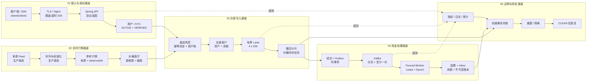

### 为什么要拆成五条通道

| 通道 | 主要压力 | 首要保护 | 不能发生的结果 |
|---|---|---|---|
| 接入与身份 | 无效请求、重复请求、慢客户端 | TLS、限速、超时、资格失败关闭 | 无资格用户进入交易核心 |
| 实时行情 | 高频 Tick、乱序、缺口、来源分歧 | 分区、时间单调、新鲜度、价格笼子 | 旧价格或异常价放行订单 |
| 交易写入 | 热点标的、并发订单、价格吃穿 | 幂等、有界 Lane、同标的定序 | 无限排队、数量不守恒 |
| 资金处理 | 消费积压、重复投递、Worker 接管 | Outbox、Inbox、Fencing、平衡账本 | 丢成交或重复动钱 |
| 证明与恢复 | 漏数、错值、幽灵数据、修复误伤 | 权威事实反查、分类、隔离 | 为了对平而改写权威历史 |

## 全局服务拓扑（运行视角）

业务链说明“一笔订单经历什么”，服务拓扑说明“请求落到哪个实例、事件由谁消费、数据写到哪里、怎样横向扩容”。

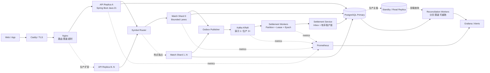

当前腾讯云使用 Caddy、Nginx、单个 FinCore 应用容器、单 Kafka KRaft、单 PostgreSQL、Prometheus 和 Grafana
组成可运行演示。图中的 API 副本、撮合分片、Kafka 多节点和 PostgreSQL 主备属于生产扩容拓扑，使用虚线区分，
不能表述成当前服务器已经具备多可用区能力。

## 六套单服务拓扑

| 服务域 | 入口 | 应用服务 | Mapper / Adapter | 权威状态 | 输出去向 |
|---|---|---|---|---|---|
| 用户 / KYC | `TradingLifecycleController` | `TradingLifecycleService` | `TradingLifecycleMapper` / KYC Adapter | `customer_profile` / `risk_profile` | 资格快照进入盘前风控 |
| 行情 | Market Feed / Reference API | `TradingLifecycleService` 行情能力 | Quote Normalizer / `TradingLifecycleMapper` | `market_reference_price` | 参考价进入价格笼子 |
| 风控账户 | `TradingLifecycleController` | `TradingLifecycleService.place` | `TradingLifecycleMapper` / `AccountService` | `account` / `pre_trade_decision` | APPROVED 进入 `TradingOrderCoordinator` |
| 准入撮合 | `TradingOrderCoordinator` | `StripedTaskExecutor` / `MatchingService` | `MatchingMapper` / `OutboxMapper` | `matching_order` / `trade_execution` | `matching.events.v1` 进入 Kafka |
| 结算账本 | `SettlementListener` | `SettlementService` / `WorkerLeaseManager` | `SettlementMapper` / `LedgerMapper` | Inbox / Balance / Ledger / Lease | 结算结果进入投影和对账 |
| 对账恢复 | Controller / Scheduler | `ReconciliationService` | `TradeReliabilityMapper` / `ReconciliationMapper` | 权威成交 / 投影 / 差异记录 | CLEAN / REBUILT / QUARANTINED |

每套拓扑都必须同时表达同步入口、内部应用服务、持久化端口、外部依赖、事件输出和失败回路。网站将这六套图全部
展开，并保留单模块深入视图用于解释并发、行情、扩容和自动证据。

## 核心场景时序图

### 1. 正常下单、成交、结算与对账

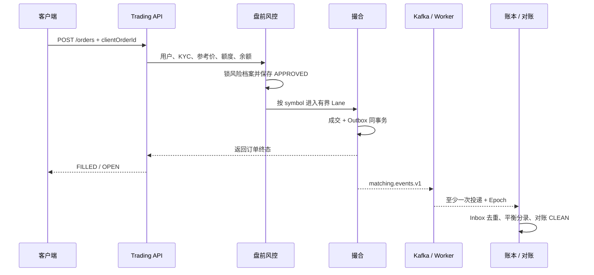

### 2. 行情暴跌与价格笼子失败关闭

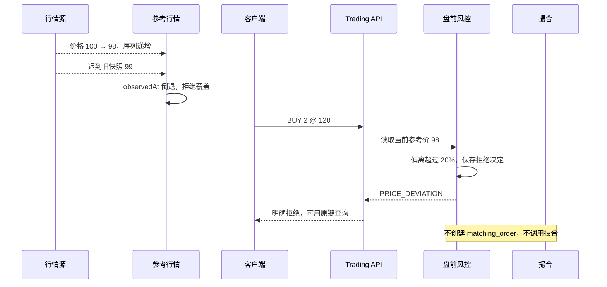

### 3. 客户端超时后的幂等重试

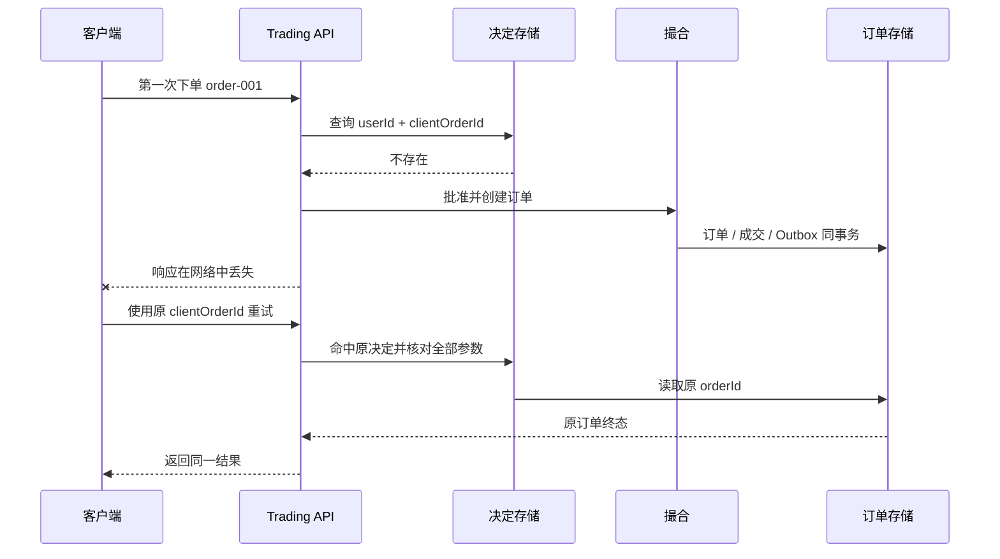

### 4. 订单洪峰与有界背压

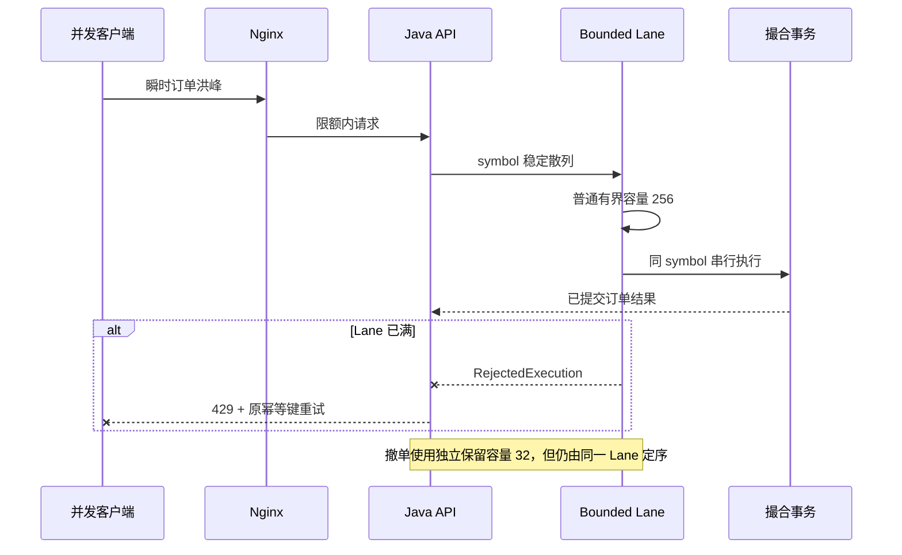

### 5. Worker 接管、重复投递与 Epoch Fencing

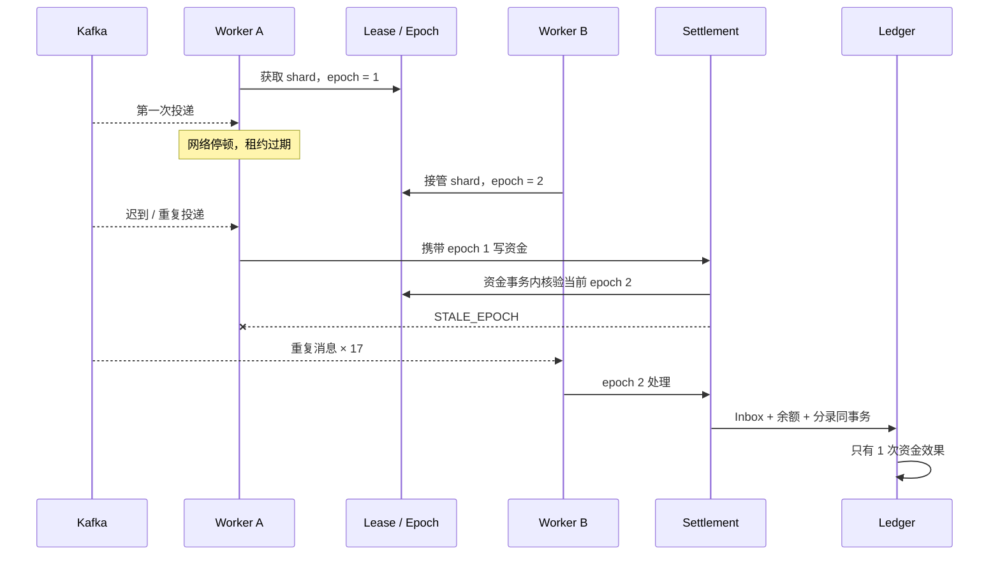

### 6. 漏数、错值与幽灵成交的对账修复

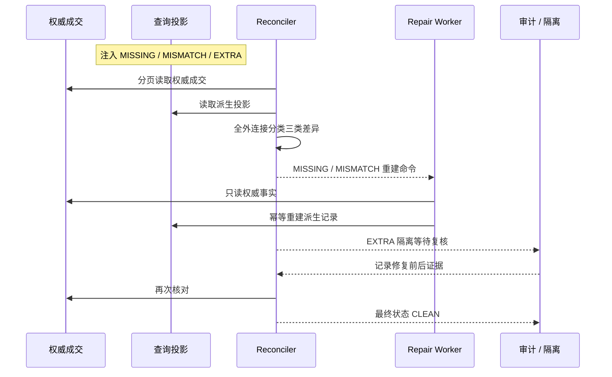

## 三、订单洪峰怎样被逐层削峰

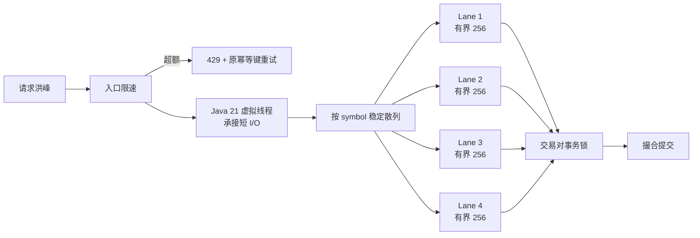

当前项目已经落地：

- Nginx 固定场景限速和应用入口明确超时；
- Java 21 虚拟线程用于短 I/O 接入，不承担撮合顺序；
- `StripedTaskExecutor` 使用 4 条单平台线程 Lane，每条含普通有界容量 256 和撤单保留容量 32；
- 同一 `symbol` 稳定进入同一 Lane，不同标的并行；
- 两类队列分别有界，队满使用 `AbortPolicy` 明确拒绝并记录指标；普通新单不能挤占撤单容量；
- 撤单优先于尚未开始的普通积压，但不抢占当前事务；连续 8 笔撤单后让 1 笔普通命令前进；
- 多实例同时处理同一标的时，PostgreSQL 事务锁和版本检查提供最后定序；
- 客户端超时不能推断订单失败，必须使用原 `clientOrderId` 查询或重试。

容量调整不能只把队列改大。队列容量必须由可接受排队时间反推：

```text
允许队列长度 ≈ 峰值处理能力 × 可接受的额外排队时间
```

如果单 Lane 实际处理能力为每秒 500 条、允许增加 200ms 排队，则合理在途量约为 100，而不是无上限堆积。
扩容时优先增加 symbol 分片或给热点交易对独占分区，而不是让单个 JVM 持有越来越大的队列。

## 四、行情剧烈波动怎样失败关闭

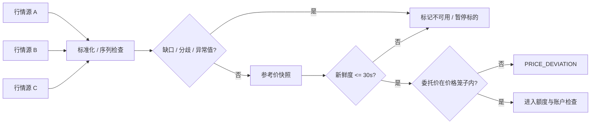

当前项目已经落地的防线：

- 参考价记录来源、观察时间和版本；
- 较旧 `observedAt` 不能覆盖较新快照；
- 受控下单只接受 30 秒内参考价；
- 委托价格相对参考价的偏离不能超过用户风控阈值；
- 没有价格保护的市价单不能通过受控入口；
- 行情缺失、过期或价格越界都会产生稳定拒绝码，不创建撮合订单。

生产演进需要补齐：多源行情接入、序列缺口检测、来源仲裁、异常值过滤、交易状态、熔断复市和行情回放。
这些能力应放在独立行情域，通过统一 Quote Adapter 输出标准快照，不能把每家交易所字段直接带进盘前风控。

## 五、用户、KYC 与权限模块架构

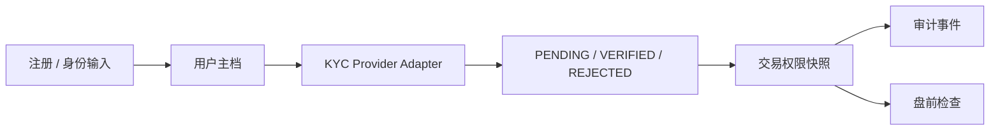

- 用户生命周期 `ACTIVE / SUSPENDED / CLOSED` 与 KYC 状态分开建模；
- 供应商不可用或状态未知时失败关闭；
- 热点读取可以缓存，但缓存不是最终授权来源；
- 风险事件可以暂停新交易，不影响已经发生的资金事实继续结算；
- 新 KYC 供应商通过 Adapter 接入，交易核心只理解标准审核结果。

## 六、盘前风控与交易账户模块架构

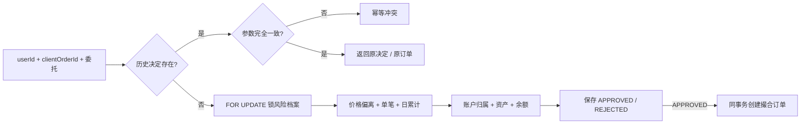

- 同一用户的日累计额度使用行锁关闭并发穿透；
- `userId + clientOrderId` 唯一，重放不重复占额度；
- 买单检查计价资产账户，卖单检查基础资产账户；
- 金额全部使用 `BigDecimal` 和 PostgreSQL `NUMERIC(38,18)`；
- 任何依赖不可判断都保存明确拒绝结果；
- 当前余额检查是保守快照，生产系统仍需增加可用、冻结、在途、已结算子账户和撤单释放。

## 七、有界准入与撮合模块架构

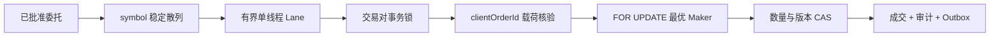

这里同时守住三类问题：

1. **进程内顺序**：同一 symbol 进入同一 Lane；
2. **跨进程顺序**：数据库事务锁防止两个实例同时修改同一订单簿；
3. **状态正确性**：原始量等于已成交量加剩余量，成交序号唯一。

价格剧烈波动时，撮合仍按价格时间优先消耗真实订单簿。深度耗尽后的额外市价单必须返回拒绝，不能生成负剩余量、
凭空成交或用最后成交价伪造流动性。

## 八、事件、结算与账本模块架构


- 成交和 Outbox 在同一事务，避免“数据库成功、消息丢失”；
- Kafka 至少一次投递是正常条件，Inbox 和业务唯一键负责去重；
- Worker 租约只代表控制面所有权，资金事务还要校验 Epoch；
- 账户按 UUID 固定顺序加锁，避免不同转账方向形成死锁；
- 状态迁移、Inbox、余额与账本分录在一个事务内一起提交；
- 账本修正只能通过反向分录，不允许更新或删除历史分录。

结算变慢时，让 Kafka Lag 暂时吸收峰值并触发扩容，而不是让撮合线程同步等待资金完成。成交事实已经由 Outbox 保存，
因此下游短时不可用不会丢失订单结果。

## 九、观测、对账与恢复模块架构

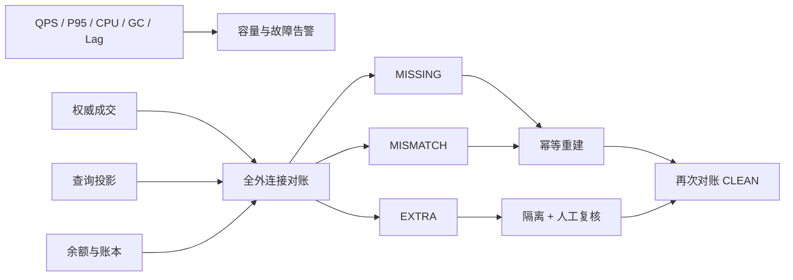

技术指标必须和业务结果放在同一时间轴：

| 观察面 | 指标 | 用途 |
|---|---|---|
| 流量 | API QPS、订单速率、拒绝数 | 判断入口是否过载、保护是否生效 |
| 延迟 | P95/P99、Lane 等待、执行时长 | 区分排队、数据库和业务计算耗时 |
| JVM | CPU、Heap、GC 暂停、Pinned Virtual Thread | 判断线程模型和对象分配是否失控 |
| 数据库 | 活跃连接、锁等待、慢 SQL | 判断热点用户、标的和账户争用 |
| 消息 | Outbox Backlog、Kafka Lag、重试数 | 判断异步链路是否需要扩容 |
| 业务 | 成交唯一数、资金效果数、账本不平、对账差异 | 判断系统是否真的正确 |

高峰期间可以降低非关键全量扫描频率，但不能关闭核心业务指标和账本不变量检查。恢复后必须补跑对账，只有再次得到
`CLEAN` 才能证明系统完成收敛。

## 十、怎样做到快速扩展

### 1. 领域边界

用户、行情、风控账户、撮合、结算账本和对账分别拥有自己的应用服务与 Mapper。Controller 和 Kafka Listener 只做协议
适配，业务事务留在 Application Service，数据库约束提供最后防线。

### 2. Adapter 边界

生产扩展点应保持统一接口：

- `KycProviderAdapter`：接入不同身份供应商；
- `MarketDataAdapter`：接入不同交易所和行情源；
- `RiskRule`：增加资产、地区、产品和客户等级规则；
- `SettlementConsumer`：增加费用、报表、通知或链上结算消费者；
- `ProjectionComparator / RepairAdapter`：增加新的查询投影与修复策略。

### 3. 数据与事件兼容

- 数据库变更通过 Flyway 前向迁移；
- Kafka 事件增加 `eventType`、`eventVersion` 和稳定业务键；
- 新消费者使用独立 Consumer Group，不修改已有资金消费者；
- 新字段优先向后兼容，废弃字段经过双读或双写验证后再移除；
- Redis、缓存和查询投影可以加速读取，但不能成为资金最终账本。

### 4. 热点扩容顺序

1. 先用指标确认瓶颈在入口、Lane、数据库还是 Kafka；
2. 入口无状态实例横向扩容；
3. 按 symbol 增加撮合分片，热点交易对独占分区；
4. 按结算分片增加带 Epoch 的 Worker；
5. 对账按日期、标的和账户拆分并限速；
6. 只有确认数据库竞争后才考虑进一步物理分库，不能用缓存掩盖账务一致性。

## 十一、当前演示与生产拓扑的差异

| 能力 | 当前腾讯云演示 | 生产演进目标 |
|---|---|---|
| 部署 | 单机 Docker Compose | 多可用区、无状态接入、独立 Kafka/PostgreSQL 集群 |
| 行情 | 接口发布参考价 | 多源 Feed、序列检查、仲裁、回放和标的熔断 |
| KYC | 实验接口写审核状态 | 可信供应商、权限、审计、人工复核和制裁名单 |
| 账户 | 余额快照盘前检查 | 可用/冻结/在途/已结算子账户和撤单释放 |
| 撮合 | 有界 Lane + 数据库定序 | symbol 分片、热点独占和自动路由 |
| 结算 | Kafka + Fenced Worker | 多分片消费、跨可用区恢复、容量自动扩缩 |
| 观测 | Prometheus + Grafana + 场景报告 | SLO、告警路由、追踪、容量预测和审计归档 |

## 十二、自动验证矩阵

| 风险 | 故障注入 | 必须观察到的结果 |
|---|---|---|
| KYC 未通过 | 用户保持 PENDING | 保存拒绝决定，撮合订单为 0 |
| 行情过期 | 参考价早于 30 秒 | `MARKET_QUOTE_STALE`，不新增风险 |
| 幂等键篡改 | 同键修改价格或数量 | 冲突拒绝，原决定和原订单不变 |
| 订单洪峰 | 多路并发市价卖单 | 成交数量守恒，队满明确拒绝 |
| 重复结算 | 同一消息投递 17 次 | 只有 1 次资金效果 |
| Worker 接管 | 旧节点恢复后迟到写入 | 旧 Epoch 在资金事务内拒绝 |
| 同步漏数 | 删除派生投影 | 分类 MISSING 并幂等重建 |
| 同步错值 | 篡改派生金额 | 分类 MISMATCH 并恢复权威值 |
| 幽灵成交 | 插入无权威来源投影 | 分类 EXTRA 并隔离，不改权威成交 |

网站上的“运行腾讯云完整链路”和“市场暴跌日”分别验证正常交易闭环与复合故障闭环；仓库 CI 使用 JUnit、
Testcontainers、架构门禁和治理校验持续保护这些结果。
