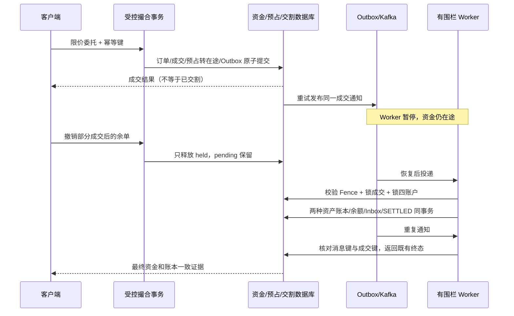

# 第二阶段：从现货下单到双资产交割

## 概要：解决什么问题

“余额足够”和“已成交”之间原来缺了一段资金约束：同一份余额可能同时支持多张委托，撤单也没有真实资金可释放；撮合成交并不自动证明买卖双方都收到资产。

本阶段将受控限价现货入口连到真实资金模型：**委托预占 → 成交转在途 → Outbox/Kafka → 有围栏 Worker → 双资产交割 → 不可变账本和分桶对账**。

重点不是再增加一张架构图，而是以下数据库不变量及其失败验证：

| 不变量 | 数据库和代码保护 |
| --- | --- |
| 可用余额不能为负 | `balance >= reserved_balance + pending_debit`，账户 UUID 全序锁 |
| 一张订单的资金去向守恒 | `initial_amount = held + pending + settled + released` |
| 一笔成交不能只交割一种资产 | 两个按资产平衡的账本事务在同一个 PostgreSQL 事务提交 |
| 重复消息不能重复入账 | 消息 Inbox 唯一键、成交主键、账本业务键、SETTLED 终态保护 |
| 撤单不能释放已经成交的钱 | 撤单只读取和释放 `held`，不触碰 `pending` |
| 对账差异不能被偷偷抹平 | 冻结账户并创建待复核工单，不自动改余额或历史 |

## 一、模型与状态

`account.balance` 仍表示实际持有的总余额，避免把“可用余额”偷换成原有总账口径：

```text
可用 available = 总余额 balance − 委托预占 reserved_balance − 成交在途 pending_debit
```

- 挂单：总余额不动，可用减少，预占增加。
- 成交：预占减少，实际成交额进入在途；买方较优价格的差额返回可用。
- 撤单：只释放剩余预占；已经成交但未交割的资金仍在途。
- 交割：付款总余额与在途一起减少，对方对应资产的总余额和可用增加。
- 故障：整个数据库事务回滚，已提交的在途保留，等待同一成交的消息重放。

新增 V8 表包括 `spot_funded_market`、`spot_order_reservation`、`spot_delivery`、`spot_fund_journal`、`spot_delivery_inbox`。
`spot_fund_journal` 保存每个账户可用、预占、在途和总额的增量，并约束三桶增量之和等于总余额增量；该审计与 Inbox 只追加。

`spot_delivery` 的账户、资产、数量、成交额一经写入不能修改；`SETTLED` 也不能退回 `PENDING`。
纠错应建立有因果关系的补偿业务，本阶段没有提供任意“重置成功单”或修改历史的接口。

## 二、例子：部分成交、价格改善与撤单

买方初始有 1,000 USDT，限价买入 2 单位、限价 100；卖方只在 95 卖出 1 单位。

| 时点 | 买方总额 | 可用 | 预占 | 在途 | 说明 |
| --- | ---: | ---: | ---: | ---: | --- |
| 初始 | 1,000 | 1,000 | 0 | 0 | 模拟期初资金 |
| 买单预占 | 1,000 | 800 | 200 | 0 | 按限价上限预占 |
| 成交 1 @ 95 | 1,000 | 805 | 100 | 95 | 5 的价差立即返回可用 |
| 撤销剩余 1 | 1,000 | 905 | 0 | 95 | 只释放余单 100，不释放在途 95 |
| 完成交割 | 905 | 905 | 0 | 0 | 买方增加 1 基础资产，卖方得到 95 USDT |

第二次撤单、重放原买单、重复投递交割通知都不能使这些金额再次变化。
该例对应 `SpotFundsIntegrationTest.partialFillPriceImprovementAndCancellationPreservePending`。

## 三、全局事务和消息拓扑

```mermaid
flowchart LR
    U[用户/KYC/行情/风控] --> Q[有界交易对 Lane]
    subgraph T1[事务 A：同一个 PostgreSQL 事务]
      Q --> M[锁交易对 / 撮合]
      M --> L[确定相关付款账户 / UUID 全序锁]
      L --> H[预占 / 成交转在途]
      H --> D[权威成交 / 交割事实 / 分桶审计]
      D --> O[事务 Outbox]
    end
    O --> P[批量发布器]
    P --> K[spot.delivery.commands.v1]
    K --> W[复用有界平台线程消费者]
    subgraph T2[事务 B：同一个 PostgreSQL 事务]
      W --> F[Lease + Epoch / 分片一致性]
      F --> I[锁交割单 / Inbox]
      I --> A[四个账户 UUID 全序锁]
      A --> B[计价资产两腿账本]
      B --> C[基础资产两腿账本]
      C --> S[消耗在途 / SETTLED / 成功 Outbox]
    end
    S --> R[总账 / 分桶审计 / 订单预占三路重算]
    R --> X[不一致：冻结待审核]
```



每笔成交的消息只携带 `messageId + tradeId`。Worker 从已提交数据库事实读取金额与账户，不能相信消息里任意传入的收付款账户或金额。
分片由买方计价资产付款账户计算，错误分片、过期 Lease、旧 Epoch 和空 Fence 都被拒绝。

## 四、核心时序：中断、撤单与恢复



## 五、实现细节与重试行为

### 5.1 为什么先确定 Maker 再按顺序锁账户

如果先锁买方账户，再边撮合边锁卖方，另一个交易对可能按相反顺序锁住这两个资产账户，形成死锁。
本阶段在撮合事务内先锁交易对、确定成交，再收集本次所有付款账户，统一使用 `UuidOrder` 排序后加锁。
随后才预占资金并生成交割事实；这之前的订单、成交仅是未提交变化。若锁定后发现可用不足，**整个请求事务回滚**，不留下无资金成交。

盘前检查也会读取实际可用余额，常规不足返回 `INSUFFICIENT_BALANCE`。若在盘前之后有其他资金事务竞争，后置检查会明确失败并回滚，不把它伪装成一张已批准订单。
相同 `userId + clientOrderId` 的请求先持有幂等键事务锁，再读取原决定；参数冲突不复用成功。

### 5.2 双资产“同时”不是分两次调用转账接口

`SpotDeliveryService.settle` 是一个 Spring 事务。计价资产和基础资产各创建一笔有独立业务键的平衡账本事务，但它们共享一次数据库提交：

```java
transfer(tradeId, quoteAsset, buyerQuote, sellerQuote, quoteAmount);
transfer(tradeId, baseAsset, sellerBase, buyerBase, quantity);
// 再消耗订单在途、迁移 SETTLED、写成功 Outbox；任一步失败全部回滚。
```

数据库最后一步失败的测试，故意让成功 Outbox 写入抛异常，随后核对四个账户、两笔账本、Inbox 和交割状态都没有部分提交，恢复后同一消息可重新执行。

### 5.3 消费失败不能默默跳过

通用结算与现货交割共用现有固定平台线程池，没有为新 Topic 额外扩一组线程。
异常采用有间隔的重试，不能重试几次后只记日志就确认资金消息。首次和周期性重试保留诊断，日志不主动打印载荷。
这保证待处理资金不丢，但**坏消息可能阻塞所在消费分区**。正式运行应补告警、审核隔离和受控重放流程；本阶段没有用自动丢弃坏消息换取表面顺畅。

### 5.4 对账与冻结

核对总余额与原有不可变账本；预占、在途分别与分桶审计汇总及订单预占明细核对。发生差异时置 `financial_hold` 并创建唯一未结工单。
新下单、资金交割及其他扣款不能越过冻结；解除冻结必须另做审核流程，当前没有自动解除或公网修改入口。
通用 `LedgerMapper.debit` 同时扣除预占和在途后判断额度，避免从原有转账入口花掉已冻结资金。

## 六、验证范围

`SpotFundsIntegrationTest` 的 16 个专项覆盖：重复使用余额、撤单幂等、精度拒绝、部分成交与价差、跨交易对抢余额、并发请求重放、撮合事务回滚、交割事务回滚、并发消息重放、乱序交割、Worker 接管、消息键冲突、通用转账边界、对账冻结和历史不可变、混单拦截、自成交撤销释放。

`SpotDeliveryKafkaIntegrationTest` 使用真实独立 PostgreSQL 与 Kafka：先暂停消费者，等 Outbox 真正发布，确认余额仍在途；随后启动消费者完成交割，再通过 Kafka 重放。还调用完整固定实验验证 12 项检查。不得用直接调用 `settle` 替代这条测试。

2026-09-03，提交 `97556f8` 的 [CI 33768072071](https://github.com/soldierking04d/fincore-reliability-lab/actions/runs/33768072071)
完整执行 109 项，0 失败、0 错误、0 跳过，包含上述 16 项数据库资金专项和 1 项真实 Kafka 全链路测试。
完整门禁同时要求原有测试继续通过；不能用本地没有 Docker 时的 `BUILD SUCCESS` 宣称验收完成。

## 七、演示与明确边界

- 腾讯云仍使用[原首页](https://124.223.164.254/)，资金实验锚点为 [full-lifecycle](https://124.223.164.254/#full-lifecycle)。本文提交不自动代表已发布，运行版本以 [release.json](https://124.223.164.254/release.json) 为准。
- 公开入口仍是既有固定实验，每次创建隔离模拟用户、资产、期初余额；不接受任意账户编号，不新增通用余额和交割查询接口。
- 本次为限价现货、八位价格/数量、无手续费模型；不支持市价保护价格、真实充值提现、退款/冲正工作流或生产授权认证。
- 日累计名义额度仍为“批准即计入，当日不回收”的保守风控口径；撤单释放资金不代表回收风险限额。
- 老的纯撮合市场不能与资金市场混单。V8 不追溯冻结老订单、不篡改老账本；历史市场需另做经审计的迁移决策。
- 16 个数据库测试不是持续高吞吐证明；真实 Kafka 消费暂停恢复也不是 Broker 数据盘故障、主备切换或完整灾备演练。
- 完整合约保证金、强平执行、保险/ADL、手续费、隔离压测和 Kafka 卷治理仍是后续里程碑。

## 八、发布兼容性

V8 虽然是增量迁移，但旧版不理解已有的预占/在途状态。数据库升级后如果新应用无法健康运行，不能盲目退回旧 V7 撮合实现。
发行脚本在这种情况下停止本项目应用接单，保留数据库及备份，要求使用 V8 兼容修复版。只有前后发行均明确支持 V8 才允许原应用回退。
该策略可能牺牲短时可用性，但不允许旧代码误处理已经预占的资金；不会重启同机其他项目，也不自动覆盖数据库。
