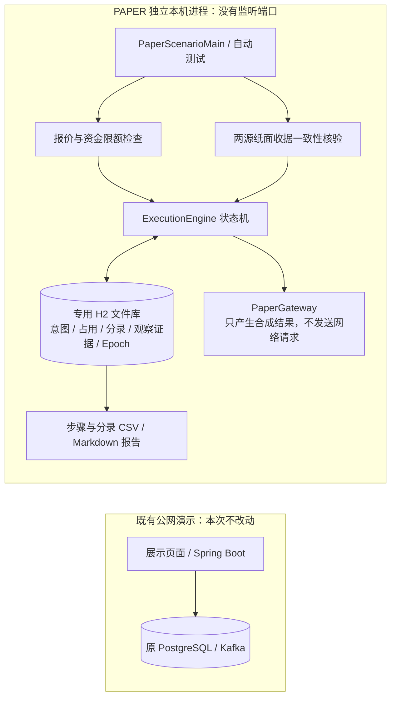
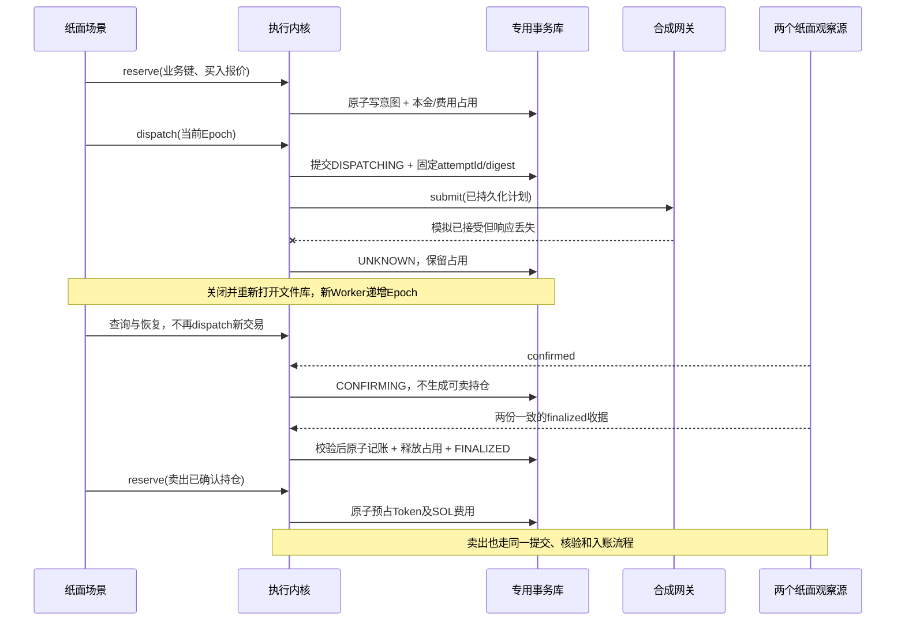
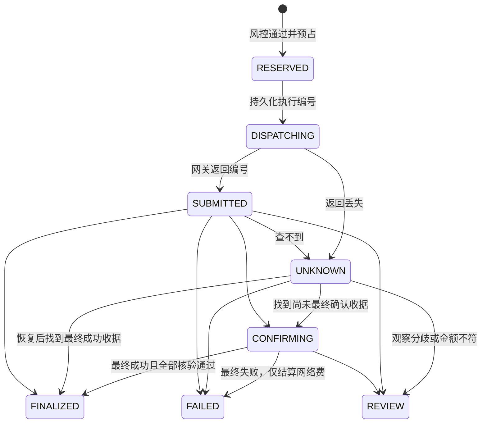

# 独立链上交易执行模块

## 这一版做到了哪一步

**三个隔离入口：PAPER 离线执行内核、READ_ONLY 链查询、WORKBENCH 本地钱包公开地址连接与真实池预检。仍不是已接通主网的买卖系统。**

第三阶段新增独立 Node 工作台，入口为 `http://127.0.0.1:4398/`：已完成真实 FCLAB / WSOL 双向报价和未签名模拟；不签名、不广播、不修改 PAPER 账本。详见 [工作台说明](workbench/README.md) 与 [实际验收记录](workbench/VERIFICATION.md)。腾讯云部署状态以验收记录为准。

第二阶段在独立 `readonly` 包实现，支持固定网络核验、经典 SPL Mint 检查、legacy 交易字节合同及只模拟不广播的检查流程。它不读取或写入 PAPER 账本，不接钱包。详细实现、运行方法和限制见 [只读接入与模拟说明](READONLY.md)。下文的合成资金与持仓规则专指第一阶段 PAPER。

把“请求买入 → 预占 → 准备发送 → 结果未知恢复 → 最终确认持仓 → 预占卖出 → 卖出到账 → 对账”做成独立 Java 21 模块。它不依赖公网演示的数据库、Spring Boot 进程、Kafka、真实地址或钱包工具。当前资产名称是合成标签，所有报价和收据都是测试输入，不能拿测试数据宣传成交量或收益。

PAPER 范围刻意有限：只支持纸面 SOL/FCLAB 单资产对、限额内精确输入交易，不包含发现新币、自动择时、跟单、刷量、合约部署、杠杆或资金托管。PAPER 入口没有 RPC 或主网模式；两个 Java 入口都没有钱包发现，Node 工作台仅发现并连接公开地址。所有入口均无私钥输入或真实广播实现，不能通过配置一个开关就开始真金白银交易。

## 不可破坏的约束

1. 金额是 `BigInteger` 最小单位；SOL 展示精度 9、FCLAB 展示精度 6；展示用 `BigDecimal`，不使用浮点金额。
2. 同一业务键只有一份请求。重试返回原请求；换金额或方向必须拒绝，不能覆盖旧意图。
3. 数据库先提交意图与占用，随后才允许调用纸面网关。JVM Map 不作为本模块的账本。
4. 广播超时或查询不到都属于未知，不能释放本金，不能形成可卖持仓，不能自动换一个交易重发。
5. 确认不足不入账。两份一致的纸面最终收据，绑定同一意图、执行编号、交易编号和金额后，才能推进结算。
6. 余额更新、占用释放、成功状态、唯一收据和追加式平衡分录在同一数据库事务中完成。
7. 每个资产的所有分录相加为零；历史分录不修改、不删除。失败交易只扣收据中的网络费，释放其余占用。
8. 卖出必须先原子预占已确认的可用持仓；两个并发卖出不能花同一份持仓。
9. Epoch 不一致的旧 Worker 不能回写；熔断阻止新交易，仍允许查询和对账。差异进入 `REVIEW`，不静默修复。

## 隔离拓扑



两个区域没有接线；新模块不加入根 POM 的构建模块列表，不进入原 Spring Boot 扫描路径、Docker Compose 或部署脚本。H2 仅以本地文件嵌入运行，不启动 TCP Server/Web Console；它是隔离实验的持久化选择，不代表生产数据库方案已经确定。[H2 官方说明](https://h2database.com/html/main.html)

源码可放在同一个仓库，运行身份、数据、秘密和发布路径必须隔离。当前运行数据由子目录 `.gitignore` 排除；不要复制之前的钱包辅助文件、session-state、私钥或服务器配置到这里。

## 核心时序：超时之后怎么办



状态概览：



`REVIEW` 不自动解冻；终态不反写为中间态。已预占但报价过期会阻止发送，当前没有自动取消/解冻接口，需后续加“确认从未开始发送”的独立取消协议，不能借过期释放所有未决订单。

## 风控与并发取舍

| 检查 | 当前离线合同 |
|---|---|
| 买入本金上限 | 100,000 lamports（0.0001 合成 SOL） |
| 每笔网络费上限 | 10,000 lamports |
| 滑点上限 | 50 bps；最低到账严格由预期与滑点整数推导 |
| 价格冲击上限 | 200 bps；当前使用合成报价字段，不是 AMM 报价器 |
| 最低池流动性 | 1,000,000 lamports 合成 SOL |
| 报价 | 必须未过期，期限不能超过当前时刻 60 秒 |
| 未决订单容量 | 最多 8 笔，未知和人工复核也占容量 |
| 累计支出 | 已花 SOL＋所有在途 SOL 占用＋新占用 ≤ 1,000,000 lamports |
| 余额底线 | 可用 SOL 不低于 5,000,000 lamports |
| 卖出 | Token 可用持仓充足，同时预占 SOL 网络费；不提前使用卖出收益付费 |

单个钱包账本使用数据库行锁串行写入，解决同钱包竞争；这是可靠性基线，不宣称高 TPS。进程内增加有界单写准入，最多 32 个等待或执行者、等锁最多 5 秒，避免多个 JDBC 会话同时争用同一个嵌入式数据库行。准入只控制竞争，不保存余额或订单；数据库互斥行、事务、唯一约束和 Epoch 仍是权威保护。固定条带可能令不同库的写入短暂串行，这是用可预期资源开销换吞吐的实验取舍，不是跨进程锁。

外部网关调用不持有准入锁或数据库资金锁，先提交 `DISPATCHING` 再调用；旧 Worker 回来时再次检查 Epoch。真正的签名器/广播端也必须识别 fencing token，才能封住“旧 Worker 已失效但仍向外发送”的窗口——**本版只证明本地回写围栏，没有生产签名器围栏**。

没有无限重试或后台忙轮询，未知订单不会通过退避重试偷偷再发一次。后续扩容应按钱包/资产对分片，引入有界 Worker、租约、队列指标和 PostgreSQL 事务验收，再实测吞吐/尾延迟，不能把内存压测当作金融正确性证据。

## 如何运行

需要 JDK 21、Maven 3.9。只在本模块目录运行：

```bash
bash run-paper.sh
```

脚本先运行测试，再在新的临时目录产生 `REPORT.md`、`steps.csv`、`journal.csv` 和独立 H2 数据库。也可给一个**全新空目录**；如果不为空会拒绝覆盖。已有 Maven 可用 `FINCORE_PAPER_MAVEN=/path/to/mvn` 指定；JDK 用正常的 `JAVA_HOME` 选择。首次构建会从 Maven 仓库下载依赖，业务执行和测试不访问链节点。

仅测试：

```bash
../../mvnw -B -f pom.xml test
```

输出的金额来源于数据库的每一步状态，而不是网页随便跳动的数字。固定验收样例：初始 0.01 SOL，买入消耗 0.0001＋0.00001 SOL，拿到 4,000 FCLAB；卖出收到 0.000098－0.00001 SOL；最终 **0.009978 SOL / 0 FCLAB**。合成净差额是 **-0.000022 SOL**，明确保留费用和不利价差，不包装成盈利演示。

2026-09-13 本机验收：39 项测试全部通过，完整运行脚本另行通过，生成 8 步快照与 19 条平衡分录。详细命令、故障修复和验证边界见 [验收记录](VERIFICATION.md)。这些是功能正确性证据，不是高并发性能成绩。

## 文件定位

| 文件 | 责任 |
|---|---|
| `Models.java` | 请求、报价、占用、收据、资产单位、限额合同 |
| `ExecutionEngine.java` | JDBC 事务、状态机、幂等、Epoch、持仓、分录与恢复 |
| `PaperScenarioMain.java` | 固定闭环场景与真实数据库快照报告 |
| `ExecutionEngineTest.java` | 主闭环、重启恢复、幂等、失败费用、并发卖出 |
| `ExecutionFaultTest.java` | 独立故障与限额验收 |
| `JournalGuardTest.java` | 历史分录防修改、事务回滚、账本投影和报价摘要防篡改验收 |
| `pom.xml` / `run-paper.sh` | 独立构建和本机执行，不触碰线上进程 |

## 上真实链之前仍缺什么

| 阶段 | 需要补齐的内容 | 通过前禁止什么 |
|---|---|---|
| 真实只读适配 | 已做固定网络、完整genesis、固定Mint/权限检查；仍缺Token-2022、池/路由/价格影响独立计算 | 不接受外部任意代币或路由 |
| 交易构造与模拟 | 已做零签名legacy字节合同、高度/费用/计算量检查和Memo负向模拟；仍缺swap构造、v0/ALT、买卖模拟差额与最低到账核验 | 不把纸面Plan或模拟通过当签名授权 |
| 独立签名边界 | 专用小额钱包、人工批准、密钥隔离、完整消息摘要、原始已签字节先持久化、签名器fencing | 不读取之前的钱包或私钥，不开放自动签名 |
| 真实发送与恢复 | RPC限流/超时、多观察源、signature/message匹配、blockhash到期与交易历史查询、未知状态和精确字节重广播协议 | 不以查不到/超时为由生成第二个交易 |
| 真实入账 | 使用同一 finalized 交易的pre/post余额与inner instructions、费用/租金/wSOL、Token-2022扣费核验 | 不用两次独立余额快照推断成交，不把confirmed当最终持仓 |
| 上线运维 | 专用数据库和身份、监控/审计/熔断、恢复演练、密钥轮换、独立安全评审、交易权限和金额重新确认 | 不部署到当前公网演示，不把该实验直接称为生产系统 |

Solana 查询 `null` 可能是没有找到，或尚未达到要求的确认级别；并不能证明从未发送。[getTransaction](https://solana.com/docs/rpc/http/gettransaction) 查询历史状态时还必须明确是否搜索历史，而非只看近期缓存。[getSignatureStatuses](https://solana.com/docs/rpc/http/getsignaturestatuses) 真实过期与确认流程必须按区块高度和 blockhash 语义实现，不只设一个本地秒数超时。[官方确认说明](https://solana.com/developers/cookbook/transactions/confirmation)

当前两个“RPC源”只是故障测试角色，不是独立的链共识或真实节点。离线测试也不能证明代币始终可卖、真实流动性足够、交易不会受夹击或一定盈利。
