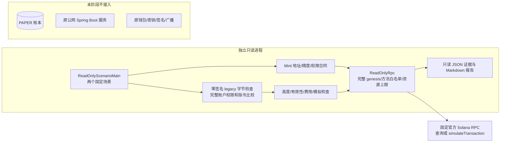
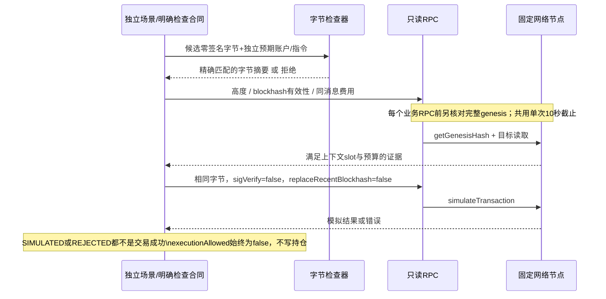

# 第二阶段：真实只读接入与无签名模拟

## 先看结论

已实现并运行：固定网络的真实 RPC 查询、FCLAB/WSOL 公开 Mint 核验、无签名 legacy 交易的完整字节合同、blockhash/费用/计算量检查，以及真实测试网的负向模拟。

**没有实现或运行真实买入/卖出，也没有完成 swap 成功模拟。** 当前没有 AMM 路由解析、池价格计算、真实卖出到账差额核验、签名器或广播接口。`executionAllowed` 始终为 `false`，不能因为收到 `err:null` 就开始执行资金操作。

第一阶段 PAPER 内核保持隔离：新包不调用 `ExecutionEngine`，不会把节点响应、模拟结果或真实资产余额写进合成账本。主网入口只查询公开资产账户，不读取用户资金钱包；测试网入口只构造一条不含转账指令的 Memo。

## 整体架构与检查时序





## 哪些问题现在会被拦住

| 问题 | 实现处理 |
|---|---|
| 测试网地址误连主网或反过来 | 固定 HTTPS 端点，每次业务请求前核对完整 genesis；不以短网络标识代替完整 hash |
| 第三方页面要求提供 RPC URL | 公开构造器只接受 DEVNET/MAINNET 枚举，不接受任意 URL 或凭证 |
| 上游试图发送、空投、签名 | 方法白名单在任何网络调用前拒绝，不存在签名/广播入口 |
| 地址格式、owner、类型不对 | 32 字节规范 Base58，经典 Token Program、82 字节 Mint 布局、非 executable、已初始化均核对 |
| 供应量溢出或丢精度 | 原始小端 u64 转 `BigInteger`；报告用十进制原子单位字符串，不依赖 UI 浮点量 |
| 增发/冻结权未关闭 | 本次 FCLAB 资产合同要求均为空，非空拒绝；精度按独立配置核对，不自动采信结果 |
| Token-2022、未知扩展或普通Token账户 | 当前全部拒绝，不把“解析不了”解释成无风险；不宣称已兼容扩展 |
| 改收款方、改金额、加指令、提权限 | 全部有序账户/权限/指令账户/原始data精确比较，不只比较program ID |
| 已签名、v0/ALT、多签、durable nonce | 目前只支持一个64字节全零签名槽的legacy；未适配格式直接拒绝 |
| 数据截断、尾随内容、短整数别名 | 1232字节上限、canonical shortvec、索引/长度/header检查、禁止尾随数据 |
| blockhash过期或节点过旧 | 使用最后有效区块高度、`isBlockhashValid`、`minContextSlot`；30秒本地检查期限不能替代链高度 |
| 费用未知、过高、计算量超限 | 缺失/null/小数/负数/越界均拒绝；费用是同消息估算，不是实际收费记录 |
| 网络卡死、超大JSON、限流 | 4个全进程在途名额，超额立即拒绝；完整调用10秒；1MiB正文；结构限制；429等不自动重试 |
| 返回null或模拟失败 | 保留不可用/拒绝结果，不推断“从未发送”，不释放任何资金，不生成持仓 |

`SimulationPolicy` 必须来自独立的受信业务合同。把 `inspect(candidate)` 的结果再当成预期合同传回，只能证明自洽，不能证明内容获批。固定 Memo 场景直接写明账户及指令预期，不使用这种自我批准方式。

完整字节相符也不证明 DEX 程序逻辑正确：结构检查器把未知指令保留为不透明数据，并不解析任意 swap 的经济语义。公开 RPC 类是“诊断级模拟”边界，不是交易批准器。

## 本机运行

需要 JDK 21 与 Maven 3.9。从本目录执行：

```bash
# 主网只读：检查之前发行的 FCLAB 与 WSOL Mint，不查资金钱包，不模拟主网交易。
bash run-readonly.sh mainnet-readonly

# 测试网负向模拟：固定无转账Memo，故意用Mint数据账户作为无效费用付款账户。
bash run-readonly.sh devnet-probe
```

可提供第二个参数指定全新空输出目录；非空拒绝覆盖。`FINCORE_PAPER_MAVEN` 可指定 Maven，`JAVA_HOME` 选择 JDK。每个入口都先跑离线测试，再访问固定官方 RPC；离线测试本身不访问网络。第一次构建可能下载 Maven 依赖。

生成内容：

- `REPORT.md`：人可读结果，区分真实查询、模拟拒绝和未验证能力。
- `readiness.json`：模式、时间、网络、精确供应量、slot、摘要和明确的禁止执行标记。
- `rpc-observations.json`：各业务调用参数、结果与耗时。只包含本场景公开数据；内部逐次 genesis 检查由传输层执行，不把该文件称为逐包网络抓包。
- `unsigned-probe.base64.txt`：仅测试网场景，64字节签名槽全零，无私钥、无转账；不是可广播的已签交易。

脚本为独立 JVM 显式设定 `jdk.httpclient.disableRetryConnect=true`、`jdk.httpclient.enableAllMethodRetry=false`、`jdk.httpclient.redirects.retrylimit=1`，并禁止重定向。公开客户端构造器检查这些启动合同，拒绝原始 HTTP 日志开关；它不会运行时改写全局属性。JDK 对这些属性的读取时机有约束，嵌入既有长寿命 JVM 前需要重新验收，不能假定运行时修改立即生效。[JDK 21 HTTP 模块说明](https://docs.oracle.com/en/java/javase/21/docs/api/java.net.http/module-summary.html)

## 2026-09-14 实际验收

首次验收基线为 `b29dbff` 上的本机补丁，当时尚未提交或部署；当前提交状态以仓库历史为准。本阶段没有改变原公网、部署配置或原钱包工具，只从原发行报告中提取了公开 Mint 地址作只读对象。

先写测试再实现：初次构建因尚无 `SolanaReadiness`、`Base58`、`UnsignedTransactionGuard` 等类而失败。这是新功能缺实现的 RED，不冒充已经复现了生产故障。第一轮 GREEN 为120项，随后补充超宽请求保护并再次通过121项。

| 测试类 | 展开用例数 | 说明 |
|---|---:|---|
| 原 PAPER 三个测试类 | 39 | 资金、占用、并发与恢复回归保持通过 |
| Base58Test | 3 | 已知向量、前导零与格式拒绝 |
| UnsignedTransactionGuardTest | 14 | 结构、签名、权限及字节篡改；部分用例内部遍历所有截断点 |
| SolanaReadinessTest | 28 | u64、Mint权限、未知格式、过期/费用/计算量/字段缺失、精确模拟字节 |
| ReadOnlyRpcTest | 37 | 网络隔离、方法拒绝、严格JSON、并发、deadline取消、启动合同与模拟参数 |

运行命令为独立模块 `mvn -o -B -f experiments/chain-execution/pom.xml -Djunit.jupiter.execution.timeout.default=15s test`；完整 `run-readonly.sh mainnet-readonly` 也已运行成功。测试结果只覆盖本模块，没有重跑原项目全量CI、全仓阿里规范扫描或生产压力测试。

实际 RPC 验收证据：

| 项目 | 实际观察 |
|---|---|
| FCLAB Mint | `AakW2qYEFRK5DunP7yNaXAr9eknBtLiEd9iMXAAC6Mck` |
| 主网完整 genesis | `5eykt4UsFv8P8NJdTREpY1vzqKqZKvdpKuc147dw2N9d` |
| FCLAB finalized slot | 446995090 |
| 原子供应量 / 精度 | 100000000000000 / 6，即1亿枚 |
| 增发 / 冻结权 | 均为空 |
| 测试网完整 genesis | `EtWTRABZaYq6iMfeYKouRu166VU2xqa1wcaWoxPkrZBG` |
| Memo 模拟 slot | 498275575 |
| 节点原始错误 | `InvalidAccountForFee` |
| 模块结果 | `REJECTED`，`executionAllowed=false`；未扣费、未签名、未重发 |

负向模拟故意选择公开 WSOL Mint 数据账户而不是资金钱包，真实节点拒绝其支付费用。这验证了完整模拟调用及失败分支，**并不意味着成功买入/卖出或成功执行 Memo**。本机分别保留 `outputs/chain-readonly-mainnet-20260914` 与 `outputs/chain-readonly-devnet-20260914` 的报告和原始结果；这些文件在仓库外，没有上传。

独立只读审查未发现有证据的P1/P2。网络断连、RPC谎报、数据回滚、链拥塞、程序升级等情况仍需要进一步集成验收；本次单官方端点观察不构成多节点独立共识证明。吞吐与尾延迟没有做性能结论。

## 下一阶段还必须补的交易能力

1. **独立读取池与报价**：确认具体DEX程序、池、vault、mint、费用、当前tick/流动性等真实状态；当前没有池价格/价格冲击计算，不能拿Mint供应量冒充可交易深度。
2. **只接一个明确版本的swap适配器**：从可信业务意图构建指令合同，解析完整账户与data；需要v0/ALT时先解析并固定地址表快照，不能直接放开格式拒绝。
3. **买入/卖出成功模拟与经济差额核验**：绑定同一模拟的pre/post余额、Token转移、费用、租金、wSOL开关账户、最低到账；现在的模拟报告故意不提供这种执行授权。
4. **后续独立签名器与最终确认**：专用小额钱包、人工批准、签名器围栏、完整签名字节持久化、未知结果恢复协议，以及真实 finalized 收据入账，必须另行实现和授权。

现阶段不用转入更多SOL，不用导出任何私钥，也不需要恢复原钱包窗口。Mint检查通过不能证明代币可卖、交易不受夹击、价格合理或一定获利。

## 源码定位与依据

| 文件 | 责任 |
|---|---|
| `readonly/ReadOnlyRpc.java` | 固定端点、方法/网络/HTTP/JSON/并发边界 |
| `readonly/Base58.java` | 规范地址编码与校验，不推导私钥 |
| `readonly/UnsignedTransactionGuard.java` | legacy零签名字节解析及独立完整合同比较 |
| `readonly/SolanaReadiness.java` | Mint、有效高度、费用和模拟证据检查 |
| `readonly/ReadOnlyScenarioMain.java` | 两个固定场景、独立合同、结果留存与报告 |
| `run-readonly.sh` | 先测试、后启动独立只读JVM |

文件路径均位于 `src/main/java/dev/fincore/chain` 下；测试位于对应 `src/test/java` 包。

RPC模拟不要求提供真实签名，前提是`sigVerify=false`；该接口不广播。我们的实现还固定不替换blockhash，便于绑定准确字节。[simulateTransaction官方说明](https://solana.com/docs/rpc/http/simulatetransaction)

Mint的权威布局与字段依据 [Solana Mint说明](https://solana.com/docs/tokens/basics/create-mint) 和 [经典Token源码](https://github.com/solana-program/token/blob/main/interface/src/state.rs)。交易结构依据 [Solana交易结构](https://solana.com/docs/core/transactions/transaction-structure)，端点依据 [官方集群说明](https://solana.com/docs/references/clusters)。JSON依赖固定为仍受维护的2.x分支发布版本 [Jackson 2.21.3](https://github.com/FasterXML/jackson/wiki/Jackson-Release-2.21.3)，未替换原Spring Boot项目依赖。
